<!-- IA_NAVIGACAO:GERADO_AUTO:v1 -->
# Mapa IA - reports

Atualizado automaticamente em: **2026-08-05 13:32:38 -0300**

- Caminho: `C:\Users\IgorPC\.claude\projects\Escritório fabio osório\fabricas de melhoria de petições\_FORJA_HARNESS\reports`
- Tipo: **pasta de caso/produção**
- Função para navegação: contém peça, parecer, memorial, relatório ou plano
- Conteúdo recursivo: **1429 arquivos**, **14 subpastas**, **33.4 MB**
- Tipos de arquivo: .md: 1163, .png: 108, .json: 50, .svg: 41, .mmd: 41, .log: 8, .jpg: 7, .ps1: 3, .html: 3, .pid: 3, +2 tipos
- Mapa raiz: [MAPA_IA.md](<../../MAPA_IA.md>)
- Índice geral: [INDICE_GERAL_IA.md](<../../00_IA_NAVIGACAO/INDICE_GERAL_IA.md>)
- Protocolo de navegação: [PROTOCOLO_NAVEGACAO_IA.md](<../../00_IA_NAVIGACAO/PROTOCOLO_NAVEGACAO_IA.md>)
- Inventário JSON para agentes: [inventario_ia.json](<../../00_IA_NAVIGACAO/dados/inventario_ia.json>)
- Mapa superior: [_FORJA_HARNESS](<../MAPA_IA.md>)

## GPS Mermaid

```mermaid
flowchart TD
  N17ba38e79c["reports<br/>pasta de caso/produção<br/>1429 arquivos / 14 subpastas"]
  Na86eee3345["subir: _FORJA_HARNESS"]
  N17ba38e79c --> Na86eee3345
  click Na86eee3345 "../MAPA_IA.md" "Abrir mapa superior"
  Ndd7ab325ed["_rev_claude_20260730<br/>pasta organizadora<br/>108 arquivos"]
  N17ba38e79c --> Ndd7ab325ed
  click Ndd7ab325ed "_rev_claude_20260730/MAPA_IA.md" "Abrir mapa da pasta"
  N27560aae60["atlas_forja_assets<br/>pasta auxiliar<br/>82 arquivos"]
  N17ba38e79c --> N27560aae60
  click N27560aae60 "atlas_forja_assets/MAPA_IA.md" "Abrir mapa da pasta"
  N0710913414["atlas_forja_blender_assets<br/>pasta organizadora<br/>0 arquivos"]
  N17ba38e79c --> N0710913414
  click N0710913414 "atlas_forja_blender_assets/MAPA_IA.md" "Abrir mapa da pasta"
  Ncbd76a7f5a["conselho_2026-07-11<br/>pasta de caso/produção<br/>5 arquivos"]
  N17ba38e79c --> Ncbd76a7f5a
  click Ncbd76a7f5a "conselho_2026-07-11/MAPA_IA.md" "Abrir mapa da pasta"
  N7548559d4e["fable5_live_validation_20260715<br/>pasta auxiliar<br/>7 arquivos"]
  N17ba38e79c --> N7548559d4e
  click N7548559d4e "fable5_live_validation_20260715/MAPA_IA.md" "Abrir mapa da pasta"
  N6b0cc66d46["RECONSTRUCAO_N3_2026-07-10<br/>pasta de caso/produção<br/>9 arquivos"]
  N17ba38e79c --> N6b0cc66d46
  click N6b0cc66d46 "RECONSTRUCAO_N3_2026-07-10/MAPA_IA.md" "Abrir mapa da pasta"
  Ncc1a6aa10d["AUDITORIA_ANTIFRAUDE_FORJA_N4_2026-07-11.md<br/>relatório, auditoria, checklist ou aprendizado"]
  N17ba38e79c --> Ncc1a6aa10d
  click Ncc1a6aa10d "AUDITORIA_ANTIFRAUDE_FORJA_N4_2026-07-11.md" "Abrir arquivo"
  Nf097f5d639["AUDITORIA_COMPLETA_FORJA_5_6_2026-07-09.md<br/>relatório, auditoria, checklist ou aprendizado"]
  N17ba38e79c --> Nf097f5d639
  click Nf097f5d639 "AUDITORIA_COMPLETA_FORJA_5_6_2026-07-09.md" "Abrir arquivo"
  Na91ed3668e["AUDITORIA_CONTINUA_2026-07-08_2309.md<br/>relatório, auditoria, checklist ou aprendizado"]
  N17ba38e79c --> Na91ed3668e
  click Na91ed3668e "AUDITORIA_CONTINUA_2026-07-08_2309.md" "Abrir arquivo"
  N43f3faef4e["AUDITORIA_INTEGRACAO_STJ_2026-07-12.md<br/>relatório, auditoria, checklist ou aprendizado"]
  N17ba38e79c --> N43f3faef4e
  click N43f3faef4e "AUDITORIA_INTEGRACAO_STJ_2026-07-12.md" "Abrir arquivo"
  N3e77d67191["AUDITORIA_ULTRACODE_2026-07-10.md<br/>relatório, auditoria, checklist ou aprendizado"]
  N17ba38e79c --> N3e77d67191
  click N3e77d67191 "AUDITORIA_ULTRACODE_2026-07-10.md" "Abrir arquivo"
  N1c45453241["RELATORIO_EFESTO_AUDITORIA_FORJA_PETICOES_2026-07-09.md<br/>relatório, auditoria, checklist ou aprendizado"]
  N17ba38e79c --> N1c45453241
  click N1c45453241 "RELATORIO_EFESTO_AUDITORIA_FORJA_PETICOES_2026-07-09.md" "Abrir arquivo"
  Nbc7afe066d["RELATORIO_FINAL_RECONSTRUCAO_N3.md<br/>relatório, auditoria, checklist ou aprendizado"]
  N17ba38e79c --> Nbc7afe066d
  click Nbc7afe066d "RELATORIO_FINAL_RECONSTRUCAO_N3.md" "Abrir arquivo"
  Nea3626b1c2["RELATORIO_PSO_PET_SOLUCAO_PROBLEMAS_E_METRICAS_2026-07-11…<br/>relatório, auditoria, checklist ou aprendizado"]
  N17ba38e79c --> Nea3626b1c2
  click Nea3626b1c2 "RELATORIO_PSO_PET_SOLUCAO_PROBLEMAS_E_METRICAS_2026-07-11.md" "Abrir arquivo"
```

## Ordem de leitura recomendada

1. Ler este `MAPA_IA.md` antes de abrir arquivos pesados.
2. Subir para a raiz se precisar das regras globais `AGENTS.md`, `CLAUDE.md` e `_LEIS_GERAIS`.
3. Usar builds, renders e QA apenas para validar entrega ou rastrear geração; não começar por eles.

## Subpastas diretas

| Subpasta | Tipo | Conteúdo | Atualização | Próximo passo |
|---|---|---:|---:|---|
| [_rev_claude_20260730](<_rev_claude_20260730/MAPA_IA.md>) | pasta organizadora | 108 arquivos / 5 subpastas | 2026-07-30 16:26 | agrega subpastas; abrir mapa filho conforme objetivo |
| [atlas_forja_assets](<atlas_forja_assets/MAPA_IA.md>) | pasta auxiliar | 82 arquivos / 0 subpastas | 2026-07-12 10:24 | conteúdo auxiliar ou residual |
| [atlas_forja_blender_assets](<atlas_forja_blender_assets/MAPA_IA.md>) | pasta organizadora | 0 arquivos / 3 subpastas | - | agrega subpastas; abrir mapa filho conforme objetivo |
| [conselho_2026-07-11](<conselho_2026-07-11/MAPA_IA.md>) | pasta de caso/produção | 5 arquivos / 0 subpastas | 2026-07-11 01:44 | contém peça, parecer, memorial, relatório ou plano |
| [fable5_live_validation_20260715](<fable5_live_validation_20260715/MAPA_IA.md>) | pasta auxiliar | 7 arquivos / 0 subpastas | 2026-07-16 19:39 | conteúdo auxiliar ou residual |
| [RECONSTRUCAO_N3_2026-07-10](<RECONSTRUCAO_N3_2026-07-10/MAPA_IA.md>) | pasta de caso/produção | 9 arquivos / 0 subpastas | 2026-07-10 04:09 | contém peça, parecer, memorial, relatório ou plano |

## Arquivos diretos

| Arquivo | Papel | Tamanho | Modificado | Observação |
|---|---:|---:|---:|---|
| [AUDITORIA_ANTIFRAUDE_FORJA_N4_2026-07-11.md](<AUDITORIA_ANTIFRAUDE_FORJA_N4_2026-07-11.md>) | relatório/auditoria | 5.9 KB | 2026-07-11 01:35 | relatório, auditoria, checklist ou aprendizado \| tópicos: AUDITORIA ANTIFRAUDE DA FORJA N4; 1. Falhas encontradas na auditoria do próprio fechamento; 2. Testes antifraude |
| [AUDITORIA_COMPLETA_FORJA_5_6_2026-07-09.md](<AUDITORIA_COMPLETA_FORJA_5_6_2026-07-09.md>) | relatório/auditoria | 18.9 KB | 2026-07-09 21:17 | relatório, auditoria, checklist ou aprendizado \| tópicos: AUDITORIA COMPLETA DA FORJA — REVISÃO 5.6; 1. Veredito executivo; 2. Como a auditoria foi feita |
| [AUDITORIA_CONTINUA_2026-07-08_2309.md](<AUDITORIA_CONTINUA_2026-07-08_2309.md>) | relatório/auditoria | 6.3 KB | 2026-07-08 23:29 | relatório, auditoria, checklist ou aprendizado \| tópicos: FORJA N2 — Auditoria contínua; 1. Veredito; 2. Achados corrigidos |
| [AUDITORIA_INTEGRACAO_STJ_2026-07-12.md](<AUDITORIA_INTEGRACAO_STJ_2026-07-12.md>) | relatório/auditoria | 2.5 KB | 2026-07-12 14:48 | relatório, auditoria, checklist ou aprendizado \| tópicos: Auditoria da integração FORJA ↔ TeiaJus ↔ STJ; Resultado; Testes reais |
| [AUDITORIA_ULTRACODE_2026-07-10.md](<AUDITORIA_ULTRACODE_2026-07-10.md>) | relatório/auditoria | 8.2 KB | 2026-07-10 13:49 | relatório, auditoria, checklist ou aprendizado \| tópicos: AUDITORIA ULTRACODE DA RODADA FORJA N3 — 10/07/2026 (tarde); 1. Veredito executivo; 2. Correções APLICADAS nesta auditoria |
| [RELATORIO_EFESTO_AUDITORIA_FORJA_PETICOES_2026-07-09.md](<RELATORIO_EFESTO_AUDITORIA_FORJA_PETICOES_2026-07-09.md>) | relatório/auditoria | 23.3 KB | 2026-07-09 00:34 | relatório, auditoria, checklist ou aprendizado \| tópicos: Relatório Efesto + Helena — Auditoria do Sistema FORJA para Elaboração de Petições; 1. Status executivo; 1-A. Leitura Helena — decisão estratégica |
| [RELATORIO_FINAL_RECONSTRUCAO_N3.md](<RELATORIO_FINAL_RECONSTRUCAO_N3.md>) | relatório/auditoria | 1.3 KB | 2026-07-10 13:43 | relatório, auditoria, checklist ou aprendizado \| tópicos: ERRATA (auditoria ultracode, 10/07/2026 tarde) |
| [RELATORIO_PSO_PET_SOLUCAO_PROBLEMAS_E_METRICAS_2026-07-11.md](<RELATORIO_PSO_PET_SOLUCAO_PROBLEMAS_E_METRICAS_2026-07-11.md>) | relatório/auditoria | 9.4 KB | 2026-07-11 18:34 | relatório, auditoria, checklist ou aprendizado \| tópicos: Relatório PSO-Pet — solução de problemas, formação de teses e valor mensurável; 1. Conclusão executiva; 2. Arquitetura por partes |
| [ANTI_HALLUCINATION_RELEASE_AUDIT_2026-07-23.json](<ANTI_HALLUCINATION_RELEASE_AUDIT_2026-07-23.json>) | dados/script | 1.3 KB | 2026-07-23 14:30 | dado estruturado ou rotina técnica |
| [BASELINE_W0_2026-07-25.json](<BASELINE_W0_2026-07-25.json>) | dados/script | 8.5 KB | 2026-07-25 18:23 | dado estruturado ou rotina técnica |
| [BASELINE_W0_FINAL_2026-07-25.json](<BASELINE_W0_FINAL_2026-07-25.json>) | dados/script | 8.5 KB | 2026-07-25 18:55 | dado estruturado ou rotina técnica |
| [BASELINE_W1_2026-07-25.json](<BASELINE_W1_2026-07-25.json>) | dados/script | 8.7 KB | 2026-07-25 20:00 | dado estruturado ou rotina técnica |
| [BASELINE_W2A_2026-07-25.json](<BASELINE_W2A_2026-07-25.json>) | dados/script | 8.7 KB | 2026-07-25 21:19 | dado estruturado ou rotina técnica |
| [BASELINE_W2B_2026-07-25.json](<BASELINE_W2B_2026-07-25.json>) | dados/script | 8.7 KB | 2026-07-25 20:15 | dado estruturado ou rotina técnica |
| [EXEMPLO_F3_MAPA_DESTINATARIO_ARESP_2698443.json](<EXEMPLO_F3_MAPA_DESTINATARIO_ARESP_2698443.json>) | dados/script | 2.8 KB | 2026-07-25 20:13 | dado estruturado ou rotina técnica |
| [FORJA_BASELINE_POST_PROTOCOL_20260729.json](<FORJA_BASELINE_POST_PROTOCOL_20260729.json>) | dados/script | 10.5 KB | 2026-07-29 01:35 | dado estruturado ou rotina técnica |
| [FORJA_BASELINE_POST_PROTOCOL_FINAL_20260729.json](<FORJA_BASELINE_POST_PROTOCOL_FINAL_20260729.json>) | dados/script | 10.5 KB | 2026-07-29 16:20 | dado estruturado ou rotina técnica |
| [FORJA_BASELINE_POST_PROTOCOL_RECHECK_20260729.json](<FORJA_BASELINE_POST_PROTOCOL_RECHECK_20260729.json>) | dados/script | 10.5 KB | 2026-07-29 16:08 | dado estruturado ou rotina técnica |
| [M6_CORPUS_FINAL.json](<M6_CORPUS_FINAL.json>) | dados/script | 2.9 KB | 2026-07-11 00:47 | dado estruturado ou rotina técnica |
| [M6_HEALTH_ANTIFRAUD_RESULT.json](<M6_HEALTH_ANTIFRAUD_RESULT.json>) | dados/script | 2.1 KB | 2026-07-11 01:32 | dado estruturado ou rotina técnica |
| [M6_HEALTH_RESULT.json](<M6_HEALTH_RESULT.json>) | dados/script | 1.4 KB | 2026-07-11 00:46 | dado estruturado ou rotina técnica |
| [M6_LIBRA_ANTIFRAUD_RESULT.json](<M6_LIBRA_ANTIFRAUD_RESULT.json>) | dados/script | 2.2 KB | 2026-07-11 01:32 | dado estruturado ou rotina técnica |
| [M6_LIBRA_RESULT.json](<M6_LIBRA_RESULT.json>) | dados/script | 1.4 KB | 2026-07-11 00:46 | dado estruturado ou rotina técnica |
| [M6_PATRICIA_ANTIFRAUD_RESULT.json](<M6_PATRICIA_ANTIFRAUD_RESULT.json>) | dados/script | 2.2 KB | 2026-07-11 01:32 | dado estruturado ou rotina técnica |
| [M6_PATRICIA_RESULT.json](<M6_PATRICIA_RESULT.json>) | dados/script | 1.4 KB | 2026-07-11 00:46 | dado estruturado ou rotina técnica |
| [manifest_visual_lote_20260730.json](<manifest_visual_lote_20260730.json>) | dados/script | 10.9 KB | 2026-08-03 12:18 | dado estruturado ou rotina técnica |
| [METRICAS_GATES.json](<METRICAS_GATES.json>) | dados/script | 2.1 KB | 2026-07-12 12:57 | dado estruturado ou rotina técnica |
| [N3_SHADOW_REPLAY_2026-07-09.json](<N3_SHADOW_REPLAY_2026-07-09.json>) | dados/script | 80.0 KB | 2026-07-10 01:18 | dado estruturado ou rotina técnica |
| [N3_VALIDATION_2026-07-10.json](<N3_VALIDATION_2026-07-10.json>) | dados/script | 13.5 KB | 2026-07-23 14:31 | dado estruturado ou rotina técnica |
| [N4_ANTI_FRAUD_AUDIT_RESULT.json](<N4_ANTI_FRAUD_AUDIT_RESULT.json>) | dados/script | 5.7 KB | 2026-07-11 01:34 | dado estruturado ou rotina técnica |
| [N4_CORPUS_ANTIFRAUD_FINAL.json](<N4_CORPUS_ANTIFRAUD_FINAL.json>) | dados/script | 2.9 KB | 2026-07-11 01:01 | dado estruturado ou rotina técnica |
| [N4_E2E_ANTI_SELF_CERTIFICATION_2026-07-11.json](<N4_E2E_ANTI_SELF_CERTIFICATION_2026-07-11.json>) | dados/script | 2.2 KB | 2026-07-11 01:34 | dado estruturado ou rotina técnica |
| [N4_F5C_PILOT_HEALTH.json](<N4_F5C_PILOT_HEALTH.json>) | dados/script | 568 B | 2026-07-11 00:21 | dado estruturado ou rotina técnica |
| [N4_M0_BASELINE_20260711T000646.json](<N4_M0_BASELINE_20260711T000646.json>) | dados/script | 6.8 KB | 2026-07-11 00:06 | dado estruturado ou rotina técnica |
| [POST_PROTOCOL_CLAUDE_OPUS5_FINAL_APPROVAL_20260729.json](<POST_PROTOCOL_CLAUDE_OPUS5_FINAL_APPROVAL_20260729.json>) | dados/script | 1.1 KB | 2026-07-29 01:21 | dado estruturado ou rotina técnica |
| [POST_PROTOCOL_LAST_RUN.json](<POST_PROTOCOL_LAST_RUN.json>) | dados/script | 1.7 KB | 2026-07-29 00:24 | dado estruturado ou rotina técnica |
| [POST_PROTOCOL_PROSPECTIVE_LEARNING_CANARY_20260729.json](<POST_PROTOCOL_PROSPECTIVE_LEARNING_CANARY_20260729.json>) | dados/script | 996 B | 2026-07-29 01:09 | dado estruturado ou rotina técnica |
| [PSO_PET_BENCHMARK_REAL_2026-07-11.json](<PSO_PET_BENCHMARK_REAL_2026-07-11.json>) | dados/script | 13.9 KB | 2026-07-11 18:35 | dado estruturado ou rotina técnica |
| [revisao_cruzada_corsan_n5_20260730_final.stdout.json](<revisao_cruzada_corsan_n5_20260730_final.stdout.json>) | dados/script | 28.5 KB | 2026-07-30 00:15 | dado estruturado ou rotina técnica |
| [revisao_cruzada_corsan_n5_20260730_quarta.stdout.json](<revisao_cruzada_corsan_n5_20260730_quarta.stdout.json>) | dados/script | 24.9 KB | 2026-07-30 00:52 | dado estruturado ou rotina técnica |
| [revisao_cruzada_corsan_n5_20260730_quinta.stdout.json](<revisao_cruzada_corsan_n5_20260730_quinta.stdout.json>) | dados/script | 39.8 KB | 2026-07-30 01:13 | dado estruturado ou rotina técnica |
| [revisao_cruzada_corsan_n5_20260730_terceira.stdout.json](<revisao_cruzada_corsan_n5_20260730_terceira.stdout.json>) | dados/script | 25.6 KB | 2026-07-30 00:34 | dado estruturado ou rotina técnica |
| [revisao_cruzada_corsan_n5_round7_raw.json](<revisao_cruzada_corsan_n5_round7_raw.json>) | dados/script | 17.1 KB | 2026-08-03 12:33 | dado estruturado ou rotina técnica |
| [revisao_cruzada_corsan_n5_round7_status.json](<revisao_cruzada_corsan_n5_round7_status.json>) | dados/script | 623 B | 2026-08-03 12:33 | dado estruturado ou rotina técnica |
| [revisao_cruzada_lote_20260729_recibo_final.json](<revisao_cruzada_lote_20260729_recibo_final.json>) | dados/script | 583 B | 2026-07-29 22:33 | dado estruturado ou rotina técnica |
| [revisao_cruzada_lote_20260729_recibo_inicial.json](<revisao_cruzada_lote_20260729_recibo_inicial.json>) | dados/script | 545 B | 2026-07-29 22:20 | dado estruturado ou rotina técnica |
| [revisao_cruzada_visual_lote_20260730_final_raw.json](<revisao_cruzada_visual_lote_20260730_final_raw.json>) | dados/script | 25.6 KB | 2026-07-30 16:42 | dado estruturado ou rotina técnica |
| [revisao_cruzada_visual_lote_20260730_raw.json](<revisao_cruzada_visual_lote_20260730_raw.json>) | dados/script | 20.8 KB | 2026-07-30 16:12 | dado estruturado ou rotina técnica |
| [revisao_cruzada_visual_lote_20260730_round3_raw.json](<revisao_cruzada_visual_lote_20260730_round3_raw.json>) | dados/script | 18.8 KB | 2026-07-30 17:06 | dado estruturado ou rotina técnica |
| [revisao_cruzada_visual_lote_20260730_round4_raw.json](<revisao_cruzada_visual_lote_20260730_round4_raw.json>) | dados/script | 22.4 KB | 2026-07-30 17:32 | dado estruturado ou rotina técnica |
| [revisao_cruzada_visual_lote_20260730_round5_raw.json](<revisao_cruzada_visual_lote_20260730_round5_raw.json>) | dados/script | 18.6 KB | 2026-07-30 17:53 | dado estruturado ou rotina técnica |
| [revisao_cruzada_visual_lote_20260730_round6_raw.json](<revisao_cruzada_visual_lote_20260730_round6_raw.json>) | dados/script | 21.9 KB | 2026-08-03 12:12 | dado estruturado ou rotina técnica |
| [revisao_cruzada_visual_lote_20260730_round6_status.json](<revisao_cruzada_visual_lote_20260730_round6_status.json>) | dados/script | 634 B | 2026-08-03 12:12 | dado estruturado ou rotina técnica |
| [run_revisao_cruzada_after_reset.ps1](<run_revisao_cruzada_after_reset.ps1>) | dados/script | 1.1 KB | 2026-07-29 19:44 | dado estruturado ou rotina técnica |
| [run_revisao_cruzada_corsan_n5_round7.ps1](<run_revisao_cruzada_corsan_n5_round7.ps1>) | dados/script | 1.4 KB | 2026-08-03 12:19 | dado estruturado ou rotina técnica |
| [run_revisao_cruzada_visual_20260730.ps1](<run_revisao_cruzada_visual_20260730.ps1>) | dados/script | 1.4 KB | 2026-08-03 11:58 | dado estruturado ou rotina técnica |
| [qa_contact_cafelana_final.jpg](<qa_contact_cafelana_final.jpg>) | artefato técnico | 470.2 KB | 2026-07-30 16:23 | imagem/render de QA ou build |
| [qa_contact_cafelana_round3.jpg](<qa_contact_cafelana_round3.jpg>) | artefato técnico | 473.0 KB | 2026-07-30 16:51 | imagem/render de QA ou build |
| [qa_contact_corsan_n5_final.jpg](<qa_contact_corsan_n5_final.jpg>) | artefato técnico | 881.3 KB | 2026-07-30 16:23 | imagem/render de QA ou build |
| [qa_contact_corsan_n5_round3.jpg](<qa_contact_corsan_n5_round3.jpg>) | artefato técnico | 873.6 KB | 2026-07-30 16:56 | imagem/render de QA ou build |
| [qa_contact_corsan_procon_final.jpg](<qa_contact_corsan_procon_final.jpg>) | artefato técnico | 171.4 KB | 2026-07-30 16:23 | imagem/render de QA ou build |
| [qa_contact_erm_final.jpg](<qa_contact_erm_final.jpg>) | artefato técnico | 113.2 KB | 2026-07-30 16:23 | imagem/render de QA ou build |
| [qa_contact_estre_final.jpg](<qa_contact_estre_final.jpg>) | artefato técnico | 113.0 KB | 2026-07-30 16:23 | imagem/render de QA ou build |
| [APRENDIZADO_FABIO_WHATSAPP_2026-07-22.md](<APRENDIZADO_FABIO_WHATSAPP_2026-07-22.md>) | outro | 3.7 KB | 2026-07-22 02:03 | arquivo não classificado automaticamente \| tópicos: Aprendizado sanitizado do WhatsApp de Fábio — 22/07/2026; Resultado; Evidência agregada |
| [ATLAS_VISUAL_FORJA_ATUAL_E_PSO_PET_2026-07-11.html](<ATLAS_VISUAL_FORJA_ATUAL_E_PSO_PET_2026-07-11.html>) | outro | 1.4 MB | 2026-07-12 10:24 | arquivo não classificado automaticamente |
| [ATLAS_VISUAL_FORJA_ATUAL_E_PSO_PET_2026-07-11.md](<ATLAS_VISUAL_FORJA_ATUAL_E_PSO_PET_2026-07-11.md>) | outro | 58.3 KB | 2026-07-12 10:23 | arquivo não classificado automaticamente \| tópicos: FORJA explicada por dentro; 1. Visão executiva; 1.1 A FORJA dentro do escritório |
| [CLAUDE Estado da Arte Mundial Fluxos de Trabalho Agênticos para Construção de Peças Jurídicas com IA e Revisão Humana — Mapa Independente e Cruzamento com o FORJA.md](<CLAUDE Estado da Arte Mundial Fluxos de Trabalho Agênticos para Construção de Peças Jurídicas com IA e Revisão Humana — Mapa Independente e Cruzamento com o FORJA.md>) | outro | 26.5 KB | 2026-07-09 14:14 | arquivo não classificado automaticamente \| tópicos: Estado da Arte Mundial: Fluxos de Trabalho Agênticos para Construção de Peças Jurídicas com IA e Revisão Humana — Mapa I; TL;DR; Principais Conclusões (Key Findings) |
| [CONSELHO_CICERO_FORJA_N4_2026-07-11.md](<CONSELHO_CICERO_FORJA_N4_2026-07-11.md>) | outro | 6.1 KB | 2026-07-11 01:13 | arquivo não classificado automaticamente \| tópicos: CONSELHO DA FORJA N4 - PARECER CICERO; Resultado juridico direto; Acertos |
| [CONSELHO_DIABOB_FORJA_N4_2026-07-11.md](<CONSELHO_DIABOB_FORJA_N4_2026-07-11.md>) | outro | 30.8 KB | 2026-07-11 01:10 | arquivo não classificado automaticamente \| tópicos: CONSELHO INDEPENDENTE DA FORJA N4 - RELATORIO DIABOB; 1. Verdict; 2. O autoengano central |
| [CONSELHO_EFESTO_FORJA_N4_2026-07-11.md](<CONSELHO_EFESTO_FORJA_N4_2026-07-11.md>) | outro | 6.2 KB | 2026-07-11 01:13 | arquivo não classificado automaticamente \| tópicos: CONSELHO DA FORJA N4 - RELATORIO EFESTO; Veredito; Acertos confirmados |
| [CONSELHO_HELENA_FORJA_N4_2026-07-11.md](<CONSELHO_HELENA_FORJA_N4_2026-07-11.md>) | outro | 22.7 KB | 2026-07-11 01:09 | arquivo não classificado automaticamente \| tópicos: CONSELHO INDEPENDENTE DA FORJA N4 — PARECER HELENA; 1. Veredito; 2. O que está correto |
| [CONSELHO_SINTESE_IMPLEMENTACAO_FORJA_N4_2026-07-11.md](<CONSELHO_SINTESE_IMPLEMENTACAO_FORJA_N4_2026-07-11.md>) | outro | 7.2 KB | 2026-07-11 01:35 | arquivo não classificado automaticamente \| tópicos: FORJA N4 - Síntese crítica do Conselho e implementação; 1. Veredito integrado; 2. Disposição das recomendações |
| [deep-research-Estado da arte global de forja de peças jurídicas com IA).md](<deep-research-Estado da arte global de forja de peças jurídicas com IA).md>) | outro | 26.6 KB | 2026-07-09 14:01 | arquivo não classificado automaticamente \| tópicos: Estado da arte global de forja de peças jurídicas com IA; Escopo e resposta curta; O que a literatura técnica e acadêmica realmente mostra |
| [EXPLICACAO_FORJA_FABIO_OSORIO_2026-07-09.html](<EXPLICACAO_FORJA_FABIO_OSORIO_2026-07-09.html>) | outro | 31.6 KB | 2026-07-09 12:58 | arquivo não classificado automaticamente |
| [FECHAMENTO_EXECUCAO_FORJA_N3_2026-07-10.md](<FECHAMENTO_EXECUCAO_FORJA_N3_2026-07-10.md>) | outro | 8.4 KB | 2026-07-10 13:43 | arquivo não classificado automaticamente \| tópicos: FORJA N3 — FECHAMENTO DA EXECUÇÃO E AUDITORIA DOS CASOS; 1. Veredito; 2. Resultado por frente atual |
| [FILA_2026-07-12_1027.md](<FILA_2026-07-12_1027.md>) | outro | 1.7 KB | 2026-07-12 10:27 | arquivo não classificado automaticamente \| tópicos: FORJA FILA — priorização painel → FORJA; Próximas peças (prontas para produção); Bloqueadas (ordenadas pela mesma régua — orientam o desbloqueio) |
| [FILA_2026-07-12_1030.md](<FILA_2026-07-12_1030.md>) | outro | 1.6 KB | 2026-07-12 10:30 | arquivo não classificado automaticamente \| tópicos: FORJA FILA — priorização painel → FORJA; Próximas peças (prontas para produção); Bloqueadas (ordenadas pela mesma régua — orientam o desbloqueio) |
| [FILA_2026-07-12_1036.md](<FILA_2026-07-12_1036.md>) | outro | 1.1 KB | 2026-07-12 10:36 | arquivo não classificado automaticamente \| tópicos: FORJA FILA — priorização painel → FORJA; Próximas peças (prontas para produção); Bloqueadas (ordenadas pela mesma régua — orientam o desbloqueio) |
| [FILA_2026-07-12_1040.md](<FILA_2026-07-12_1040.md>) | outro | 1.1 KB | 2026-07-12 10:40 | arquivo não classificado automaticamente \| tópicos: FORJA FILA — priorização painel → FORJA; Próximas peças (prontas para produção); Bloqueadas (ordenadas pela mesma régua — orientam o desbloqueio) |
| [FILA_2026-07-12_1041.md](<FILA_2026-07-12_1041.md>) | outro | 1.1 KB | 2026-07-12 10:41 | arquivo não classificado automaticamente \| tópicos: FORJA FILA — priorização painel → FORJA; Próximas peças (prontas para produção); Bloqueadas (ordenadas pela mesma régua — orientam o desbloqueio) |
| [FILA_2026-07-12_1252.md](<FILA_2026-07-12_1252.md>) | outro | 1.1 KB | 2026-07-12 12:52 | arquivo não classificado automaticamente \| tópicos: FORJA FILA — priorização painel → FORJA; Próximas peças (prontas para produção); Bloqueadas (ordenadas pela mesma régua — orientam o desbloqueio) |
| [FILA_2026-07-12_1359.md](<FILA_2026-07-12_1359.md>) | outro | 1.1 KB | 2026-07-12 13:59 | arquivo não classificado automaticamente \| tópicos: FORJA FILA — priorização painel → FORJA; Próximas peças (prontas para produção); Bloqueadas (ordenadas pela mesma régua — orientam o desbloqueio) |
| [FILA_2026-07-12_1408.md](<FILA_2026-07-12_1408.md>) | outro | 1.2 KB | 2026-07-12 14:08 | arquivo não classificado automaticamente \| tópicos: FORJA FILA — priorização painel → FORJA; Próximas peças (prontas para produção); Bloqueadas (ordenadas pela mesma régua — orientam o desbloqueio) |
| [FILA_2026-07-13_0603.md](<FILA_2026-07-13_0603.md>) | outro | 1.2 KB | 2026-07-13 06:03 | arquivo não classificado automaticamente \| tópicos: FORJA FILA — priorização painel → FORJA; Próximas peças (prontas para produção); Bloqueadas (ordenadas pela mesma régua — orientam o desbloqueio) |
| [FILA_2026-07-13_0604.md](<FILA_2026-07-13_0604.md>) | outro | 1.2 KB | 2026-07-13 06:04 | arquivo não classificado automaticamente \| tópicos: FORJA FILA — priorização painel → FORJA; Próximas peças (prontas para produção); Bloqueadas (ordenadas pela mesma régua — orientam o desbloqueio) |
| [FILA_2026-07-13_2128.md](<FILA_2026-07-13_2128.md>) | outro | 1.3 KB | 2026-07-13 21:28 | arquivo não classificado automaticamente \| tópicos: FORJA FILA — priorização painel → FORJA; Próximas peças (prontas para produção); Bloqueadas (ordenadas pela mesma régua — orientam o desbloqueio) |
| [FILA_2026-07-13_2135.md](<FILA_2026-07-13_2135.md>) | outro | 1.3 KB | 2026-07-13 21:35 | arquivo não classificado automaticamente \| tópicos: FORJA FILA — priorização painel → FORJA; Próximas peças (prontas para produção); Bloqueadas (ordenadas pela mesma régua — orientam o desbloqueio) |
| [FILA_2026-07-13_2136.md](<FILA_2026-07-13_2136.md>) | outro | 1.3 KB | 2026-07-13 21:36 | arquivo não classificado automaticamente \| tópicos: FORJA FILA — priorização painel → FORJA; Próximas peças (prontas para produção); Bloqueadas (ordenadas pela mesma régua — orientam o desbloqueio) |
| [FILA_2026-07-13_2146.md](<FILA_2026-07-13_2146.md>) | outro | 1000 B | 2026-07-13 21:46 | arquivo não classificado automaticamente \| tópicos: FORJA FILA — priorização painel → FORJA; Próximas peças (prontas para produção); Bloqueadas (ordenadas pela mesma régua — orientam o desbloqueio) |
| [FILA_2026-07-14_0603.md](<FILA_2026-07-14_0603.md>) | outro | 1002 B | 2026-07-14 06:03 | arquivo não classificado automaticamente \| tópicos: FORJA FILA — priorização painel → FORJA; Próximas peças (prontas para produção); Bloqueadas (ordenadas pela mesma régua — orientam o desbloqueio) |
| [FILA_2026-07-14_1332.md](<FILA_2026-07-14_1332.md>) | outro | 1002 B | 2026-07-14 13:32 | arquivo não classificado automaticamente \| tópicos: FORJA FILA — priorização painel → FORJA; Próximas peças (prontas para produção); Bloqueadas (ordenadas pela mesma régua — orientam o desbloqueio) |
| [FILA_2026-07-14_1443.md](<FILA_2026-07-14_1443.md>) | outro | 1002 B | 2026-07-14 14:43 | arquivo não classificado automaticamente \| tópicos: FORJA FILA — priorização painel → FORJA; Próximas peças (prontas para produção); Bloqueadas (ordenadas pela mesma régua — orientam o desbloqueio) |
| [FILA_2026-07-14_1508.md](<FILA_2026-07-14_1508.md>) | outro | 1002 B | 2026-07-14 15:08 | arquivo não classificado automaticamente \| tópicos: FORJA FILA — priorização painel → FORJA; Próximas peças (prontas para produção); Bloqueadas (ordenadas pela mesma régua — orientam o desbloqueio) |
| [FILA_2026-07-14_1513.md](<FILA_2026-07-14_1513.md>) | outro | 1.1 KB | 2026-07-14 15:13 | arquivo não classificado automaticamente \| tópicos: FORJA FILA — priorização painel → FORJA; Próximas peças (prontas para produção); Bloqueadas (ordenadas pela mesma régua — orientam o desbloqueio) |
| [FILA_2026-07-14_1542.md](<FILA_2026-07-14_1542.md>) | outro | 1.1 KB | 2026-07-14 15:42 | arquivo não classificado automaticamente \| tópicos: FORJA FILA — priorização painel → FORJA; Próximas peças (prontas para produção); Bloqueadas (ordenadas pela mesma régua — orientam o desbloqueio) |
| [FILA_2026-07-14_1613.md](<FILA_2026-07-14_1613.md>) | outro | 1.1 KB | 2026-07-14 16:13 | arquivo não classificado automaticamente \| tópicos: FORJA FILA — priorização painel → FORJA; Próximas peças (prontas para produção); Bloqueadas (ordenadas pela mesma régua — orientam o desbloqueio) |
| [FILA_2026-07-14_1643.md](<FILA_2026-07-14_1643.md>) | outro | 1.3 KB | 2026-07-14 16:43 | arquivo não classificado automaticamente \| tópicos: FORJA FILA — priorização painel → FORJA; Próximas peças (prontas para produção); Bloqueadas (ordenadas pela mesma régua — orientam o desbloqueio) |
| [FILA_2026-07-14_1713.md](<FILA_2026-07-14_1713.md>) | outro | 1.3 KB | 2026-07-14 17:13 | arquivo não classificado automaticamente \| tópicos: FORJA FILA — priorização painel → FORJA; Próximas peças (prontas para produção); Bloqueadas (ordenadas pela mesma régua — orientam o desbloqueio) |
| [FILA_2026-07-14_1743.md](<FILA_2026-07-14_1743.md>) | outro | 1.3 KB | 2026-07-14 17:43 | arquivo não classificado automaticamente \| tópicos: FORJA FILA — priorização painel → FORJA; Próximas peças (prontas para produção); Bloqueadas (ordenadas pela mesma régua — orientam o desbloqueio) |
| [FILA_2026-07-14_1813.md](<FILA_2026-07-14_1813.md>) | outro | 1.3 KB | 2026-07-14 18:13 | arquivo não classificado automaticamente \| tópicos: FORJA FILA — priorização painel → FORJA; Próximas peças (prontas para produção); Bloqueadas (ordenadas pela mesma régua — orientam o desbloqueio) |
| [FILA_2026-07-14_1842.md](<FILA_2026-07-14_1842.md>) | outro | 1.3 KB | 2026-07-14 18:42 | arquivo não classificado automaticamente \| tópicos: FORJA FILA — priorização painel → FORJA; Próximas peças (prontas para produção); Bloqueadas (ordenadas pela mesma régua — orientam o desbloqueio) |
| [FILA_2026-07-14_1913.md](<FILA_2026-07-14_1913.md>) | outro | 1.3 KB | 2026-07-14 19:13 | arquivo não classificado automaticamente \| tópicos: FORJA FILA — priorização painel → FORJA; Próximas peças (prontas para produção); Bloqueadas (ordenadas pela mesma régua — orientam o desbloqueio) |
| [FILA_2026-07-14_1942.md](<FILA_2026-07-14_1942.md>) | outro | 1.3 KB | 2026-07-14 19:42 | arquivo não classificado automaticamente \| tópicos: FORJA FILA — priorização painel → FORJA; Próximas peças (prontas para produção); Bloqueadas (ordenadas pela mesma régua — orientam o desbloqueio) |
| [FILA_2026-07-14_2012.md](<FILA_2026-07-14_2012.md>) | outro | 1.3 KB | 2026-07-14 20:12 | arquivo não classificado automaticamente \| tópicos: FORJA FILA — priorização painel → FORJA; Próximas peças (prontas para produção); Bloqueadas (ordenadas pela mesma régua — orientam o desbloqueio) |
| [FILA_2026-07-14_2042.md](<FILA_2026-07-14_2042.md>) | outro | 1.3 KB | 2026-07-14 20:42 | arquivo não classificado automaticamente \| tópicos: FORJA FILA — priorização painel → FORJA; Próximas peças (prontas para produção); Bloqueadas (ordenadas pela mesma régua — orientam o desbloqueio) |
| [FILA_2026-07-14_2112.md](<FILA_2026-07-14_2112.md>) | outro | 1.3 KB | 2026-07-14 21:12 | arquivo não classificado automaticamente \| tópicos: FORJA FILA — priorização painel → FORJA; Próximas peças (prontas para produção); Bloqueadas (ordenadas pela mesma régua — orientam o desbloqueio) |
| [FILA_2026-07-14_2142.md](<FILA_2026-07-14_2142.md>) | outro | 1.3 KB | 2026-07-14 21:42 | arquivo não classificado automaticamente \| tópicos: FORJA FILA — priorização painel → FORJA; Próximas peças (prontas para produção); Bloqueadas (ordenadas pela mesma régua — orientam o desbloqueio) |
| [FILA_2026-07-14_2212.md](<FILA_2026-07-14_2212.md>) | outro | 1.3 KB | 2026-07-14 22:12 | arquivo não classificado automaticamente \| tópicos: FORJA FILA — priorização painel → FORJA; Próximas peças (prontas para produção); Bloqueadas (ordenadas pela mesma régua — orientam o desbloqueio) |
| [FILA_2026-07-14_2242.md](<FILA_2026-07-14_2242.md>) | outro | 1.3 KB | 2026-07-14 22:42 | arquivo não classificado automaticamente \| tópicos: FORJA FILA — priorização painel → FORJA; Próximas peças (prontas para produção); Bloqueadas (ordenadas pela mesma régua — orientam o desbloqueio) |
| [FILA_2026-07-14_2312.md](<FILA_2026-07-14_2312.md>) | outro | 1.3 KB | 2026-07-14 23:12 | arquivo não classificado automaticamente \| tópicos: FORJA FILA — priorização painel → FORJA; Próximas peças (prontas para produção); Bloqueadas (ordenadas pela mesma régua — orientam o desbloqueio) |
| [FILA_2026-07-14_2342.md](<FILA_2026-07-14_2342.md>) | outro | 1.3 KB | 2026-07-14 23:42 | arquivo não classificado automaticamente \| tópicos: FORJA FILA — priorização painel → FORJA; Próximas peças (prontas para produção); Bloqueadas (ordenadas pela mesma régua — orientam o desbloqueio) |
| [FILA_2026-07-15_0012.md](<FILA_2026-07-15_0012.md>) | outro | 1.3 KB | 2026-07-15 00:12 | arquivo não classificado automaticamente \| tópicos: FORJA FILA — priorização painel → FORJA; Próximas peças (prontas para produção); Bloqueadas (ordenadas pela mesma régua — orientam o desbloqueio) |
| [FILA_2026-07-15_0042.md](<FILA_2026-07-15_0042.md>) | outro | 1.1 KB | 2026-07-15 00:42 | arquivo não classificado automaticamente \| tópicos: FORJA FILA — priorização painel → FORJA; Próximas peças (prontas para produção); Bloqueadas (ordenadas pela mesma régua — orientam o desbloqueio) |
| [FILA_2026-07-15_0112.md](<FILA_2026-07-15_0112.md>) | outro | 1.1 KB | 2026-07-15 01:12 | arquivo não classificado automaticamente \| tópicos: FORJA FILA — priorização painel → FORJA; Próximas peças (prontas para produção); Bloqueadas (ordenadas pela mesma régua — orientam o desbloqueio) |
| [FILA_2026-07-15_0142.md](<FILA_2026-07-15_0142.md>) | outro | 1.1 KB | 2026-07-15 01:42 | arquivo não classificado automaticamente \| tópicos: FORJA FILA — priorização painel → FORJA; Próximas peças (prontas para produção); Bloqueadas (ordenadas pela mesma régua — orientam o desbloqueio) |
| [FILA_2026-07-15_0212.md](<FILA_2026-07-15_0212.md>) | outro | 1.1 KB | 2026-07-15 02:12 | arquivo não classificado automaticamente \| tópicos: FORJA FILA — priorização painel → FORJA; Próximas peças (prontas para produção); Bloqueadas (ordenadas pela mesma régua — orientam o desbloqueio) |
| [FILA_2026-07-15_0312.md](<FILA_2026-07-15_0312.md>) | outro | 1.1 KB | 2026-07-15 03:12 | arquivo não classificado automaticamente \| tópicos: FORJA FILA — priorização painel → FORJA; Próximas peças (prontas para produção); Bloqueadas (ordenadas pela mesma régua — orientam o desbloqueio) |
| [FILA_2026-07-15_0342.md](<FILA_2026-07-15_0342.md>) | outro | 1.1 KB | 2026-07-15 03:42 | arquivo não classificado automaticamente \| tópicos: FORJA FILA — priorização painel → FORJA; Próximas peças (prontas para produção); Bloqueadas (ordenadas pela mesma régua — orientam o desbloqueio) |
| [FILA_2026-07-15_0412.md](<FILA_2026-07-15_0412.md>) | outro | 1.1 KB | 2026-07-15 04:12 | arquivo não classificado automaticamente \| tópicos: FORJA FILA — priorização painel → FORJA; Próximas peças (prontas para produção); Bloqueadas (ordenadas pela mesma régua — orientam o desbloqueio) |
| [FILA_2026-07-15_0442.md](<FILA_2026-07-15_0442.md>) | outro | 1.1 KB | 2026-07-15 04:42 | arquivo não classificado automaticamente \| tópicos: FORJA FILA — priorização painel → FORJA; Próximas peças (prontas para produção); Bloqueadas (ordenadas pela mesma régua — orientam o desbloqueio) |
| [FILA_2026-07-15_0512.md](<FILA_2026-07-15_0512.md>) | outro | 1.1 KB | 2026-07-15 05:12 | arquivo não classificado automaticamente \| tópicos: FORJA FILA — priorização painel → FORJA; Próximas peças (prontas para produção); Bloqueadas (ordenadas pela mesma régua — orientam o desbloqueio) |
| [FILA_2026-07-15_0542.md](<FILA_2026-07-15_0542.md>) | outro | 1.1 KB | 2026-07-15 05:42 | arquivo não classificado automaticamente \| tópicos: FORJA FILA — priorização painel → FORJA; Próximas peças (prontas para produção); Bloqueadas (ordenadas pela mesma régua — orientam o desbloqueio) |
| [FILA_2026-07-15_0604.md](<FILA_2026-07-15_0604.md>) | outro | 1.1 KB | 2026-07-15 06:04 | arquivo não classificado automaticamente \| tópicos: FORJA FILA — priorização painel → FORJA; Próximas peças (prontas para produção); Bloqueadas (ordenadas pela mesma régua — orientam o desbloqueio) |
| [FILA_2026-07-15_0612.md](<FILA_2026-07-15_0612.md>) | outro | 1.1 KB | 2026-07-15 06:12 | arquivo não classificado automaticamente \| tópicos: FORJA FILA — priorização painel → FORJA; Próximas peças (prontas para produção); Bloqueadas (ordenadas pela mesma régua — orientam o desbloqueio) |
| [FILA_2026-07-15_0642.md](<FILA_2026-07-15_0642.md>) | outro | 1.1 KB | 2026-07-15 06:42 | arquivo não classificado automaticamente \| tópicos: FORJA FILA — priorização painel → FORJA; Próximas peças (prontas para produção); Bloqueadas (ordenadas pela mesma régua — orientam o desbloqueio) |
| [FILA_2026-07-15_0712.md](<FILA_2026-07-15_0712.md>) | outro | 1.1 KB | 2026-07-15 07:12 | arquivo não classificado automaticamente \| tópicos: FORJA FILA — priorização painel → FORJA; Próximas peças (prontas para produção); Bloqueadas (ordenadas pela mesma régua — orientam o desbloqueio) |
| [FILA_2026-07-15_0742.md](<FILA_2026-07-15_0742.md>) | outro | 1.1 KB | 2026-07-15 07:42 | arquivo não classificado automaticamente \| tópicos: FORJA FILA — priorização painel → FORJA; Próximas peças (prontas para produção); Bloqueadas (ordenadas pela mesma régua — orientam o desbloqueio) |
| [FILA_2026-07-15_0812.md](<FILA_2026-07-15_0812.md>) | outro | 1.1 KB | 2026-07-15 08:12 | arquivo não classificado automaticamente \| tópicos: FORJA FILA — priorização painel → FORJA; Próximas peças (prontas para produção); Bloqueadas (ordenadas pela mesma régua — orientam o desbloqueio) |
| [FILA_2026-07-15_0842.md](<FILA_2026-07-15_0842.md>) | outro | 1.1 KB | 2026-07-15 08:42 | arquivo não classificado automaticamente \| tópicos: FORJA FILA — priorização painel → FORJA; Próximas peças (prontas para produção); Bloqueadas (ordenadas pela mesma régua — orientam o desbloqueio) |
| [FILA_2026-07-15_0912.md](<FILA_2026-07-15_0912.md>) | outro | 1.1 KB | 2026-07-15 09:12 | arquivo não classificado automaticamente \| tópicos: FORJA FILA — priorização painel → FORJA; Próximas peças (prontas para produção); Bloqueadas (ordenadas pela mesma régua — orientam o desbloqueio) |
| [FILA_2026-07-15_0942.md](<FILA_2026-07-15_0942.md>) | outro | 1.1 KB | 2026-07-15 09:42 | arquivo não classificado automaticamente \| tópicos: FORJA FILA — priorização painel → FORJA; Próximas peças (prontas para produção); Bloqueadas (ordenadas pela mesma régua — orientam o desbloqueio) |
| [FILA_2026-07-15_1012.md](<FILA_2026-07-15_1012.md>) | outro | 1.1 KB | 2026-07-15 10:12 | arquivo não classificado automaticamente \| tópicos: FORJA FILA — priorização painel → FORJA; Próximas peças (prontas para produção); Bloqueadas (ordenadas pela mesma régua — orientam o desbloqueio) |
| [FILA_2026-07-15_1042.md](<FILA_2026-07-15_1042.md>) | outro | 1.3 KB | 2026-07-15 10:42 | arquivo não classificado automaticamente \| tópicos: FORJA FILA — priorização painel → FORJA; Próximas peças (prontas para produção); Bloqueadas (ordenadas pela mesma régua — orientam o desbloqueio) |
| [FILA_2026-07-15_1112.md](<FILA_2026-07-15_1112.md>) | outro | 1.3 KB | 2026-07-15 11:12 | arquivo não classificado automaticamente \| tópicos: FORJA FILA — priorização painel → FORJA; Próximas peças (prontas para produção); Bloqueadas (ordenadas pela mesma régua — orientam o desbloqueio) |
| [FILA_2026-07-15_1142.md](<FILA_2026-07-15_1142.md>) | outro | 1.3 KB | 2026-07-15 11:42 | arquivo não classificado automaticamente \| tópicos: FORJA FILA — priorização painel → FORJA; Próximas peças (prontas para produção); Bloqueadas (ordenadas pela mesma régua — orientam o desbloqueio) |
| [FILA_2026-07-15_1212.md](<FILA_2026-07-15_1212.md>) | outro | 1.3 KB | 2026-07-15 12:12 | arquivo não classificado automaticamente \| tópicos: FORJA FILA — priorização painel → FORJA; Próximas peças (prontas para produção); Bloqueadas (ordenadas pela mesma régua — orientam o desbloqueio) |
| [FILA_2026-07-15_1312.md](<FILA_2026-07-15_1312.md>) | outro | 1.3 KB | 2026-07-15 13:12 | arquivo não classificado automaticamente \| tópicos: FORJA FILA — priorização painel → FORJA; Próximas peças (prontas para produção); Bloqueadas (ordenadas pela mesma régua — orientam o desbloqueio) |
| [FILA_2026-07-15_1342.md](<FILA_2026-07-15_1342.md>) | outro | 1.1 KB | 2026-07-15 13:42 | arquivo não classificado automaticamente \| tópicos: FORJA FILA — priorização painel → FORJA; Próximas peças (prontas para produção); Bloqueadas (ordenadas pela mesma régua — orientam o desbloqueio) |
| [FILA_2026-07-15_1344.md](<FILA_2026-07-15_1344.md>) | outro | 1.1 KB | 2026-07-15 13:44 | arquivo não classificado automaticamente \| tópicos: FORJA FILA — priorização painel → FORJA; Próximas peças (prontas para produção); Bloqueadas (ordenadas pela mesma régua — orientam o desbloqueio) |
| [FILA_2026-07-15_1412.md](<FILA_2026-07-15_1412.md>) | outro | 994 B | 2026-07-15 14:12 | arquivo não classificado automaticamente \| tópicos: FORJA FILA — priorização painel → FORJA; Próximas peças (prontas para produção); Bloqueadas (ordenadas pela mesma régua — orientam o desbloqueio) |
| [FILA_2026-07-15_1418.md](<FILA_2026-07-15_1418.md>) | outro | 889 B | 2026-07-15 14:18 | arquivo não classificado automaticamente \| tópicos: FORJA FILA — priorização painel → FORJA; Próximas peças (prontas para produção); Bloqueadas (ordenadas pela mesma régua — orientam o desbloqueio) |
| [FILA_2026-07-15_1442.md](<FILA_2026-07-15_1442.md>) | outro | 889 B | 2026-07-15 14:42 | arquivo não classificado automaticamente \| tópicos: FORJA FILA — priorização painel → FORJA; Próximas peças (prontas para produção); Bloqueadas (ordenadas pela mesma régua — orientam o desbloqueio) |
| [FILA_2026-07-15_1512.md](<FILA_2026-07-15_1512.md>) | outro | 889 B | 2026-07-15 15:12 | arquivo não classificado automaticamente \| tópicos: FORJA FILA — priorização painel → FORJA; Próximas peças (prontas para produção); Bloqueadas (ordenadas pela mesma régua — orientam o desbloqueio) |
| [FILA_2026-07-15_1542.md](<FILA_2026-07-15_1542.md>) | outro | 775 B | 2026-07-15 15:42 | arquivo não classificado automaticamente \| tópicos: FORJA FILA — priorização painel → FORJA; Próximas peças (prontas para produção); Bloqueadas (ordenadas pela mesma régua — orientam o desbloqueio) |
| [FILA_2026-07-15_1613.md](<FILA_2026-07-15_1613.md>) | outro | 775 B | 2026-07-15 16:13 | arquivo não classificado automaticamente \| tópicos: FORJA FILA — priorização painel → FORJA; Próximas peças (prontas para produção); Bloqueadas (ordenadas pela mesma régua — orientam o desbloqueio) |
| [FILA_2026-07-15_1642.md](<FILA_2026-07-15_1642.md>) | outro | 775 B | 2026-07-15 16:42 | arquivo não classificado automaticamente \| tópicos: FORJA FILA — priorização painel → FORJA; Próximas peças (prontas para produção); Bloqueadas (ordenadas pela mesma régua — orientam o desbloqueio) |
| [FILA_2026-07-15_1712.md](<FILA_2026-07-15_1712.md>) | outro | 775 B | 2026-07-15 17:12 | arquivo não classificado automaticamente \| tópicos: FORJA FILA — priorização painel → FORJA; Próximas peças (prontas para produção); Bloqueadas (ordenadas pela mesma régua — orientam o desbloqueio) |
| [FILA_2026-07-15_1742.md](<FILA_2026-07-15_1742.md>) | outro | 775 B | 2026-07-15 17:42 | arquivo não classificado automaticamente \| tópicos: FORJA FILA — priorização painel → FORJA; Próximas peças (prontas para produção); Bloqueadas (ordenadas pela mesma régua — orientam o desbloqueio) |
| [FILA_2026-07-15_1812.md](<FILA_2026-07-15_1812.md>) | outro | 775 B | 2026-07-15 18:12 | arquivo não classificado automaticamente \| tópicos: FORJA FILA — priorização painel → FORJA; Próximas peças (prontas para produção); Bloqueadas (ordenadas pela mesma régua — orientam o desbloqueio) |
| [FILA_2026-07-15_1842.md](<FILA_2026-07-15_1842.md>) | outro | 775 B | 2026-07-15 18:42 | arquivo não classificado automaticamente \| tópicos: FORJA FILA — priorização painel → FORJA; Próximas peças (prontas para produção); Bloqueadas (ordenadas pela mesma régua — orientam o desbloqueio) |
| [FILA_2026-07-15_1912.md](<FILA_2026-07-15_1912.md>) | outro | 775 B | 2026-07-15 19:12 | arquivo não classificado automaticamente \| tópicos: FORJA FILA — priorização painel → FORJA; Próximas peças (prontas para produção); Bloqueadas (ordenadas pela mesma régua — orientam o desbloqueio) |
| [FILA_2026-07-15_1942.md](<FILA_2026-07-15_1942.md>) | outro | 775 B | 2026-07-15 19:42 | arquivo não classificado automaticamente \| tópicos: FORJA FILA — priorização painel → FORJA; Próximas peças (prontas para produção); Bloqueadas (ordenadas pela mesma régua — orientam o desbloqueio) |
| [FILA_2026-07-15_2012.md](<FILA_2026-07-15_2012.md>) | outro | 775 B | 2026-07-15 20:12 | arquivo não classificado automaticamente \| tópicos: FORJA FILA — priorização painel → FORJA; Próximas peças (prontas para produção); Bloqueadas (ordenadas pela mesma régua — orientam o desbloqueio) |
| [FILA_2026-07-15_2042.md](<FILA_2026-07-15_2042.md>) | outro | 775 B | 2026-07-15 20:42 | arquivo não classificado automaticamente \| tópicos: FORJA FILA — priorização painel → FORJA; Próximas peças (prontas para produção); Bloqueadas (ordenadas pela mesma régua — orientam o desbloqueio) |
| [FILA_2026-07-15_2112.md](<FILA_2026-07-15_2112.md>) | outro | 775 B | 2026-07-16 19:39 | arquivo não classificado automaticamente \| tópicos: FORJA FILA — priorização painel → FORJA; Próximas peças (prontas para produção); Bloqueadas (ordenadas pela mesma régua — orientam o desbloqueio) |
| [FILA_2026-07-15_2213.md](<FILA_2026-07-15_2213.md>) | outro | 775 B | 2026-07-16 19:39 | arquivo não classificado automaticamente \| tópicos: FORJA FILA — priorização painel → FORJA; Próximas peças (prontas para produção); Bloqueadas (ordenadas pela mesma régua — orientam o desbloqueio) |
| [FILA_2026-07-15_2243.md](<FILA_2026-07-15_2243.md>) | outro | 775 B | 2026-07-16 19:39 | arquivo não classificado automaticamente \| tópicos: FORJA FILA — priorização painel → FORJA; Próximas peças (prontas para produção); Bloqueadas (ordenadas pela mesma régua — orientam o desbloqueio) |
| [FILA_2026-07-15_2312.md](<FILA_2026-07-15_2312.md>) | outro | 775 B | 2026-07-16 19:39 | arquivo não classificado automaticamente \| tópicos: FORJA FILA — priorização painel → FORJA; Próximas peças (prontas para produção); Bloqueadas (ordenadas pela mesma régua — orientam o desbloqueio) |
| [FILA_2026-07-15_2342.md](<FILA_2026-07-15_2342.md>) | outro | 775 B | 2026-07-16 19:39 | arquivo não classificado automaticamente \| tópicos: FORJA FILA — priorização painel → FORJA; Próximas peças (prontas para produção); Bloqueadas (ordenadas pela mesma régua — orientam o desbloqueio) |
| [FILA_2026-07-16_0012.md](<FILA_2026-07-16_0012.md>) | outro | 775 B | 2026-07-16 19:39 | arquivo não classificado automaticamente \| tópicos: FORJA FILA — priorização painel → FORJA; Próximas peças (prontas para produção); Bloqueadas (ordenadas pela mesma régua — orientam o desbloqueio) |
| [FILA_2026-07-16_0043.md](<FILA_2026-07-16_0043.md>) | outro | 775 B | 2026-07-16 19:39 | arquivo não classificado automaticamente \| tópicos: FORJA FILA — priorização painel → FORJA; Próximas peças (prontas para produção); Bloqueadas (ordenadas pela mesma régua — orientam o desbloqueio) |
| [FILA_2026-07-16_0112.md](<FILA_2026-07-16_0112.md>) | outro | 775 B | 2026-07-16 19:39 | arquivo não classificado automaticamente \| tópicos: FORJA FILA — priorização painel → FORJA; Próximas peças (prontas para produção); Bloqueadas (ordenadas pela mesma régua — orientam o desbloqueio) |
| [FILA_2026-07-16_0143.md](<FILA_2026-07-16_0143.md>) | outro | 775 B | 2026-07-16 19:39 | arquivo não classificado automaticamente \| tópicos: FORJA FILA — priorização painel → FORJA; Próximas peças (prontas para produção); Bloqueadas (ordenadas pela mesma régua — orientam o desbloqueio) |
| [FILA_2026-07-16_0212.md](<FILA_2026-07-16_0212.md>) | outro | 1.0 KB | 2026-07-16 19:39 | arquivo não classificado automaticamente \| tópicos: FORJA FILA — priorização painel → FORJA; Próximas peças (prontas para produção); Bloqueadas (ordenadas pela mesma régua — orientam o desbloqueio) |
| [FILA_2026-07-16_0242.md](<FILA_2026-07-16_0242.md>) | outro | 1.0 KB | 2026-07-16 19:39 | arquivo não classificado automaticamente \| tópicos: FORJA FILA — priorização painel → FORJA; Próximas peças (prontas para produção); Bloqueadas (ordenadas pela mesma régua — orientam o desbloqueio) |
| [FILA_2026-07-16_0312.md](<FILA_2026-07-16_0312.md>) | outro | 1.2 KB | 2026-07-16 19:39 | arquivo não classificado automaticamente \| tópicos: FORJA FILA — priorização painel → FORJA; Próximas peças (prontas para produção); Bloqueadas (ordenadas pela mesma régua — orientam o desbloqueio) |
| [FILA_2026-07-16_0343.md](<FILA_2026-07-16_0343.md>) | outro | 1.2 KB | 2026-07-16 19:39 | arquivo não classificado automaticamente \| tópicos: FORJA FILA — priorização painel → FORJA; Próximas peças (prontas para produção); Bloqueadas (ordenadas pela mesma régua — orientam o desbloqueio) |
| [FILA_2026-07-16_0412.md](<FILA_2026-07-16_0412.md>) | outro | 1.2 KB | 2026-07-16 19:39 | arquivo não classificado automaticamente \| tópicos: FORJA FILA — priorização painel → FORJA; Próximas peças (prontas para produção); Bloqueadas (ordenadas pela mesma régua — orientam o desbloqueio) |
| [FILA_2026-07-16_0442.md](<FILA_2026-07-16_0442.md>) | outro | 1.2 KB | 2026-07-16 19:39 | arquivo não classificado automaticamente \| tópicos: FORJA FILA — priorização painel → FORJA; Próximas peças (prontas para produção); Bloqueadas (ordenadas pela mesma régua — orientam o desbloqueio) |
| [FILA_2026-07-16_0512.md](<FILA_2026-07-16_0512.md>) | outro | 1.2 KB | 2026-07-16 19:39 | arquivo não classificado automaticamente \| tópicos: FORJA FILA — priorização painel → FORJA; Próximas peças (prontas para produção); Bloqueadas (ordenadas pela mesma régua — orientam o desbloqueio) |
| [FILA_2026-07-16_0542.md](<FILA_2026-07-16_0542.md>) | outro | 1.2 KB | 2026-07-16 19:39 | arquivo não classificado automaticamente \| tópicos: FORJA FILA — priorização painel → FORJA; Próximas peças (prontas para produção); Bloqueadas (ordenadas pela mesma régua — orientam o desbloqueio) |
| [FILA_2026-07-16_0603.md](<FILA_2026-07-16_0603.md>) | outro | 1.2 KB | 2026-07-16 19:39 | arquivo não classificado automaticamente \| tópicos: FORJA FILA — priorização painel → FORJA; Próximas peças (prontas para produção); Bloqueadas (ordenadas pela mesma régua — orientam o desbloqueio) |
| [FILA_2026-07-16_0613.md](<FILA_2026-07-16_0613.md>) | outro | 1.2 KB | 2026-07-16 19:39 | arquivo não classificado automaticamente \| tópicos: FORJA FILA — priorização painel → FORJA; Próximas peças (prontas para produção); Bloqueadas (ordenadas pela mesma régua — orientam o desbloqueio) |
| [FILA_2026-07-16_0642.md](<FILA_2026-07-16_0642.md>) | outro | 1.2 KB | 2026-07-16 19:39 | arquivo não classificado automaticamente \| tópicos: FORJA FILA — priorização painel → FORJA; Próximas peças (prontas para produção); Bloqueadas (ordenadas pela mesma régua — orientam o desbloqueio) |
| [FILA_2026-07-16_0712.md](<FILA_2026-07-16_0712.md>) | outro | 1.2 KB | 2026-07-16 19:39 | arquivo não classificado automaticamente \| tópicos: FORJA FILA — priorização painel → FORJA; Próximas peças (prontas para produção); Bloqueadas (ordenadas pela mesma régua — orientam o desbloqueio) |
| [FILA_2026-07-16_0742.md](<FILA_2026-07-16_0742.md>) | outro | 1.2 KB | 2026-07-16 19:39 | arquivo não classificado automaticamente \| tópicos: FORJA FILA — priorização painel → FORJA; Próximas peças (prontas para produção); Bloqueadas (ordenadas pela mesma régua — orientam o desbloqueio) |
| [FILA_2026-07-16_0812.md](<FILA_2026-07-16_0812.md>) | outro | 1.2 KB | 2026-07-16 19:39 | arquivo não classificado automaticamente \| tópicos: FORJA FILA — priorização painel → FORJA; Próximas peças (prontas para produção); Bloqueadas (ordenadas pela mesma régua — orientam o desbloqueio) |
| [FILA_2026-07-16_0842.md](<FILA_2026-07-16_0842.md>) | outro | 1.2 KB | 2026-07-16 19:39 | arquivo não classificado automaticamente \| tópicos: FORJA FILA — priorização painel → FORJA; Próximas peças (prontas para produção); Bloqueadas (ordenadas pela mesma régua — orientam o desbloqueio) |
| [FILA_2026-07-16_0912.md](<FILA_2026-07-16_0912.md>) | outro | 1.2 KB | 2026-07-16 19:39 | arquivo não classificado automaticamente \| tópicos: FORJA FILA — priorização painel → FORJA; Próximas peças (prontas para produção); Bloqueadas (ordenadas pela mesma régua — orientam o desbloqueio) |
| [FILA_2026-07-16_0942.md](<FILA_2026-07-16_0942.md>) | outro | 1.2 KB | 2026-07-16 19:39 | arquivo não classificado automaticamente \| tópicos: FORJA FILA — priorização painel → FORJA; Próximas peças (prontas para produção); Bloqueadas (ordenadas pela mesma régua — orientam o desbloqueio) |
| [FILA_2026-07-16_1012.md](<FILA_2026-07-16_1012.md>) | outro | 1.2 KB | 2026-07-16 19:39 | arquivo não classificado automaticamente \| tópicos: FORJA FILA — priorização painel → FORJA; Próximas peças (prontas para produção); Bloqueadas (ordenadas pela mesma régua — orientam o desbloqueio) |
| [FILA_2026-07-16_1043.md](<FILA_2026-07-16_1043.md>) | outro | 1.2 KB | 2026-07-16 19:39 | arquivo não classificado automaticamente \| tópicos: FORJA FILA — priorização painel → FORJA; Próximas peças (prontas para produção); Bloqueadas (ordenadas pela mesma régua — orientam o desbloqueio) |
| [FILA_2026-07-16_1112.md](<FILA_2026-07-16_1112.md>) | outro | 1.2 KB | 2026-07-16 19:39 | arquivo não classificado automaticamente \| tópicos: FORJA FILA — priorização painel → FORJA; Próximas peças (prontas para produção); Bloqueadas (ordenadas pela mesma régua — orientam o desbloqueio) |
| [FILA_2026-07-16_1142.md](<FILA_2026-07-16_1142.md>) | outro | 1.2 KB | 2026-07-16 19:39 | arquivo não classificado automaticamente \| tópicos: FORJA FILA — priorização painel → FORJA; Próximas peças (prontas para produção); Bloqueadas (ordenadas pela mesma régua — orientam o desbloqueio) |
| [FILA_2026-07-16_1212.md](<FILA_2026-07-16_1212.md>) | outro | 1.2 KB | 2026-07-16 19:39 | arquivo não classificado automaticamente \| tópicos: FORJA FILA — priorização painel → FORJA; Próximas peças (prontas para produção); Bloqueadas (ordenadas pela mesma régua — orientam o desbloqueio) |
| [FILA_2026-07-16_1242.md](<FILA_2026-07-16_1242.md>) | outro | 1.2 KB | 2026-07-16 19:39 | arquivo não classificado automaticamente \| tópicos: FORJA FILA — priorização painel → FORJA; Próximas peças (prontas para produção); Bloqueadas (ordenadas pela mesma régua — orientam o desbloqueio) |
| [FILA_2026-07-16_1312.md](<FILA_2026-07-16_1312.md>) | outro | 1.2 KB | 2026-07-16 19:39 | arquivo não classificado automaticamente \| tópicos: FORJA FILA — priorização painel → FORJA; Próximas peças (prontas para produção); Bloqueadas (ordenadas pela mesma régua — orientam o desbloqueio) |
| [FILA_2026-07-16_1343.md](<FILA_2026-07-16_1343.md>) | outro | 1.2 KB | 2026-07-16 19:39 | arquivo não classificado automaticamente \| tópicos: FORJA FILA — priorização painel → FORJA; Próximas peças (prontas para produção); Bloqueadas (ordenadas pela mesma régua — orientam o desbloqueio) |
| [FILA_2026-07-16_1413.md](<FILA_2026-07-16_1413.md>) | outro | 1.2 KB | 2026-07-16 19:39 | arquivo não classificado automaticamente \| tópicos: FORJA FILA — priorização painel → FORJA; Próximas peças (prontas para produção); Bloqueadas (ordenadas pela mesma régua — orientam o desbloqueio) |
| [FILA_2026-07-16_1442.md](<FILA_2026-07-16_1442.md>) | outro | 1.2 KB | 2026-07-16 19:39 | arquivo não classificado automaticamente \| tópicos: FORJA FILA — priorização painel → FORJA; Próximas peças (prontas para produção); Bloqueadas (ordenadas pela mesma régua — orientam o desbloqueio) |
| [FILA_2026-07-16_1512.md](<FILA_2026-07-16_1512.md>) | outro | 1.2 KB | 2026-07-16 19:39 | arquivo não classificado automaticamente \| tópicos: FORJA FILA — priorização painel → FORJA; Próximas peças (prontas para produção); Bloqueadas (ordenadas pela mesma régua — orientam o desbloqueio) |
| [FILA_2026-07-16_1542.md](<FILA_2026-07-16_1542.md>) | outro | 1.2 KB | 2026-07-16 19:39 | arquivo não classificado automaticamente \| tópicos: FORJA FILA — priorização painel → FORJA; Próximas peças (prontas para produção); Bloqueadas (ordenadas pela mesma régua — orientam o desbloqueio) |
| [FILA_2026-07-16_1613.md](<FILA_2026-07-16_1613.md>) | outro | 1.2 KB | 2026-07-16 19:39 | arquivo não classificado automaticamente \| tópicos: FORJA FILA — priorização painel → FORJA; Próximas peças (prontas para produção); Bloqueadas (ordenadas pela mesma régua — orientam o desbloqueio) |
| [FILA_2026-07-16_1642.md](<FILA_2026-07-16_1642.md>) | outro | 1.2 KB | 2026-07-16 19:39 | arquivo não classificado automaticamente \| tópicos: FORJA FILA — priorização painel → FORJA; Próximas peças (prontas para produção); Bloqueadas (ordenadas pela mesma régua — orientam o desbloqueio) |
| [FILA_2026-07-16_1712.md](<FILA_2026-07-16_1712.md>) | outro | 1.2 KB | 2026-07-16 19:39 | arquivo não classificado automaticamente \| tópicos: FORJA FILA — priorização painel → FORJA; Próximas peças (prontas para produção); Bloqueadas (ordenadas pela mesma régua — orientam o desbloqueio) |
| [FILA_2026-07-16_1742.md](<FILA_2026-07-16_1742.md>) | outro | 1.2 KB | 2026-07-16 19:39 | arquivo não classificado automaticamente \| tópicos: FORJA FILA — priorização painel → FORJA; Próximas peças (prontas para produção); Bloqueadas (ordenadas pela mesma régua — orientam o desbloqueio) |
| [FILA_2026-07-16_1812.md](<FILA_2026-07-16_1812.md>) | outro | 1.4 KB | 2026-07-16 19:39 | arquivo não classificado automaticamente \| tópicos: FORJA FILA — priorização painel → FORJA; Próximas peças (prontas para produção); Bloqueadas (ordenadas pela mesma régua — orientam o desbloqueio) |
| [FILA_2026-07-16_1912.md](<FILA_2026-07-16_1912.md>) | outro | 1.4 KB | 2026-07-16 19:39 | arquivo não classificado automaticamente \| tópicos: FORJA FILA — priorização painel → FORJA; Próximas peças (prontas para produção); Bloqueadas (ordenadas pela mesma régua — orientam o desbloqueio) |
| [FILA_2026-07-16_1936.md](<FILA_2026-07-16_1936.md>) | outro | 1.4 KB | 2026-07-16 19:39 | arquivo não classificado automaticamente \| tópicos: FORJA FILA — priorização painel → FORJA; Próximas peças (prontas para produção); Bloqueadas (ordenadas pela mesma régua — orientam o desbloqueio) |
| [FILA_2026-07-16_1942.md](<FILA_2026-07-16_1942.md>) | outro | 1.5 KB | 2026-07-16 19:42 | arquivo não classificado automaticamente \| tópicos: FORJA FILA — priorização painel → FORJA; Próximas peças (prontas para produção); Bloqueadas (ordenadas pela mesma régua — orientam o desbloqueio) |
| [FILA_2026-07-16_2012.md](<FILA_2026-07-16_2012.md>) | outro | 1.5 KB | 2026-07-16 20:12 | arquivo não classificado automaticamente \| tópicos: FORJA FILA — priorização painel → FORJA; Próximas peças (prontas para produção); Bloqueadas (ordenadas pela mesma régua — orientam o desbloqueio) |
| [FILA_2026-07-16_2042.md](<FILA_2026-07-16_2042.md>) | outro | 1.5 KB | 2026-07-16 20:42 | arquivo não classificado automaticamente \| tópicos: FORJA FILA — priorização painel → FORJA; Próximas peças (prontas para produção); Bloqueadas (ordenadas pela mesma régua — orientam o desbloqueio) |
| [FILA_2026-07-16_2112.md](<FILA_2026-07-16_2112.md>) | outro | 1.5 KB | 2026-07-16 21:12 | arquivo não classificado automaticamente \| tópicos: FORJA FILA — priorização painel → FORJA; Próximas peças (prontas para produção); Bloqueadas (ordenadas pela mesma régua — orientam o desbloqueio) |
| [FILA_2026-07-16_2142.md](<FILA_2026-07-16_2142.md>) | outro | 1.5 KB | 2026-07-16 21:42 | arquivo não classificado automaticamente \| tópicos: FORJA FILA — priorização painel → FORJA; Próximas peças (prontas para produção); Bloqueadas (ordenadas pela mesma régua — orientam o desbloqueio) |
| [FILA_2026-07-16_2144.md](<FILA_2026-07-16_2144.md>) | outro | 1.5 KB | 2026-07-16 21:44 | arquivo não classificado automaticamente \| tópicos: FORJA FILA — priorização painel → FORJA; Próximas peças (prontas para produção); Bloqueadas (ordenadas pela mesma régua — orientam o desbloqueio) |
| [FILA_2026-07-16_2213.md](<FILA_2026-07-16_2213.md>) | outro | 1.5 KB | 2026-07-16 22:13 | arquivo não classificado automaticamente \| tópicos: FORJA FILA — priorização painel → FORJA; Próximas peças (prontas para produção); Bloqueadas (ordenadas pela mesma régua — orientam o desbloqueio) |
| [FILA_2026-07-16_2242.md](<FILA_2026-07-16_2242.md>) | outro | 1.5 KB | 2026-07-16 22:42 | arquivo não classificado automaticamente \| tópicos: FORJA FILA — priorização painel → FORJA; Próximas peças (prontas para produção); Bloqueadas (ordenadas pela mesma régua — orientam o desbloqueio) |
| [FILA_2026-07-16_2312.md](<FILA_2026-07-16_2312.md>) | outro | 1.5 KB | 2026-07-16 23:12 | arquivo não classificado automaticamente \| tópicos: FORJA FILA — priorização painel → FORJA; Próximas peças (prontas para produção); Bloqueadas (ordenadas pela mesma régua — orientam o desbloqueio) |
| [FILA_2026-07-16_2342.md](<FILA_2026-07-16_2342.md>) | outro | 1.3 KB | 2026-07-16 23:42 | arquivo não classificado automaticamente \| tópicos: FORJA FILA — priorização painel → FORJA; Próximas peças (prontas para produção); Bloqueadas (ordenadas pela mesma régua — orientam o desbloqueio) |
| [FILA_2026-07-17_0012.md](<FILA_2026-07-17_0012.md>) | outro | 1.3 KB | 2026-07-17 00:12 | arquivo não classificado automaticamente \| tópicos: FORJA FILA — priorização painel → FORJA; Próximas peças (prontas para produção); Bloqueadas (ordenadas pela mesma régua — orientam o desbloqueio) |
| [FILA_2026-07-17_0042.md](<FILA_2026-07-17_0042.md>) | outro | 1.3 KB | 2026-07-17 00:42 | arquivo não classificado automaticamente \| tópicos: FORJA FILA — priorização painel → FORJA; Próximas peças (prontas para produção); Bloqueadas (ordenadas pela mesma régua — orientam o desbloqueio) |
| [FILA_2026-07-17_0112.md](<FILA_2026-07-17_0112.md>) | outro | 1.3 KB | 2026-07-17 01:12 | arquivo não classificado automaticamente \| tópicos: FORJA FILA — priorização painel → FORJA; Próximas peças (prontas para produção); Bloqueadas (ordenadas pela mesma régua — orientam o desbloqueio) |
| [FILA_2026-07-17_0142.md](<FILA_2026-07-17_0142.md>) | outro | 1.3 KB | 2026-07-17 01:42 | arquivo não classificado automaticamente \| tópicos: FORJA FILA — priorização painel → FORJA; Próximas peças (prontas para produção); Bloqueadas (ordenadas pela mesma régua — orientam o desbloqueio) |
| [FILA_2026-07-17_0213.md](<FILA_2026-07-17_0213.md>) | outro | 1.3 KB | 2026-07-17 02:13 | arquivo não classificado automaticamente \| tópicos: FORJA FILA — priorização painel → FORJA; Próximas peças (prontas para produção); Bloqueadas (ordenadas pela mesma régua — orientam o desbloqueio) |
| [FILA_2026-07-17_0243.md](<FILA_2026-07-17_0243.md>) | outro | 1.2 KB | 2026-07-17 02:43 | arquivo não classificado automaticamente \| tópicos: FORJA FILA — priorização painel → FORJA; Próximas peças (prontas para produção); Bloqueadas (ordenadas pela mesma régua — orientam o desbloqueio) |
| [FILA_2026-07-17_0313.md](<FILA_2026-07-17_0313.md>) | outro | 1.2 KB | 2026-07-17 03:13 | arquivo não classificado automaticamente \| tópicos: FORJA FILA — priorização painel → FORJA; Próximas peças (prontas para produção); Bloqueadas (ordenadas pela mesma régua — orientam o desbloqueio) |
| [FILA_2026-07-17_0343.md](<FILA_2026-07-17_0343.md>) | outro | 1.2 KB | 2026-07-17 03:43 | arquivo não classificado automaticamente \| tópicos: FORJA FILA — priorização painel → FORJA; Próximas peças (prontas para produção); Bloqueadas (ordenadas pela mesma régua — orientam o desbloqueio) |
| [FILA_2026-07-17_0413.md](<FILA_2026-07-17_0413.md>) | outro | 1.2 KB | 2026-07-17 04:13 | arquivo não classificado automaticamente \| tópicos: FORJA FILA — priorização painel → FORJA; Próximas peças (prontas para produção); Bloqueadas (ordenadas pela mesma régua — orientam o desbloqueio) |
| [FILA_2026-07-17_0443.md](<FILA_2026-07-17_0443.md>) | outro | 1.2 KB | 2026-07-17 04:43 | arquivo não classificado automaticamente \| tópicos: FORJA FILA — priorização painel → FORJA; Próximas peças (prontas para produção); Bloqueadas (ordenadas pela mesma régua — orientam o desbloqueio) |
| [FILA_2026-07-17_0513.md](<FILA_2026-07-17_0513.md>) | outro | 1.2 KB | 2026-07-17 05:13 | arquivo não classificado automaticamente \| tópicos: FORJA FILA — priorização painel → FORJA; Próximas peças (prontas para produção); Bloqueadas (ordenadas pela mesma régua — orientam o desbloqueio) |
| [FILA_2026-07-17_0542.md](<FILA_2026-07-17_0542.md>) | outro | 1.2 KB | 2026-07-17 05:42 | arquivo não classificado automaticamente \| tópicos: FORJA FILA — priorização painel → FORJA; Próximas peças (prontas para produção); Bloqueadas (ordenadas pela mesma régua — orientam o desbloqueio) |
| [FILA_2026-07-17_0604.md](<FILA_2026-07-17_0604.md>) | outro | 1.2 KB | 2026-07-17 06:04 | arquivo não classificado automaticamente \| tópicos: FORJA FILA — priorização painel → FORJA; Próximas peças (prontas para produção); Bloqueadas (ordenadas pela mesma régua — orientam o desbloqueio) |
| [FILA_2026-07-17_0612.md](<FILA_2026-07-17_0612.md>) | outro | 1.2 KB | 2026-07-17 06:12 | arquivo não classificado automaticamente \| tópicos: FORJA FILA — priorização painel → FORJA; Próximas peças (prontas para produção); Bloqueadas (ordenadas pela mesma régua — orientam o desbloqueio) |
| [FILA_2026-07-17_0642.md](<FILA_2026-07-17_0642.md>) | outro | 1.2 KB | 2026-07-17 06:42 | arquivo não classificado automaticamente \| tópicos: FORJA FILA — priorização painel → FORJA; Próximas peças (prontas para produção); Bloqueadas (ordenadas pela mesma régua — orientam o desbloqueio) |
| [FILA_2026-07-17_0713.md](<FILA_2026-07-17_0713.md>) | outro | 1.2 KB | 2026-07-17 07:13 | arquivo não classificado automaticamente \| tópicos: FORJA FILA — priorização painel → FORJA; Próximas peças (prontas para produção); Bloqueadas (ordenadas pela mesma régua — orientam o desbloqueio) |
| [FILA_2026-07-17_0742.md](<FILA_2026-07-17_0742.md>) | outro | 1.2 KB | 2026-07-17 07:42 | arquivo não classificado automaticamente \| tópicos: FORJA FILA — priorização painel → FORJA; Próximas peças (prontas para produção); Bloqueadas (ordenadas pela mesma régua — orientam o desbloqueio) |
| [FILA_2026-07-17_0812.md](<FILA_2026-07-17_0812.md>) | outro | 1.2 KB | 2026-07-17 08:12 | arquivo não classificado automaticamente \| tópicos: FORJA FILA — priorização painel → FORJA; Próximas peças (prontas para produção); Bloqueadas (ordenadas pela mesma régua — orientam o desbloqueio) |
| [FILA_2026-07-17_0842.md](<FILA_2026-07-17_0842.md>) | outro | 1.2 KB | 2026-07-17 08:42 | arquivo não classificado automaticamente \| tópicos: FORJA FILA — priorização painel → FORJA; Próximas peças (prontas para produção); Bloqueadas (ordenadas pela mesma régua — orientam o desbloqueio) |
| [FILA_2026-07-17_0912.md](<FILA_2026-07-17_0912.md>) | outro | 1.2 KB | 2026-07-17 09:12 | arquivo não classificado automaticamente \| tópicos: FORJA FILA — priorização painel → FORJA; Próximas peças (prontas para produção); Bloqueadas (ordenadas pela mesma régua — orientam o desbloqueio) |
| [FILA_2026-07-17_0942.md](<FILA_2026-07-17_0942.md>) | outro | 1.2 KB | 2026-07-17 09:42 | arquivo não classificado automaticamente \| tópicos: FORJA FILA — priorização painel → FORJA; Próximas peças (prontas para produção); Bloqueadas (ordenadas pela mesma régua — orientam o desbloqueio) |
| [FILA_2026-07-17_1013.md](<FILA_2026-07-17_1013.md>) | outro | 1.2 KB | 2026-07-17 10:13 | arquivo não classificado automaticamente \| tópicos: FORJA FILA — priorização painel → FORJA; Próximas peças (prontas para produção); Bloqueadas (ordenadas pela mesma régua — orientam o desbloqueio) |
| [FILA_2026-07-17_1042.md](<FILA_2026-07-17_1042.md>) | outro | 1.2 KB | 2026-07-17 10:42 | arquivo não classificado automaticamente \| tópicos: FORJA FILA — priorização painel → FORJA; Próximas peças (prontas para produção); Bloqueadas (ordenadas pela mesma régua — orientam o desbloqueio) |
| [FILA_2026-07-17_1112.md](<FILA_2026-07-17_1112.md>) | outro | 1.2 KB | 2026-07-17 11:12 | arquivo não classificado automaticamente \| tópicos: FORJA FILA — priorização painel → FORJA; Próximas peças (prontas para produção); Bloqueadas (ordenadas pela mesma régua — orientam o desbloqueio) |
| [FILA_2026-07-17_1143.md](<FILA_2026-07-17_1143.md>) | outro | 1.2 KB | 2026-07-17 11:43 | arquivo não classificado automaticamente \| tópicos: FORJA FILA — priorização painel → FORJA; Próximas peças (prontas para produção); Bloqueadas (ordenadas pela mesma régua — orientam o desbloqueio) |
| [FILA_2026-07-17_1212.md](<FILA_2026-07-17_1212.md>) | outro | 1.2 KB | 2026-07-17 12:12 | arquivo não classificado automaticamente \| tópicos: FORJA FILA — priorização painel → FORJA; Próximas peças (prontas para produção); Bloqueadas (ordenadas pela mesma régua — orientam o desbloqueio) |
| [FILA_2026-07-17_1242.md](<FILA_2026-07-17_1242.md>) | outro | 1.3 KB | 2026-07-17 12:42 | arquivo não classificado automaticamente \| tópicos: FORJA FILA — priorização painel → FORJA; Próximas peças (prontas para produção); Bloqueadas (ordenadas pela mesma régua — orientam o desbloqueio) |
| [FILA_2026-07-17_1313.md](<FILA_2026-07-17_1313.md>) | outro | 1.3 KB | 2026-07-17 13:13 | arquivo não classificado automaticamente \| tópicos: FORJA FILA — priorização painel → FORJA; Próximas peças (prontas para produção); Bloqueadas (ordenadas pela mesma régua — orientam o desbloqueio) |
| [FILA_2026-07-17_1412.md](<FILA_2026-07-17_1412.md>) | outro | 1.3 KB | 2026-07-17 14:12 | arquivo não classificado automaticamente \| tópicos: FORJA FILA — priorização painel → FORJA; Próximas peças (prontas para produção); Bloqueadas (ordenadas pela mesma régua — orientam o desbloqueio) |
| [FILA_2026-07-17_1442.md](<FILA_2026-07-17_1442.md>) | outro | 1.3 KB | 2026-07-17 14:42 | arquivo não classificado automaticamente \| tópicos: FORJA FILA — priorização painel → FORJA; Próximas peças (prontas para produção); Bloqueadas (ordenadas pela mesma régua — orientam o desbloqueio) |
| [FILA_2026-07-17_1513.md](<FILA_2026-07-17_1513.md>) | outro | 1.3 KB | 2026-07-17 15:13 | arquivo não classificado automaticamente \| tópicos: FORJA FILA — priorização painel → FORJA; Próximas peças (prontas para produção); Bloqueadas (ordenadas pela mesma régua — orientam o desbloqueio) |
| [FILA_2026-07-17_1542.md](<FILA_2026-07-17_1542.md>) | outro | 1.3 KB | 2026-07-17 15:42 | arquivo não classificado automaticamente \| tópicos: FORJA FILA — priorização painel → FORJA; Próximas peças (prontas para produção); Bloqueadas (ordenadas pela mesma régua — orientam o desbloqueio) |
| [FILA_2026-07-17_1613.md](<FILA_2026-07-17_1613.md>) | outro | 1.3 KB | 2026-07-17 16:13 | arquivo não classificado automaticamente \| tópicos: FORJA FILA — priorização painel → FORJA; Próximas peças (prontas para produção); Bloqueadas (ordenadas pela mesma régua — orientam o desbloqueio) |
| [FILA_2026-07-17_1642.md](<FILA_2026-07-17_1642.md>) | outro | 1.3 KB | 2026-07-17 16:42 | arquivo não classificado automaticamente \| tópicos: FORJA FILA — priorização painel → FORJA; Próximas peças (prontas para produção); Bloqueadas (ordenadas pela mesma régua — orientam o desbloqueio) |
| [FILA_2026-07-17_1713.md](<FILA_2026-07-17_1713.md>) | outro | 1.3 KB | 2026-07-17 17:13 | arquivo não classificado automaticamente \| tópicos: FORJA FILA — priorização painel → FORJA; Próximas peças (prontas para produção); Bloqueadas (ordenadas pela mesma régua — orientam o desbloqueio) |
| [FILA_2026-07-17_1742.md](<FILA_2026-07-17_1742.md>) | outro | 1.3 KB | 2026-07-17 17:42 | arquivo não classificado automaticamente \| tópicos: FORJA FILA — priorização painel → FORJA; Próximas peças (prontas para produção); Bloqueadas (ordenadas pela mesma régua — orientam o desbloqueio) |
| [FILA_2026-07-17_1813.md](<FILA_2026-07-17_1813.md>) | outro | 1.3 KB | 2026-07-17 18:13 | arquivo não classificado automaticamente \| tópicos: FORJA FILA — priorização painel → FORJA; Próximas peças (prontas para produção); Bloqueadas (ordenadas pela mesma régua — orientam o desbloqueio) |
| [FILA_2026-07-17_1843.md](<FILA_2026-07-17_1843.md>) | outro | 1.3 KB | 2026-07-17 18:43 | arquivo não classificado automaticamente \| tópicos: FORJA FILA — priorização painel → FORJA; Próximas peças (prontas para produção); Bloqueadas (ordenadas pela mesma régua — orientam o desbloqueio) |
| [FILA_2026-07-17_1913.md](<FILA_2026-07-17_1913.md>) | outro | 1.3 KB | 2026-07-17 19:13 | arquivo não classificado automaticamente \| tópicos: FORJA FILA — priorização painel → FORJA; Próximas peças (prontas para produção); Bloqueadas (ordenadas pela mesma régua — orientam o desbloqueio) |
| [FILA_2026-07-17_1943.md](<FILA_2026-07-17_1943.md>) | outro | 1.3 KB | 2026-07-17 19:43 | arquivo não classificado automaticamente \| tópicos: FORJA FILA — priorização painel → FORJA; Próximas peças (prontas para produção); Bloqueadas (ordenadas pela mesma régua — orientam o desbloqueio) |
| [FILA_2026-07-17_2013.md](<FILA_2026-07-17_2013.md>) | outro | 1.3 KB | 2026-07-17 20:13 | arquivo não classificado automaticamente \| tópicos: FORJA FILA — priorização painel → FORJA; Próximas peças (prontas para produção); Bloqueadas (ordenadas pela mesma régua — orientam o desbloqueio) |
| [FILA_2026-07-17_2043.md](<FILA_2026-07-17_2043.md>) | outro | 1.3 KB | 2026-07-17 20:43 | arquivo não classificado automaticamente \| tópicos: FORJA FILA — priorização painel → FORJA; Próximas peças (prontas para produção); Bloqueadas (ordenadas pela mesma régua — orientam o desbloqueio) |
| [FILA_2026-07-17_2113.md](<FILA_2026-07-17_2113.md>) | outro | 1.3 KB | 2026-07-17 21:13 | arquivo não classificado automaticamente \| tópicos: FORJA FILA — priorização painel → FORJA; Próximas peças (prontas para produção); Bloqueadas (ordenadas pela mesma régua — orientam o desbloqueio) |
| [FILA_2026-07-17_2142.md](<FILA_2026-07-17_2142.md>) | outro | 1.3 KB | 2026-07-17 21:42 | arquivo não classificado automaticamente \| tópicos: FORJA FILA — priorização painel → FORJA; Próximas peças (prontas para produção); Bloqueadas (ordenadas pela mesma régua — orientam o desbloqueio) |
| [FILA_2026-07-17_2212.md](<FILA_2026-07-17_2212.md>) | outro | 1.3 KB | 2026-07-17 22:12 | arquivo não classificado automaticamente \| tópicos: FORJA FILA — priorização painel → FORJA; Próximas peças (prontas para produção); Bloqueadas (ordenadas pela mesma régua — orientam o desbloqueio) |
| [FILA_2026-07-17_2242.md](<FILA_2026-07-17_2242.md>) | outro | 1.3 KB | 2026-07-17 22:42 | arquivo não classificado automaticamente \| tópicos: FORJA FILA — priorização painel → FORJA; Próximas peças (prontas para produção); Bloqueadas (ordenadas pela mesma régua — orientam o desbloqueio) |
| [FILA_2026-07-17_2312.md](<FILA_2026-07-17_2312.md>) | outro | 1.3 KB | 2026-07-17 23:12 | arquivo não classificado automaticamente \| tópicos: FORJA FILA — priorização painel → FORJA; Próximas peças (prontas para produção); Bloqueadas (ordenadas pela mesma régua — orientam o desbloqueio) |
| [FILA_2026-07-17_2343.md](<FILA_2026-07-17_2343.md>) | outro | 1.3 KB | 2026-07-17 23:43 | arquivo não classificado automaticamente \| tópicos: FORJA FILA — priorização painel → FORJA; Próximas peças (prontas para produção); Bloqueadas (ordenadas pela mesma régua — orientam o desbloqueio) |
| [FILA_2026-07-18_0013.md](<FILA_2026-07-18_0013.md>) | outro | 1.3 KB | 2026-07-18 00:13 | arquivo não classificado automaticamente \| tópicos: FORJA FILA — priorização painel → FORJA; Próximas peças (prontas para produção); Bloqueadas (ordenadas pela mesma régua — orientam o desbloqueio) |
| [FILA_2026-07-18_0043.md](<FILA_2026-07-18_0043.md>) | outro | 1.3 KB | 2026-07-18 00:43 | arquivo não classificado automaticamente \| tópicos: FORJA FILA — priorização painel → FORJA; Próximas peças (prontas para produção); Bloqueadas (ordenadas pela mesma régua — orientam o desbloqueio) |
| [FILA_2026-07-18_0113.md](<FILA_2026-07-18_0113.md>) | outro | 1.3 KB | 2026-07-18 01:13 | arquivo não classificado automaticamente \| tópicos: FORJA FILA — priorização painel → FORJA; Próximas peças (prontas para produção); Bloqueadas (ordenadas pela mesma régua — orientam o desbloqueio) |
| [FILA_2026-07-18_0143.md](<FILA_2026-07-18_0143.md>) | outro | 1.4 KB | 2026-07-18 01:43 | arquivo não classificado automaticamente \| tópicos: FORJA FILA — priorização painel → FORJA; Próximas peças (prontas para produção); Bloqueadas (ordenadas pela mesma régua — orientam o desbloqueio) |
| [FILA_2026-07-18_0213.md](<FILA_2026-07-18_0213.md>) | outro | 1.4 KB | 2026-07-18 02:13 | arquivo não classificado automaticamente \| tópicos: FORJA FILA — priorização painel → FORJA; Próximas peças (prontas para produção); Bloqueadas (ordenadas pela mesma régua — orientam o desbloqueio) |
| [FILA_2026-07-18_0243.md](<FILA_2026-07-18_0243.md>) | outro | 1.4 KB | 2026-07-18 02:43 | arquivo não classificado automaticamente \| tópicos: FORJA FILA — priorização painel → FORJA; Próximas peças (prontas para produção); Bloqueadas (ordenadas pela mesma régua — orientam o desbloqueio) |
| [FILA_2026-07-18_0313.md](<FILA_2026-07-18_0313.md>) | outro | 1.4 KB | 2026-07-18 03:13 | arquivo não classificado automaticamente \| tópicos: FORJA FILA — priorização painel → FORJA; Próximas peças (prontas para produção); Bloqueadas (ordenadas pela mesma régua — orientam o desbloqueio) |
| [FILA_2026-07-18_0343.md](<FILA_2026-07-18_0343.md>) | outro | 1.4 KB | 2026-07-18 03:43 | arquivo não classificado automaticamente \| tópicos: FORJA FILA — priorização painel → FORJA; Próximas peças (prontas para produção); Bloqueadas (ordenadas pela mesma régua — orientam o desbloqueio) |
| [FILA_2026-07-18_0413.md](<FILA_2026-07-18_0413.md>) | outro | 1.4 KB | 2026-07-18 04:13 | arquivo não classificado automaticamente \| tópicos: FORJA FILA — priorização painel → FORJA; Próximas peças (prontas para produção); Bloqueadas (ordenadas pela mesma régua — orientam o desbloqueio) |
| [FILA_2026-07-18_0443.md](<FILA_2026-07-18_0443.md>) | outro | 1.4 KB | 2026-07-18 04:43 | arquivo não classificado automaticamente \| tópicos: FORJA FILA — priorização painel → FORJA; Próximas peças (prontas para produção); Bloqueadas (ordenadas pela mesma régua — orientam o desbloqueio) |
| [FILA_2026-07-18_0513.md](<FILA_2026-07-18_0513.md>) | outro | 1.4 KB | 2026-07-18 05:13 | arquivo não classificado automaticamente \| tópicos: FORJA FILA — priorização painel → FORJA; Próximas peças (prontas para produção); Bloqueadas (ordenadas pela mesma régua — orientam o desbloqueio) |
| [FILA_2026-07-18_0543.md](<FILA_2026-07-18_0543.md>) | outro | 1.4 KB | 2026-07-18 05:43 | arquivo não classificado automaticamente \| tópicos: FORJA FILA — priorização painel → FORJA; Próximas peças (prontas para produção); Bloqueadas (ordenadas pela mesma régua — orientam o desbloqueio) |
| [FILA_2026-07-18_0603.md](<FILA_2026-07-18_0603.md>) | outro | 1.4 KB | 2026-07-18 06:03 | arquivo não classificado automaticamente \| tópicos: FORJA FILA — priorização painel → FORJA; Próximas peças (prontas para produção); Bloqueadas (ordenadas pela mesma régua — orientam o desbloqueio) |
| [FILA_2026-07-18_0613.md](<FILA_2026-07-18_0613.md>) | outro | 1.4 KB | 2026-07-18 06:13 | arquivo não classificado automaticamente \| tópicos: FORJA FILA — priorização painel → FORJA; Próximas peças (prontas para produção); Bloqueadas (ordenadas pela mesma régua — orientam o desbloqueio) |
| [FILA_2026-07-18_0643.md](<FILA_2026-07-18_0643.md>) | outro | 1.4 KB | 2026-07-18 06:43 | arquivo não classificado automaticamente \| tópicos: FORJA FILA — priorização painel → FORJA; Próximas peças (prontas para produção); Bloqueadas (ordenadas pela mesma régua — orientam o desbloqueio) |
| [FILA_2026-07-18_0713.md](<FILA_2026-07-18_0713.md>) | outro | 1.4 KB | 2026-07-18 07:13 | arquivo não classificado automaticamente \| tópicos: FORJA FILA — priorização painel → FORJA; Próximas peças (prontas para produção); Bloqueadas (ordenadas pela mesma régua — orientam o desbloqueio) |
| [FILA_2026-07-18_0743.md](<FILA_2026-07-18_0743.md>) | outro | 1.4 KB | 2026-07-18 07:43 | arquivo não classificado automaticamente \| tópicos: FORJA FILA — priorização painel → FORJA; Próximas peças (prontas para produção); Bloqueadas (ordenadas pela mesma régua — orientam o desbloqueio) |
| [FILA_2026-07-18_0813.md](<FILA_2026-07-18_0813.md>) | outro | 1.4 KB | 2026-07-18 08:13 | arquivo não classificado automaticamente \| tópicos: FORJA FILA — priorização painel → FORJA; Próximas peças (prontas para produção); Bloqueadas (ordenadas pela mesma régua — orientam o desbloqueio) |
| [FILA_2026-07-18_0843.md](<FILA_2026-07-18_0843.md>) | outro | 1.4 KB | 2026-07-18 08:43 | arquivo não classificado automaticamente \| tópicos: FORJA FILA — priorização painel → FORJA; Próximas peças (prontas para produção); Bloqueadas (ordenadas pela mesma régua — orientam o desbloqueio) |
| [FILA_2026-07-18_0912.md](<FILA_2026-07-18_0912.md>) | outro | 1.4 KB | 2026-07-18 09:12 | arquivo não classificado automaticamente \| tópicos: FORJA FILA — priorização painel → FORJA; Próximas peças (prontas para produção); Bloqueadas (ordenadas pela mesma régua — orientam o desbloqueio) |
| [FILA_2026-07-18_0943.md](<FILA_2026-07-18_0943.md>) | outro | 1.4 KB | 2026-07-18 09:43 | arquivo não classificado automaticamente \| tópicos: FORJA FILA — priorização painel → FORJA; Próximas peças (prontas para produção); Bloqueadas (ordenadas pela mesma régua — orientam o desbloqueio) |
| [FILA_2026-07-18_1013.md](<FILA_2026-07-18_1013.md>) | outro | 1.4 KB | 2026-07-18 10:13 | arquivo não classificado automaticamente \| tópicos: FORJA FILA — priorização painel → FORJA; Próximas peças (prontas para produção); Bloqueadas (ordenadas pela mesma régua — orientam o desbloqueio) |
| [FILA_2026-07-18_1042.md](<FILA_2026-07-18_1042.md>) | outro | 1.4 KB | 2026-07-18 10:42 | arquivo não classificado automaticamente \| tópicos: FORJA FILA — priorização painel → FORJA; Próximas peças (prontas para produção); Bloqueadas (ordenadas pela mesma régua — orientam o desbloqueio) |
| [FILA_2026-07-18_1112.md](<FILA_2026-07-18_1112.md>) | outro | 1.4 KB | 2026-07-18 11:12 | arquivo não classificado automaticamente \| tópicos: FORJA FILA — priorização painel → FORJA; Próximas peças (prontas para produção); Bloqueadas (ordenadas pela mesma régua — orientam o desbloqueio) |
| [FILA_2026-07-18_1142.md](<FILA_2026-07-18_1142.md>) | outro | 1.4 KB | 2026-07-18 11:42 | arquivo não classificado automaticamente \| tópicos: FORJA FILA — priorização painel → FORJA; Próximas peças (prontas para produção); Bloqueadas (ordenadas pela mesma régua — orientam o desbloqueio) |
| [FILA_2026-07-18_1213.md](<FILA_2026-07-18_1213.md>) | outro | 1.4 KB | 2026-07-18 12:13 | arquivo não classificado automaticamente \| tópicos: FORJA FILA — priorização painel → FORJA; Próximas peças (prontas para produção); Bloqueadas (ordenadas pela mesma régua — orientam o desbloqueio) |
| [FILA_2026-07-18_1243.md](<FILA_2026-07-18_1243.md>) | outro | 1.4 KB | 2026-07-18 12:43 | arquivo não classificado automaticamente \| tópicos: FORJA FILA — priorização painel → FORJA; Próximas peças (prontas para produção); Bloqueadas (ordenadas pela mesma régua — orientam o desbloqueio) |
| [FILA_2026-07-18_1312.md](<FILA_2026-07-18_1312.md>) | outro | 1.4 KB | 2026-07-18 13:12 | arquivo não classificado automaticamente \| tópicos: FORJA FILA — priorização painel → FORJA; Próximas peças (prontas para produção); Bloqueadas (ordenadas pela mesma régua — orientam o desbloqueio) |
| [FILA_2026-07-18_1343.md](<FILA_2026-07-18_1343.md>) | outro | 1.4 KB | 2026-07-18 13:43 | arquivo não classificado automaticamente \| tópicos: FORJA FILA — priorização painel → FORJA; Próximas peças (prontas para produção); Bloqueadas (ordenadas pela mesma régua — orientam o desbloqueio) |
| [FILA_2026-07-18_1413.md](<FILA_2026-07-18_1413.md>) | outro | 1.4 KB | 2026-07-18 14:13 | arquivo não classificado automaticamente \| tópicos: FORJA FILA — priorização painel → FORJA; Próximas peças (prontas para produção); Bloqueadas (ordenadas pela mesma régua — orientam o desbloqueio) |
| [FILA_2026-07-18_1443.md](<FILA_2026-07-18_1443.md>) | outro | 1.4 KB | 2026-07-18 14:43 | arquivo não classificado automaticamente \| tópicos: FORJA FILA — priorização painel → FORJA; Próximas peças (prontas para produção); Bloqueadas (ordenadas pela mesma régua — orientam o desbloqueio) |
| [FILA_2026-07-18_1512.md](<FILA_2026-07-18_1512.md>) | outro | 1.4 KB | 2026-07-18 15:12 | arquivo não classificado automaticamente \| tópicos: FORJA FILA — priorização painel → FORJA; Próximas peças (prontas para produção); Bloqueadas (ordenadas pela mesma régua — orientam o desbloqueio) |
| [FILA_2026-07-18_1543.md](<FILA_2026-07-18_1543.md>) | outro | 1.4 KB | 2026-07-18 15:43 | arquivo não classificado automaticamente \| tópicos: FORJA FILA — priorização painel → FORJA; Próximas peças (prontas para produção); Bloqueadas (ordenadas pela mesma régua — orientam o desbloqueio) |
| [FILA_2026-07-18_1613.md](<FILA_2026-07-18_1613.md>) | outro | 1.4 KB | 2026-07-18 16:13 | arquivo não classificado automaticamente \| tópicos: FORJA FILA — priorização painel → FORJA; Próximas peças (prontas para produção); Bloqueadas (ordenadas pela mesma régua — orientam o desbloqueio) |
| [FILA_2026-07-18_1642.md](<FILA_2026-07-18_1642.md>) | outro | 1.4 KB | 2026-07-18 16:42 | arquivo não classificado automaticamente \| tópicos: FORJA FILA — priorização painel → FORJA; Próximas peças (prontas para produção); Bloqueadas (ordenadas pela mesma régua — orientam o desbloqueio) |
| [FILA_2026-07-18_1712.md](<FILA_2026-07-18_1712.md>) | outro | 1.4 KB | 2026-07-18 17:12 | arquivo não classificado automaticamente \| tópicos: FORJA FILA — priorização painel → FORJA; Próximas peças (prontas para produção); Bloqueadas (ordenadas pela mesma régua — orientam o desbloqueio) |
| [FILA_2026-07-18_1742.md](<FILA_2026-07-18_1742.md>) | outro | 1.4 KB | 2026-07-18 17:42 | arquivo não classificado automaticamente \| tópicos: FORJA FILA — priorização painel → FORJA; Próximas peças (prontas para produção); Bloqueadas (ordenadas pela mesma régua — orientam o desbloqueio) |
| [FILA_2026-07-18_1813.md](<FILA_2026-07-18_1813.md>) | outro | 1.4 KB | 2026-07-18 18:13 | arquivo não classificado automaticamente \| tópicos: FORJA FILA — priorização painel → FORJA; Próximas peças (prontas para produção); Bloqueadas (ordenadas pela mesma régua — orientam o desbloqueio) |
| [FILA_2026-07-18_1842.md](<FILA_2026-07-18_1842.md>) | outro | 1.4 KB | 2026-07-18 18:42 | arquivo não classificado automaticamente \| tópicos: FORJA FILA — priorização painel → FORJA; Próximas peças (prontas para produção); Bloqueadas (ordenadas pela mesma régua — orientam o desbloqueio) |
| [FILA_2026-07-18_1913.md](<FILA_2026-07-18_1913.md>) | outro | 1.4 KB | 2026-07-18 19:13 | arquivo não classificado automaticamente \| tópicos: FORJA FILA — priorização painel → FORJA; Próximas peças (prontas para produção); Bloqueadas (ordenadas pela mesma régua — orientam o desbloqueio) |
| [FILA_2026-07-18_1942.md](<FILA_2026-07-18_1942.md>) | outro | 1.4 KB | 2026-07-18 19:42 | arquivo não classificado automaticamente \| tópicos: FORJA FILA — priorização painel → FORJA; Próximas peças (prontas para produção); Bloqueadas (ordenadas pela mesma régua — orientam o desbloqueio) |
| [FILA_2026-07-18_2013.md](<FILA_2026-07-18_2013.md>) | outro | 1.4 KB | 2026-07-18 20:13 | arquivo não classificado automaticamente \| tópicos: FORJA FILA — priorização painel → FORJA; Próximas peças (prontas para produção); Bloqueadas (ordenadas pela mesma régua — orientam o desbloqueio) |
| [FILA_2026-07-18_2042.md](<FILA_2026-07-18_2042.md>) | outro | 1.4 KB | 2026-07-18 20:42 | arquivo não classificado automaticamente \| tópicos: FORJA FILA — priorização painel → FORJA; Próximas peças (prontas para produção); Bloqueadas (ordenadas pela mesma régua — orientam o desbloqueio) |
| [FILA_2026-07-18_2113.md](<FILA_2026-07-18_2113.md>) | outro | 1.4 KB | 2026-07-18 21:13 | arquivo não classificado automaticamente \| tópicos: FORJA FILA — priorização painel → FORJA; Próximas peças (prontas para produção); Bloqueadas (ordenadas pela mesma régua — orientam o desbloqueio) |
| [FILA_2026-07-18_2143.md](<FILA_2026-07-18_2143.md>) | outro | 1.8 KB | 2026-07-18 21:43 | arquivo não classificado automaticamente \| tópicos: FORJA FILA — priorização painel → FORJA; Próximas peças (prontas para produção); Bloqueadas (ordenadas pela mesma régua — orientam o desbloqueio) |
| [FILA_2026-07-18_2213.md](<FILA_2026-07-18_2213.md>) | outro | 1.8 KB | 2026-07-18 22:13 | arquivo não classificado automaticamente \| tópicos: FORJA FILA — priorização painel → FORJA; Próximas peças (prontas para produção); Bloqueadas (ordenadas pela mesma régua — orientam o desbloqueio) |
| [FILA_2026-07-18_2242.md](<FILA_2026-07-18_2242.md>) | outro | 1.8 KB | 2026-07-18 22:42 | arquivo não classificado automaticamente \| tópicos: FORJA FILA — priorização painel → FORJA; Próximas peças (prontas para produção); Bloqueadas (ordenadas pela mesma régua — orientam o desbloqueio) |
| [FILA_2026-07-18_2313.md](<FILA_2026-07-18_2313.md>) | outro | 1.8 KB | 2026-07-18 23:13 | arquivo não classificado automaticamente \| tópicos: FORJA FILA — priorização painel → FORJA; Próximas peças (prontas para produção); Bloqueadas (ordenadas pela mesma régua — orientam o desbloqueio) |
| [FILA_2026-07-18_2343.md](<FILA_2026-07-18_2343.md>) | outro | 1.8 KB | 2026-07-18 23:43 | arquivo não classificado automaticamente \| tópicos: FORJA FILA — priorização painel → FORJA; Próximas peças (prontas para produção); Bloqueadas (ordenadas pela mesma régua — orientam o desbloqueio) |
| [FILA_2026-07-19_0013.md](<FILA_2026-07-19_0013.md>) | outro | 1.9 KB | 2026-07-19 00:13 | arquivo não classificado automaticamente \| tópicos: FORJA FILA — priorização painel → FORJA; Próximas peças (prontas para produção); Bloqueadas (ordenadas pela mesma régua — orientam o desbloqueio) |
| [FILA_2026-07-19_0043.md](<FILA_2026-07-19_0043.md>) | outro | 1.9 KB | 2026-07-19 00:43 | arquivo não classificado automaticamente \| tópicos: FORJA FILA — priorização painel → FORJA; Próximas peças (prontas para produção); Bloqueadas (ordenadas pela mesma régua — orientam o desbloqueio) |
| [FILA_2026-07-19_0113.md](<FILA_2026-07-19_0113.md>) | outro | 1.9 KB | 2026-07-19 01:13 | arquivo não classificado automaticamente \| tópicos: FORJA FILA — priorização painel → FORJA; Próximas peças (prontas para produção); Bloqueadas (ordenadas pela mesma régua — orientam o desbloqueio) |
| [FILA_2026-07-19_0143.md](<FILA_2026-07-19_0143.md>) | outro | 1.9 KB | 2026-07-19 01:43 | arquivo não classificado automaticamente \| tópicos: FORJA FILA — priorização painel → FORJA; Próximas peças (prontas para produção); Bloqueadas (ordenadas pela mesma régua — orientam o desbloqueio) |
| [FILA_2026-07-19_0213.md](<FILA_2026-07-19_0213.md>) | outro | 1.9 KB | 2026-07-19 02:13 | arquivo não classificado automaticamente \| tópicos: FORJA FILA — priorização painel → FORJA; Próximas peças (prontas para produção); Bloqueadas (ordenadas pela mesma régua — orientam o desbloqueio) |
| [FILA_2026-07-19_0243.md](<FILA_2026-07-19_0243.md>) | outro | 1.9 KB | 2026-07-19 02:43 | arquivo não classificado automaticamente \| tópicos: FORJA FILA — priorização painel → FORJA; Próximas peças (prontas para produção); Bloqueadas (ordenadas pela mesma régua — orientam o desbloqueio) |
| [FILA_2026-07-19_0313.md](<FILA_2026-07-19_0313.md>) | outro | 1.9 KB | 2026-07-19 03:13 | arquivo não classificado automaticamente \| tópicos: FORJA FILA — priorização painel → FORJA; Próximas peças (prontas para produção); Bloqueadas (ordenadas pela mesma régua — orientam o desbloqueio) |
| [FILA_2026-07-19_0343.md](<FILA_2026-07-19_0343.md>) | outro | 1.9 KB | 2026-07-19 03:43 | arquivo não classificado automaticamente \| tópicos: FORJA FILA — priorização painel → FORJA; Próximas peças (prontas para produção); Bloqueadas (ordenadas pela mesma régua — orientam o desbloqueio) |
| [FILA_2026-07-19_0413.md](<FILA_2026-07-19_0413.md>) | outro | 1.9 KB | 2026-07-19 04:13 | arquivo não classificado automaticamente \| tópicos: FORJA FILA — priorização painel → FORJA; Próximas peças (prontas para produção); Bloqueadas (ordenadas pela mesma régua — orientam o desbloqueio) |
| [FILA_2026-07-19_0443.md](<FILA_2026-07-19_0443.md>) | outro | 1.9 KB | 2026-07-19 04:43 | arquivo não classificado automaticamente \| tópicos: FORJA FILA — priorização painel → FORJA; Próximas peças (prontas para produção); Bloqueadas (ordenadas pela mesma régua — orientam o desbloqueio) |
| [FILA_2026-07-19_0513.md](<FILA_2026-07-19_0513.md>) | outro | 1.9 KB | 2026-07-19 05:13 | arquivo não classificado automaticamente \| tópicos: FORJA FILA — priorização painel → FORJA; Próximas peças (prontas para produção); Bloqueadas (ordenadas pela mesma régua — orientam o desbloqueio) |
| [FILA_2026-07-19_0543.md](<FILA_2026-07-19_0543.md>) | outro | 1.9 KB | 2026-07-19 05:43 | arquivo não classificado automaticamente \| tópicos: FORJA FILA — priorização painel → FORJA; Próximas peças (prontas para produção); Bloqueadas (ordenadas pela mesma régua — orientam o desbloqueio) |
| [FILA_2026-07-19_0604.md](<FILA_2026-07-19_0604.md>) | outro | 1.9 KB | 2026-07-19 06:04 | arquivo não classificado automaticamente \| tópicos: FORJA FILA — priorização painel → FORJA; Próximas peças (prontas para produção); Bloqueadas (ordenadas pela mesma régua — orientam o desbloqueio) |
| [FILA_2026-07-19_0613.md](<FILA_2026-07-19_0613.md>) | outro | 1.9 KB | 2026-07-19 06:13 | arquivo não classificado automaticamente \| tópicos: FORJA FILA — priorização painel → FORJA; Próximas peças (prontas para produção); Bloqueadas (ordenadas pela mesma régua — orientam o desbloqueio) |
| [FILA_2026-07-19_0643.md](<FILA_2026-07-19_0643.md>) | outro | 1.9 KB | 2026-07-19 06:43 | arquivo não classificado automaticamente \| tópicos: FORJA FILA — priorização painel → FORJA; Próximas peças (prontas para produção); Bloqueadas (ordenadas pela mesma régua — orientam o desbloqueio) |
| [FILA_2026-07-19_0713.md](<FILA_2026-07-19_0713.md>) | outro | 1.9 KB | 2026-07-19 07:13 | arquivo não classificado automaticamente \| tópicos: FORJA FILA — priorização painel → FORJA; Próximas peças (prontas para produção); Bloqueadas (ordenadas pela mesma régua — orientam o desbloqueio) |
| [FILA_2026-07-19_0743.md](<FILA_2026-07-19_0743.md>) | outro | 1.9 KB | 2026-07-19 07:43 | arquivo não classificado automaticamente \| tópicos: FORJA FILA — priorização painel → FORJA; Próximas peças (prontas para produção); Bloqueadas (ordenadas pela mesma régua — orientam o desbloqueio) |
| [FILA_2026-07-19_0813.md](<FILA_2026-07-19_0813.md>) | outro | 1.9 KB | 2026-07-19 08:13 | arquivo não classificado automaticamente \| tópicos: FORJA FILA — priorização painel → FORJA; Próximas peças (prontas para produção); Bloqueadas (ordenadas pela mesma régua — orientam o desbloqueio) |
| [FILA_2026-07-19_0842.md](<FILA_2026-07-19_0842.md>) | outro | 1.9 KB | 2026-07-19 08:42 | arquivo não classificado automaticamente \| tópicos: FORJA FILA — priorização painel → FORJA; Próximas peças (prontas para produção); Bloqueadas (ordenadas pela mesma régua — orientam o desbloqueio) |
| [FILA_2026-07-19_0913.md](<FILA_2026-07-19_0913.md>) | outro | 1.9 KB | 2026-07-19 09:13 | arquivo não classificado automaticamente \| tópicos: FORJA FILA — priorização painel → FORJA; Próximas peças (prontas para produção); Bloqueadas (ordenadas pela mesma régua — orientam o desbloqueio) |
| [FILA_2026-07-19_0943.md](<FILA_2026-07-19_0943.md>) | outro | 1.9 KB | 2026-07-19 09:43 | arquivo não classificado automaticamente \| tópicos: FORJA FILA — priorização painel → FORJA; Próximas peças (prontas para produção); Bloqueadas (ordenadas pela mesma régua — orientam o desbloqueio) |
| [FILA_2026-07-19_1026.md](<FILA_2026-07-19_1026.md>) | outro | 1.9 KB | 2026-07-19 10:26 | arquivo não classificado automaticamente \| tópicos: FORJA FILA — priorização painel → FORJA; Próximas peças (prontas para produção); Bloqueadas (ordenadas pela mesma régua — orientam o desbloqueio) |
| [FILA_2026-07-19_1113.md](<FILA_2026-07-19_1113.md>) | outro | 1.9 KB | 2026-07-19 11:13 | arquivo não classificado automaticamente \| tópicos: FORJA FILA — priorização painel → FORJA; Próximas peças (prontas para produção); Bloqueadas (ordenadas pela mesma régua — orientam o desbloqueio) |
| [FILA_2026-07-19_1142.md](<FILA_2026-07-19_1142.md>) | outro | 1.9 KB | 2026-07-19 11:42 | arquivo não classificado automaticamente \| tópicos: FORJA FILA — priorização painel → FORJA; Próximas peças (prontas para produção); Bloqueadas (ordenadas pela mesma régua — orientam o desbloqueio) |
| [FILA_2026-07-19_1212.md](<FILA_2026-07-19_1212.md>) | outro | 1.9 KB | 2026-07-19 12:12 | arquivo não classificado automaticamente \| tópicos: FORJA FILA — priorização painel → FORJA; Próximas peças (prontas para produção); Bloqueadas (ordenadas pela mesma régua — orientam o desbloqueio) |
| [FILA_2026-07-19_1242.md](<FILA_2026-07-19_1242.md>) | outro | 1.9 KB | 2026-07-19 12:42 | arquivo não classificado automaticamente \| tópicos: FORJA FILA — priorização painel → FORJA; Próximas peças (prontas para produção); Bloqueadas (ordenadas pela mesma régua — orientam o desbloqueio) |
| [FILA_2026-07-19_1312.md](<FILA_2026-07-19_1312.md>) | outro | 1.9 KB | 2026-07-19 13:12 | arquivo não classificado automaticamente \| tópicos: FORJA FILA — priorização painel → FORJA; Próximas peças (prontas para produção); Bloqueadas (ordenadas pela mesma régua — orientam o desbloqueio) |
| [FILA_2026-07-19_1343.md](<FILA_2026-07-19_1343.md>) | outro | 1.9 KB | 2026-07-19 13:43 | arquivo não classificado automaticamente \| tópicos: FORJA FILA — priorização painel → FORJA; Próximas peças (prontas para produção); Bloqueadas (ordenadas pela mesma régua — orientam o desbloqueio) |
| [FILA_2026-07-19_1412.md](<FILA_2026-07-19_1412.md>) | outro | 1.9 KB | 2026-07-19 14:12 | arquivo não classificado automaticamente \| tópicos: FORJA FILA — priorização painel → FORJA; Próximas peças (prontas para produção); Bloqueadas (ordenadas pela mesma régua — orientam o desbloqueio) |
| [FILA_2026-07-19_1442.md](<FILA_2026-07-19_1442.md>) | outro | 1.9 KB | 2026-07-19 14:42 | arquivo não classificado automaticamente \| tópicos: FORJA FILA — priorização painel → FORJA; Próximas peças (prontas para produção); Bloqueadas (ordenadas pela mesma régua — orientam o desbloqueio) |
| [FILA_2026-07-19_1513.md](<FILA_2026-07-19_1513.md>) | outro | 1.9 KB | 2026-07-19 15:13 | arquivo não classificado automaticamente \| tópicos: FORJA FILA — priorização painel → FORJA; Próximas peças (prontas para produção); Bloqueadas (ordenadas pela mesma régua — orientam o desbloqueio) |
| [FILA_2026-07-19_1542.md](<FILA_2026-07-19_1542.md>) | outro | 1.9 KB | 2026-07-19 15:42 | arquivo não classificado automaticamente \| tópicos: FORJA FILA — priorização painel → FORJA; Próximas peças (prontas para produção); Bloqueadas (ordenadas pela mesma régua — orientam o desbloqueio) |
| [FILA_2026-07-19_1613.md](<FILA_2026-07-19_1613.md>) | outro | 1.9 KB | 2026-07-19 16:13 | arquivo não classificado automaticamente \| tópicos: FORJA FILA — priorização painel → FORJA; Próximas peças (prontas para produção); Bloqueadas (ordenadas pela mesma régua — orientam o desbloqueio) |
| [FILA_2026-07-19_1643.md](<FILA_2026-07-19_1643.md>) | outro | 1.9 KB | 2026-07-19 16:43 | arquivo não classificado automaticamente \| tópicos: FORJA FILA — priorização painel → FORJA; Próximas peças (prontas para produção); Bloqueadas (ordenadas pela mesma régua — orientam o desbloqueio) |
| [FILA_2026-07-19_1713.md](<FILA_2026-07-19_1713.md>) | outro | 1.9 KB | 2026-07-19 17:13 | arquivo não classificado automaticamente \| tópicos: FORJA FILA — priorização painel → FORJA; Próximas peças (prontas para produção); Bloqueadas (ordenadas pela mesma régua — orientam o desbloqueio) |
| [FILA_2026-07-19_1743.md](<FILA_2026-07-19_1743.md>) | outro | 1.9 KB | 2026-07-19 17:43 | arquivo não classificado automaticamente \| tópicos: FORJA FILA — priorização painel → FORJA; Próximas peças (prontas para produção); Bloqueadas (ordenadas pela mesma régua — orientam o desbloqueio) |
| [FILA_2026-07-19_1813.md](<FILA_2026-07-19_1813.md>) | outro | 1.7 KB | 2026-07-19 18:13 | arquivo não classificado automaticamente \| tópicos: FORJA FILA — priorização painel → FORJA; Próximas peças (prontas para produção); Bloqueadas (ordenadas pela mesma régua — orientam o desbloqueio) |
| [FILA_2026-07-19_1843.md](<FILA_2026-07-19_1843.md>) | outro | 1.5 KB | 2026-07-19 18:43 | arquivo não classificado automaticamente \| tópicos: FORJA FILA — priorização painel → FORJA; Próximas peças (prontas para produção); Bloqueadas (ordenadas pela mesma régua — orientam o desbloqueio) |
| [FILA_2026-07-19_1909.md](<FILA_2026-07-19_1909.md>) | outro | 1.2 KB | 2026-07-19 19:09 | arquivo não classificado automaticamente \| tópicos: FORJA FILA — priorização painel → FORJA; Próximas peças (prontas para produção); Bloqueadas (ordenadas pela mesma régua — orientam o desbloqueio) |
| [FILA_2026-07-19_1913.md](<FILA_2026-07-19_1913.md>) | outro | 1.2 KB | 2026-07-19 19:13 | arquivo não classificado automaticamente \| tópicos: FORJA FILA — priorização painel → FORJA; Próximas peças (prontas para produção); Bloqueadas (ordenadas pela mesma régua — orientam o desbloqueio) |
| [FILA_2026-07-19_1943.md](<FILA_2026-07-19_1943.md>) | outro | 1.2 KB | 2026-07-19 19:43 | arquivo não classificado automaticamente \| tópicos: FORJA FILA — priorização painel → FORJA; Próximas peças (prontas para produção); Bloqueadas (ordenadas pela mesma régua — orientam o desbloqueio) |
| [FILA_2026-07-19_2013.md](<FILA_2026-07-19_2013.md>) | outro | 1.2 KB | 2026-07-19 20:13 | arquivo não classificado automaticamente \| tópicos: FORJA FILA — priorização painel → FORJA; Próximas peças (prontas para produção); Bloqueadas (ordenadas pela mesma régua — orientam o desbloqueio) |
| [FILA_2026-07-19_2017.md](<FILA_2026-07-19_2017.md>) | outro | 1.1 KB | 2026-07-19 20:17 | arquivo não classificado automaticamente \| tópicos: FORJA FILA — priorização painel → FORJA; Próximas peças (prontas para produção); Bloqueadas (ordenadas pela mesma régua — orientam o desbloqueio) |
| [FILA_2026-07-19_2043.md](<FILA_2026-07-19_2043.md>) | outro | 1.1 KB | 2026-07-19 20:43 | arquivo não classificado automaticamente \| tópicos: FORJA FILA — priorização painel → FORJA; Próximas peças (prontas para produção); Bloqueadas (ordenadas pela mesma régua — orientam o desbloqueio) |
| [FILA_2026-07-19_2046.md](<FILA_2026-07-19_2046.md>) | outro | 1.1 KB | 2026-07-19 20:46 | arquivo não classificado automaticamente \| tópicos: FORJA FILA — priorização painel → FORJA; Próximas peças (prontas para produção); Bloqueadas (ordenadas pela mesma régua — orientam o desbloqueio) |
| [FILA_2026-07-19_2143.md](<FILA_2026-07-19_2143.md>) | outro | 1.1 KB | 2026-07-19 21:43 | arquivo não classificado automaticamente \| tópicos: FORJA FILA — priorização painel → FORJA; Próximas peças (prontas para produção); Bloqueadas (ordenadas pela mesma régua — orientam o desbloqueio) |
| [FILA_2026-07-19_2213.md](<FILA_2026-07-19_2213.md>) | outro | 1.1 KB | 2026-07-19 22:13 | arquivo não classificado automaticamente \| tópicos: FORJA FILA — priorização painel → FORJA; Próximas peças (prontas para produção); Bloqueadas (ordenadas pela mesma régua — orientam o desbloqueio) |
| [FILA_2026-07-19_2243.md](<FILA_2026-07-19_2243.md>) | outro | 1.1 KB | 2026-07-19 22:43 | arquivo não classificado automaticamente \| tópicos: FORJA FILA — priorização painel → FORJA; Próximas peças (prontas para produção); Bloqueadas (ordenadas pela mesma régua — orientam o desbloqueio) |
| [FILA_2026-07-19_2313.md](<FILA_2026-07-19_2313.md>) | outro | 1.1 KB | 2026-07-19 23:13 | arquivo não classificado automaticamente \| tópicos: FORJA FILA — priorização painel → FORJA; Próximas peças (prontas para produção); Bloqueadas (ordenadas pela mesma régua — orientam o desbloqueio) |
| [FILA_2026-07-19_2343.md](<FILA_2026-07-19_2343.md>) | outro | 1.3 KB | 2026-07-19 23:43 | arquivo não classificado automaticamente \| tópicos: FORJA FILA — priorização painel → FORJA; Próximas peças (prontas para produção); Bloqueadas (ordenadas pela mesma régua — orientam o desbloqueio) |
| [FILA_2026-07-20_0013.md](<FILA_2026-07-20_0013.md>) | outro | 1.3 KB | 2026-07-20 00:13 | arquivo não classificado automaticamente \| tópicos: FORJA FILA — priorização painel → FORJA; Próximas peças (prontas para produção); Bloqueadas (ordenadas pela mesma régua — orientam o desbloqueio) |
| [FILA_2026-07-20_0043.md](<FILA_2026-07-20_0043.md>) | outro | 1.3 KB | 2026-07-20 00:43 | arquivo não classificado automaticamente \| tópicos: FORJA FILA — priorização painel → FORJA; Próximas peças (prontas para produção); Bloqueadas (ordenadas pela mesma régua — orientam o desbloqueio) |
| [FILA_2026-07-20_0113.md](<FILA_2026-07-20_0113.md>) | outro | 1.3 KB | 2026-07-20 01:13 | arquivo não classificado automaticamente \| tópicos: FORJA FILA — priorização painel → FORJA; Próximas peças (prontas para produção); Bloqueadas (ordenadas pela mesma régua — orientam o desbloqueio) |
| [FILA_2026-07-20_0143.md](<FILA_2026-07-20_0143.md>) | outro | 1.3 KB | 2026-07-20 01:43 | arquivo não classificado automaticamente \| tópicos: FORJA FILA — priorização painel → FORJA; Próximas peças (prontas para produção); Bloqueadas (ordenadas pela mesma régua — orientam o desbloqueio) |
| [FILA_2026-07-20_0213.md](<FILA_2026-07-20_0213.md>) | outro | 1.3 KB | 2026-07-20 02:13 | arquivo não classificado automaticamente \| tópicos: FORJA FILA — priorização painel → FORJA; Próximas peças (prontas para produção); Bloqueadas (ordenadas pela mesma régua — orientam o desbloqueio) |
| [FILA_2026-07-20_0243.md](<FILA_2026-07-20_0243.md>) | outro | 1.3 KB | 2026-07-20 02:43 | arquivo não classificado automaticamente \| tópicos: FORJA FILA — priorização painel → FORJA; Próximas peças (prontas para produção); Bloqueadas (ordenadas pela mesma régua — orientam o desbloqueio) |
| [FILA_2026-07-20_0313.md](<FILA_2026-07-20_0313.md>) | outro | 1.3 KB | 2026-07-20 03:13 | arquivo não classificado automaticamente \| tópicos: FORJA FILA — priorização painel → FORJA; Próximas peças (prontas para produção); Bloqueadas (ordenadas pela mesma régua — orientam o desbloqueio) |
| [FILA_2026-07-20_0343.md](<FILA_2026-07-20_0343.md>) | outro | 1.3 KB | 2026-07-20 03:43 | arquivo não classificado automaticamente \| tópicos: FORJA FILA — priorização painel → FORJA; Próximas peças (prontas para produção); Bloqueadas (ordenadas pela mesma régua — orientam o desbloqueio) |
| [FILA_2026-07-20_0413.md](<FILA_2026-07-20_0413.md>) | outro | 1.3 KB | 2026-07-20 04:13 | arquivo não classificado automaticamente \| tópicos: FORJA FILA — priorização painel → FORJA; Próximas peças (prontas para produção); Bloqueadas (ordenadas pela mesma régua — orientam o desbloqueio) |
| [FILA_2026-07-20_0443.md](<FILA_2026-07-20_0443.md>) | outro | 1.3 KB | 2026-07-20 04:43 | arquivo não classificado automaticamente \| tópicos: FORJA FILA — priorização painel → FORJA; Próximas peças (prontas para produção); Bloqueadas (ordenadas pela mesma régua — orientam o desbloqueio) |
| [FILA_2026-07-20_0513.md](<FILA_2026-07-20_0513.md>) | outro | 1.3 KB | 2026-07-20 05:13 | arquivo não classificado automaticamente \| tópicos: FORJA FILA — priorização painel → FORJA; Próximas peças (prontas para produção); Bloqueadas (ordenadas pela mesma régua — orientam o desbloqueio) |
| [FILA_2026-07-20_0543.md](<FILA_2026-07-20_0543.md>) | outro | 1.3 KB | 2026-07-20 05:43 | arquivo não classificado automaticamente \| tópicos: FORJA FILA — priorização painel → FORJA; Próximas peças (prontas para produção); Bloqueadas (ordenadas pela mesma régua — orientam o desbloqueio) |
| [FILA_2026-07-20_0604.md](<FILA_2026-07-20_0604.md>) | outro | 1.3 KB | 2026-07-20 06:04 | arquivo não classificado automaticamente \| tópicos: FORJA FILA — priorização painel → FORJA; Próximas peças (prontas para produção); Bloqueadas (ordenadas pela mesma régua — orientam o desbloqueio) |
| [FILA_2026-07-20_0613.md](<FILA_2026-07-20_0613.md>) | outro | 1.3 KB | 2026-07-20 06:13 | arquivo não classificado automaticamente \| tópicos: FORJA FILA — priorização painel → FORJA; Próximas peças (prontas para produção); Bloqueadas (ordenadas pela mesma régua — orientam o desbloqueio) |
| [FILA_2026-07-20_0643.md](<FILA_2026-07-20_0643.md>) | outro | 1.3 KB | 2026-07-20 06:43 | arquivo não classificado automaticamente \| tópicos: FORJA FILA — priorização painel → FORJA; Próximas peças (prontas para produção); Bloqueadas (ordenadas pela mesma régua — orientam o desbloqueio) |
| [FILA_2026-07-20_0713.md](<FILA_2026-07-20_0713.md>) | outro | 1.3 KB | 2026-07-20 07:13 | arquivo não classificado automaticamente \| tópicos: FORJA FILA — priorização painel → FORJA; Próximas peças (prontas para produção); Bloqueadas (ordenadas pela mesma régua — orientam o desbloqueio) |
| [FILA_2026-07-20_0743.md](<FILA_2026-07-20_0743.md>) | outro | 1.3 KB | 2026-07-20 07:43 | arquivo não classificado automaticamente \| tópicos: FORJA FILA — priorização painel → FORJA; Próximas peças (prontas para produção); Bloqueadas (ordenadas pela mesma régua — orientam o desbloqueio) |
| [FILA_2026-07-20_0813.md](<FILA_2026-07-20_0813.md>) | outro | 1.3 KB | 2026-07-20 08:13 | arquivo não classificado automaticamente \| tópicos: FORJA FILA — priorização painel → FORJA; Próximas peças (prontas para produção); Bloqueadas (ordenadas pela mesma régua — orientam o desbloqueio) |
| [FILA_2026-07-20_0843.md](<FILA_2026-07-20_0843.md>) | outro | 1.3 KB | 2026-07-20 08:43 | arquivo não classificado automaticamente \| tópicos: FORJA FILA — priorização painel → FORJA; Próximas peças (prontas para produção); Bloqueadas (ordenadas pela mesma régua — orientam o desbloqueio) |
| [FILA_2026-07-20_0913.md](<FILA_2026-07-20_0913.md>) | outro | 1.3 KB | 2026-07-20 09:13 | arquivo não classificado automaticamente \| tópicos: FORJA FILA — priorização painel → FORJA; Próximas peças (prontas para produção); Bloqueadas (ordenadas pela mesma régua — orientam o desbloqueio) |
| [FILA_2026-07-20_0943.md](<FILA_2026-07-20_0943.md>) | outro | 1.3 KB | 2026-07-20 09:43 | arquivo não classificado automaticamente \| tópicos: FORJA FILA — priorização painel → FORJA; Próximas peças (prontas para produção); Bloqueadas (ordenadas pela mesma régua — orientam o desbloqueio) |
| [FILA_2026-07-20_1013.md](<FILA_2026-07-20_1013.md>) | outro | 1.3 KB | 2026-07-20 10:13 | arquivo não classificado automaticamente \| tópicos: FORJA FILA — priorização painel → FORJA; Próximas peças (prontas para produção); Bloqueadas (ordenadas pela mesma régua — orientam o desbloqueio) |
| [FILA_2026-07-20_1043.md](<FILA_2026-07-20_1043.md>) | outro | 1.3 KB | 2026-07-20 10:43 | arquivo não classificado automaticamente \| tópicos: FORJA FILA — priorização painel → FORJA; Próximas peças (prontas para produção); Bloqueadas (ordenadas pela mesma régua — orientam o desbloqueio) |
| [FILA_2026-07-20_1113.md](<FILA_2026-07-20_1113.md>) | outro | 1.3 KB | 2026-07-20 11:13 | arquivo não classificado automaticamente \| tópicos: FORJA FILA — priorização painel → FORJA; Próximas peças (prontas para produção); Bloqueadas (ordenadas pela mesma régua — orientam o desbloqueio) |
| [FILA_2026-07-20_1143.md](<FILA_2026-07-20_1143.md>) | outro | 1.3 KB | 2026-07-20 11:43 | arquivo não classificado automaticamente \| tópicos: FORJA FILA — priorização painel → FORJA; Próximas peças (prontas para produção); Bloqueadas (ordenadas pela mesma régua — orientam o desbloqueio) |
| [FILA_2026-07-20_1213.md](<FILA_2026-07-20_1213.md>) | outro | 1.3 KB | 2026-07-20 12:13 | arquivo não classificado automaticamente \| tópicos: FORJA FILA — priorização painel → FORJA; Próximas peças (prontas para produção); Bloqueadas (ordenadas pela mesma régua — orientam o desbloqueio) |
| [FILA_2026-07-20_1243.md](<FILA_2026-07-20_1243.md>) | outro | 1.3 KB | 2026-07-20 12:43 | arquivo não classificado automaticamente \| tópicos: FORJA FILA — priorização painel → FORJA; Próximas peças (prontas para produção); Bloqueadas (ordenadas pela mesma régua — orientam o desbloqueio) |
| [FILA_2026-07-20_1313.md](<FILA_2026-07-20_1313.md>) | outro | 1.3 KB | 2026-07-20 13:13 | arquivo não classificado automaticamente \| tópicos: FORJA FILA — priorização painel → FORJA; Próximas peças (prontas para produção); Bloqueadas (ordenadas pela mesma régua — orientam o desbloqueio) |
| [FILA_2026-07-20_1343.md](<FILA_2026-07-20_1343.md>) | outro | 1.3 KB | 2026-07-20 13:43 | arquivo não classificado automaticamente \| tópicos: FORJA FILA — priorização painel → FORJA; Próximas peças (prontas para produção); Bloqueadas (ordenadas pela mesma régua — orientam o desbloqueio) |
| [FILA_2026-07-20_1413.md](<FILA_2026-07-20_1413.md>) | outro | 1.3 KB | 2026-07-20 14:13 | arquivo não classificado automaticamente \| tópicos: FORJA FILA — priorização painel → FORJA; Próximas peças (prontas para produção); Bloqueadas (ordenadas pela mesma régua — orientam o desbloqueio) |
| [FILA_2026-07-20_1443.md](<FILA_2026-07-20_1443.md>) | outro | 1.3 KB | 2026-07-20 14:43 | arquivo não classificado automaticamente \| tópicos: FORJA FILA — priorização painel → FORJA; Próximas peças (prontas para produção); Bloqueadas (ordenadas pela mesma régua — orientam o desbloqueio) |
| [FILA_2026-07-20_1513.md](<FILA_2026-07-20_1513.md>) | outro | 1.3 KB | 2026-07-20 15:13 | arquivo não classificado automaticamente \| tópicos: FORJA FILA — priorização painel → FORJA; Próximas peças (prontas para produção); Bloqueadas (ordenadas pela mesma régua — orientam o desbloqueio) |
| [FILA_2026-07-20_1543.md](<FILA_2026-07-20_1543.md>) | outro | 1.3 KB | 2026-07-20 15:43 | arquivo não classificado automaticamente \| tópicos: FORJA FILA — priorização painel → FORJA; Próximas peças (prontas para produção); Bloqueadas (ordenadas pela mesma régua — orientam o desbloqueio) |
| [FILA_2026-07-20_1613.md](<FILA_2026-07-20_1613.md>) | outro | 1.3 KB | 2026-07-20 16:13 | arquivo não classificado automaticamente \| tópicos: FORJA FILA — priorização painel → FORJA; Próximas peças (prontas para produção); Bloqueadas (ordenadas pela mesma régua — orientam o desbloqueio) |
| [FILA_2026-07-20_1643.md](<FILA_2026-07-20_1643.md>) | outro | 1.3 KB | 2026-07-20 16:43 | arquivo não classificado automaticamente \| tópicos: FORJA FILA — priorização painel → FORJA; Próximas peças (prontas para produção); Bloqueadas (ordenadas pela mesma régua — orientam o desbloqueio) |
| [FILA_2026-07-20_1713.md](<FILA_2026-07-20_1713.md>) | outro | 1.3 KB | 2026-07-20 17:13 | arquivo não classificado automaticamente \| tópicos: FORJA FILA — priorização painel → FORJA; Próximas peças (prontas para produção); Bloqueadas (ordenadas pela mesma régua — orientam o desbloqueio) |
| [FILA_2026-07-20_1743.md](<FILA_2026-07-20_1743.md>) | outro | 1.3 KB | 2026-07-20 17:43 | arquivo não classificado automaticamente \| tópicos: FORJA FILA — priorização painel → FORJA; Próximas peças (prontas para produção); Bloqueadas (ordenadas pela mesma régua — orientam o desbloqueio) |
| [FILA_2026-07-20_1813.md](<FILA_2026-07-20_1813.md>) | outro | 1.3 KB | 2026-07-20 18:13 | arquivo não classificado automaticamente \| tópicos: FORJA FILA — priorização painel → FORJA; Próximas peças (prontas para produção); Bloqueadas (ordenadas pela mesma régua — orientam o desbloqueio) |
| [FILA_2026-07-20_1843.md](<FILA_2026-07-20_1843.md>) | outro | 1.3 KB | 2026-07-20 18:43 | arquivo não classificado automaticamente \| tópicos: FORJA FILA — priorização painel → FORJA; Próximas peças (prontas para produção); Bloqueadas (ordenadas pela mesma régua — orientam o desbloqueio) |
| [FILA_2026-07-20_1913.md](<FILA_2026-07-20_1913.md>) | outro | 1.5 KB | 2026-07-20 19:13 | arquivo não classificado automaticamente \| tópicos: FORJA FILA — priorização painel → FORJA; Próximas peças (prontas para produção); Bloqueadas (ordenadas pela mesma régua — orientam o desbloqueio) |
| [FILA_2026-07-20_1936.md](<FILA_2026-07-20_1936.md>) | outro | 1.1 KB | 2026-07-20 19:36 | arquivo não classificado automaticamente \| tópicos: FORJA FILA — priorização painel → FORJA; Próximas peças (prontas para produção); Bloqueadas (ordenadas pela mesma régua — orientam o desbloqueio) |
| [FILA_2026-07-20_1943.md](<FILA_2026-07-20_1943.md>) | outro | 1.2 KB | 2026-07-20 19:43 | arquivo não classificado automaticamente \| tópicos: FORJA FILA — priorização painel → FORJA; Próximas peças (prontas para produção); Bloqueadas (ordenadas pela mesma régua — orientam o desbloqueio) |
| [FILA_2026-07-20_2013.md](<FILA_2026-07-20_2013.md>) | outro | 1.2 KB | 2026-07-20 20:13 | arquivo não classificado automaticamente \| tópicos: FORJA FILA — priorização painel → FORJA; Próximas peças (prontas para produção); Bloqueadas (ordenadas pela mesma régua — orientam o desbloqueio) |
| [FILA_2026-07-20_2043.md](<FILA_2026-07-20_2043.md>) | outro | 1.2 KB | 2026-07-20 20:43 | arquivo não classificado automaticamente \| tópicos: FORJA FILA — priorização painel → FORJA; Próximas peças (prontas para produção); Bloqueadas (ordenadas pela mesma régua — orientam o desbloqueio) |
| [FILA_2026-07-20_2113.md](<FILA_2026-07-20_2113.md>) | outro | 1.2 KB | 2026-07-20 21:13 | arquivo não classificado automaticamente \| tópicos: FORJA FILA — priorização painel → FORJA; Próximas peças (prontas para produção); Bloqueadas (ordenadas pela mesma régua — orientam o desbloqueio) |
| [FILA_2026-07-20_2143.md](<FILA_2026-07-20_2143.md>) | outro | 1.2 KB | 2026-07-20 21:43 | arquivo não classificado automaticamente \| tópicos: FORJA FILA — priorização painel → FORJA; Próximas peças (prontas para produção); Bloqueadas (ordenadas pela mesma régua — orientam o desbloqueio) |
| [FILA_2026-07-20_2213.md](<FILA_2026-07-20_2213.md>) | outro | 1.2 KB | 2026-07-20 22:13 | arquivo não classificado automaticamente \| tópicos: FORJA FILA — priorização painel → FORJA; Próximas peças (prontas para produção); Bloqueadas (ordenadas pela mesma régua — orientam o desbloqueio) |
| [FILA_2026-07-20_2243.md](<FILA_2026-07-20_2243.md>) | outro | 1.2 KB | 2026-07-20 22:43 | arquivo não classificado automaticamente \| tópicos: FORJA FILA — priorização painel → FORJA; Próximas peças (prontas para produção); Bloqueadas (ordenadas pela mesma régua — orientam o desbloqueio) |
| [FILA_2026-07-20_2251.md](<FILA_2026-07-20_2251.md>) | outro | 1.2 KB | 2026-07-20 22:51 | arquivo não classificado automaticamente \| tópicos: FORJA FILA — priorização painel → FORJA; Próximas peças (prontas para produção); Bloqueadas (ordenadas pela mesma régua — orientam o desbloqueio) |
| [FILA_2026-07-20_2313.md](<FILA_2026-07-20_2313.md>) | outro | 1.2 KB | 2026-07-20 23:13 | arquivo não classificado automaticamente \| tópicos: FORJA FILA — priorização painel → FORJA; Próximas peças (prontas para produção); Bloqueadas (ordenadas pela mesma régua — orientam o desbloqueio) |
| [FILA_2026-07-20_2343.md](<FILA_2026-07-20_2343.md>) | outro | 1.2 KB | 2026-07-20 23:43 | arquivo não classificado automaticamente \| tópicos: FORJA FILA — priorização painel → FORJA; Próximas peças (prontas para produção); Bloqueadas (ordenadas pela mesma régua — orientam o desbloqueio) |
| [FILA_2026-07-21_0013.md](<FILA_2026-07-21_0013.md>) | outro | 1004 B | 2026-07-21 00:13 | arquivo não classificado automaticamente \| tópicos: FORJA FILA — priorização painel → FORJA; Próximas peças (prontas para produção); Bloqueadas (ordenadas pela mesma régua — orientam o desbloqueio) |
| [FILA_2026-07-21_0041.md](<FILA_2026-07-21_0041.md>) | outro | 1004 B | 2026-07-21 00:41 | arquivo não classificado automaticamente \| tópicos: FORJA FILA — priorização painel → FORJA; Próximas peças (prontas para produção); Bloqueadas (ordenadas pela mesma régua — orientam o desbloqueio) |
| [FILA_2026-07-21_0043.md](<FILA_2026-07-21_0043.md>) | outro | 1004 B | 2026-07-21 00:43 | arquivo não classificado automaticamente \| tópicos: FORJA FILA — priorização painel → FORJA; Próximas peças (prontas para produção); Bloqueadas (ordenadas pela mesma régua — orientam o desbloqueio) |
| [FILA_2026-07-21_0113.md](<FILA_2026-07-21_0113.md>) | outro | 1004 B | 2026-07-21 01:13 | arquivo não classificado automaticamente \| tópicos: FORJA FILA — priorização painel → FORJA; Próximas peças (prontas para produção); Bloqueadas (ordenadas pela mesma régua — orientam o desbloqueio) |
| [FILA_2026-07-21_0137.md](<FILA_2026-07-21_0137.md>) | outro | 1.1 KB | 2026-07-21 01:37 | arquivo não classificado automaticamente \| tópicos: FORJA FILA — priorização painel → FORJA; Próximas peças (prontas para produção); Bloqueadas (ordenadas pela mesma régua — orientam o desbloqueio) |
| [FILA_2026-07-21_0143.md](<FILA_2026-07-21_0143.md>) | outro | 1.1 KB | 2026-07-21 01:43 | arquivo não classificado automaticamente \| tópicos: FORJA FILA — priorização painel → FORJA; Próximas peças (prontas para produção); Bloqueadas (ordenadas pela mesma régua — orientam o desbloqueio) |
| [FILA_2026-07-21_0145.md](<FILA_2026-07-21_0145.md>) | outro | 1.1 KB | 2026-07-21 01:45 | arquivo não classificado automaticamente \| tópicos: FORJA FILA — priorização painel → FORJA; Próximas peças (prontas para produção); Bloqueadas (ordenadas pela mesma régua — orientam o desbloqueio) |
| [FILA_2026-07-21_0213.md](<FILA_2026-07-21_0213.md>) | outro | 1.1 KB | 2026-07-21 02:13 | arquivo não classificado automaticamente \| tópicos: FORJA FILA — priorização painel → FORJA; Próximas peças (prontas para produção); Bloqueadas (ordenadas pela mesma régua — orientam o desbloqueio) |
| [FILA_2026-07-21_0313.md](<FILA_2026-07-21_0313.md>) | outro | 1.1 KB | 2026-07-21 03:13 | arquivo não classificado automaticamente \| tópicos: FORJA FILA — priorização painel → FORJA; Próximas peças (prontas para produção); Bloqueadas (ordenadas pela mesma régua — orientam o desbloqueio) |
| [FILA_2026-07-21_0343.md](<FILA_2026-07-21_0343.md>) | outro | 1.1 KB | 2026-07-21 03:43 | arquivo não classificado automaticamente \| tópicos: FORJA FILA — priorização painel → FORJA; Próximas peças (prontas para produção); Bloqueadas (ordenadas pela mesma régua — orientam o desbloqueio) |
| [FILA_2026-07-21_0413.md](<FILA_2026-07-21_0413.md>) | outro | 1.1 KB | 2026-07-21 04:13 | arquivo não classificado automaticamente \| tópicos: FORJA FILA — priorização painel → FORJA; Próximas peças (prontas para produção); Bloqueadas (ordenadas pela mesma régua — orientam o desbloqueio) |
| [FILA_2026-07-21_0443.md](<FILA_2026-07-21_0443.md>) | outro | 1.1 KB | 2026-07-21 04:43 | arquivo não classificado automaticamente \| tópicos: FORJA FILA — priorização painel → FORJA; Próximas peças (prontas para produção); Bloqueadas (ordenadas pela mesma régua — orientam o desbloqueio) |
| [FILA_2026-07-21_0513.md](<FILA_2026-07-21_0513.md>) | outro | 1.1 KB | 2026-07-21 05:13 | arquivo não classificado automaticamente \| tópicos: FORJA FILA — priorização painel → FORJA; Próximas peças (prontas para produção); Bloqueadas (ordenadas pela mesma régua — orientam o desbloqueio) |
| [FILA_2026-07-21_0543.md](<FILA_2026-07-21_0543.md>) | outro | 1.1 KB | 2026-07-21 05:43 | arquivo não classificado automaticamente \| tópicos: FORJA FILA — priorização painel → FORJA; Próximas peças (prontas para produção); Bloqueadas (ordenadas pela mesma régua — orientam o desbloqueio) |
| [FILA_2026-07-21_0605.md](<FILA_2026-07-21_0605.md>) | outro | 1.1 KB | 2026-07-21 06:05 | arquivo não classificado automaticamente \| tópicos: FORJA FILA — priorização painel → FORJA; Próximas peças (prontas para produção); Bloqueadas (ordenadas pela mesma régua — orientam o desbloqueio) |
| [FILA_2026-07-21_0613.md](<FILA_2026-07-21_0613.md>) | outro | 1.1 KB | 2026-07-21 06:13 | arquivo não classificado automaticamente \| tópicos: FORJA FILA — priorização painel → FORJA; Próximas peças (prontas para produção); Bloqueadas (ordenadas pela mesma régua — orientam o desbloqueio) |
| [FILA_2026-07-21_0643.md](<FILA_2026-07-21_0643.md>) | outro | 1.1 KB | 2026-07-21 06:43 | arquivo não classificado automaticamente \| tópicos: FORJA FILA — priorização painel → FORJA; Próximas peças (prontas para produção); Bloqueadas (ordenadas pela mesma régua — orientam o desbloqueio) |
| [FILA_2026-07-21_0713.md](<FILA_2026-07-21_0713.md>) | outro | 1.1 KB | 2026-07-21 07:13 | arquivo não classificado automaticamente \| tópicos: FORJA FILA — priorização painel → FORJA; Próximas peças (prontas para produção); Bloqueadas (ordenadas pela mesma régua — orientam o desbloqueio) |
| [FILA_2026-07-21_0743.md](<FILA_2026-07-21_0743.md>) | outro | 1.1 KB | 2026-07-21 07:43 | arquivo não classificado automaticamente \| tópicos: FORJA FILA — priorização painel → FORJA; Próximas peças (prontas para produção); Bloqueadas (ordenadas pela mesma régua — orientam o desbloqueio) |
| [FILA_2026-07-21_0813.md](<FILA_2026-07-21_0813.md>) | outro | 1.1 KB | 2026-07-21 08:13 | arquivo não classificado automaticamente \| tópicos: FORJA FILA — priorização painel → FORJA; Próximas peças (prontas para produção); Bloqueadas (ordenadas pela mesma régua — orientam o desbloqueio) |
| [FILA_2026-07-21_0843.md](<FILA_2026-07-21_0843.md>) | outro | 1.1 KB | 2026-07-21 08:43 | arquivo não classificado automaticamente \| tópicos: FORJA FILA — priorização painel → FORJA; Próximas peças (prontas para produção); Bloqueadas (ordenadas pela mesma régua — orientam o desbloqueio) |
| [FILA_2026-07-21_0913.md](<FILA_2026-07-21_0913.md>) | outro | 1.1 KB | 2026-07-21 09:13 | arquivo não classificado automaticamente \| tópicos: FORJA FILA — priorização painel → FORJA; Próximas peças (prontas para produção); Bloqueadas (ordenadas pela mesma régua — orientam o desbloqueio) |
| [FILA_2026-07-21_0943.md](<FILA_2026-07-21_0943.md>) | outro | 1.1 KB | 2026-07-21 09:43 | arquivo não classificado automaticamente \| tópicos: FORJA FILA — priorização painel → FORJA; Próximas peças (prontas para produção); Bloqueadas (ordenadas pela mesma régua — orientam o desbloqueio) |
| [FILA_2026-07-21_1013.md](<FILA_2026-07-21_1013.md>) | outro | 1.1 KB | 2026-07-21 10:13 | arquivo não classificado automaticamente \| tópicos: FORJA FILA — priorização painel → FORJA; Próximas peças (prontas para produção); Bloqueadas (ordenadas pela mesma régua — orientam o desbloqueio) |
| [FILA_2026-07-21_1043.md](<FILA_2026-07-21_1043.md>) | outro | 1.1 KB | 2026-07-21 10:43 | arquivo não classificado automaticamente \| tópicos: FORJA FILA — priorização painel → FORJA; Próximas peças (prontas para produção); Bloqueadas (ordenadas pela mesma régua — orientam o desbloqueio) |
| [FILA_2026-07-21_1113.md](<FILA_2026-07-21_1113.md>) | outro | 1.1 KB | 2026-07-21 11:13 | arquivo não classificado automaticamente \| tópicos: FORJA FILA — priorização painel → FORJA; Próximas peças (prontas para produção); Bloqueadas (ordenadas pela mesma régua — orientam o desbloqueio) |
| [FILA_2026-07-21_1143.md](<FILA_2026-07-21_1143.md>) | outro | 1.1 KB | 2026-07-21 11:43 | arquivo não classificado automaticamente \| tópicos: FORJA FILA — priorização painel → FORJA; Próximas peças (prontas para produção); Bloqueadas (ordenadas pela mesma régua — orientam o desbloqueio) |
| [FILA_2026-07-21_1213.md](<FILA_2026-07-21_1213.md>) | outro | 1.1 KB | 2026-07-21 12:13 | arquivo não classificado automaticamente \| tópicos: FORJA FILA — priorização painel → FORJA; Próximas peças (prontas para produção); Bloqueadas (ordenadas pela mesma régua — orientam o desbloqueio) |
| [FILA_2026-07-21_1243.md](<FILA_2026-07-21_1243.md>) | outro | 1.1 KB | 2026-07-21 12:43 | arquivo não classificado automaticamente \| tópicos: FORJA FILA — priorização painel → FORJA; Próximas peças (prontas para produção); Bloqueadas (ordenadas pela mesma régua — orientam o desbloqueio) |
| [FILA_2026-07-21_1313.md](<FILA_2026-07-21_1313.md>) | outro | 1.1 KB | 2026-07-21 13:13 | arquivo não classificado automaticamente \| tópicos: FORJA FILA — priorização painel → FORJA; Próximas peças (prontas para produção); Bloqueadas (ordenadas pela mesma régua — orientam o desbloqueio) |
| [FILA_2026-07-21_1343.md](<FILA_2026-07-21_1343.md>) | outro | 1.1 KB | 2026-07-21 13:43 | arquivo não classificado automaticamente \| tópicos: FORJA FILA — priorização painel → FORJA; Próximas peças (prontas para produção); Bloqueadas (ordenadas pela mesma régua — orientam o desbloqueio) |
| [FILA_2026-07-21_1413.md](<FILA_2026-07-21_1413.md>) | outro | 1.1 KB | 2026-07-21 14:13 | arquivo não classificado automaticamente \| tópicos: FORJA FILA — priorização painel → FORJA; Próximas peças (prontas para produção); Bloqueadas (ordenadas pela mesma régua — orientam o desbloqueio) |
| [FILA_2026-07-21_1443.md](<FILA_2026-07-21_1443.md>) | outro | 1.1 KB | 2026-07-21 14:43 | arquivo não classificado automaticamente \| tópicos: FORJA FILA — priorização painel → FORJA; Próximas peças (prontas para produção); Bloqueadas (ordenadas pela mesma régua — orientam o desbloqueio) |
| [FILA_2026-07-21_1843.md](<FILA_2026-07-21_1843.md>) | outro | 1.1 KB | 2026-07-21 18:43 | arquivo não classificado automaticamente \| tópicos: FORJA FILA — priorização painel → FORJA; Próximas peças (prontas para produção); Bloqueadas (ordenadas pela mesma régua — orientam o desbloqueio) |
| [FILA_2026-07-21_1913.md](<FILA_2026-07-21_1913.md>) | outro | 1.1 KB | 2026-07-21 19:13 | arquivo não classificado automaticamente \| tópicos: FORJA FILA — priorização painel → FORJA; Próximas peças (prontas para produção); Bloqueadas (ordenadas pela mesma régua — orientam o desbloqueio) |
| [FILA_2026-07-21_1943.md](<FILA_2026-07-21_1943.md>) | outro | 1.1 KB | 2026-07-21 19:43 | arquivo não classificado automaticamente \| tópicos: FORJA FILA — priorização painel → FORJA; Próximas peças (prontas para produção); Bloqueadas (ordenadas pela mesma régua — orientam o desbloqueio) |
| [FILA_2026-07-21_2013.md](<FILA_2026-07-21_2013.md>) | outro | 1.1 KB | 2026-07-21 20:13 | arquivo não classificado automaticamente \| tópicos: FORJA FILA — priorização painel → FORJA; Próximas peças (prontas para produção); Bloqueadas (ordenadas pela mesma régua — orientam o desbloqueio) |
| [FILA_2026-07-21_2113.md](<FILA_2026-07-21_2113.md>) | outro | 1.3 KB | 2026-07-21 21:13 | arquivo não classificado automaticamente \| tópicos: FORJA FILA — priorização painel → FORJA; Próximas peças (prontas para produção); Bloqueadas (ordenadas pela mesma régua — orientam o desbloqueio) |
| [FILA_2026-07-21_2143.md](<FILA_2026-07-21_2143.md>) | outro | 1.3 KB | 2026-07-21 21:43 | arquivo não classificado automaticamente \| tópicos: FORJA FILA — priorização painel → FORJA; Próximas peças (prontas para produção); Bloqueadas (ordenadas pela mesma régua — orientam o desbloqueio) |
| [FILA_2026-07-21_2213.md](<FILA_2026-07-21_2213.md>) | outro | 1.3 KB | 2026-07-21 22:13 | arquivo não classificado automaticamente \| tópicos: FORJA FILA — priorização painel → FORJA; Próximas peças (prontas para produção); Bloqueadas (ordenadas pela mesma régua — orientam o desbloqueio) |
| [FILA_2026-07-21_2243.md](<FILA_2026-07-21_2243.md>) | outro | 1.3 KB | 2026-07-21 22:43 | arquivo não classificado automaticamente \| tópicos: FORJA FILA — priorização painel → FORJA; Próximas peças (prontas para produção); Bloqueadas (ordenadas pela mesma régua — orientam o desbloqueio) |
| [FILA_2026-07-21_2244.md](<FILA_2026-07-21_2244.md>) | outro | 1.3 KB | 2026-07-21 22:44 | arquivo não classificado automaticamente \| tópicos: FORJA FILA — priorização painel → FORJA; Próximas peças (prontas para produção); Bloqueadas (ordenadas pela mesma régua — orientam o desbloqueio) |
| [FILA_2026-07-21_2312.md](<FILA_2026-07-21_2312.md>) | outro | 1.3 KB | 2026-07-21 23:12 | arquivo não classificado automaticamente \| tópicos: FORJA FILA — priorização painel → FORJA; Próximas peças (prontas para produção); Bloqueadas (ordenadas pela mesma régua — orientam o desbloqueio) |
| [FILA_2026-07-21_2313.md](<FILA_2026-07-21_2313.md>) | outro | 1.1 KB | 2026-07-21 23:13 | arquivo não classificado automaticamente \| tópicos: FORJA FILA — priorização painel → FORJA; Próximas peças (prontas para produção); Bloqueadas (ordenadas pela mesma régua — orientam o desbloqueio) |
| [FILA_2026-07-21_2343.md](<FILA_2026-07-21_2343.md>) | outro | 1.1 KB | 2026-07-21 23:43 | arquivo não classificado automaticamente \| tópicos: FORJA FILA — priorização painel → FORJA; Próximas peças (prontas para produção); Bloqueadas (ordenadas pela mesma régua — orientam o desbloqueio) |
| [FILA_2026-07-22_0013.md](<FILA_2026-07-22_0013.md>) | outro | 1.1 KB | 2026-07-22 00:13 | arquivo não classificado automaticamente \| tópicos: FORJA FILA — priorização painel → FORJA; Próximas peças (prontas para produção); Bloqueadas (ordenadas pela mesma régua — orientam o desbloqueio) |
| [FILA_2026-07-22_0043.md](<FILA_2026-07-22_0043.md>) | outro | 1.1 KB | 2026-07-22 00:43 | arquivo não classificado automaticamente \| tópicos: FORJA FILA — priorização painel → FORJA; Próximas peças (prontas para produção); Bloqueadas (ordenadas pela mesma régua — orientam o desbloqueio) |
| [FILA_2026-07-22_0113.md](<FILA_2026-07-22_0113.md>) | outro | 1.1 KB | 2026-07-22 01:13 | arquivo não classificado automaticamente \| tópicos: FORJA FILA — priorização painel → FORJA; Próximas peças (prontas para produção); Bloqueadas (ordenadas pela mesma régua — orientam o desbloqueio) |
| [FILA_2026-07-22_0143.md](<FILA_2026-07-22_0143.md>) | outro | 1.1 KB | 2026-07-22 01:43 | arquivo não classificado automaticamente \| tópicos: FORJA FILA — priorização painel → FORJA; Próximas peças (prontas para produção); Bloqueadas (ordenadas pela mesma régua — orientam o desbloqueio) |
| [FILA_2026-07-22_0153.md](<FILA_2026-07-22_0153.md>) | outro | 1.1 KB | 2026-07-22 01:53 | arquivo não classificado automaticamente \| tópicos: FORJA FILA — priorização painel → FORJA; Próximas peças (prontas para produção); Bloqueadas (ordenadas pela mesma régua — orientam o desbloqueio) |
| [FILA_2026-07-22_0213.md](<FILA_2026-07-22_0213.md>) | outro | 1.1 KB | 2026-07-22 02:13 | arquivo não classificado automaticamente \| tópicos: FORJA FILA — priorização painel → FORJA; Próximas peças (prontas para produção); Bloqueadas (ordenadas pela mesma régua — orientam o desbloqueio) |
| [FILA_2026-07-22_0243.md](<FILA_2026-07-22_0243.md>) | outro | 1.1 KB | 2026-07-22 02:43 | arquivo não classificado automaticamente \| tópicos: FORJA FILA — priorização painel → FORJA; Próximas peças (prontas para produção); Bloqueadas (ordenadas pela mesma régua — orientam o desbloqueio) |
| [FILA_2026-07-22_0313.md](<FILA_2026-07-22_0313.md>) | outro | 1.1 KB | 2026-07-22 03:13 | arquivo não classificado automaticamente \| tópicos: FORJA FILA — priorização painel → FORJA; Próximas peças (prontas para produção); Bloqueadas (ordenadas pela mesma régua — orientam o desbloqueio) |
| [FILA_2026-07-22_0343.md](<FILA_2026-07-22_0343.md>) | outro | 1.5 KB | 2026-07-22 03:43 | arquivo não classificado automaticamente \| tópicos: FORJA FILA — priorização painel → FORJA; Próximas peças (prontas para produção); Bloqueadas (ordenadas pela mesma régua — orientam o desbloqueio) |
| [FILA_2026-07-22_0413.md](<FILA_2026-07-22_0413.md>) | outro | 1.5 KB | 2026-07-22 04:13 | arquivo não classificado automaticamente \| tópicos: FORJA FILA — priorização painel → FORJA; Próximas peças (prontas para produção); Bloqueadas (ordenadas pela mesma régua — orientam o desbloqueio) |
| [FILA_2026-07-22_0443.md](<FILA_2026-07-22_0443.md>) | outro | 1.5 KB | 2026-07-22 04:43 | arquivo não classificado automaticamente \| tópicos: FORJA FILA — priorização painel → FORJA; Próximas peças (prontas para produção); Bloqueadas (ordenadas pela mesma régua — orientam o desbloqueio) |
| [FILA_2026-07-22_0513.md](<FILA_2026-07-22_0513.md>) | outro | 1.5 KB | 2026-07-22 05:13 | arquivo não classificado automaticamente \| tópicos: FORJA FILA — priorização painel → FORJA; Próximas peças (prontas para produção); Bloqueadas (ordenadas pela mesma régua — orientam o desbloqueio) |
| [FILA_2026-07-22_0544.md](<FILA_2026-07-22_0544.md>) | outro | 1.5 KB | 2026-07-22 05:44 | arquivo não classificado automaticamente \| tópicos: FORJA FILA — priorização painel → FORJA; Próximas peças (prontas para produção); Bloqueadas (ordenadas pela mesma régua — orientam o desbloqueio) |
| [FILA_2026-07-22_0613.md](<FILA_2026-07-22_0613.md>) | outro | 1.5 KB | 2026-07-22 06:13 | arquivo não classificado automaticamente \| tópicos: FORJA FILA — priorização painel → FORJA; Próximas peças (prontas para produção); Bloqueadas (ordenadas pela mesma régua — orientam o desbloqueio) |
| [FILA_2026-07-22_0643.md](<FILA_2026-07-22_0643.md>) | outro | 1.5 KB | 2026-07-22 06:43 | arquivo não classificado automaticamente \| tópicos: FORJA FILA — priorização painel → FORJA; Próximas peças (prontas para produção); Bloqueadas (ordenadas pela mesma régua — orientam o desbloqueio) |
| [FILA_2026-07-22_0713.md](<FILA_2026-07-22_0713.md>) | outro | 1.5 KB | 2026-07-22 07:13 | arquivo não classificado automaticamente \| tópicos: FORJA FILA — priorização painel → FORJA; Próximas peças (prontas para produção); Bloqueadas (ordenadas pela mesma régua — orientam o desbloqueio) |
| [FILA_2026-07-22_0743.md](<FILA_2026-07-22_0743.md>) | outro | 1.5 KB | 2026-07-22 07:43 | arquivo não classificado automaticamente \| tópicos: FORJA FILA — priorização painel → FORJA; Próximas peças (prontas para produção); Bloqueadas (ordenadas pela mesma régua — orientam o desbloqueio) |
| [FILA_2026-07-22_0813.md](<FILA_2026-07-22_0813.md>) | outro | 1.5 KB | 2026-07-22 08:13 | arquivo não classificado automaticamente \| tópicos: FORJA FILA — priorização painel → FORJA; Próximas peças (prontas para produção); Bloqueadas (ordenadas pela mesma régua — orientam o desbloqueio) |
| [FILA_2026-07-22_0843.md](<FILA_2026-07-22_0843.md>) | outro | 1.5 KB | 2026-07-22 08:43 | arquivo não classificado automaticamente \| tópicos: FORJA FILA — priorização painel → FORJA; Próximas peças (prontas para produção); Bloqueadas (ordenadas pela mesma régua — orientam o desbloqueio) |
| [FILA_2026-07-22_0913.md](<FILA_2026-07-22_0913.md>) | outro | 1.5 KB | 2026-07-22 09:13 | arquivo não classificado automaticamente \| tópicos: FORJA FILA — priorização painel → FORJA; Próximas peças (prontas para produção); Bloqueadas (ordenadas pela mesma régua — orientam o desbloqueio) |
| [FILA_2026-07-22_0943.md](<FILA_2026-07-22_0943.md>) | outro | 1.6 KB | 2026-07-22 09:43 | arquivo não classificado automaticamente \| tópicos: FORJA FILA — priorização painel → FORJA; Próximas peças (prontas para produção); Bloqueadas (ordenadas pela mesma régua — orientam o desbloqueio) |
| [FILA_2026-07-22_1013.md](<FILA_2026-07-22_1013.md>) | outro | 1.6 KB | 2026-07-22 10:13 | arquivo não classificado automaticamente \| tópicos: FORJA FILA — priorização painel → FORJA; Próximas peças (prontas para produção); Bloqueadas (ordenadas pela mesma régua — orientam o desbloqueio) |
| [FILA_2026-07-22_1043.md](<FILA_2026-07-22_1043.md>) | outro | 1.6 KB | 2026-07-22 10:43 | arquivo não classificado automaticamente \| tópicos: FORJA FILA — priorização painel → FORJA; Próximas peças (prontas para produção); Bloqueadas (ordenadas pela mesma régua — orientam o desbloqueio) |
| [FILA_2026-07-22_1113.md](<FILA_2026-07-22_1113.md>) | outro | 1.6 KB | 2026-07-22 11:13 | arquivo não classificado automaticamente \| tópicos: FORJA FILA — priorização painel → FORJA; Próximas peças (prontas para produção); Bloqueadas (ordenadas pela mesma régua — orientam o desbloqueio) |
| [FILA_2026-07-22_1143.md](<FILA_2026-07-22_1143.md>) | outro | 1.6 KB | 2026-07-22 11:43 | arquivo não classificado automaticamente \| tópicos: FORJA FILA — priorização painel → FORJA; Próximas peças (prontas para produção); Bloqueadas (ordenadas pela mesma régua — orientam o desbloqueio) |
| [FILA_2026-07-22_1213.md](<FILA_2026-07-22_1213.md>) | outro | 1.6 KB | 2026-07-22 12:13 | arquivo não classificado automaticamente \| tópicos: FORJA FILA — priorização painel → FORJA; Próximas peças (prontas para produção); Bloqueadas (ordenadas pela mesma régua — orientam o desbloqueio) |
| [FILA_2026-07-22_1243.md](<FILA_2026-07-22_1243.md>) | outro | 1.6 KB | 2026-07-22 12:43 | arquivo não classificado automaticamente \| tópicos: FORJA FILA — priorização painel → FORJA; Próximas peças (prontas para produção); Bloqueadas (ordenadas pela mesma régua — orientam o desbloqueio) |
| [FILA_2026-07-22_1313.md](<FILA_2026-07-22_1313.md>) | outro | 1.6 KB | 2026-07-22 13:13 | arquivo não classificado automaticamente \| tópicos: FORJA FILA — priorização painel → FORJA; Próximas peças (prontas para produção); Bloqueadas (ordenadas pela mesma régua — orientam o desbloqueio) |
| [FILA_2026-07-22_1343.md](<FILA_2026-07-22_1343.md>) | outro | 1.6 KB | 2026-07-22 13:43 | arquivo não classificado automaticamente \| tópicos: FORJA FILA — priorização painel → FORJA; Próximas peças (prontas para produção); Bloqueadas (ordenadas pela mesma régua — orientam o desbloqueio) |
| [FILA_2026-07-22_1413.md](<FILA_2026-07-22_1413.md>) | outro | 1.6 KB | 2026-07-22 14:13 | arquivo não classificado automaticamente \| tópicos: FORJA FILA — priorização painel → FORJA; Próximas peças (prontas para produção); Bloqueadas (ordenadas pela mesma régua — orientam o desbloqueio) |
| [FILA_2026-07-22_1443.md](<FILA_2026-07-22_1443.md>) | outro | 1.6 KB | 2026-07-22 14:43 | arquivo não classificado automaticamente \| tópicos: FORJA FILA — priorização painel → FORJA; Próximas peças (prontas para produção); Bloqueadas (ordenadas pela mesma régua — orientam o desbloqueio) |
| [FILA_2026-07-22_1513.md](<FILA_2026-07-22_1513.md>) | outro | 1.6 KB | 2026-07-22 15:13 | arquivo não classificado automaticamente \| tópicos: FORJA FILA — priorização painel → FORJA; Próximas peças (prontas para produção); Bloqueadas (ordenadas pela mesma régua — orientam o desbloqueio) |
| [FILA_2026-07-22_1543.md](<FILA_2026-07-22_1543.md>) | outro | 1.6 KB | 2026-07-22 15:43 | arquivo não classificado automaticamente \| tópicos: FORJA FILA — priorização painel → FORJA; Próximas peças (prontas para produção); Bloqueadas (ordenadas pela mesma régua — orientam o desbloqueio) |
| [FILA_2026-07-22_1613.md](<FILA_2026-07-22_1613.md>) | outro | 1.6 KB | 2026-07-22 16:13 | arquivo não classificado automaticamente \| tópicos: FORJA FILA — priorização painel → FORJA; Próximas peças (prontas para produção); Bloqueadas (ordenadas pela mesma régua — orientam o desbloqueio) |
| [FILA_2026-07-22_1643.md](<FILA_2026-07-22_1643.md>) | outro | 1.6 KB | 2026-07-22 16:43 | arquivo não classificado automaticamente \| tópicos: FORJA FILA — priorização painel → FORJA; Próximas peças (prontas para produção); Bloqueadas (ordenadas pela mesma régua — orientam o desbloqueio) |
| [FILA_2026-07-22_1713.md](<FILA_2026-07-22_1713.md>) | outro | 1.6 KB | 2026-07-22 17:13 | arquivo não classificado automaticamente \| tópicos: FORJA FILA — priorização painel → FORJA; Próximas peças (prontas para produção); Bloqueadas (ordenadas pela mesma régua — orientam o desbloqueio) |
| [FILA_2026-07-22_1743.md](<FILA_2026-07-22_1743.md>) | outro | 1.6 KB | 2026-07-22 17:43 | arquivo não classificado automaticamente \| tópicos: FORJA FILA — priorização painel → FORJA; Próximas peças (prontas para produção); Bloqueadas (ordenadas pela mesma régua — orientam o desbloqueio) |
| [FILA_2026-07-22_1813.md](<FILA_2026-07-22_1813.md>) | outro | 1.6 KB | 2026-07-22 18:13 | arquivo não classificado automaticamente \| tópicos: FORJA FILA — priorização painel → FORJA; Próximas peças (prontas para produção); Bloqueadas (ordenadas pela mesma régua — orientam o desbloqueio) |
| [FILA_2026-07-22_1843.md](<FILA_2026-07-22_1843.md>) | outro | 1.6 KB | 2026-07-22 18:43 | arquivo não classificado automaticamente \| tópicos: FORJA FILA — priorização painel → FORJA; Próximas peças (prontas para produção); Bloqueadas (ordenadas pela mesma régua — orientam o desbloqueio) |
| [FILA_2026-07-22_1913.md](<FILA_2026-07-22_1913.md>) | outro | 1.6 KB | 2026-07-22 19:13 | arquivo não classificado automaticamente \| tópicos: FORJA FILA — priorização painel → FORJA; Próximas peças (prontas para produção); Bloqueadas (ordenadas pela mesma régua — orientam o desbloqueio) |
| [FILA_2026-07-22_1931.md](<FILA_2026-07-22_1931.md>) | outro | 1.6 KB | 2026-07-22 19:31 | arquivo não classificado automaticamente \| tópicos: FORJA FILA — priorização painel → FORJA; Próximas peças (prontas para produção); Bloqueadas (ordenadas pela mesma régua — orientam o desbloqueio) |
| [FILA_2026-07-22_1943.md](<FILA_2026-07-22_1943.md>) | outro | 1.6 KB | 2026-07-22 19:43 | arquivo não classificado automaticamente \| tópicos: FORJA FILA — priorização painel → FORJA; Próximas peças (prontas para produção); Bloqueadas (ordenadas pela mesma régua — orientam o desbloqueio) |
| [FILA_2026-07-22_2013.md](<FILA_2026-07-22_2013.md>) | outro | 1.6 KB | 2026-07-22 20:13 | arquivo não classificado automaticamente \| tópicos: FORJA FILA — priorização painel → FORJA; Próximas peças (prontas para produção); Bloqueadas (ordenadas pela mesma régua — orientam o desbloqueio) |
| [FILA_2026-07-22_2043.md](<FILA_2026-07-22_2043.md>) | outro | 1.6 KB | 2026-07-22 20:43 | arquivo não classificado automaticamente \| tópicos: FORJA FILA — priorização painel → FORJA; Próximas peças (prontas para produção); Bloqueadas (ordenadas pela mesma régua — orientam o desbloqueio) |
| [FILA_2026-07-22_2113.md](<FILA_2026-07-22_2113.md>) | outro | 1.6 KB | 2026-07-22 21:13 | arquivo não classificado automaticamente \| tópicos: FORJA FILA — priorização painel → FORJA; Próximas peças (prontas para produção); Bloqueadas (ordenadas pela mesma régua — orientam o desbloqueio) |
| [FILA_2026-07-22_2143.md](<FILA_2026-07-22_2143.md>) | outro | 1.6 KB | 2026-07-22 21:43 | arquivo não classificado automaticamente \| tópicos: FORJA FILA — priorização painel → FORJA; Próximas peças (prontas para produção); Bloqueadas (ordenadas pela mesma régua — orientam o desbloqueio) |
| [FILA_2026-07-22_2213.md](<FILA_2026-07-22_2213.md>) | outro | 1.6 KB | 2026-07-22 22:13 | arquivo não classificado automaticamente \| tópicos: FORJA FILA — priorização painel → FORJA; Próximas peças (prontas para produção); Bloqueadas (ordenadas pela mesma régua — orientam o desbloqueio) |
| [FILA_2026-07-22_2243.md](<FILA_2026-07-22_2243.md>) | outro | 1.6 KB | 2026-07-22 22:43 | arquivo não classificado automaticamente \| tópicos: FORJA FILA — priorização painel → FORJA; Próximas peças (prontas para produção); Bloqueadas (ordenadas pela mesma régua — orientam o desbloqueio) |
| [FILA_2026-07-22_2313.md](<FILA_2026-07-22_2313.md>) | outro | 1.8 KB | 2026-07-22 23:13 | arquivo não classificado automaticamente \| tópicos: FORJA FILA — priorização painel → FORJA; Próximas peças (prontas para produção); Bloqueadas (ordenadas pela mesma régua — orientam o desbloqueio) |
| [FILA_2026-07-22_2343.md](<FILA_2026-07-22_2343.md>) | outro | 1.8 KB | 2026-07-22 23:43 | arquivo não classificado automaticamente \| tópicos: FORJA FILA — priorização painel → FORJA; Próximas peças (prontas para produção); Bloqueadas (ordenadas pela mesma régua — orientam o desbloqueio) |
| [FILA_2026-07-23_0013.md](<FILA_2026-07-23_0013.md>) | outro | 2.0 KB | 2026-07-23 00:13 | arquivo não classificado automaticamente \| tópicos: FORJA FILA — priorização painel → FORJA; Próximas peças (prontas para produção); Bloqueadas (ordenadas pela mesma régua — orientam o desbloqueio) |
| [FILA_2026-07-23_0043.md](<FILA_2026-07-23_0043.md>) | outro | 2.0 KB | 2026-07-23 00:43 | arquivo não classificado automaticamente \| tópicos: FORJA FILA — priorização painel → FORJA; Próximas peças (prontas para produção); Bloqueadas (ordenadas pela mesma régua — orientam o desbloqueio) |
| [FILA_2026-07-23_0113.md](<FILA_2026-07-23_0113.md>) | outro | 2.0 KB | 2026-07-23 01:13 | arquivo não classificado automaticamente \| tópicos: FORJA FILA — priorização painel → FORJA; Próximas peças (prontas para produção); Bloqueadas (ordenadas pela mesma régua — orientam o desbloqueio) |
| [FILA_2026-07-23_0122.md](<FILA_2026-07-23_0122.md>) | outro | 2.0 KB | 2026-07-23 01:22 | arquivo não classificado automaticamente \| tópicos: FORJA FILA — priorização painel → FORJA; Próximas peças (prontas para produção); Bloqueadas (ordenadas pela mesma régua — orientam o desbloqueio) |
| [FILA_2026-07-23_0128.md](<FILA_2026-07-23_0128.md>) | outro | 1.9 KB | 2026-07-23 01:28 | arquivo não classificado automaticamente \| tópicos: FORJA FILA — priorização painel → FORJA; Próximas peças (prontas para produção); Bloqueadas (ordenadas pela mesma régua — orientam o desbloqueio) |
| [FILA_2026-07-23_0143.md](<FILA_2026-07-23_0143.md>) | outro | 1.9 KB | 2026-07-23 01:43 | arquivo não classificado automaticamente \| tópicos: FORJA FILA — priorização painel → FORJA; Próximas peças (prontas para produção); Bloqueadas (ordenadas pela mesma régua — orientam o desbloqueio) |
| [FILA_2026-07-23_0147.md](<FILA_2026-07-23_0147.md>) | outro | 1.9 KB | 2026-07-23 01:47 | arquivo não classificado automaticamente \| tópicos: FORJA FILA — priorização painel → FORJA; Próximas peças (prontas para produção); Bloqueadas (ordenadas pela mesma régua — orientam o desbloqueio) |
| [FILA_2026-07-23_0148.md](<FILA_2026-07-23_0148.md>) | outro | 1.8 KB | 2026-07-23 01:48 | arquivo não classificado automaticamente \| tópicos: FORJA FILA — priorização painel → FORJA; Próximas peças (prontas para produção); Bloqueadas (ordenadas pela mesma régua — orientam o desbloqueio) |
| [FILA_2026-07-23_0213.md](<FILA_2026-07-23_0213.md>) | outro | 1.8 KB | 2026-07-23 02:13 | arquivo não classificado automaticamente \| tópicos: FORJA FILA — priorização painel → FORJA; Próximas peças (prontas para produção); Bloqueadas (ordenadas pela mesma régua — orientam o desbloqueio) |
| [FILA_2026-07-23_0243.md](<FILA_2026-07-23_0243.md>) | outro | 1.7 KB | 2026-07-23 02:43 | arquivo não classificado automaticamente \| tópicos: FORJA FILA — priorização painel → FORJA; Próximas peças (prontas para produção); Bloqueadas (ordenadas pela mesma régua — orientam o desbloqueio) |
| [FILA_2026-07-23_0313.md](<FILA_2026-07-23_0313.md>) | outro | 1.7 KB | 2026-07-23 03:13 | arquivo não classificado automaticamente \| tópicos: FORJA FILA — priorização painel → FORJA; Próximas peças (prontas para produção); Bloqueadas (ordenadas pela mesma régua — orientam o desbloqueio) |
| [FILA_2026-07-23_0344.md](<FILA_2026-07-23_0344.md>) | outro | 1.7 KB | 2026-07-23 03:44 | arquivo não classificado automaticamente \| tópicos: FORJA FILA — priorização painel → FORJA; Próximas peças (prontas para produção); Bloqueadas (ordenadas pela mesma régua — orientam o desbloqueio) |
| [FILA_2026-07-23_0414.md](<FILA_2026-07-23_0414.md>) | outro | 1.7 KB | 2026-07-23 04:14 | arquivo não classificado automaticamente \| tópicos: FORJA FILA — priorização painel → FORJA; Próximas peças (prontas para produção); Bloqueadas (ordenadas pela mesma régua — orientam o desbloqueio) |
| [FILA_2026-07-23_0443.md](<FILA_2026-07-23_0443.md>) | outro | 1.7 KB | 2026-07-23 04:43 | arquivo não classificado automaticamente \| tópicos: FORJA FILA — priorização painel → FORJA; Próximas peças (prontas para produção); Bloqueadas (ordenadas pela mesma régua — orientam o desbloqueio) |
| [FILA_2026-07-23_0513.md](<FILA_2026-07-23_0513.md>) | outro | 1.7 KB | 2026-07-23 05:13 | arquivo não classificado automaticamente \| tópicos: FORJA FILA — priorização painel → FORJA; Próximas peças (prontas para produção); Bloqueadas (ordenadas pela mesma régua — orientam o desbloqueio) |
| [FILA_2026-07-23_0543.md](<FILA_2026-07-23_0543.md>) | outro | 1.7 KB | 2026-07-23 05:43 | arquivo não classificado automaticamente \| tópicos: FORJA FILA — priorização painel → FORJA; Próximas peças (prontas para produção); Bloqueadas (ordenadas pela mesma régua — orientam o desbloqueio) |
| [FILA_2026-07-23_0605.md](<FILA_2026-07-23_0605.md>) | outro | 1.7 KB | 2026-07-23 06:05 | arquivo não classificado automaticamente \| tópicos: FORJA FILA — priorização painel → FORJA; Próximas peças (prontas para produção); Bloqueadas (ordenadas pela mesma régua — orientam o desbloqueio) |
| [FILA_2026-07-23_0613.md](<FILA_2026-07-23_0613.md>) | outro | 1.7 KB | 2026-07-23 06:13 | arquivo não classificado automaticamente \| tópicos: FORJA FILA — priorização painel → FORJA; Próximas peças (prontas para produção); Bloqueadas (ordenadas pela mesma régua — orientam o desbloqueio) |
| [FILA_2026-07-23_0643.md](<FILA_2026-07-23_0643.md>) | outro | 1.7 KB | 2026-07-23 06:43 | arquivo não classificado automaticamente \| tópicos: FORJA FILA — priorização painel → FORJA; Próximas peças (prontas para produção); Bloqueadas (ordenadas pela mesma régua — orientam o desbloqueio) |
| [FILA_2026-07-23_0713.md](<FILA_2026-07-23_0713.md>) | outro | 1.7 KB | 2026-07-23 07:13 | arquivo não classificado automaticamente \| tópicos: FORJA FILA — priorização painel → FORJA; Próximas peças (prontas para produção); Bloqueadas (ordenadas pela mesma régua — orientam o desbloqueio) |
| [FILA_2026-07-23_0743.md](<FILA_2026-07-23_0743.md>) | outro | 1.7 KB | 2026-07-23 07:43 | arquivo não classificado automaticamente \| tópicos: FORJA FILA — priorização painel → FORJA; Próximas peças (prontas para produção); Bloqueadas (ordenadas pela mesma régua — orientam o desbloqueio) |
| [FILA_2026-07-23_0813.md](<FILA_2026-07-23_0813.md>) | outro | 1.7 KB | 2026-07-23 08:13 | arquivo não classificado automaticamente \| tópicos: FORJA FILA — priorização painel → FORJA; Próximas peças (prontas para produção); Bloqueadas (ordenadas pela mesma régua — orientam o desbloqueio) |
| [FILA_2026-07-23_0843.md](<FILA_2026-07-23_0843.md>) | outro | 1.7 KB | 2026-07-23 08:43 | arquivo não classificado automaticamente \| tópicos: FORJA FILA — priorização painel → FORJA; Próximas peças (prontas para produção); Bloqueadas (ordenadas pela mesma régua — orientam o desbloqueio) |
| [FILA_2026-07-23_0913.md](<FILA_2026-07-23_0913.md>) | outro | 1.7 KB | 2026-07-23 09:13 | arquivo não classificado automaticamente \| tópicos: FORJA FILA — priorização painel → FORJA; Próximas peças (prontas para produção); Bloqueadas (ordenadas pela mesma régua — orientam o desbloqueio) |
| [FILA_2026-07-23_0943.md](<FILA_2026-07-23_0943.md>) | outro | 1.7 KB | 2026-07-23 09:43 | arquivo não classificado automaticamente \| tópicos: FORJA FILA — priorização painel → FORJA; Próximas peças (prontas para produção); Bloqueadas (ordenadas pela mesma régua — orientam o desbloqueio) |
| [FILA_2026-07-23_1014.md](<FILA_2026-07-23_1014.md>) | outro | 1.7 KB | 2026-07-23 10:14 | arquivo não classificado automaticamente \| tópicos: FORJA FILA — priorização painel → FORJA; Próximas peças (prontas para produção); Bloqueadas (ordenadas pela mesma régua — orientam o desbloqueio) |
| [FILA_2026-07-23_1043.md](<FILA_2026-07-23_1043.md>) | outro | 1.7 KB | 2026-07-23 10:43 | arquivo não classificado automaticamente \| tópicos: FORJA FILA — priorização painel → FORJA; Próximas peças (prontas para produção); Bloqueadas (ordenadas pela mesma régua — orientam o desbloqueio) |
| [FILA_2026-07-23_1113.md](<FILA_2026-07-23_1113.md>) | outro | 1.7 KB | 2026-07-23 11:13 | arquivo não classificado automaticamente \| tópicos: FORJA FILA — priorização painel → FORJA; Próximas peças (prontas para produção); Bloqueadas (ordenadas pela mesma régua — orientam o desbloqueio) |
| [FILA_2026-07-23_1143.md](<FILA_2026-07-23_1143.md>) | outro | 1.7 KB | 2026-07-23 11:43 | arquivo não classificado automaticamente \| tópicos: FORJA FILA — priorização painel → FORJA; Próximas peças (prontas para produção); Bloqueadas (ordenadas pela mesma régua — orientam o desbloqueio) |
| [FILA_2026-07-23_1213.md](<FILA_2026-07-23_1213.md>) | outro | 1.7 KB | 2026-07-23 12:13 | arquivo não classificado automaticamente \| tópicos: FORJA FILA — priorização painel → FORJA; Próximas peças (prontas para produção); Bloqueadas (ordenadas pela mesma régua — orientam o desbloqueio) |
| [FILA_2026-07-23_1243.md](<FILA_2026-07-23_1243.md>) | outro | 1.7 KB | 2026-07-23 12:43 | arquivo não classificado automaticamente \| tópicos: FORJA FILA — priorização painel → FORJA; Próximas peças (prontas para produção); Bloqueadas (ordenadas pela mesma régua — orientam o desbloqueio) |
| [FILA_2026-07-23_1313.md](<FILA_2026-07-23_1313.md>) | outro | 1.7 KB | 2026-07-23 13:13 | arquivo não classificado automaticamente \| tópicos: FORJA FILA — priorização painel → FORJA; Próximas peças (prontas para produção); Bloqueadas (ordenadas pela mesma régua — orientam o desbloqueio) |
| [FILA_2026-07-23_1343.md](<FILA_2026-07-23_1343.md>) | outro | 1.7 KB | 2026-07-23 13:43 | arquivo não classificado automaticamente \| tópicos: FORJA FILA — priorização painel → FORJA; Próximas peças (prontas para produção); Bloqueadas (ordenadas pela mesma régua — orientam o desbloqueio) |
| [FILA_2026-07-23_1413.md](<FILA_2026-07-23_1413.md>) | outro | 1.7 KB | 2026-07-23 14:13 | arquivo não classificado automaticamente \| tópicos: FORJA FILA — priorização painel → FORJA; Próximas peças (prontas para produção); Bloqueadas (ordenadas pela mesma régua — orientam o desbloqueio) |
| [FILA_2026-07-23_1443.md](<FILA_2026-07-23_1443.md>) | outro | 1.7 KB | 2026-07-23 14:43 | arquivo não classificado automaticamente \| tópicos: FORJA FILA — priorização painel → FORJA; Próximas peças (prontas para produção); Bloqueadas (ordenadas pela mesma régua — orientam o desbloqueio) |
| [FILA_2026-07-23_1513.md](<FILA_2026-07-23_1513.md>) | outro | 1.7 KB | 2026-07-23 15:13 | arquivo não classificado automaticamente \| tópicos: FORJA FILA — priorização painel → FORJA; Próximas peças (prontas para produção); Bloqueadas (ordenadas pela mesma régua — orientam o desbloqueio) |
| [FILA_2026-07-23_1534.md](<FILA_2026-07-23_1534.md>) | outro | 1.7 KB | 2026-07-23 15:34 | arquivo não classificado automaticamente \| tópicos: FORJA FILA — priorização painel → FORJA; Próximas peças (prontas para produção); Bloqueadas (ordenadas pela mesma régua — orientam o desbloqueio) |
| [FILA_2026-07-23_1538.md](<FILA_2026-07-23_1538.md>) | outro | 1.7 KB | 2026-07-23 15:38 | arquivo não classificado automaticamente \| tópicos: FORJA FILA — priorização painel → FORJA; Próximas peças (prontas para produção); Bloqueadas (ordenadas pela mesma régua — orientam o desbloqueio) |
| [FILA_2026-07-23_1543.md](<FILA_2026-07-23_1543.md>) | outro | 1.7 KB | 2026-07-23 15:43 | arquivo não classificado automaticamente \| tópicos: FORJA FILA — priorização painel → FORJA; Próximas peças (prontas para produção); Bloqueadas (ordenadas pela mesma régua — orientam o desbloqueio) |
| [FILA_2026-07-23_1613.md](<FILA_2026-07-23_1613.md>) | outro | 1.7 KB | 2026-07-23 16:13 | arquivo não classificado automaticamente \| tópicos: FORJA FILA — priorização painel → FORJA; Próximas peças (prontas para produção); Bloqueadas (ordenadas pela mesma régua — orientam o desbloqueio) |
| [FILA_2026-07-23_1643.md](<FILA_2026-07-23_1643.md>) | outro | 1.7 KB | 2026-07-23 16:43 | arquivo não classificado automaticamente \| tópicos: FORJA FILA — priorização painel → FORJA; Próximas peças (prontas para produção); Bloqueadas (ordenadas pela mesma régua — orientam o desbloqueio) |
| [FILA_2026-07-23_1713.md](<FILA_2026-07-23_1713.md>) | outro | 1.7 KB | 2026-07-23 17:13 | arquivo não classificado automaticamente \| tópicos: FORJA FILA — priorização painel → FORJA; Próximas peças (prontas para produção); Bloqueadas (ordenadas pela mesma régua — orientam o desbloqueio) |
| [FILA_2026-07-23_1743.md](<FILA_2026-07-23_1743.md>) | outro | 1.7 KB | 2026-07-23 17:43 | arquivo não classificado automaticamente \| tópicos: FORJA FILA — priorização painel → FORJA; Próximas peças (prontas para produção); Bloqueadas (ordenadas pela mesma régua — orientam o desbloqueio) |
| [FILA_2026-07-23_1813.md](<FILA_2026-07-23_1813.md>) | outro | 1.7 KB | 2026-07-23 18:13 | arquivo não classificado automaticamente \| tópicos: FORJA FILA — priorização painel → FORJA; Próximas peças (prontas para produção); Bloqueadas (ordenadas pela mesma régua — orientam o desbloqueio) |
| [FILA_2026-07-23_1843.md](<FILA_2026-07-23_1843.md>) | outro | 1.7 KB | 2026-07-23 18:43 | arquivo não classificado automaticamente \| tópicos: FORJA FILA — priorização painel → FORJA; Próximas peças (prontas para produção); Bloqueadas (ordenadas pela mesma régua — orientam o desbloqueio) |
| [FILA_2026-07-23_1913.md](<FILA_2026-07-23_1913.md>) | outro | 1.7 KB | 2026-07-23 19:13 | arquivo não classificado automaticamente \| tópicos: FORJA FILA — priorização painel → FORJA; Próximas peças (prontas para produção); Bloqueadas (ordenadas pela mesma régua — orientam o desbloqueio) |
| [FILA_2026-07-23_1943.md](<FILA_2026-07-23_1943.md>) | outro | 1.7 KB | 2026-07-23 19:43 | arquivo não classificado automaticamente \| tópicos: FORJA FILA — priorização painel → FORJA; Próximas peças (prontas para produção); Bloqueadas (ordenadas pela mesma régua — orientam o desbloqueio) |
| [FILA_2026-07-23_2013.md](<FILA_2026-07-23_2013.md>) | outro | 1.7 KB | 2026-07-23 20:13 | arquivo não classificado automaticamente \| tópicos: FORJA FILA — priorização painel → FORJA; Próximas peças (prontas para produção); Bloqueadas (ordenadas pela mesma régua — orientam o desbloqueio) |
| [FILA_2026-07-23_2044.md](<FILA_2026-07-23_2044.md>) | outro | 1.7 KB | 2026-07-23 20:44 | arquivo não classificado automaticamente \| tópicos: FORJA FILA — priorização painel → FORJA; Próximas peças (prontas para produção); Bloqueadas (ordenadas pela mesma régua — orientam o desbloqueio) |
| [FILA_2026-07-23_2047.md](<FILA_2026-07-23_2047.md>) | outro | 1.7 KB | 2026-07-23 20:47 | arquivo não classificado automaticamente \| tópicos: FORJA FILA — priorização painel → FORJA; Próximas peças (prontas para produção); Bloqueadas (ordenadas pela mesma régua — orientam o desbloqueio) |
| [FILA_2026-07-23_2051.md](<FILA_2026-07-23_2051.md>) | outro | 1.7 KB | 2026-07-23 20:51 | arquivo não classificado automaticamente \| tópicos: FORJA FILA — priorização painel → FORJA; Próximas peças (prontas para produção); Bloqueadas (ordenadas pela mesma régua — orientam o desbloqueio) |
| [FILA_2026-07-23_2114.md](<FILA_2026-07-23_2114.md>) | outro | 1.7 KB | 2026-07-23 21:14 | arquivo não classificado automaticamente \| tópicos: FORJA FILA — priorização painel → FORJA; Próximas peças (prontas para produção); Bloqueadas (ordenadas pela mesma régua — orientam o desbloqueio) |
| [FILA_2026-07-23_2144.md](<FILA_2026-07-23_2144.md>) | outro | 1.7 KB | 2026-07-23 21:44 | arquivo não classificado automaticamente \| tópicos: FORJA FILA — priorização painel → FORJA; Próximas peças (prontas para produção); Bloqueadas (ordenadas pela mesma régua — orientam o desbloqueio) |
| [FILA_2026-07-23_2214.md](<FILA_2026-07-23_2214.md>) | outro | 1.7 KB | 2026-07-23 22:14 | arquivo não classificado automaticamente \| tópicos: FORJA FILA — priorização painel → FORJA; Próximas peças (prontas para produção); Bloqueadas (ordenadas pela mesma régua — orientam o desbloqueio) |
| [FILA_2026-07-23_2243.md](<FILA_2026-07-23_2243.md>) | outro | 1.7 KB | 2026-07-23 22:43 | arquivo não classificado automaticamente \| tópicos: FORJA FILA — priorização painel → FORJA; Próximas peças (prontas para produção); Bloqueadas (ordenadas pela mesma régua — orientam o desbloqueio) |
| [FILA_2026-07-23_2313.md](<FILA_2026-07-23_2313.md>) | outro | 1.7 KB | 2026-07-23 23:13 | arquivo não classificado automaticamente \| tópicos: FORJA FILA — priorização painel → FORJA; Próximas peças (prontas para produção); Bloqueadas (ordenadas pela mesma régua — orientam o desbloqueio) |
| [FILA_2026-07-23_2344.md](<FILA_2026-07-23_2344.md>) | outro | 1.7 KB | 2026-07-23 23:44 | arquivo não classificado automaticamente \| tópicos: FORJA FILA — priorização painel → FORJA; Próximas peças (prontas para produção); Bloqueadas (ordenadas pela mesma régua — orientam o desbloqueio) |
| [FILA_2026-07-24_0014.md](<FILA_2026-07-24_0014.md>) | outro | 1.7 KB | 2026-07-24 00:14 | arquivo não classificado automaticamente \| tópicos: FORJA FILA — priorização painel → FORJA; Próximas peças (prontas para produção); Bloqueadas (ordenadas pela mesma régua — orientam o desbloqueio) |
| [FILA_2026-07-24_0044.md](<FILA_2026-07-24_0044.md>) | outro | 1.7 KB | 2026-07-24 00:44 | arquivo não classificado automaticamente \| tópicos: FORJA FILA — priorização painel → FORJA; Próximas peças (prontas para produção); Bloqueadas (ordenadas pela mesma régua — orientam o desbloqueio) |
| [FILA_2026-07-24_0114.md](<FILA_2026-07-24_0114.md>) | outro | 1.7 KB | 2026-07-24 01:14 | arquivo não classificado automaticamente \| tópicos: FORJA FILA — priorização painel → FORJA; Próximas peças (prontas para produção); Bloqueadas (ordenadas pela mesma régua — orientam o desbloqueio) |
| [FILA_2026-07-24_0137.md](<FILA_2026-07-24_0137.md>) | outro | 1.7 KB | 2026-07-24 01:37 | arquivo não classificado automaticamente \| tópicos: FORJA FILA — priorização painel → FORJA; Próximas peças (prontas para produção); Bloqueadas (ordenadas pela mesma régua — orientam o desbloqueio) |
| [FILA_2026-07-24_0144.md](<FILA_2026-07-24_0144.md>) | outro | 1.7 KB | 2026-07-24 01:44 | arquivo não classificado automaticamente \| tópicos: FORJA FILA — priorização painel → FORJA; Próximas peças (prontas para produção); Bloqueadas (ordenadas pela mesma régua — orientam o desbloqueio) |
| [FILA_2026-07-24_0213.md](<FILA_2026-07-24_0213.md>) | outro | 1.7 KB | 2026-07-24 02:13 | arquivo não classificado automaticamente \| tópicos: FORJA FILA — priorização painel → FORJA; Próximas peças (prontas para produção); Bloqueadas (ordenadas pela mesma régua — orientam o desbloqueio) |
| [FILA_2026-07-24_0243.md](<FILA_2026-07-24_0243.md>) | outro | 1.7 KB | 2026-07-24 02:43 | arquivo não classificado automaticamente \| tópicos: FORJA FILA — priorização painel → FORJA; Próximas peças (prontas para produção); Bloqueadas (ordenadas pela mesma régua — orientam o desbloqueio) |
| [FILA_2026-07-24_0313.md](<FILA_2026-07-24_0313.md>) | outro | 1.7 KB | 2026-07-24 03:13 | arquivo não classificado automaticamente \| tópicos: FORJA FILA — priorização painel → FORJA; Próximas peças (prontas para produção); Bloqueadas (ordenadas pela mesma régua — orientam o desbloqueio) |
| [FILA_2026-07-24_0343.md](<FILA_2026-07-24_0343.md>) | outro | 1.7 KB | 2026-07-24 03:43 | arquivo não classificado automaticamente \| tópicos: FORJA FILA — priorização painel → FORJA; Próximas peças (prontas para produção); Bloqueadas (ordenadas pela mesma régua — orientam o desbloqueio) |
| [FILA_2026-07-24_0413.md](<FILA_2026-07-24_0413.md>) | outro | 1.7 KB | 2026-07-24 04:13 | arquivo não classificado automaticamente \| tópicos: FORJA FILA — priorização painel → FORJA; Próximas peças (prontas para produção); Bloqueadas (ordenadas pela mesma régua — orientam o desbloqueio) |
| [FILA_2026-07-24_0444.md](<FILA_2026-07-24_0444.md>) | outro | 1.7 KB | 2026-07-24 04:44 | arquivo não classificado automaticamente \| tópicos: FORJA FILA — priorização painel → FORJA; Próximas peças (prontas para produção); Bloqueadas (ordenadas pela mesma régua — orientam o desbloqueio) |
| [FILA_2026-07-24_0513.md](<FILA_2026-07-24_0513.md>) | outro | 1.7 KB | 2026-07-24 05:13 | arquivo não classificado automaticamente \| tópicos: FORJA FILA — priorização painel → FORJA; Próximas peças (prontas para produção); Bloqueadas (ordenadas pela mesma régua — orientam o desbloqueio) |
| [FILA_2026-07-24_0543.md](<FILA_2026-07-24_0543.md>) | outro | 1.7 KB | 2026-07-24 05:43 | arquivo não classificado automaticamente \| tópicos: FORJA FILA — priorização painel → FORJA; Próximas peças (prontas para produção); Bloqueadas (ordenadas pela mesma régua — orientam o desbloqueio) |
| [FILA_2026-07-24_0604.md](<FILA_2026-07-24_0604.md>) | outro | 1.7 KB | 2026-07-24 06:04 | arquivo não classificado automaticamente \| tópicos: FORJA FILA — priorização painel → FORJA; Próximas peças (prontas para produção); Bloqueadas (ordenadas pela mesma régua — orientam o desbloqueio) |
| [FILA_2026-07-24_0613.md](<FILA_2026-07-24_0613.md>) | outro | 1.7 KB | 2026-07-24 06:13 | arquivo não classificado automaticamente \| tópicos: FORJA FILA — priorização painel → FORJA; Próximas peças (prontas para produção); Bloqueadas (ordenadas pela mesma régua — orientam o desbloqueio) |
| [FILA_2026-07-24_0643.md](<FILA_2026-07-24_0643.md>) | outro | 1.7 KB | 2026-07-24 06:43 | arquivo não classificado automaticamente \| tópicos: FORJA FILA — priorização painel → FORJA; Próximas peças (prontas para produção); Bloqueadas (ordenadas pela mesma régua — orientam o desbloqueio) |
| [FILA_2026-07-24_0713.md](<FILA_2026-07-24_0713.md>) | outro | 1.7 KB | 2026-07-24 07:13 | arquivo não classificado automaticamente \| tópicos: FORJA FILA — priorização painel → FORJA; Próximas peças (prontas para produção); Bloqueadas (ordenadas pela mesma régua — orientam o desbloqueio) |
| [FILA_2026-07-24_0743.md](<FILA_2026-07-24_0743.md>) | outro | 1.7 KB | 2026-07-24 07:43 | arquivo não classificado automaticamente \| tópicos: FORJA FILA — priorização painel → FORJA; Próximas peças (prontas para produção); Bloqueadas (ordenadas pela mesma régua — orientam o desbloqueio) |
| [FILA_2026-07-24_0813.md](<FILA_2026-07-24_0813.md>) | outro | 1.7 KB | 2026-07-24 08:13 | arquivo não classificado automaticamente \| tópicos: FORJA FILA — priorização painel → FORJA; Próximas peças (prontas para produção); Bloqueadas (ordenadas pela mesma régua — orientam o desbloqueio) |
| [FILA_2026-07-24_0843.md](<FILA_2026-07-24_0843.md>) | outro | 1.7 KB | 2026-07-24 08:43 | arquivo não classificado automaticamente \| tópicos: FORJA FILA — priorização painel → FORJA; Próximas peças (prontas para produção); Bloqueadas (ordenadas pela mesma régua — orientam o desbloqueio) |
| [FILA_2026-07-24_0913.md](<FILA_2026-07-24_0913.md>) | outro | 1.7 KB | 2026-07-24 09:13 | arquivo não classificado automaticamente \| tópicos: FORJA FILA — priorização painel → FORJA; Próximas peças (prontas para produção); Bloqueadas (ordenadas pela mesma régua — orientam o desbloqueio) |
| [FILA_2026-07-24_0943.md](<FILA_2026-07-24_0943.md>) | outro | 1.7 KB | 2026-07-24 09:43 | arquivo não classificado automaticamente \| tópicos: FORJA FILA — priorização painel → FORJA; Próximas peças (prontas para produção); Bloqueadas (ordenadas pela mesma régua — orientam o desbloqueio) |
| [FILA_2026-07-24_1013.md](<FILA_2026-07-24_1013.md>) | outro | 1.7 KB | 2026-07-24 10:13 | arquivo não classificado automaticamente \| tópicos: FORJA FILA — priorização painel → FORJA; Próximas peças (prontas para produção); Bloqueadas (ordenadas pela mesma régua — orientam o desbloqueio) |
| [FILA_2026-07-24_1043.md](<FILA_2026-07-24_1043.md>) | outro | 1.7 KB | 2026-07-24 10:43 | arquivo não classificado automaticamente \| tópicos: FORJA FILA — priorização painel → FORJA; Próximas peças (prontas para produção); Bloqueadas (ordenadas pela mesma régua — orientam o desbloqueio) |
| [FILA_2026-07-24_1113.md](<FILA_2026-07-24_1113.md>) | outro | 1.7 KB | 2026-07-24 11:13 | arquivo não classificado automaticamente \| tópicos: FORJA FILA — priorização painel → FORJA; Próximas peças (prontas para produção); Bloqueadas (ordenadas pela mesma régua — orientam o desbloqueio) |
| [FILA_2026-07-24_1143.md](<FILA_2026-07-24_1143.md>) | outro | 1.7 KB | 2026-07-24 11:43 | arquivo não classificado automaticamente \| tópicos: FORJA FILA — priorização painel → FORJA; Próximas peças (prontas para produção); Bloqueadas (ordenadas pela mesma régua — orientam o desbloqueio) |
| [FILA_2026-07-24_1213.md](<FILA_2026-07-24_1213.md>) | outro | 1.7 KB | 2026-07-24 12:13 | arquivo não classificado automaticamente \| tópicos: FORJA FILA — priorização painel → FORJA; Próximas peças (prontas para produção); Bloqueadas (ordenadas pela mesma régua — orientam o desbloqueio) |
| [FILA_2026-07-24_1243.md](<FILA_2026-07-24_1243.md>) | outro | 1.7 KB | 2026-07-24 12:43 | arquivo não classificado automaticamente \| tópicos: FORJA FILA — priorização painel → FORJA; Próximas peças (prontas para produção); Bloqueadas (ordenadas pela mesma régua — orientam o desbloqueio) |
| [FILA_2026-07-24_1313.md](<FILA_2026-07-24_1313.md>) | outro | 1.7 KB | 2026-07-24 13:13 | arquivo não classificado automaticamente \| tópicos: FORJA FILA — priorização painel → FORJA; Próximas peças (prontas para produção); Bloqueadas (ordenadas pela mesma régua — orientam o desbloqueio) |
| [FILA_2026-07-24_1324.md](<FILA_2026-07-24_1324.md>) | outro | 849 B | 2026-07-24 13:24 | arquivo não classificado automaticamente \| tópicos: FORJA FILA — priorização painel → FORJA; Próximas peças (prontas para produção); Bloqueadas (ordenadas pela mesma régua — orientam o desbloqueio) |
| [FILA_2026-07-24_1343.md](<FILA_2026-07-24_1343.md>) | outro | 849 B | 2026-07-24 13:43 | arquivo não classificado automaticamente \| tópicos: FORJA FILA — priorização painel → FORJA; Próximas peças (prontas para produção); Bloqueadas (ordenadas pela mesma régua — orientam o desbloqueio) |
| [FILA_2026-07-24_1413.md](<FILA_2026-07-24_1413.md>) | outro | 849 B | 2026-07-24 14:13 | arquivo não classificado automaticamente \| tópicos: FORJA FILA — priorização painel → FORJA; Próximas peças (prontas para produção); Bloqueadas (ordenadas pela mesma régua — orientam o desbloqueio) |
| [FILA_2026-07-24_1443.md](<FILA_2026-07-24_1443.md>) | outro | 849 B | 2026-07-24 14:43 | arquivo não classificado automaticamente \| tópicos: FORJA FILA — priorização painel → FORJA; Próximas peças (prontas para produção); Bloqueadas (ordenadas pela mesma régua — orientam o desbloqueio) |
| [FILA_2026-07-24_1513.md](<FILA_2026-07-24_1513.md>) | outro | 849 B | 2026-07-24 15:13 | arquivo não classificado automaticamente \| tópicos: FORJA FILA — priorização painel → FORJA; Próximas peças (prontas para produção); Bloqueadas (ordenadas pela mesma régua — orientam o desbloqueio) |
| [FILA_2026-07-24_1543.md](<FILA_2026-07-24_1543.md>) | outro | 849 B | 2026-07-24 15:43 | arquivo não classificado automaticamente \| tópicos: FORJA FILA — priorização painel → FORJA; Próximas peças (prontas para produção); Bloqueadas (ordenadas pela mesma régua — orientam o desbloqueio) |
| [FILA_2026-07-24_1613.md](<FILA_2026-07-24_1613.md>) | outro | 849 B | 2026-07-24 16:13 | arquivo não classificado automaticamente \| tópicos: FORJA FILA — priorização painel → FORJA; Próximas peças (prontas para produção); Bloqueadas (ordenadas pela mesma régua — orientam o desbloqueio) |
| [FILA_2026-07-24_1643.md](<FILA_2026-07-24_1643.md>) | outro | 849 B | 2026-07-24 16:43 | arquivo não classificado automaticamente \| tópicos: FORJA FILA — priorização painel → FORJA; Próximas peças (prontas para produção); Bloqueadas (ordenadas pela mesma régua — orientam o desbloqueio) |
| [FILA_2026-07-24_1713.md](<FILA_2026-07-24_1713.md>) | outro | 849 B | 2026-07-24 17:13 | arquivo não classificado automaticamente \| tópicos: FORJA FILA — priorização painel → FORJA; Próximas peças (prontas para produção); Bloqueadas (ordenadas pela mesma régua — orientam o desbloqueio) |
| [FILA_2026-07-24_1743.md](<FILA_2026-07-24_1743.md>) | outro | 849 B | 2026-07-24 17:43 | arquivo não classificado automaticamente \| tópicos: FORJA FILA — priorização painel → FORJA; Próximas peças (prontas para produção); Bloqueadas (ordenadas pela mesma régua — orientam o desbloqueio) |
| [FILA_2026-07-24_1813.md](<FILA_2026-07-24_1813.md>) | outro | 849 B | 2026-07-24 18:13 | arquivo não classificado automaticamente \| tópicos: FORJA FILA — priorização painel → FORJA; Próximas peças (prontas para produção); Bloqueadas (ordenadas pela mesma régua — orientam o desbloqueio) |
| [FILA_2026-07-24_1843.md](<FILA_2026-07-24_1843.md>) | outro | 996 B | 2026-07-24 18:43 | arquivo não classificado automaticamente \| tópicos: FORJA FILA — priorização painel → FORJA; Próximas peças (prontas para produção); Bloqueadas (ordenadas pela mesma régua — orientam o desbloqueio) |
| [FILA_2026-07-24_1914.md](<FILA_2026-07-24_1914.md>) | outro | 996 B | 2026-07-24 19:14 | arquivo não classificado automaticamente \| tópicos: FORJA FILA — priorização painel → FORJA; Próximas peças (prontas para produção); Bloqueadas (ordenadas pela mesma régua — orientam o desbloqueio) |
| [FILA_2026-07-24_1943.md](<FILA_2026-07-24_1943.md>) | outro | 996 B | 2026-07-24 19:43 | arquivo não classificado automaticamente \| tópicos: FORJA FILA — priorização painel → FORJA; Próximas peças (prontas para produção); Bloqueadas (ordenadas pela mesma régua — orientam o desbloqueio) |
| [FILA_2026-07-24_2013.md](<FILA_2026-07-24_2013.md>) | outro | 996 B | 2026-07-24 20:13 | arquivo não classificado automaticamente \| tópicos: FORJA FILA — priorização painel → FORJA; Próximas peças (prontas para produção); Bloqueadas (ordenadas pela mesma régua — orientam o desbloqueio) |
| [FILA_2026-07-24_2043.md](<FILA_2026-07-24_2043.md>) | outro | 996 B | 2026-07-24 20:43 | arquivo não classificado automaticamente \| tópicos: FORJA FILA — priorização painel → FORJA; Próximas peças (prontas para produção); Bloqueadas (ordenadas pela mesma régua — orientam o desbloqueio) |
| [FILA_2026-07-24_2113.md](<FILA_2026-07-24_2113.md>) | outro | 996 B | 2026-07-24 21:13 | arquivo não classificado automaticamente \| tópicos: FORJA FILA — priorização painel → FORJA; Próximas peças (prontas para produção); Bloqueadas (ordenadas pela mesma régua — orientam o desbloqueio) |
| [FILA_2026-07-24_2143.md](<FILA_2026-07-24_2143.md>) | outro | 996 B | 2026-07-24 21:43 | arquivo não classificado automaticamente \| tópicos: FORJA FILA — priorização painel → FORJA; Próximas peças (prontas para produção); Bloqueadas (ordenadas pela mesma régua — orientam o desbloqueio) |
| [FILA_2026-07-24_2213.md](<FILA_2026-07-24_2213.md>) | outro | 996 B | 2026-07-24 22:13 | arquivo não classificado automaticamente \| tópicos: FORJA FILA — priorização painel → FORJA; Próximas peças (prontas para produção); Bloqueadas (ordenadas pela mesma régua — orientam o desbloqueio) |
| [FILA_2026-07-24_2243.md](<FILA_2026-07-24_2243.md>) | outro | 996 B | 2026-07-24 22:43 | arquivo não classificado automaticamente \| tópicos: FORJA FILA — priorização painel → FORJA; Próximas peças (prontas para produção); Bloqueadas (ordenadas pela mesma régua — orientam o desbloqueio) |
| [FILA_2026-07-24_2313.md](<FILA_2026-07-24_2313.md>) | outro | 996 B | 2026-07-24 23:13 | arquivo não classificado automaticamente \| tópicos: FORJA FILA — priorização painel → FORJA; Próximas peças (prontas para produção); Bloqueadas (ordenadas pela mesma régua — orientam o desbloqueio) |
| [FILA_2026-07-24_2344.md](<FILA_2026-07-24_2344.md>) | outro | 996 B | 2026-07-24 23:44 | arquivo não classificado automaticamente \| tópicos: FORJA FILA — priorização painel → FORJA; Próximas peças (prontas para produção); Bloqueadas (ordenadas pela mesma régua — orientam o desbloqueio) |
| [FILA_2026-07-25_0013.md](<FILA_2026-07-25_0013.md>) | outro | 996 B | 2026-07-25 00:13 | arquivo não classificado automaticamente \| tópicos: FORJA FILA — priorização painel → FORJA; Próximas peças (prontas para produção); Bloqueadas (ordenadas pela mesma régua — orientam o desbloqueio) |
| [FILA_2026-07-25_0043.md](<FILA_2026-07-25_0043.md>) | outro | 996 B | 2026-07-25 00:43 | arquivo não classificado automaticamente \| tópicos: FORJA FILA — priorização painel → FORJA; Próximas peças (prontas para produção); Bloqueadas (ordenadas pela mesma régua — orientam o desbloqueio) |
| [FILA_2026-07-25_0113.md](<FILA_2026-07-25_0113.md>) | outro | 1.1 KB | 2026-07-25 01:13 | arquivo não classificado automaticamente \| tópicos: FORJA FILA — priorização painel → FORJA; Próximas peças (prontas para produção); Bloqueadas (ordenadas pela mesma régua — orientam o desbloqueio) |
| [FILA_2026-07-25_0143.md](<FILA_2026-07-25_0143.md>) | outro | 1.1 KB | 2026-07-25 01:43 | arquivo não classificado automaticamente \| tópicos: FORJA FILA — priorização painel → FORJA; Próximas peças (prontas para produção); Bloqueadas (ordenadas pela mesma régua — orientam o desbloqueio) |
| [FILA_2026-07-25_0213.md](<FILA_2026-07-25_0213.md>) | outro | 1.1 KB | 2026-07-25 02:13 | arquivo não classificado automaticamente \| tópicos: FORJA FILA — priorização painel → FORJA; Próximas peças (prontas para produção); Bloqueadas (ordenadas pela mesma régua — orientam o desbloqueio) |
| [FILA_2026-07-25_0243.md](<FILA_2026-07-25_0243.md>) | outro | 1.1 KB | 2026-07-25 02:43 | arquivo não classificado automaticamente \| tópicos: FORJA FILA — priorização painel → FORJA; Próximas peças (prontas para produção); Bloqueadas (ordenadas pela mesma régua — orientam o desbloqueio) |
| [FILA_2026-07-25_0313.md](<FILA_2026-07-25_0313.md>) | outro | 1.1 KB | 2026-07-25 03:13 | arquivo não classificado automaticamente \| tópicos: FORJA FILA — priorização painel → FORJA; Próximas peças (prontas para produção); Bloqueadas (ordenadas pela mesma régua — orientam o desbloqueio) |
| [FILA_2026-07-25_0343.md](<FILA_2026-07-25_0343.md>) | outro | 1.1 KB | 2026-07-25 03:43 | arquivo não classificado automaticamente \| tópicos: FORJA FILA — priorização painel → FORJA; Próximas peças (prontas para produção); Bloqueadas (ordenadas pela mesma régua — orientam o desbloqueio) |
| [FILA_2026-07-25_0413.md](<FILA_2026-07-25_0413.md>) | outro | 1.1 KB | 2026-07-25 04:13 | arquivo não classificado automaticamente \| tópicos: FORJA FILA — priorização painel → FORJA; Próximas peças (prontas para produção); Bloqueadas (ordenadas pela mesma régua — orientam o desbloqueio) |
| [FILA_2026-07-25_0443.md](<FILA_2026-07-25_0443.md>) | outro | 1.1 KB | 2026-07-25 04:43 | arquivo não classificado automaticamente \| tópicos: FORJA FILA — priorização painel → FORJA; Próximas peças (prontas para produção); Bloqueadas (ordenadas pela mesma régua — orientam o desbloqueio) |
| [FILA_2026-07-25_0514.md](<FILA_2026-07-25_0514.md>) | outro | 1.1 KB | 2026-07-25 05:14 | arquivo não classificado automaticamente \| tópicos: FORJA FILA — priorização painel → FORJA; Próximas peças (prontas para produção); Bloqueadas (ordenadas pela mesma régua — orientam o desbloqueio) |
| [FILA_2026-07-25_0544.md](<FILA_2026-07-25_0544.md>) | outro | 1.1 KB | 2026-07-25 05:44 | arquivo não classificado automaticamente \| tópicos: FORJA FILA — priorização painel → FORJA; Próximas peças (prontas para produção); Bloqueadas (ordenadas pela mesma régua — orientam o desbloqueio) |
| [FILA_2026-07-25_0613.md](<FILA_2026-07-25_0613.md>) | outro | 1.1 KB | 2026-07-25 06:13 | arquivo não classificado automaticamente \| tópicos: FORJA FILA — priorização painel → FORJA; Próximas peças (prontas para produção); Bloqueadas (ordenadas pela mesma régua — orientam o desbloqueio) |
| [FILA_2026-07-25_0643.md](<FILA_2026-07-25_0643.md>) | outro | 1.1 KB | 2026-07-25 06:43 | arquivo não classificado automaticamente \| tópicos: FORJA FILA — priorização painel → FORJA; Próximas peças (prontas para produção); Bloqueadas (ordenadas pela mesma régua — orientam o desbloqueio) |
| [FILA_2026-07-25_0713.md](<FILA_2026-07-25_0713.md>) | outro | 1.1 KB | 2026-07-25 07:13 | arquivo não classificado automaticamente \| tópicos: FORJA FILA — priorização painel → FORJA; Próximas peças (prontas para produção); Bloqueadas (ordenadas pela mesma régua — orientam o desbloqueio) |
| [FILA_2026-07-25_0743.md](<FILA_2026-07-25_0743.md>) | outro | 1.1 KB | 2026-07-25 07:43 | arquivo não classificado automaticamente \| tópicos: FORJA FILA — priorização painel → FORJA; Próximas peças (prontas para produção); Bloqueadas (ordenadas pela mesma régua — orientam o desbloqueio) |
| [FILA_2026-07-25_0813.md](<FILA_2026-07-25_0813.md>) | outro | 1.1 KB | 2026-07-25 08:13 | arquivo não classificado automaticamente \| tópicos: FORJA FILA — priorização painel → FORJA; Próximas peças (prontas para produção); Bloqueadas (ordenadas pela mesma régua — orientam o desbloqueio) |
| [FILA_2026-07-25_0843.md](<FILA_2026-07-25_0843.md>) | outro | 1.1 KB | 2026-07-25 08:43 | arquivo não classificado automaticamente \| tópicos: FORJA FILA — priorização painel → FORJA; Próximas peças (prontas para produção); Bloqueadas (ordenadas pela mesma régua — orientam o desbloqueio) |
| [FILA_2026-07-25_0913.md](<FILA_2026-07-25_0913.md>) | outro | 1.1 KB | 2026-07-25 09:13 | arquivo não classificado automaticamente \| tópicos: FORJA FILA — priorização painel → FORJA; Próximas peças (prontas para produção); Bloqueadas (ordenadas pela mesma régua — orientam o desbloqueio) |
| [FILA_2026-07-25_1013.md](<FILA_2026-07-25_1013.md>) | outro | 1.1 KB | 2026-07-25 10:13 | arquivo não classificado automaticamente \| tópicos: FORJA FILA — priorização painel → FORJA; Próximas peças (prontas para produção); Bloqueadas (ordenadas pela mesma régua — orientam o desbloqueio) |
| [FILA_2026-07-25_1043.md](<FILA_2026-07-25_1043.md>) | outro | 1.1 KB | 2026-07-25 10:43 | arquivo não classificado automaticamente \| tópicos: FORJA FILA — priorização painel → FORJA; Próximas peças (prontas para produção); Bloqueadas (ordenadas pela mesma régua — orientam o desbloqueio) |
| [FILA_2026-07-25_1113.md](<FILA_2026-07-25_1113.md>) | outro | 1.1 KB | 2026-07-25 11:13 | arquivo não classificado automaticamente \| tópicos: FORJA FILA — priorização painel → FORJA; Próximas peças (prontas para produção); Bloqueadas (ordenadas pela mesma régua — orientam o desbloqueio) |
| [FILA_2026-07-25_1143.md](<FILA_2026-07-25_1143.md>) | outro | 1.1 KB | 2026-07-25 11:43 | arquivo não classificado automaticamente \| tópicos: FORJA FILA — priorização painel → FORJA; Próximas peças (prontas para produção); Bloqueadas (ordenadas pela mesma régua — orientam o desbloqueio) |
| [FILA_2026-07-25_1213.md](<FILA_2026-07-25_1213.md>) | outro | 1.1 KB | 2026-07-25 12:13 | arquivo não classificado automaticamente \| tópicos: FORJA FILA — priorização painel → FORJA; Próximas peças (prontas para produção); Bloqueadas (ordenadas pela mesma régua — orientam o desbloqueio) |
| [FILA_2026-07-25_1243.md](<FILA_2026-07-25_1243.md>) | outro | 1.1 KB | 2026-07-25 12:43 | arquivo não classificado automaticamente \| tópicos: FORJA FILA — priorização painel → FORJA; Próximas peças (prontas para produção); Bloqueadas (ordenadas pela mesma régua — orientam o desbloqueio) |
| [FILA_2026-07-25_1313.md](<FILA_2026-07-25_1313.md>) | outro | 1.1 KB | 2026-07-25 13:13 | arquivo não classificado automaticamente \| tópicos: FORJA FILA — priorização painel → FORJA; Próximas peças (prontas para produção); Bloqueadas (ordenadas pela mesma régua — orientam o desbloqueio) |
| [FILA_2026-07-25_1343.md](<FILA_2026-07-25_1343.md>) | outro | 1.1 KB | 2026-07-25 13:43 | arquivo não classificado automaticamente \| tópicos: FORJA FILA — priorização painel → FORJA; Próximas peças (prontas para produção); Bloqueadas (ordenadas pela mesma régua — orientam o desbloqueio) |
| [FILA_2026-07-25_1413.md](<FILA_2026-07-25_1413.md>) | outro | 1.1 KB | 2026-07-25 14:13 | arquivo não classificado automaticamente \| tópicos: FORJA FILA — priorização painel → FORJA; Próximas peças (prontas para produção); Bloqueadas (ordenadas pela mesma régua — orientam o desbloqueio) |
| [FILA_2026-07-25_1443.md](<FILA_2026-07-25_1443.md>) | outro | 1.1 KB | 2026-07-25 14:43 | arquivo não classificado automaticamente \| tópicos: FORJA FILA — priorização painel → FORJA; Próximas peças (prontas para produção); Bloqueadas (ordenadas pela mesma régua — orientam o desbloqueio) |
| [FILA_2026-07-25_1513.md](<FILA_2026-07-25_1513.md>) | outro | 1.1 KB | 2026-07-25 15:13 | arquivo não classificado automaticamente \| tópicos: FORJA FILA — priorização painel → FORJA; Próximas peças (prontas para produção); Bloqueadas (ordenadas pela mesma régua — orientam o desbloqueio) |
| [FILA_2026-07-25_1543.md](<FILA_2026-07-25_1543.md>) | outro | 1.1 KB | 2026-07-25 15:43 | arquivo não classificado automaticamente \| tópicos: FORJA FILA — priorização painel → FORJA; Próximas peças (prontas para produção); Bloqueadas (ordenadas pela mesma régua — orientam o desbloqueio) |
| [FILA_2026-07-25_1613.md](<FILA_2026-07-25_1613.md>) | outro | 1.1 KB | 2026-07-25 16:13 | arquivo não classificado automaticamente \| tópicos: FORJA FILA — priorização painel → FORJA; Próximas peças (prontas para produção); Bloqueadas (ordenadas pela mesma régua — orientam o desbloqueio) |
| [FILA_2026-07-25_1643.md](<FILA_2026-07-25_1643.md>) | outro | 1.1 KB | 2026-07-25 16:43 | arquivo não classificado automaticamente \| tópicos: FORJA FILA — priorização painel → FORJA; Próximas peças (prontas para produção); Bloqueadas (ordenadas pela mesma régua — orientam o desbloqueio) |
| [FILA_2026-07-25_1713.md](<FILA_2026-07-25_1713.md>) | outro | 1.1 KB | 2026-07-25 17:13 | arquivo não classificado automaticamente \| tópicos: FORJA FILA — priorização painel → FORJA; Próximas peças (prontas para produção); Bloqueadas (ordenadas pela mesma régua — orientam o desbloqueio) |
| [FILA_2026-07-25_1743.md](<FILA_2026-07-25_1743.md>) | outro | 1.1 KB | 2026-07-25 17:43 | arquivo não classificado automaticamente \| tópicos: FORJA FILA — priorização painel → FORJA; Próximas peças (prontas para produção); Bloqueadas (ordenadas pela mesma régua — orientam o desbloqueio) |
| [FILA_2026-07-25_1813.md](<FILA_2026-07-25_1813.md>) | outro | 1.1 KB | 2026-07-25 18:13 | arquivo não classificado automaticamente \| tópicos: FORJA FILA — priorização painel → FORJA; Próximas peças (prontas para produção); Bloqueadas (ordenadas pela mesma régua — orientam o desbloqueio) |
| [FILA_2026-07-25_1843.md](<FILA_2026-07-25_1843.md>) | outro | 1.1 KB | 2026-07-25 18:43 | arquivo não classificado automaticamente \| tópicos: FORJA FILA — priorização painel → FORJA; Próximas peças (prontas para produção); Bloqueadas (ordenadas pela mesma régua — orientam o desbloqueio) |
| [FILA_2026-07-25_1913.md](<FILA_2026-07-25_1913.md>) | outro | 1.1 KB | 2026-07-25 19:13 | arquivo não classificado automaticamente \| tópicos: FORJA FILA — priorização painel → FORJA; Próximas peças (prontas para produção); Bloqueadas (ordenadas pela mesma régua — orientam o desbloqueio) |
| [FILA_2026-07-25_1943.md](<FILA_2026-07-25_1943.md>) | outro | 1.1 KB | 2026-07-25 19:43 | arquivo não classificado automaticamente \| tópicos: FORJA FILA — priorização painel → FORJA; Próximas peças (prontas para produção); Bloqueadas (ordenadas pela mesma régua — orientam o desbloqueio) |
| [FILA_2026-07-25_2013.md](<FILA_2026-07-25_2013.md>) | outro | 1.1 KB | 2026-07-25 20:13 | arquivo não classificado automaticamente \| tópicos: FORJA FILA — priorização painel → FORJA; Próximas peças (prontas para produção); Bloqueadas (ordenadas pela mesma régua — orientam o desbloqueio) |
| [FILA_2026-07-25_2043.md](<FILA_2026-07-25_2043.md>) | outro | 1.1 KB | 2026-07-25 20:43 | arquivo não classificado automaticamente \| tópicos: FORJA FILA — priorização painel → FORJA; Próximas peças (prontas para produção); Bloqueadas (ordenadas pela mesma régua — orientam o desbloqueio) |
| [FILA_2026-07-25_2114.md](<FILA_2026-07-25_2114.md>) | outro | 1.1 KB | 2026-07-25 21:14 | arquivo não classificado automaticamente \| tópicos: FORJA FILA — priorização painel → FORJA; Próximas peças (prontas para produção); Bloqueadas (ordenadas pela mesma régua — orientam o desbloqueio) |
| [FILA_2026-07-25_2143.md](<FILA_2026-07-25_2143.md>) | outro | 1.1 KB | 2026-07-25 21:43 | arquivo não classificado automaticamente \| tópicos: FORJA FILA — priorização painel → FORJA; Próximas peças (prontas para produção); Bloqueadas (ordenadas pela mesma régua — orientam o desbloqueio) |
| [FILA_2026-07-25_2213.md](<FILA_2026-07-25_2213.md>) | outro | 1.1 KB | 2026-07-25 22:13 | arquivo não classificado automaticamente \| tópicos: FORJA FILA — priorização painel → FORJA; Próximas peças (prontas para produção); Bloqueadas (ordenadas pela mesma régua — orientam o desbloqueio) |
| [FILA_2026-07-25_2243.md](<FILA_2026-07-25_2243.md>) | outro | 1.1 KB | 2026-07-25 22:43 | arquivo não classificado automaticamente \| tópicos: FORJA FILA — priorização painel → FORJA; Próximas peças (prontas para produção); Bloqueadas (ordenadas pela mesma régua — orientam o desbloqueio) |
| [FILA_2026-07-25_2313.md](<FILA_2026-07-25_2313.md>) | outro | 1.1 KB | 2026-07-25 23:13 | arquivo não classificado automaticamente \| tópicos: FORJA FILA — priorização painel → FORJA; Próximas peças (prontas para produção); Bloqueadas (ordenadas pela mesma régua — orientam o desbloqueio) |
| [FILA_2026-07-25_2343.md](<FILA_2026-07-25_2343.md>) | outro | 1.1 KB | 2026-07-25 23:43 | arquivo não classificado automaticamente \| tópicos: FORJA FILA — priorização painel → FORJA; Próximas peças (prontas para produção); Bloqueadas (ordenadas pela mesma régua — orientam o desbloqueio) |
| [FILA_2026-07-26_0014.md](<FILA_2026-07-26_0014.md>) | outro | 1.1 KB | 2026-07-26 00:14 | arquivo não classificado automaticamente \| tópicos: FORJA FILA — priorização painel → FORJA; Próximas peças (prontas para produção); Bloqueadas (ordenadas pela mesma régua — orientam o desbloqueio) |
| [FILA_2026-07-26_0044.md](<FILA_2026-07-26_0044.md>) | outro | 1.1 KB | 2026-07-26 00:44 | arquivo não classificado automaticamente \| tópicos: FORJA FILA — priorização painel → FORJA; Próximas peças (prontas para produção); Bloqueadas (ordenadas pela mesma régua — orientam o desbloqueio) |
| [FILA_2026-07-26_0114.md](<FILA_2026-07-26_0114.md>) | outro | 1.1 KB | 2026-07-26 01:14 | arquivo não classificado automaticamente \| tópicos: FORJA FILA — priorização painel → FORJA; Próximas peças (prontas para produção); Bloqueadas (ordenadas pela mesma régua — orientam o desbloqueio) |
| [FILA_2026-07-26_0144.md](<FILA_2026-07-26_0144.md>) | outro | 1.1 KB | 2026-07-26 01:44 | arquivo não classificado automaticamente \| tópicos: FORJA FILA — priorização painel → FORJA; Próximas peças (prontas para produção); Bloqueadas (ordenadas pela mesma régua — orientam o desbloqueio) |
| [FILA_2026-07-26_0214.md](<FILA_2026-07-26_0214.md>) | outro | 1.1 KB | 2026-07-26 02:14 | arquivo não classificado automaticamente \| tópicos: FORJA FILA — priorização painel → FORJA; Próximas peças (prontas para produção); Bloqueadas (ordenadas pela mesma régua — orientam o desbloqueio) |
| [FILA_2026-07-26_0244.md](<FILA_2026-07-26_0244.md>) | outro | 1.1 KB | 2026-07-26 02:44 | arquivo não classificado automaticamente \| tópicos: FORJA FILA — priorização painel → FORJA; Próximas peças (prontas para produção); Bloqueadas (ordenadas pela mesma régua — orientam o desbloqueio) |
| [FILA_2026-07-26_0313.md](<FILA_2026-07-26_0313.md>) | outro | 1.1 KB | 2026-07-26 03:13 | arquivo não classificado automaticamente \| tópicos: FORJA FILA — priorização painel → FORJA; Próximas peças (prontas para produção); Bloqueadas (ordenadas pela mesma régua — orientam o desbloqueio) |
| [FILA_2026-07-26_0344.md](<FILA_2026-07-26_0344.md>) | outro | 1.1 KB | 2026-07-26 03:44 | arquivo não classificado automaticamente \| tópicos: FORJA FILA — priorização painel → FORJA; Próximas peças (prontas para produção); Bloqueadas (ordenadas pela mesma régua — orientam o desbloqueio) |
| [FILA_2026-07-26_0414.md](<FILA_2026-07-26_0414.md>) | outro | 1.1 KB | 2026-07-26 04:14 | arquivo não classificado automaticamente \| tópicos: FORJA FILA — priorização painel → FORJA; Próximas peças (prontas para produção); Bloqueadas (ordenadas pela mesma régua — orientam o desbloqueio) |
| [FILA_2026-07-26_0444.md](<FILA_2026-07-26_0444.md>) | outro | 1.1 KB | 2026-07-26 04:44 | arquivo não classificado automaticamente \| tópicos: FORJA FILA — priorização painel → FORJA; Próximas peças (prontas para produção); Bloqueadas (ordenadas pela mesma régua — orientam o desbloqueio) |
| [FILA_2026-07-26_0514.md](<FILA_2026-07-26_0514.md>) | outro | 1.1 KB | 2026-07-26 05:14 | arquivo não classificado automaticamente \| tópicos: FORJA FILA — priorização painel → FORJA; Próximas peças (prontas para produção); Bloqueadas (ordenadas pela mesma régua — orientam o desbloqueio) |
| [FILA_2026-07-26_0544.md](<FILA_2026-07-26_0544.md>) | outro | 1.1 KB | 2026-07-26 05:44 | arquivo não classificado automaticamente \| tópicos: FORJA FILA — priorização painel → FORJA; Próximas peças (prontas para produção); Bloqueadas (ordenadas pela mesma régua — orientam o desbloqueio) |
| [FILA_2026-07-26_0606.md](<FILA_2026-07-26_0606.md>) | outro | 1.1 KB | 2026-07-26 06:06 | arquivo não classificado automaticamente \| tópicos: FORJA FILA — priorização painel → FORJA; Próximas peças (prontas para produção); Bloqueadas (ordenadas pela mesma régua — orientam o desbloqueio) |
| [FILA_2026-07-26_0614.md](<FILA_2026-07-26_0614.md>) | outro | 1.1 KB | 2026-07-26 06:14 | arquivo não classificado automaticamente \| tópicos: FORJA FILA — priorização painel → FORJA; Próximas peças (prontas para produção); Bloqueadas (ordenadas pela mesma régua — orientam o desbloqueio) |
| [FILA_2026-07-26_0643.md](<FILA_2026-07-26_0643.md>) | outro | 1.1 KB | 2026-07-26 06:43 | arquivo não classificado automaticamente \| tópicos: FORJA FILA — priorização painel → FORJA; Próximas peças (prontas para produção); Bloqueadas (ordenadas pela mesma régua — orientam o desbloqueio) |
| [FILA_2026-07-26_0713.md](<FILA_2026-07-26_0713.md>) | outro | 1.1 KB | 2026-07-26 07:13 | arquivo não classificado automaticamente \| tópicos: FORJA FILA — priorização painel → FORJA; Próximas peças (prontas para produção); Bloqueadas (ordenadas pela mesma régua — orientam o desbloqueio) |
| [FILA_2026-07-26_0743.md](<FILA_2026-07-26_0743.md>) | outro | 1.1 KB | 2026-07-26 07:43 | arquivo não classificado automaticamente \| tópicos: FORJA FILA — priorização painel → FORJA; Próximas peças (prontas para produção); Bloqueadas (ordenadas pela mesma régua — orientam o desbloqueio) |
| [FILA_2026-07-26_0813.md](<FILA_2026-07-26_0813.md>) | outro | 1.1 KB | 2026-07-26 08:13 | arquivo não classificado automaticamente \| tópicos: FORJA FILA — priorização painel → FORJA; Próximas peças (prontas para produção); Bloqueadas (ordenadas pela mesma régua — orientam o desbloqueio) |
| [FILA_2026-07-26_0843.md](<FILA_2026-07-26_0843.md>) | outro | 1.1 KB | 2026-07-26 08:43 | arquivo não classificado automaticamente \| tópicos: FORJA FILA — priorização painel → FORJA; Próximas peças (prontas para produção); Bloqueadas (ordenadas pela mesma régua — orientam o desbloqueio) |
| [FILA_2026-07-26_0913.md](<FILA_2026-07-26_0913.md>) | outro | 1.1 KB | 2026-07-26 09:13 | arquivo não classificado automaticamente \| tópicos: FORJA FILA — priorização painel → FORJA; Próximas peças (prontas para produção); Bloqueadas (ordenadas pela mesma régua — orientam o desbloqueio) |
| [FILA_2026-07-26_0943.md](<FILA_2026-07-26_0943.md>) | outro | 1.1 KB | 2026-07-26 09:43 | arquivo não classificado automaticamente \| tópicos: FORJA FILA — priorização painel → FORJA; Próximas peças (prontas para produção); Bloqueadas (ordenadas pela mesma régua — orientam o desbloqueio) |
| [FILA_2026-07-26_1013.md](<FILA_2026-07-26_1013.md>) | outro | 1.1 KB | 2026-07-26 10:13 | arquivo não classificado automaticamente \| tópicos: FORJA FILA — priorização painel → FORJA; Próximas peças (prontas para produção); Bloqueadas (ordenadas pela mesma régua — orientam o desbloqueio) |
| [FILA_2026-07-26_1043.md](<FILA_2026-07-26_1043.md>) | outro | 1.1 KB | 2026-07-26 10:43 | arquivo não classificado automaticamente \| tópicos: FORJA FILA — priorização painel → FORJA; Próximas peças (prontas para produção); Bloqueadas (ordenadas pela mesma régua — orientam o desbloqueio) |
| [FILA_2026-07-26_1113.md](<FILA_2026-07-26_1113.md>) | outro | 1.1 KB | 2026-07-26 11:13 | arquivo não classificado automaticamente \| tópicos: FORJA FILA — priorização painel → FORJA; Próximas peças (prontas para produção); Bloqueadas (ordenadas pela mesma régua — orientam o desbloqueio) |
| [FILA_2026-07-26_1143.md](<FILA_2026-07-26_1143.md>) | outro | 1.1 KB | 2026-07-26 11:43 | arquivo não classificado automaticamente \| tópicos: FORJA FILA — priorização painel → FORJA; Próximas peças (prontas para produção); Bloqueadas (ordenadas pela mesma régua — orientam o desbloqueio) |
| [FILA_2026-07-26_1213.md](<FILA_2026-07-26_1213.md>) | outro | 1.1 KB | 2026-07-26 12:13 | arquivo não classificado automaticamente \| tópicos: FORJA FILA — priorização painel → FORJA; Próximas peças (prontas para produção); Bloqueadas (ordenadas pela mesma régua — orientam o desbloqueio) |
| [FILA_2026-07-26_1243.md](<FILA_2026-07-26_1243.md>) | outro | 1.1 KB | 2026-07-26 12:43 | arquivo não classificado automaticamente \| tópicos: FORJA FILA — priorização painel → FORJA; Próximas peças (prontas para produção); Bloqueadas (ordenadas pela mesma régua — orientam o desbloqueio) |
| [FILA_2026-07-26_1314.md](<FILA_2026-07-26_1314.md>) | outro | 1.1 KB | 2026-07-26 13:14 | arquivo não classificado automaticamente \| tópicos: FORJA FILA — priorização painel → FORJA; Próximas peças (prontas para produção); Bloqueadas (ordenadas pela mesma régua — orientam o desbloqueio) |
| [FILA_2026-07-26_1343.md](<FILA_2026-07-26_1343.md>) | outro | 1.1 KB | 2026-07-26 13:43 | arquivo não classificado automaticamente \| tópicos: FORJA FILA — priorização painel → FORJA; Próximas peças (prontas para produção); Bloqueadas (ordenadas pela mesma régua — orientam o desbloqueio) |
| [FILA_2026-07-26_1413.md](<FILA_2026-07-26_1413.md>) | outro | 1.1 KB | 2026-07-26 14:13 | arquivo não classificado automaticamente \| tópicos: FORJA FILA — priorização painel → FORJA; Próximas peças (prontas para produção); Bloqueadas (ordenadas pela mesma régua — orientam o desbloqueio) |
| [FILA_2026-07-26_1443.md](<FILA_2026-07-26_1443.md>) | outro | 1.1 KB | 2026-07-26 14:43 | arquivo não classificado automaticamente \| tópicos: FORJA FILA — priorização painel → FORJA; Próximas peças (prontas para produção); Bloqueadas (ordenadas pela mesma régua — orientam o desbloqueio) |
| [FILA_2026-07-26_1513.md](<FILA_2026-07-26_1513.md>) | outro | 1.1 KB | 2026-07-26 15:13 | arquivo não classificado automaticamente \| tópicos: FORJA FILA — priorização painel → FORJA; Próximas peças (prontas para produção); Bloqueadas (ordenadas pela mesma régua — orientam o desbloqueio) |
| [FILA_2026-07-26_1543.md](<FILA_2026-07-26_1543.md>) | outro | 1.1 KB | 2026-07-26 15:43 | arquivo não classificado automaticamente \| tópicos: FORJA FILA — priorização painel → FORJA; Próximas peças (prontas para produção); Bloqueadas (ordenadas pela mesma régua — orientam o desbloqueio) |
| [FILA_2026-07-26_1614.md](<FILA_2026-07-26_1614.md>) | outro | 1.1 KB | 2026-07-26 16:14 | arquivo não classificado automaticamente \| tópicos: FORJA FILA — priorização painel → FORJA; Próximas peças (prontas para produção); Bloqueadas (ordenadas pela mesma régua — orientam o desbloqueio) |
| [FILA_2026-07-26_1643.md](<FILA_2026-07-26_1643.md>) | outro | 1.1 KB | 2026-07-26 16:43 | arquivo não classificado automaticamente \| tópicos: FORJA FILA — priorização painel → FORJA; Próximas peças (prontas para produção); Bloqueadas (ordenadas pela mesma régua — orientam o desbloqueio) |
| [FILA_2026-07-26_1713.md](<FILA_2026-07-26_1713.md>) | outro | 1.1 KB | 2026-07-26 17:13 | arquivo não classificado automaticamente \| tópicos: FORJA FILA — priorização painel → FORJA; Próximas peças (prontas para produção); Bloqueadas (ordenadas pela mesma régua — orientam o desbloqueio) |
| [FILA_2026-07-26_1743.md](<FILA_2026-07-26_1743.md>) | outro | 1.1 KB | 2026-07-26 17:43 | arquivo não classificado automaticamente \| tópicos: FORJA FILA — priorização painel → FORJA; Próximas peças (prontas para produção); Bloqueadas (ordenadas pela mesma régua — orientam o desbloqueio) |
| [FILA_2026-07-26_1814.md](<FILA_2026-07-26_1814.md>) | outro | 1.1 KB | 2026-07-26 18:14 | arquivo não classificado automaticamente \| tópicos: FORJA FILA — priorização painel → FORJA; Próximas peças (prontas para produção); Bloqueadas (ordenadas pela mesma régua — orientam o desbloqueio) |
| [FILA_2026-07-26_1843.md](<FILA_2026-07-26_1843.md>) | outro | 1.1 KB | 2026-07-26 18:43 | arquivo não classificado automaticamente \| tópicos: FORJA FILA — priorização painel → FORJA; Próximas peças (prontas para produção); Bloqueadas (ordenadas pela mesma régua — orientam o desbloqueio) |
| [FILA_2026-07-26_1913.md](<FILA_2026-07-26_1913.md>) | outro | 1.1 KB | 2026-07-26 19:13 | arquivo não classificado automaticamente \| tópicos: FORJA FILA — priorização painel → FORJA; Próximas peças (prontas para produção); Bloqueadas (ordenadas pela mesma régua — orientam o desbloqueio) |
| [FILA_2026-07-26_1943.md](<FILA_2026-07-26_1943.md>) | outro | 1.1 KB | 2026-07-26 19:43 | arquivo não classificado automaticamente \| tópicos: FORJA FILA — priorização painel → FORJA; Próximas peças (prontas para produção); Bloqueadas (ordenadas pela mesma régua — orientam o desbloqueio) |
| [FILA_2026-07-26_2013.md](<FILA_2026-07-26_2013.md>) | outro | 1.1 KB | 2026-07-26 20:13 | arquivo não classificado automaticamente \| tópicos: FORJA FILA — priorização painel → FORJA; Próximas peças (prontas para produção); Bloqueadas (ordenadas pela mesma régua — orientam o desbloqueio) |
| [FILA_2026-07-26_2043.md](<FILA_2026-07-26_2043.md>) | outro | 1.1 KB | 2026-07-26 20:43 | arquivo não classificado automaticamente \| tópicos: FORJA FILA — priorização painel → FORJA; Próximas peças (prontas para produção); Bloqueadas (ordenadas pela mesma régua — orientam o desbloqueio) |
| [FILA_2026-07-26_2113.md](<FILA_2026-07-26_2113.md>) | outro | 1.1 KB | 2026-07-26 21:13 | arquivo não classificado automaticamente \| tópicos: FORJA FILA — priorização painel → FORJA; Próximas peças (prontas para produção); Bloqueadas (ordenadas pela mesma régua — orientam o desbloqueio) |
| [FILA_2026-07-26_2143.md](<FILA_2026-07-26_2143.md>) | outro | 1.1 KB | 2026-07-26 21:43 | arquivo não classificado automaticamente \| tópicos: FORJA FILA — priorização painel → FORJA; Próximas peças (prontas para produção); Bloqueadas (ordenadas pela mesma régua — orientam o desbloqueio) |
| [FILA_2026-07-26_2213.md](<FILA_2026-07-26_2213.md>) | outro | 1.1 KB | 2026-07-26 22:13 | arquivo não classificado automaticamente \| tópicos: FORJA FILA — priorização painel → FORJA; Próximas peças (prontas para produção); Bloqueadas (ordenadas pela mesma régua — orientam o desbloqueio) |
| [FILA_2026-07-26_2243.md](<FILA_2026-07-26_2243.md>) | outro | 1.1 KB | 2026-07-26 22:43 | arquivo não classificado automaticamente \| tópicos: FORJA FILA — priorização painel → FORJA; Próximas peças (prontas para produção); Bloqueadas (ordenadas pela mesma régua — orientam o desbloqueio) |
| [FILA_2026-07-26_2313.md](<FILA_2026-07-26_2313.md>) | outro | 1.1 KB | 2026-07-26 23:13 | arquivo não classificado automaticamente \| tópicos: FORJA FILA — priorização painel → FORJA; Próximas peças (prontas para produção); Bloqueadas (ordenadas pela mesma régua — orientam o desbloqueio) |
| [FILA_2026-07-27_0013.md](<FILA_2026-07-27_0013.md>) | outro | 1.1 KB | 2026-07-27 00:13 | arquivo não classificado automaticamente \| tópicos: FORJA FILA — priorização painel → FORJA; Próximas peças (prontas para produção); Bloqueadas (ordenadas pela mesma régua — orientam o desbloqueio) |
| [FILA_2026-07-27_0043.md](<FILA_2026-07-27_0043.md>) | outro | 1.1 KB | 2026-07-27 00:43 | arquivo não classificado automaticamente \| tópicos: FORJA FILA — priorização painel → FORJA; Próximas peças (prontas para produção); Bloqueadas (ordenadas pela mesma régua — orientam o desbloqueio) |
| [FILA_2026-07-27_0114.md](<FILA_2026-07-27_0114.md>) | outro | 1.1 KB | 2026-07-27 01:14 | arquivo não classificado automaticamente \| tópicos: FORJA FILA — priorização painel → FORJA; Próximas peças (prontas para produção); Bloqueadas (ordenadas pela mesma régua — orientam o desbloqueio) |
| [FILA_2026-07-27_0144.md](<FILA_2026-07-27_0144.md>) | outro | 1.1 KB | 2026-07-27 01:44 | arquivo não classificado automaticamente \| tópicos: FORJA FILA — priorização painel → FORJA; Próximas peças (prontas para produção); Bloqueadas (ordenadas pela mesma régua — orientam o desbloqueio) |
| [FILA_2026-07-27_0214.md](<FILA_2026-07-27_0214.md>) | outro | 1.1 KB | 2026-07-27 02:14 | arquivo não classificado automaticamente \| tópicos: FORJA FILA — priorização painel → FORJA; Próximas peças (prontas para produção); Bloqueadas (ordenadas pela mesma régua — orientam o desbloqueio) |
| [FILA_2026-07-27_0244.md](<FILA_2026-07-27_0244.md>) | outro | 1.1 KB | 2026-07-27 02:44 | arquivo não classificado automaticamente \| tópicos: FORJA FILA — priorização painel → FORJA; Próximas peças (prontas para produção); Bloqueadas (ordenadas pela mesma régua — orientam o desbloqueio) |
| [FILA_2026-07-27_0314.md](<FILA_2026-07-27_0314.md>) | outro | 1.1 KB | 2026-07-27 03:14 | arquivo não classificado automaticamente \| tópicos: FORJA FILA — priorização painel → FORJA; Próximas peças (prontas para produção); Bloqueadas (ordenadas pela mesma régua — orientam o desbloqueio) |
| [FILA_2026-07-27_0344.md](<FILA_2026-07-27_0344.md>) | outro | 1.1 KB | 2026-07-27 03:44 | arquivo não classificado automaticamente \| tópicos: FORJA FILA — priorização painel → FORJA; Próximas peças (prontas para produção); Bloqueadas (ordenadas pela mesma régua — orientam o desbloqueio) |
| [FILA_2026-07-27_0414.md](<FILA_2026-07-27_0414.md>) | outro | 1.1 KB | 2026-07-27 04:14 | arquivo não classificado automaticamente \| tópicos: FORJA FILA — priorização painel → FORJA; Próximas peças (prontas para produção); Bloqueadas (ordenadas pela mesma régua — orientam o desbloqueio) |
| [FILA_2026-07-27_0444.md](<FILA_2026-07-27_0444.md>) | outro | 1.1 KB | 2026-07-27 04:44 | arquivo não classificado automaticamente \| tópicos: FORJA FILA — priorização painel → FORJA; Próximas peças (prontas para produção); Bloqueadas (ordenadas pela mesma régua — orientam o desbloqueio) |
| [FILA_2026-07-27_0514.md](<FILA_2026-07-27_0514.md>) | outro | 1.1 KB | 2026-07-27 05:14 | arquivo não classificado automaticamente \| tópicos: FORJA FILA — priorização painel → FORJA; Próximas peças (prontas para produção); Bloqueadas (ordenadas pela mesma régua — orientam o desbloqueio) |
| [FILA_2026-07-27_0543.md](<FILA_2026-07-27_0543.md>) | outro | 1.1 KB | 2026-07-27 05:43 | arquivo não classificado automaticamente \| tópicos: FORJA FILA — priorização painel → FORJA; Próximas peças (prontas para produção); Bloqueadas (ordenadas pela mesma régua — orientam o desbloqueio) |
| [FILA_2026-07-27_0613.md](<FILA_2026-07-27_0613.md>) | outro | 1.1 KB | 2026-07-27 06:13 | arquivo não classificado automaticamente \| tópicos: FORJA FILA — priorização painel → FORJA; Próximas peças (prontas para produção); Bloqueadas (ordenadas pela mesma régua — orientam o desbloqueio) |
| [FILA_2026-07-27_0644.md](<FILA_2026-07-27_0644.md>) | outro | 1.1 KB | 2026-07-27 06:44 | arquivo não classificado automaticamente \| tópicos: FORJA FILA — priorização painel → FORJA; Próximas peças (prontas para produção); Bloqueadas (ordenadas pela mesma régua — orientam o desbloqueio) |
| [FILA_2026-07-27_0713.md](<FILA_2026-07-27_0713.md>) | outro | 1.1 KB | 2026-07-27 07:13 | arquivo não classificado automaticamente \| tópicos: FORJA FILA — priorização painel → FORJA; Próximas peças (prontas para produção); Bloqueadas (ordenadas pela mesma régua — orientam o desbloqueio) |
| [FILA_2026-07-27_0743.md](<FILA_2026-07-27_0743.md>) | outro | 1.1 KB | 2026-07-27 07:43 | arquivo não classificado automaticamente \| tópicos: FORJA FILA — priorização painel → FORJA; Próximas peças (prontas para produção); Bloqueadas (ordenadas pela mesma régua — orientam o desbloqueio) |
| [FILA_2026-07-27_0813.md](<FILA_2026-07-27_0813.md>) | outro | 1.1 KB | 2026-07-27 08:13 | arquivo não classificado automaticamente \| tópicos: FORJA FILA — priorização painel → FORJA; Próximas peças (prontas para produção); Bloqueadas (ordenadas pela mesma régua — orientam o desbloqueio) |
| [FILA_2026-07-27_0843.md](<FILA_2026-07-27_0843.md>) | outro | 1.1 KB | 2026-07-27 08:43 | arquivo não classificado automaticamente \| tópicos: FORJA FILA — priorização painel → FORJA; Próximas peças (prontas para produção); Bloqueadas (ordenadas pela mesma régua — orientam o desbloqueio) |
| [FILA_2026-07-27_0914.md](<FILA_2026-07-27_0914.md>) | outro | 1.1 KB | 2026-07-27 09:14 | arquivo não classificado automaticamente \| tópicos: FORJA FILA — priorização painel → FORJA; Próximas peças (prontas para produção); Bloqueadas (ordenadas pela mesma régua — orientam o desbloqueio) |
| [FILA_2026-07-27_0943.md](<FILA_2026-07-27_0943.md>) | outro | 1.1 KB | 2026-07-27 09:43 | arquivo não classificado automaticamente \| tópicos: FORJA FILA — priorização painel → FORJA; Próximas peças (prontas para produção); Bloqueadas (ordenadas pela mesma régua — orientam o desbloqueio) |
| [FILA_2026-07-27_1013.md](<FILA_2026-07-27_1013.md>) | outro | 1.1 KB | 2026-07-27 10:13 | arquivo não classificado automaticamente \| tópicos: FORJA FILA — priorização painel → FORJA; Próximas peças (prontas para produção); Bloqueadas (ordenadas pela mesma régua — orientam o desbloqueio) |
| [FILA_2026-07-27_1043.md](<FILA_2026-07-27_1043.md>) | outro | 1.1 KB | 2026-07-27 10:43 | arquivo não classificado automaticamente \| tópicos: FORJA FILA — priorização painel → FORJA; Próximas peças (prontas para produção); Bloqueadas (ordenadas pela mesma régua — orientam o desbloqueio) |
| [FILA_2026-07-27_1113.md](<FILA_2026-07-27_1113.md>) | outro | 1.1 KB | 2026-07-27 11:13 | arquivo não classificado automaticamente \| tópicos: FORJA FILA — priorização painel → FORJA; Próximas peças (prontas para produção); Bloqueadas (ordenadas pela mesma régua — orientam o desbloqueio) |
| [FILA_2026-07-27_1143.md](<FILA_2026-07-27_1143.md>) | outro | 1.1 KB | 2026-07-27 11:43 | arquivo não classificado automaticamente \| tópicos: FORJA FILA — priorização painel → FORJA; Próximas peças (prontas para produção); Bloqueadas (ordenadas pela mesma régua — orientam o desbloqueio) |
| [FILA_2026-07-27_1213.md](<FILA_2026-07-27_1213.md>) | outro | 1.1 KB | 2026-07-27 12:13 | arquivo não classificado automaticamente \| tópicos: FORJA FILA — priorização painel → FORJA; Próximas peças (prontas para produção); Bloqueadas (ordenadas pela mesma régua — orientam o desbloqueio) |
| [FILA_2026-07-27_1243.md](<FILA_2026-07-27_1243.md>) | outro | 1.1 KB | 2026-07-27 12:43 | arquivo não classificado automaticamente \| tópicos: FORJA FILA — priorização painel → FORJA; Próximas peças (prontas para produção); Bloqueadas (ordenadas pela mesma régua — orientam o desbloqueio) |
| [FILA_2026-07-27_1253.md](<FILA_2026-07-27_1253.md>) | outro | 1.1 KB | 2026-07-27 12:53 | arquivo não classificado automaticamente \| tópicos: FORJA FILA — priorização painel → FORJA; Próximas peças (prontas para produção); Bloqueadas (ordenadas pela mesma régua — orientam o desbloqueio) |
| [FILA_2026-07-27_1314.md](<FILA_2026-07-27_1314.md>) | outro | 1.1 KB | 2026-07-27 13:14 | arquivo não classificado automaticamente \| tópicos: FORJA FILA — priorização painel → FORJA; Próximas peças (prontas para produção); Bloqueadas (ordenadas pela mesma régua — orientam o desbloqueio) |
| [FILA_2026-07-27_1344.md](<FILA_2026-07-27_1344.md>) | outro | 1.1 KB | 2026-07-27 13:44 | arquivo não classificado automaticamente \| tópicos: FORJA FILA — priorização painel → FORJA; Próximas peças (prontas para produção); Bloqueadas (ordenadas pela mesma régua — orientam o desbloqueio) |
| [FILA_2026-07-27_1414.md](<FILA_2026-07-27_1414.md>) | outro | 1.1 KB | 2026-07-27 14:14 | arquivo não classificado automaticamente \| tópicos: FORJA FILA — priorização painel → FORJA; Próximas peças (prontas para produção); Bloqueadas (ordenadas pela mesma régua — orientam o desbloqueio) |
| [FILA_2026-07-27_1443.md](<FILA_2026-07-27_1443.md>) | outro | 1.1 KB | 2026-07-27 14:43 | arquivo não classificado automaticamente \| tópicos: FORJA FILA — priorização painel → FORJA; Próximas peças (prontas para produção); Bloqueadas (ordenadas pela mesma régua — orientam o desbloqueio) |
| [FILA_2026-07-27_1514.md](<FILA_2026-07-27_1514.md>) | outro | 1.1 KB | 2026-07-27 15:14 | arquivo não classificado automaticamente \| tópicos: FORJA FILA — priorização painel → FORJA; Próximas peças (prontas para produção); Bloqueadas (ordenadas pela mesma régua — orientam o desbloqueio) |
| [FILA_2026-07-27_1522.md](<FILA_2026-07-27_1522.md>) | outro | 1.1 KB | 2026-07-27 15:22 | arquivo não classificado automaticamente \| tópicos: FORJA FILA — priorização painel → FORJA; Próximas peças (prontas para produção); Bloqueadas (ordenadas pela mesma régua — orientam o desbloqueio) |
| [FILA_2026-07-27_1531.md](<FILA_2026-07-27_1531.md>) | outro | 849 B | 2026-07-27 15:31 | arquivo não classificado automaticamente \| tópicos: FORJA FILA — priorização painel → FORJA; Próximas peças (prontas para produção); Bloqueadas (ordenadas pela mesma régua — orientam o desbloqueio) |
| [FILA_2026-07-27_1532.md](<FILA_2026-07-27_1532.md>) | outro | 849 B | 2026-07-27 15:32 | arquivo não classificado automaticamente \| tópicos: FORJA FILA — priorização painel → FORJA; Próximas peças (prontas para produção); Bloqueadas (ordenadas pela mesma régua — orientam o desbloqueio) |
| [FILA_2026-07-27_1543.md](<FILA_2026-07-27_1543.md>) | outro | 849 B | 2026-07-27 15:43 | arquivo não classificado automaticamente \| tópicos: FORJA FILA — priorização painel → FORJA; Próximas peças (prontas para produção); Bloqueadas (ordenadas pela mesma régua — orientam o desbloqueio) |
| [FILA_2026-07-27_1613.md](<FILA_2026-07-27_1613.md>) | outro | 849 B | 2026-07-27 16:13 | arquivo não classificado automaticamente \| tópicos: FORJA FILA — priorização painel → FORJA; Próximas peças (prontas para produção); Bloqueadas (ordenadas pela mesma régua — orientam o desbloqueio) |
| [FILA_2026-07-27_1643.md](<FILA_2026-07-27_1643.md>) | outro | 849 B | 2026-07-27 16:43 | arquivo não classificado automaticamente \| tópicos: FORJA FILA — priorização painel → FORJA; Próximas peças (prontas para produção); Bloqueadas (ordenadas pela mesma régua — orientam o desbloqueio) |
| [FILA_2026-07-27_1713.md](<FILA_2026-07-27_1713.md>) | outro | 849 B | 2026-07-27 17:13 | arquivo não classificado automaticamente \| tópicos: FORJA FILA — priorização painel → FORJA; Próximas peças (prontas para produção); Bloqueadas (ordenadas pela mesma régua — orientam o desbloqueio) |
| [FILA_2026-07-27_1731.md](<FILA_2026-07-27_1731.md>) | outro | 849 B | 2026-07-27 17:31 | arquivo não classificado automaticamente \| tópicos: FORJA FILA — priorização painel → FORJA; Próximas peças (prontas para produção); Bloqueadas (ordenadas pela mesma régua — orientam o desbloqueio) |
| [FILA_2026-07-27_1744.md](<FILA_2026-07-27_1744.md>) | outro | 849 B | 2026-07-27 17:44 | arquivo não classificado automaticamente \| tópicos: FORJA FILA — priorização painel → FORJA; Próximas peças (prontas para produção); Bloqueadas (ordenadas pela mesma régua — orientam o desbloqueio) |
| [FILA_2026-07-27_1814.md](<FILA_2026-07-27_1814.md>) | outro | 849 B | 2026-07-27 18:14 | arquivo não classificado automaticamente \| tópicos: FORJA FILA — priorização painel → FORJA; Próximas peças (prontas para produção); Bloqueadas (ordenadas pela mesma régua — orientam o desbloqueio) |
| [FILA_2026-07-27_1844.md](<FILA_2026-07-27_1844.md>) | outro | 849 B | 2026-07-27 18:44 | arquivo não classificado automaticamente \| tópicos: FORJA FILA — priorização painel → FORJA; Próximas peças (prontas para produção); Bloqueadas (ordenadas pela mesma régua — orientam o desbloqueio) |
| [FILA_2026-07-27_1914.md](<FILA_2026-07-27_1914.md>) | outro | 849 B | 2026-07-27 19:14 | arquivo não classificado automaticamente \| tópicos: FORJA FILA — priorização painel → FORJA; Próximas peças (prontas para produção); Bloqueadas (ordenadas pela mesma régua — orientam o desbloqueio) |
| [FILA_2026-07-27_1944.md](<FILA_2026-07-27_1944.md>) | outro | 849 B | 2026-07-27 19:44 | arquivo não classificado automaticamente \| tópicos: FORJA FILA — priorização painel → FORJA; Próximas peças (prontas para produção); Bloqueadas (ordenadas pela mesma régua — orientam o desbloqueio) |
| [FILA_2026-07-27_2014.md](<FILA_2026-07-27_2014.md>) | outro | 1.0 KB | 2026-07-27 20:14 | arquivo não classificado automaticamente \| tópicos: FORJA FILA — priorização painel → FORJA; Próximas peças (prontas para produção); Bloqueadas (ordenadas pela mesma régua — orientam o desbloqueio) |
| [FILA_2026-07-27_2044.md](<FILA_2026-07-27_2044.md>) | outro | 1.0 KB | 2026-07-27 20:44 | arquivo não classificado automaticamente \| tópicos: FORJA FILA — priorização painel → FORJA; Próximas peças (prontas para produção); Bloqueadas (ordenadas pela mesma régua — orientam o desbloqueio) |
| [FILA_2026-07-27_2113.md](<FILA_2026-07-27_2113.md>) | outro | 1.0 KB | 2026-07-27 21:13 | arquivo não classificado automaticamente \| tópicos: FORJA FILA — priorização painel → FORJA; Próximas peças (prontas para produção); Bloqueadas (ordenadas pela mesma régua — orientam o desbloqueio) |
| [FILA_2026-07-27_2143.md](<FILA_2026-07-27_2143.md>) | outro | 1.0 KB | 2026-07-27 21:43 | arquivo não classificado automaticamente \| tópicos: FORJA FILA — priorização painel → FORJA; Próximas peças (prontas para produção); Bloqueadas (ordenadas pela mesma régua — orientam o desbloqueio) |
| [FILA_2026-07-27_2214.md](<FILA_2026-07-27_2214.md>) | outro | 1.0 KB | 2026-07-27 22:14 | arquivo não classificado automaticamente \| tópicos: FORJA FILA — priorização painel → FORJA; Próximas peças (prontas para produção); Bloqueadas (ordenadas pela mesma régua — orientam o desbloqueio) |
| [FILA_2026-07-27_2244.md](<FILA_2026-07-27_2244.md>) | outro | 1.0 KB | 2026-07-27 22:44 | arquivo não classificado automaticamente \| tópicos: FORJA FILA — priorização painel → FORJA; Próximas peças (prontas para produção); Bloqueadas (ordenadas pela mesma régua — orientam o desbloqueio) |
| [FILA_2026-07-27_2314.md](<FILA_2026-07-27_2314.md>) | outro | 1.0 KB | 2026-07-27 23:14 | arquivo não classificado automaticamente \| tópicos: FORJA FILA — priorização painel → FORJA; Próximas peças (prontas para produção); Bloqueadas (ordenadas pela mesma régua — orientam o desbloqueio) |
| [FILA_2026-07-27_2343.md](<FILA_2026-07-27_2343.md>) | outro | 1.0 KB | 2026-07-27 23:43 | arquivo não classificado automaticamente \| tópicos: FORJA FILA — priorização painel → FORJA; Próximas peças (prontas para produção); Bloqueadas (ordenadas pela mesma régua — orientam o desbloqueio) |
| [FILA_2026-07-28_0014.md](<FILA_2026-07-28_0014.md>) | outro | 1.0 KB | 2026-07-28 00:14 | arquivo não classificado automaticamente \| tópicos: FORJA FILA — priorização painel → FORJA; Próximas peças (prontas para produção); Bloqueadas (ordenadas pela mesma régua — orientam o desbloqueio) |
| [FILA_2026-07-28_0043.md](<FILA_2026-07-28_0043.md>) | outro | 1.0 KB | 2026-07-28 00:43 | arquivo não classificado automaticamente \| tópicos: FORJA FILA — priorização painel → FORJA; Próximas peças (prontas para produção); Bloqueadas (ordenadas pela mesma régua — orientam o desbloqueio) |
| [FILA_2026-07-28_0114.md](<FILA_2026-07-28_0114.md>) | outro | 1.0 KB | 2026-07-28 01:14 | arquivo não classificado automaticamente \| tópicos: FORJA FILA — priorização painel → FORJA; Próximas peças (prontas para produção); Bloqueadas (ordenadas pela mesma régua — orientam o desbloqueio) |
| [FILA_2026-07-28_0143.md](<FILA_2026-07-28_0143.md>) | outro | 1.0 KB | 2026-07-28 01:43 | arquivo não classificado automaticamente \| tópicos: FORJA FILA — priorização painel → FORJA; Próximas peças (prontas para produção); Bloqueadas (ordenadas pela mesma régua — orientam o desbloqueio) |
| [FILA_2026-07-28_0214.md](<FILA_2026-07-28_0214.md>) | outro | 1.0 KB | 2026-07-28 02:14 | arquivo não classificado automaticamente \| tópicos: FORJA FILA — priorização painel → FORJA; Próximas peças (prontas para produção); Bloqueadas (ordenadas pela mesma régua — orientam o desbloqueio) |
| [FILA_2026-07-28_0244.md](<FILA_2026-07-28_0244.md>) | outro | 1.0 KB | 2026-07-28 02:44 | arquivo não classificado automaticamente \| tópicos: FORJA FILA — priorização painel → FORJA; Próximas peças (prontas para produção); Bloqueadas (ordenadas pela mesma régua — orientam o desbloqueio) |
| [FILA_2026-07-28_0313.md](<FILA_2026-07-28_0313.md>) | outro | 1.0 KB | 2026-07-28 03:13 | arquivo não classificado automaticamente \| tópicos: FORJA FILA — priorização painel → FORJA; Próximas peças (prontas para produção); Bloqueadas (ordenadas pela mesma régua — orientam o desbloqueio) |
| [FILA_2026-07-28_0344.md](<FILA_2026-07-28_0344.md>) | outro | 1.0 KB | 2026-07-28 03:44 | arquivo não classificado automaticamente \| tópicos: FORJA FILA — priorização painel → FORJA; Próximas peças (prontas para produção); Bloqueadas (ordenadas pela mesma régua — orientam o desbloqueio) |
| [FILA_2026-07-28_0414.md](<FILA_2026-07-28_0414.md>) | outro | 1.0 KB | 2026-07-28 04:14 | arquivo não classificado automaticamente \| tópicos: FORJA FILA — priorização painel → FORJA; Próximas peças (prontas para produção); Bloqueadas (ordenadas pela mesma régua — orientam o desbloqueio) |
| [FILA_2026-07-28_0444.md](<FILA_2026-07-28_0444.md>) | outro | 1.0 KB | 2026-07-28 04:44 | arquivo não classificado automaticamente \| tópicos: FORJA FILA — priorização painel → FORJA; Próximas peças (prontas para produção); Bloqueadas (ordenadas pela mesma régua — orientam o desbloqueio) |
| [FILA_2026-07-28_0514.md](<FILA_2026-07-28_0514.md>) | outro | 1.0 KB | 2026-07-28 05:14 | arquivo não classificado automaticamente \| tópicos: FORJA FILA — priorização painel → FORJA; Próximas peças (prontas para produção); Bloqueadas (ordenadas pela mesma régua — orientam o desbloqueio) |
| [FILA_2026-07-28_0544.md](<FILA_2026-07-28_0544.md>) | outro | 1.0 KB | 2026-07-28 05:44 | arquivo não classificado automaticamente \| tópicos: FORJA FILA — priorização painel → FORJA; Próximas peças (prontas para produção); Bloqueadas (ordenadas pela mesma régua — orientam o desbloqueio) |
| [FILA_2026-07-28_0604.md](<FILA_2026-07-28_0604.md>) | outro | 1.0 KB | 2026-07-28 06:04 | arquivo não classificado automaticamente \| tópicos: FORJA FILA — priorização painel → FORJA; Próximas peças (prontas para produção); Bloqueadas (ordenadas pela mesma régua — orientam o desbloqueio) |
| [FILA_2026-07-28_0605.md](<FILA_2026-07-28_0605.md>) | outro | 1.0 KB | 2026-07-28 06:05 | arquivo não classificado automaticamente \| tópicos: FORJA FILA — priorização painel → FORJA; Próximas peças (prontas para produção); Bloqueadas (ordenadas pela mesma régua — orientam o desbloqueio) |
| [FILA_2026-07-28_0614.md](<FILA_2026-07-28_0614.md>) | outro | 1.0 KB | 2026-07-28 06:14 | arquivo não classificado automaticamente \| tópicos: FORJA FILA — priorização painel → FORJA; Próximas peças (prontas para produção); Bloqueadas (ordenadas pela mesma régua — orientam o desbloqueio) |
| [FILA_2026-07-28_0643.md](<FILA_2026-07-28_0643.md>) | outro | 1.0 KB | 2026-07-28 06:43 | arquivo não classificado automaticamente \| tópicos: FORJA FILA — priorização painel → FORJA; Próximas peças (prontas para produção); Bloqueadas (ordenadas pela mesma régua — orientam o desbloqueio) |
| [FILA_2026-07-28_0714.md](<FILA_2026-07-28_0714.md>) | outro | 1.0 KB | 2026-07-28 07:14 | arquivo não classificado automaticamente \| tópicos: FORJA FILA — priorização painel → FORJA; Próximas peças (prontas para produção); Bloqueadas (ordenadas pela mesma régua — orientam o desbloqueio) |
| [FILA_2026-07-28_0744.md](<FILA_2026-07-28_0744.md>) | outro | 1.0 KB | 2026-07-28 07:44 | arquivo não classificado automaticamente \| tópicos: FORJA FILA — priorização painel → FORJA; Próximas peças (prontas para produção); Bloqueadas (ordenadas pela mesma régua — orientam o desbloqueio) |
| [FILA_2026-07-28_0814.md](<FILA_2026-07-28_0814.md>) | outro | 1.0 KB | 2026-07-28 08:14 | arquivo não classificado automaticamente \| tópicos: FORJA FILA — priorização painel → FORJA; Próximas peças (prontas para produção); Bloqueadas (ordenadas pela mesma régua — orientam o desbloqueio) |
| [FILA_2026-07-28_0843.md](<FILA_2026-07-28_0843.md>) | outro | 1.0 KB | 2026-07-28 08:43 | arquivo não classificado automaticamente \| tópicos: FORJA FILA — priorização painel → FORJA; Próximas peças (prontas para produção); Bloqueadas (ordenadas pela mesma régua — orientam o desbloqueio) |
| [FILA_2026-07-28_0914.md](<FILA_2026-07-28_0914.md>) | outro | 1.0 KB | 2026-07-28 09:14 | arquivo não classificado automaticamente \| tópicos: FORJA FILA — priorização painel → FORJA; Próximas peças (prontas para produção); Bloqueadas (ordenadas pela mesma régua — orientam o desbloqueio) |
| [FILA_2026-07-28_0943.md](<FILA_2026-07-28_0943.md>) | outro | 1.0 KB | 2026-07-28 09:43 | arquivo não classificado automaticamente \| tópicos: FORJA FILA — priorização painel → FORJA; Próximas peças (prontas para produção); Bloqueadas (ordenadas pela mesma régua — orientam o desbloqueio) |
| [FILA_2026-07-28_1014.md](<FILA_2026-07-28_1014.md>) | outro | 1.0 KB | 2026-07-28 10:14 | arquivo não classificado automaticamente \| tópicos: FORJA FILA — priorização painel → FORJA; Próximas peças (prontas para produção); Bloqueadas (ordenadas pela mesma régua — orientam o desbloqueio) |
| [FILA_2026-07-28_1043.md](<FILA_2026-07-28_1043.md>) | outro | 1.0 KB | 2026-07-28 10:43 | arquivo não classificado automaticamente \| tópicos: FORJA FILA — priorização painel → FORJA; Próximas peças (prontas para produção); Bloqueadas (ordenadas pela mesma régua — orientam o desbloqueio) |
| [FILA_2026-07-28_1114.md](<FILA_2026-07-28_1114.md>) | outro | 1.0 KB | 2026-07-28 11:14 | arquivo não classificado automaticamente \| tópicos: FORJA FILA — priorização painel → FORJA; Próximas peças (prontas para produção); Bloqueadas (ordenadas pela mesma régua — orientam o desbloqueio) |
| [FILA_2026-07-28_1144.md](<FILA_2026-07-28_1144.md>) | outro | 1.0 KB | 2026-07-28 11:44 | arquivo não classificado automaticamente \| tópicos: FORJA FILA — priorização painel → FORJA; Próximas peças (prontas para produção); Bloqueadas (ordenadas pela mesma régua — orientam o desbloqueio) |
| [FILA_2026-07-28_1214.md](<FILA_2026-07-28_1214.md>) | outro | 1.0 KB | 2026-07-28 12:14 | arquivo não classificado automaticamente \| tópicos: FORJA FILA — priorização painel → FORJA; Próximas peças (prontas para produção); Bloqueadas (ordenadas pela mesma régua — orientam o desbloqueio) |
| [FILA_2026-07-28_1243.md](<FILA_2026-07-28_1243.md>) | outro | 1.0 KB | 2026-07-28 12:43 | arquivo não classificado automaticamente \| tópicos: FORJA FILA — priorização painel → FORJA; Próximas peças (prontas para produção); Bloqueadas (ordenadas pela mesma régua — orientam o desbloqueio) |
| [FILA_2026-07-28_1313.md](<FILA_2026-07-28_1313.md>) | outro | 1.0 KB | 2026-07-28 13:13 | arquivo não classificado automaticamente \| tópicos: FORJA FILA — priorização painel → FORJA; Próximas peças (prontas para produção); Bloqueadas (ordenadas pela mesma régua — orientam o desbloqueio) |
| [FILA_2026-07-28_1343.md](<FILA_2026-07-28_1343.md>) | outro | 1.0 KB | 2026-07-28 13:43 | arquivo não classificado automaticamente \| tópicos: FORJA FILA — priorização painel → FORJA; Próximas peças (prontas para produção); Bloqueadas (ordenadas pela mesma régua — orientam o desbloqueio) |
| [FILA_2026-07-28_1414.md](<FILA_2026-07-28_1414.md>) | outro | 1.0 KB | 2026-07-28 14:14 | arquivo não classificado automaticamente \| tópicos: FORJA FILA — priorização painel → FORJA; Próximas peças (prontas para produção); Bloqueadas (ordenadas pela mesma régua — orientam o desbloqueio) |
| [FILA_2026-07-28_1830.md](<FILA_2026-07-28_1830.md>) | outro | 1.2 KB | 2026-07-28 18:30 | arquivo não classificado automaticamente \| tópicos: FORJA FILA — priorização painel → FORJA; Próximas peças (prontas para produção); Bloqueadas (ordenadas pela mesma régua — orientam o desbloqueio) |
| [FILA_2026-07-28_1843.md](<FILA_2026-07-28_1843.md>) | outro | 1.2 KB | 2026-07-28 18:43 | arquivo não classificado automaticamente \| tópicos: FORJA FILA — priorização painel → FORJA; Próximas peças (prontas para produção); Bloqueadas (ordenadas pela mesma régua — orientam o desbloqueio) |
| [FILA_2026-07-28_1913.md](<FILA_2026-07-28_1913.md>) | outro | 1.2 KB | 2026-07-28 19:13 | arquivo não classificado automaticamente \| tópicos: FORJA FILA — priorização painel → FORJA; Próximas peças (prontas para produção); Bloqueadas (ordenadas pela mesma régua — orientam o desbloqueio) |
| [FILA_2026-07-28_1943.md](<FILA_2026-07-28_1943.md>) | outro | 1.2 KB | 2026-07-28 19:43 | arquivo não classificado automaticamente \| tópicos: FORJA FILA — priorização painel → FORJA; Próximas peças (prontas para produção); Bloqueadas (ordenadas pela mesma régua — orientam o desbloqueio) |
| [FILA_2026-07-28_2013.md](<FILA_2026-07-28_2013.md>) | outro | 1.2 KB | 2026-07-28 20:13 | arquivo não classificado automaticamente \| tópicos: FORJA FILA — priorização painel → FORJA; Próximas peças (prontas para produção); Bloqueadas (ordenadas pela mesma régua — orientam o desbloqueio) |
| [FILA_2026-07-28_2043.md](<FILA_2026-07-28_2043.md>) | outro | 1.2 KB | 2026-07-28 20:43 | arquivo não classificado automaticamente \| tópicos: FORJA FILA — priorização painel → FORJA; Próximas peças (prontas para produção); Bloqueadas (ordenadas pela mesma régua — orientam o desbloqueio) |
| [FILA_2026-07-28_2113.md](<FILA_2026-07-28_2113.md>) | outro | 1.2 KB | 2026-07-28 21:13 | arquivo não classificado automaticamente \| tópicos: FORJA FILA — priorização painel → FORJA; Próximas peças (prontas para produção); Bloqueadas (ordenadas pela mesma régua — orientam o desbloqueio) |
| [FILA_2026-07-28_2143.md](<FILA_2026-07-28_2143.md>) | outro | 1.2 KB | 2026-07-28 21:43 | arquivo não classificado automaticamente \| tópicos: FORJA FILA — priorização painel → FORJA; Próximas peças (prontas para produção); Bloqueadas (ordenadas pela mesma régua — orientam o desbloqueio) |
| [FILA_2026-07-28_2213.md](<FILA_2026-07-28_2213.md>) | outro | 1.4 KB | 2026-07-28 22:13 | arquivo não classificado automaticamente \| tópicos: FORJA FILA — priorização painel → FORJA; Próximas peças (prontas para produção); Bloqueadas (ordenadas pela mesma régua — orientam o desbloqueio) |
| [FILA_2026-07-28_2243.md](<FILA_2026-07-28_2243.md>) | outro | 1.4 KB | 2026-07-28 22:43 | arquivo não classificado automaticamente \| tópicos: FORJA FILA — priorização painel → FORJA; Próximas peças (prontas para produção); Bloqueadas (ordenadas pela mesma régua — orientam o desbloqueio) |
| [FILA_2026-07-28_2313.md](<FILA_2026-07-28_2313.md>) | outro | 1.4 KB | 2026-07-28 23:13 | arquivo não classificado automaticamente \| tópicos: FORJA FILA — priorização painel → FORJA; Próximas peças (prontas para produção); Bloqueadas (ordenadas pela mesma régua — orientam o desbloqueio) |
| [FILA_2026-07-28_2343.md](<FILA_2026-07-28_2343.md>) | outro | 1.4 KB | 2026-07-28 23:43 | arquivo não classificado automaticamente \| tópicos: FORJA FILA — priorização painel → FORJA; Próximas peças (prontas para produção); Bloqueadas (ordenadas pela mesma régua — orientam o desbloqueio) |
| [FILA_2026-07-29_0014.md](<FILA_2026-07-29_0014.md>) | outro | 2.1 KB | 2026-07-29 00:14 | arquivo não classificado automaticamente \| tópicos: FORJA FILA — priorização painel → FORJA; Próximas peças (prontas para produção); Bloqueadas (ordenadas pela mesma régua — orientam o desbloqueio) |
| [FILA_2026-07-29_0032.md](<FILA_2026-07-29_0032.md>) | outro | 2.1 KB | 2026-07-29 00:32 | arquivo não classificado automaticamente \| tópicos: FORJA FILA — priorização painel → FORJA; Próximas peças (prontas para produção); Bloqueadas (ordenadas pela mesma régua — orientam o desbloqueio) |
| [FILA_2026-07-29_0033.md](<FILA_2026-07-29_0033.md>) | outro | 1.7 KB | 2026-07-29 00:33 | arquivo não classificado automaticamente \| tópicos: FORJA FILA — priorização painel → FORJA; Próximas peças (prontas para produção); Bloqueadas (ordenadas pela mesma régua — orientam o desbloqueio) |
| [FILA_2026-07-29_0044.md](<FILA_2026-07-29_0044.md>) | outro | 1.7 KB | 2026-07-29 00:44 | arquivo não classificado automaticamente \| tópicos: FORJA FILA — priorização painel → FORJA; Próximas peças (prontas para produção); Bloqueadas (ordenadas pela mesma régua — orientam o desbloqueio) |
| [FILA_2026-07-29_0114.md](<FILA_2026-07-29_0114.md>) | outro | 1.7 KB | 2026-07-29 01:14 | arquivo não classificado automaticamente \| tópicos: FORJA FILA — priorização painel → FORJA; Próximas peças (prontas para produção); Bloqueadas (ordenadas pela mesma régua — orientam o desbloqueio) |
| [FILA_2026-07-29_0144.md](<FILA_2026-07-29_0144.md>) | outro | 1.7 KB | 2026-07-29 01:44 | arquivo não classificado automaticamente \| tópicos: FORJA FILA — priorização painel → FORJA; Próximas peças (prontas para produção); Bloqueadas (ordenadas pela mesma régua — orientam o desbloqueio) |
| [FILA_2026-07-29_0214.md](<FILA_2026-07-29_0214.md>) | outro | 1.7 KB | 2026-07-29 02:14 | arquivo não classificado automaticamente \| tópicos: FORJA FILA — priorização painel → FORJA; Próximas peças (prontas para produção); Bloqueadas (ordenadas pela mesma régua — orientam o desbloqueio) |
| [FILA_2026-07-29_0244.md](<FILA_2026-07-29_0244.md>) | outro | 1.7 KB | 2026-07-29 02:44 | arquivo não classificado automaticamente \| tópicos: FORJA FILA — priorização painel → FORJA; Próximas peças (prontas para produção); Bloqueadas (ordenadas pela mesma régua — orientam o desbloqueio) |
| [FILA_2026-07-29_0314.md](<FILA_2026-07-29_0314.md>) | outro | 1.7 KB | 2026-07-29 03:14 | arquivo não classificado automaticamente \| tópicos: FORJA FILA — priorização painel → FORJA; Próximas peças (prontas para produção); Bloqueadas (ordenadas pela mesma régua — orientam o desbloqueio) |
| [FILA_2026-07-29_0829.md](<FILA_2026-07-29_0829.md>) | outro | 1.7 KB | 2026-07-29 08:29 | arquivo não classificado automaticamente \| tópicos: FORJA FILA — priorização painel → FORJA; Próximas peças (prontas para produção); Bloqueadas (ordenadas pela mesma régua — orientam o desbloqueio) |
| [FILA_2026-07-29_0844.md](<FILA_2026-07-29_0844.md>) | outro | 1.7 KB | 2026-07-29 08:44 | arquivo não classificado automaticamente \| tópicos: FORJA FILA — priorização painel → FORJA; Próximas peças (prontas para produção); Bloqueadas (ordenadas pela mesma régua — orientam o desbloqueio) |
| [FILA_2026-07-29_0914.md](<FILA_2026-07-29_0914.md>) | outro | 1.7 KB | 2026-07-29 09:14 | arquivo não classificado automaticamente \| tópicos: FORJA FILA — priorização painel → FORJA; Próximas peças (prontas para produção); Bloqueadas (ordenadas pela mesma régua — orientam o desbloqueio) |
| [FILA_2026-07-29_0943.md](<FILA_2026-07-29_0943.md>) | outro | 1.7 KB | 2026-07-29 09:43 | arquivo não classificado automaticamente \| tópicos: FORJA FILA — priorização painel → FORJA; Próximas peças (prontas para produção); Bloqueadas (ordenadas pela mesma régua — orientam o desbloqueio) |
| [FILA_2026-07-29_1013.md](<FILA_2026-07-29_1013.md>) | outro | 1.7 KB | 2026-07-29 10:13 | arquivo não classificado automaticamente \| tópicos: FORJA FILA — priorização painel → FORJA; Próximas peças (prontas para produção); Bloqueadas (ordenadas pela mesma régua — orientam o desbloqueio) |
| [FILA_2026-07-29_1043.md](<FILA_2026-07-29_1043.md>) | outro | 1.7 KB | 2026-07-29 10:43 | arquivo não classificado automaticamente \| tópicos: FORJA FILA — priorização painel → FORJA; Próximas peças (prontas para produção); Bloqueadas (ordenadas pela mesma régua — orientam o desbloqueio) |
| [FILA_2026-07-29_1113.md](<FILA_2026-07-29_1113.md>) | outro | 1.7 KB | 2026-07-29 11:13 | arquivo não classificado automaticamente \| tópicos: FORJA FILA — priorização painel → FORJA; Próximas peças (prontas para produção); Bloqueadas (ordenadas pela mesma régua — orientam o desbloqueio) |
| [FILA_2026-07-29_1144.md](<FILA_2026-07-29_1144.md>) | outro | 1.7 KB | 2026-07-29 11:44 | arquivo não classificado automaticamente \| tópicos: FORJA FILA — priorização painel → FORJA; Próximas peças (prontas para produção); Bloqueadas (ordenadas pela mesma régua — orientam o desbloqueio) |
| [FILA_2026-07-29_1213.md](<FILA_2026-07-29_1213.md>) | outro | 1.7 KB | 2026-07-29 12:13 | arquivo não classificado automaticamente \| tópicos: FORJA FILA — priorização painel → FORJA; Próximas peças (prontas para produção); Bloqueadas (ordenadas pela mesma régua — orientam o desbloqueio) |
| [FILA_2026-07-29_1243.md](<FILA_2026-07-29_1243.md>) | outro | 1.7 KB | 2026-07-29 12:43 | arquivo não classificado automaticamente \| tópicos: FORJA FILA — priorização painel → FORJA; Próximas peças (prontas para produção); Bloqueadas (ordenadas pela mesma régua — orientam o desbloqueio) |
| [FILA_2026-07-29_1313.md](<FILA_2026-07-29_1313.md>) | outro | 1.7 KB | 2026-07-29 13:13 | arquivo não classificado automaticamente \| tópicos: FORJA FILA — priorização painel → FORJA; Próximas peças (prontas para produção); Bloqueadas (ordenadas pela mesma régua — orientam o desbloqueio) |
| [FILA_2026-07-29_1343.md](<FILA_2026-07-29_1343.md>) | outro | 1.7 KB | 2026-07-29 13:43 | arquivo não classificado automaticamente \| tópicos: FORJA FILA — priorização painel → FORJA; Próximas peças (prontas para produção); Bloqueadas (ordenadas pela mesma régua — orientam o desbloqueio) |
| [FILA_2026-07-29_1414.md](<FILA_2026-07-29_1414.md>) | outro | 1.9 KB | 2026-07-29 14:14 | arquivo não classificado automaticamente \| tópicos: FORJA FILA — priorização painel → FORJA; Próximas peças (prontas para produção); Bloqueadas (ordenadas pela mesma régua — orientam o desbloqueio) |
| [FILA_2026-07-29_1443.md](<FILA_2026-07-29_1443.md>) | outro | 1.9 KB | 2026-07-29 14:43 | arquivo não classificado automaticamente \| tópicos: FORJA FILA — priorização painel → FORJA; Próximas peças (prontas para produção); Bloqueadas (ordenadas pela mesma régua — orientam o desbloqueio) |
| [FILA_2026-07-29_1514.md](<FILA_2026-07-29_1514.md>) | outro | 2.5 KB | 2026-07-29 15:14 | arquivo não classificado automaticamente \| tópicos: FORJA FILA — priorização painel → FORJA; Próximas peças (prontas para produção); Bloqueadas (ordenadas pela mesma régua — orientam o desbloqueio) |
| [FILA_2026-07-29_1544.md](<FILA_2026-07-29_1544.md>) | outro | 2.5 KB | 2026-07-29 15:44 | arquivo não classificado automaticamente \| tópicos: FORJA FILA — priorização painel → FORJA; Próximas peças (prontas para produção); Bloqueadas (ordenadas pela mesma régua — orientam o desbloqueio) |
| [FILA_2026-07-29_1603.md](<FILA_2026-07-29_1603.md>) | outro | 2.5 KB | 2026-07-29 16:03 | arquivo não classificado automaticamente \| tópicos: FORJA FILA — priorização painel → FORJA; Próximas peças (prontas para produção); Bloqueadas (ordenadas pela mesma régua — orientam o desbloqueio) |
| [FILA_2026-07-29_1614.md](<FILA_2026-07-29_1614.md>) | outro | 2.5 KB | 2026-07-29 16:14 | arquivo não classificado automaticamente \| tópicos: FORJA FILA — priorização painel → FORJA; Próximas peças (prontas para produção); Bloqueadas (ordenadas pela mesma régua — orientam o desbloqueio) |
| [FILA_2026-07-29_1644.md](<FILA_2026-07-29_1644.md>) | outro | 2.3 KB | 2026-07-29 16:44 | arquivo não classificado automaticamente \| tópicos: FORJA FILA — priorização painel → FORJA; Próximas peças (prontas para produção); Bloqueadas (ordenadas pela mesma régua — orientam o desbloqueio) |
| [FILA_2026-07-29_1653.md](<FILA_2026-07-29_1653.md>) | outro | 2.1 KB | 2026-07-29 16:53 | arquivo não classificado automaticamente \| tópicos: FORJA FILA — priorização painel → FORJA; Próximas peças (prontas para produção); Bloqueadas (ordenadas pela mesma régua — orientam o desbloqueio) |
| [FILA_2026-07-29_1656.md](<FILA_2026-07-29_1656.md>) | outro | 2.3 KB | 2026-07-29 16:56 | arquivo não classificado automaticamente \| tópicos: FORJA FILA — priorização painel → FORJA; Próximas peças (prontas para produção); Bloqueadas (ordenadas pela mesma régua — orientam o desbloqueio) |
| [FILA_2026-07-29_1657.md](<FILA_2026-07-29_1657.md>) | outro | 1.8 KB | 2026-07-29 16:57 | arquivo não classificado automaticamente \| tópicos: FORJA FILA — priorização painel → FORJA; Próximas peças (prontas para produção); Bloqueadas (ordenadas pela mesma régua — orientam o desbloqueio) |
| [FILA_2026-07-29_1714.md](<FILA_2026-07-29_1714.md>) | outro | 1.8 KB | 2026-07-29 17:14 | arquivo não classificado automaticamente \| tópicos: FORJA FILA — priorização painel → FORJA; Próximas peças (prontas para produção); Bloqueadas (ordenadas pela mesma régua — orientam o desbloqueio) |
| [FILA_2026-07-29_1744.md](<FILA_2026-07-29_1744.md>) | outro | 1.8 KB | 2026-07-29 17:44 | arquivo não classificado automaticamente \| tópicos: FORJA FILA — priorização painel → FORJA; Próximas peças (prontas para produção); Bloqueadas (ordenadas pela mesma régua — orientam o desbloqueio) |
| [FILA_2026-07-29_1814.md](<FILA_2026-07-29_1814.md>) | outro | 1.8 KB | 2026-07-29 18:14 | arquivo não classificado automaticamente \| tópicos: FORJA FILA — priorização painel → FORJA; Próximas peças (prontas para produção); Bloqueadas (ordenadas pela mesma régua — orientam o desbloqueio) |
| [FILA_2026-07-29_1844.md](<FILA_2026-07-29_1844.md>) | outro | 1.8 KB | 2026-07-29 18:44 | arquivo não classificado automaticamente \| tópicos: FORJA FILA — priorização painel → FORJA; Próximas peças (prontas para produção); Bloqueadas (ordenadas pela mesma régua — orientam o desbloqueio) |
| [FILA_2026-07-29_1921.md](<FILA_2026-07-29_1921.md>) | outro | 1.8 KB | 2026-07-29 19:21 | arquivo não classificado automaticamente \| tópicos: FORJA FILA — priorização painel → FORJA; Próximas peças (prontas para produção); Bloqueadas (ordenadas pela mesma régua — orientam o desbloqueio) |
| [FILA_2026-07-29_1944.md](<FILA_2026-07-29_1944.md>) | outro | 1.8 KB | 2026-07-29 19:44 | arquivo não classificado automaticamente \| tópicos: FORJA FILA — priorização painel → FORJA; Próximas peças (prontas para produção); Bloqueadas (ordenadas pela mesma régua — orientam o desbloqueio) |
| [FILA_2026-07-29_2014.md](<FILA_2026-07-29_2014.md>) | outro | 1.8 KB | 2026-07-29 20:14 | arquivo não classificado automaticamente \| tópicos: FORJA FILA — priorização painel → FORJA; Próximas peças (prontas para produção); Bloqueadas (ordenadas pela mesma régua — orientam o desbloqueio) |
| [FILA_2026-07-29_2044.md](<FILA_2026-07-29_2044.md>) | outro | 1.8 KB | 2026-07-29 20:44 | arquivo não classificado automaticamente \| tópicos: FORJA FILA — priorização painel → FORJA; Próximas peças (prontas para produção); Bloqueadas (ordenadas pela mesma régua — orientam o desbloqueio) |
| [FILA_2026-07-29_2115.md](<FILA_2026-07-29_2115.md>) | outro | 1.8 KB | 2026-07-29 21:15 | arquivo não classificado automaticamente \| tópicos: FORJA FILA — priorização painel → FORJA; Próximas peças (prontas para produção); Bloqueadas (ordenadas pela mesma régua — orientam o desbloqueio) |
| [FILA_2026-07-29_2144.md](<FILA_2026-07-29_2144.md>) | outro | 1.8 KB | 2026-07-29 21:44 | arquivo não classificado automaticamente \| tópicos: FORJA FILA — priorização painel → FORJA; Próximas peças (prontas para produção); Bloqueadas (ordenadas pela mesma régua — orientam o desbloqueio) |
| [FILA_2026-07-29_2214.md](<FILA_2026-07-29_2214.md>) | outro | 1.8 KB | 2026-07-29 22:14 | arquivo não classificado automaticamente \| tópicos: FORJA FILA — priorização painel → FORJA; Próximas peças (prontas para produção); Bloqueadas (ordenadas pela mesma régua — orientam o desbloqueio) |
| [FILA_2026-07-29_2244.md](<FILA_2026-07-29_2244.md>) | outro | 1016 B | 2026-07-29 22:44 | arquivo não classificado automaticamente \| tópicos: FORJA FILA — priorização painel → FORJA; Próximas peças (prontas para produção); Bloqueadas (ordenadas pela mesma régua — orientam o desbloqueio) |
| [FILA_2026-07-29_2300.md](<FILA_2026-07-29_2300.md>) | outro | 1016 B | 2026-07-29 23:00 | arquivo não classificado automaticamente \| tópicos: FORJA FILA — priorização painel → FORJA; Próximas peças (prontas para produção); Bloqueadas (ordenadas pela mesma régua — orientam o desbloqueio) |
| [FILA_2026-07-29_2314.md](<FILA_2026-07-29_2314.md>) | outro | 1016 B | 2026-07-29 23:14 | arquivo não classificado automaticamente \| tópicos: FORJA FILA — priorização painel → FORJA; Próximas peças (prontas para produção); Bloqueadas (ordenadas pela mesma régua — orientam o desbloqueio) |
| [FILA_2026-07-29_2345.md](<FILA_2026-07-29_2345.md>) | outro | 1016 B | 2026-07-29 23:45 | arquivo não classificado automaticamente \| tópicos: FORJA FILA — priorização painel → FORJA; Próximas peças (prontas para produção); Bloqueadas (ordenadas pela mesma régua — orientam o desbloqueio) |
| [FILA_2026-07-30_0014.md](<FILA_2026-07-30_0014.md>) | outro | 1016 B | 2026-07-30 00:14 | arquivo não classificado automaticamente \| tópicos: FORJA FILA — priorização painel → FORJA; Próximas peças (prontas para produção); Bloqueadas (ordenadas pela mesma régua — orientam o desbloqueio) |
| [FILA_2026-07-30_0044.md](<FILA_2026-07-30_0044.md>) | outro | 1016 B | 2026-07-30 00:44 | arquivo não classificado automaticamente \| tópicos: FORJA FILA — priorização painel → FORJA; Próximas peças (prontas para produção); Bloqueadas (ordenadas pela mesma régua — orientam o desbloqueio) |
| [FILA_2026-07-30_0114.md](<FILA_2026-07-30_0114.md>) | outro | 1016 B | 2026-07-30 01:14 | arquivo não classificado automaticamente \| tópicos: FORJA FILA — priorização painel → FORJA; Próximas peças (prontas para produção); Bloqueadas (ordenadas pela mesma régua — orientam o desbloqueio) |
| [FILA_2026-07-30_0144.md](<FILA_2026-07-30_0144.md>) | outro | 1016 B | 2026-07-30 01:44 | arquivo não classificado automaticamente \| tópicos: FORJA FILA — priorização painel → FORJA; Próximas peças (prontas para produção); Bloqueadas (ordenadas pela mesma régua — orientam o desbloqueio) |
| [FILA_2026-07-30_0214.md](<FILA_2026-07-30_0214.md>) | outro | 1016 B | 2026-07-30 02:14 | arquivo não classificado automaticamente \| tópicos: FORJA FILA — priorização painel → FORJA; Próximas peças (prontas para produção); Bloqueadas (ordenadas pela mesma régua — orientam o desbloqueio) |
| [FILA_2026-07-30_0244.md](<FILA_2026-07-30_0244.md>) | outro | 1016 B | 2026-07-30 02:44 | arquivo não classificado automaticamente \| tópicos: FORJA FILA — priorização painel → FORJA; Próximas peças (prontas para produção); Bloqueadas (ordenadas pela mesma régua — orientam o desbloqueio) |
| [FILA_2026-07-30_0314.md](<FILA_2026-07-30_0314.md>) | outro | 1016 B | 2026-07-30 03:14 | arquivo não classificado automaticamente \| tópicos: FORJA FILA — priorização painel → FORJA; Próximas peças (prontas para produção); Bloqueadas (ordenadas pela mesma régua — orientam o desbloqueio) |
| [FILA_2026-07-30_0344.md](<FILA_2026-07-30_0344.md>) | outro | 1016 B | 2026-07-30 03:44 | arquivo não classificado automaticamente \| tópicos: FORJA FILA — priorização painel → FORJA; Próximas peças (prontas para produção); Bloqueadas (ordenadas pela mesma régua — orientam o desbloqueio) |
| [FILA_2026-07-30_0413.md](<FILA_2026-07-30_0413.md>) | outro | 1016 B | 2026-07-30 04:13 | arquivo não classificado automaticamente \| tópicos: FORJA FILA — priorização painel → FORJA; Próximas peças (prontas para produção); Bloqueadas (ordenadas pela mesma régua — orientam o desbloqueio) |
| [FILA_2026-07-30_0414.md](<FILA_2026-07-30_0414.md>) | outro | 1016 B | 2026-07-30 04:14 | arquivo não classificado automaticamente \| tópicos: FORJA FILA — priorização painel → FORJA; Próximas peças (prontas para produção); Bloqueadas (ordenadas pela mesma régua — orientam o desbloqueio) |
| [FILA_2026-07-30_0444.md](<FILA_2026-07-30_0444.md>) | outro | 1016 B | 2026-07-30 04:44 | arquivo não classificado automaticamente \| tópicos: FORJA FILA — priorização painel → FORJA; Próximas peças (prontas para produção); Bloqueadas (ordenadas pela mesma régua — orientam o desbloqueio) |
| [FILA_2026-07-30_0514.md](<FILA_2026-07-30_0514.md>) | outro | 1016 B | 2026-07-30 05:14 | arquivo não classificado automaticamente \| tópicos: FORJA FILA — priorização painel → FORJA; Próximas peças (prontas para produção); Bloqueadas (ordenadas pela mesma régua — orientam o desbloqueio) |
| [FILA_2026-07-30_0544.md](<FILA_2026-07-30_0544.md>) | outro | 1016 B | 2026-07-30 05:44 | arquivo não classificado automaticamente \| tópicos: FORJA FILA — priorização painel → FORJA; Próximas peças (prontas para produção); Bloqueadas (ordenadas pela mesma régua — orientam o desbloqueio) |
| [FILA_2026-07-30_0605.md](<FILA_2026-07-30_0605.md>) | outro | 1016 B | 2026-07-30 06:05 | arquivo não classificado automaticamente \| tópicos: FORJA FILA — priorização painel → FORJA; Próximas peças (prontas para produção); Bloqueadas (ordenadas pela mesma régua — orientam o desbloqueio) |
| [FILA_2026-07-30_0614.md](<FILA_2026-07-30_0614.md>) | outro | 1016 B | 2026-07-30 06:14 | arquivo não classificado automaticamente \| tópicos: FORJA FILA — priorização painel → FORJA; Próximas peças (prontas para produção); Bloqueadas (ordenadas pela mesma régua — orientam o desbloqueio) |
| [FILA_2026-07-30_0644.md](<FILA_2026-07-30_0644.md>) | outro | 1016 B | 2026-07-30 06:44 | arquivo não classificado automaticamente \| tópicos: FORJA FILA — priorização painel → FORJA; Próximas peças (prontas para produção); Bloqueadas (ordenadas pela mesma régua — orientam o desbloqueio) |
| [FILA_2026-07-30_0714.md](<FILA_2026-07-30_0714.md>) | outro | 1016 B | 2026-07-30 07:14 | arquivo não classificado automaticamente \| tópicos: FORJA FILA — priorização painel → FORJA; Próximas peças (prontas para produção); Bloqueadas (ordenadas pela mesma régua — orientam o desbloqueio) |
| [FILA_2026-07-30_0744.md](<FILA_2026-07-30_0744.md>) | outro | 1016 B | 2026-07-30 07:44 | arquivo não classificado automaticamente \| tópicos: FORJA FILA — priorização painel → FORJA; Próximas peças (prontas para produção); Bloqueadas (ordenadas pela mesma régua — orientam o desbloqueio) |
| [FILA_2026-07-30_0814.md](<FILA_2026-07-30_0814.md>) | outro | 1016 B | 2026-07-30 08:14 | arquivo não classificado automaticamente \| tópicos: FORJA FILA — priorização painel → FORJA; Próximas peças (prontas para produção); Bloqueadas (ordenadas pela mesma régua — orientam o desbloqueio) |
| [FILA_2026-07-30_0844.md](<FILA_2026-07-30_0844.md>) | outro | 1016 B | 2026-07-30 08:44 | arquivo não classificado automaticamente \| tópicos: FORJA FILA — priorização painel → FORJA; Próximas peças (prontas para produção); Bloqueadas (ordenadas pela mesma régua — orientam o desbloqueio) |
| [FILA_2026-07-30_0914.md](<FILA_2026-07-30_0914.md>) | outro | 1016 B | 2026-07-30 09:14 | arquivo não classificado automaticamente \| tópicos: FORJA FILA — priorização painel → FORJA; Próximas peças (prontas para produção); Bloqueadas (ordenadas pela mesma régua — orientam o desbloqueio) |
| [FILA_2026-07-30_0944.md](<FILA_2026-07-30_0944.md>) | outro | 1016 B | 2026-07-30 09:44 | arquivo não classificado automaticamente \| tópicos: FORJA FILA — priorização painel → FORJA; Próximas peças (prontas para produção); Bloqueadas (ordenadas pela mesma régua — orientam o desbloqueio) |
| [FILA_2026-07-30_1014.md](<FILA_2026-07-30_1014.md>) | outro | 1016 B | 2026-07-30 10:14 | arquivo não classificado automaticamente \| tópicos: FORJA FILA — priorização painel → FORJA; Próximas peças (prontas para produção); Bloqueadas (ordenadas pela mesma régua — orientam o desbloqueio) |
| [FILA_2026-07-30_1047.md](<FILA_2026-07-30_1047.md>) | outro | 1016 B | 2026-07-30 10:47 | arquivo não classificado automaticamente \| tópicos: FORJA FILA — priorização painel → FORJA; Próximas peças (prontas para produção); Bloqueadas (ordenadas pela mesma régua — orientam o desbloqueio) |
| [FILA_2026-07-30_1114.md](<FILA_2026-07-30_1114.md>) | outro | 1016 B | 2026-07-30 11:14 | arquivo não classificado automaticamente \| tópicos: FORJA FILA — priorização painel → FORJA; Próximas peças (prontas para produção); Bloqueadas (ordenadas pela mesma régua — orientam o desbloqueio) |
| [FILA_2026-07-30_1144.md](<FILA_2026-07-30_1144.md>) | outro | 1016 B | 2026-07-30 11:44 | arquivo não classificado automaticamente \| tópicos: FORJA FILA — priorização painel → FORJA; Próximas peças (prontas para produção); Bloqueadas (ordenadas pela mesma régua — orientam o desbloqueio) |
| [FILA_2026-07-30_1214.md](<FILA_2026-07-30_1214.md>) | outro | 1016 B | 2026-07-30 12:14 | arquivo não classificado automaticamente \| tópicos: FORJA FILA — priorização painel → FORJA; Próximas peças (prontas para produção); Bloqueadas (ordenadas pela mesma régua — orientam o desbloqueio) |
| [FILA_2026-07-30_1244.md](<FILA_2026-07-30_1244.md>) | outro | 1016 B | 2026-07-30 12:44 | arquivo não classificado automaticamente \| tópicos: FORJA FILA — priorização painel → FORJA; Próximas peças (prontas para produção); Bloqueadas (ordenadas pela mesma régua — orientam o desbloqueio) |
| [FILA_2026-07-30_1314.md](<FILA_2026-07-30_1314.md>) | outro | 1016 B | 2026-07-30 13:14 | arquivo não classificado automaticamente \| tópicos: FORJA FILA — priorização painel → FORJA; Próximas peças (prontas para produção); Bloqueadas (ordenadas pela mesma régua — orientam o desbloqueio) |
| [FILA_2026-07-30_1345.md](<FILA_2026-07-30_1345.md>) | outro | 1016 B | 2026-07-30 13:45 | arquivo não classificado automaticamente \| tópicos: FORJA FILA — priorização painel → FORJA; Próximas peças (prontas para produção); Bloqueadas (ordenadas pela mesma régua — orientam o desbloqueio) |
| [FILA_2026-07-30_1414.md](<FILA_2026-07-30_1414.md>) | outro | 1016 B | 2026-07-30 14:14 | arquivo não classificado automaticamente \| tópicos: FORJA FILA — priorização painel → FORJA; Próximas peças (prontas para produção); Bloqueadas (ordenadas pela mesma régua — orientam o desbloqueio) |
| [FILA_2026-07-30_1444.md](<FILA_2026-07-30_1444.md>) | outro | 1016 B | 2026-07-30 14:44 | arquivo não classificado automaticamente \| tópicos: FORJA FILA — priorização painel → FORJA; Próximas peças (prontas para produção); Bloqueadas (ordenadas pela mesma régua — orientam o desbloqueio) |
| [FILA_2026-07-30_1514.md](<FILA_2026-07-30_1514.md>) | outro | 1016 B | 2026-07-30 15:14 | arquivo não classificado automaticamente \| tópicos: FORJA FILA — priorização painel → FORJA; Próximas peças (prontas para produção); Bloqueadas (ordenadas pela mesma régua — orientam o desbloqueio) |
| [FILA_2026-07-30_1544.md](<FILA_2026-07-30_1544.md>) | outro | 1016 B | 2026-07-30 15:44 | arquivo não classificado automaticamente \| tópicos: FORJA FILA — priorização painel → FORJA; Próximas peças (prontas para produção); Bloqueadas (ordenadas pela mesma régua — orientam o desbloqueio) |
| [FILA_2026-07-30_1614.md](<FILA_2026-07-30_1614.md>) | outro | 1016 B | 2026-07-30 16:14 | arquivo não classificado automaticamente \| tópicos: FORJA FILA — priorização painel → FORJA; Próximas peças (prontas para produção); Bloqueadas (ordenadas pela mesma régua — orientam o desbloqueio) |
| [FILA_2026-07-30_1644.md](<FILA_2026-07-30_1644.md>) | outro | 1016 B | 2026-07-30 16:44 | arquivo não classificado automaticamente \| tópicos: FORJA FILA — priorização painel → FORJA; Próximas peças (prontas para produção); Bloqueadas (ordenadas pela mesma régua — orientam o desbloqueio) |
| [FILA_2026-07-30_1714.md](<FILA_2026-07-30_1714.md>) | outro | 1016 B | 2026-07-30 17:14 | arquivo não classificado automaticamente \| tópicos: FORJA FILA — priorização painel → FORJA; Próximas peças (prontas para produção); Bloqueadas (ordenadas pela mesma régua — orientam o desbloqueio) |
| [FILA_2026-07-30_1744.md](<FILA_2026-07-30_1744.md>) | outro | 1016 B | 2026-07-30 17:44 | arquivo não classificado automaticamente \| tópicos: FORJA FILA — priorização painel → FORJA; Próximas peças (prontas para produção); Bloqueadas (ordenadas pela mesma régua — orientam o desbloqueio) |
| [FILA_2026-07-30_1814.md](<FILA_2026-07-30_1814.md>) | outro | 1016 B | 2026-07-30 18:14 | arquivo não classificado automaticamente \| tópicos: FORJA FILA — priorização painel → FORJA; Próximas peças (prontas para produção); Bloqueadas (ordenadas pela mesma régua — orientam o desbloqueio) |
| [FILA_2026-07-30_1844.md](<FILA_2026-07-30_1844.md>) | outro | 1016 B | 2026-07-30 18:44 | arquivo não classificado automaticamente \| tópicos: FORJA FILA — priorização painel → FORJA; Próximas peças (prontas para produção); Bloqueadas (ordenadas pela mesma régua — orientam o desbloqueio) |
| [FILA_2026-07-30_1914.md](<FILA_2026-07-30_1914.md>) | outro | 1016 B | 2026-07-30 19:14 | arquivo não classificado automaticamente \| tópicos: FORJA FILA — priorização painel → FORJA; Próximas peças (prontas para produção); Bloqueadas (ordenadas pela mesma régua — orientam o desbloqueio) |
| [FILA_2026-07-30_1944.md](<FILA_2026-07-30_1944.md>) | outro | 1016 B | 2026-07-30 19:44 | arquivo não classificado automaticamente \| tópicos: FORJA FILA — priorização painel → FORJA; Próximas peças (prontas para produção); Bloqueadas (ordenadas pela mesma régua — orientam o desbloqueio) |
| [FILA_2026-07-30_2014.md](<FILA_2026-07-30_2014.md>) | outro | 1016 B | 2026-07-30 20:14 | arquivo não classificado automaticamente \| tópicos: FORJA FILA — priorização painel → FORJA; Próximas peças (prontas para produção); Bloqueadas (ordenadas pela mesma régua — orientam o desbloqueio) |
| [FILA_2026-07-30_2044.md](<FILA_2026-07-30_2044.md>) | outro | 1016 B | 2026-07-30 20:44 | arquivo não classificado automaticamente \| tópicos: FORJA FILA — priorização painel → FORJA; Próximas peças (prontas para produção); Bloqueadas (ordenadas pela mesma régua — orientam o desbloqueio) |
| [FILA_2026-07-30_2114.md](<FILA_2026-07-30_2114.md>) | outro | 1016 B | 2026-07-30 21:14 | arquivo não classificado automaticamente \| tópicos: FORJA FILA — priorização painel → FORJA; Próximas peças (prontas para produção); Bloqueadas (ordenadas pela mesma régua — orientam o desbloqueio) |
| [FILA_2026-07-30_2144.md](<FILA_2026-07-30_2144.md>) | outro | 1016 B | 2026-07-30 21:44 | arquivo não classificado automaticamente \| tópicos: FORJA FILA — priorização painel → FORJA; Próximas peças (prontas para produção); Bloqueadas (ordenadas pela mesma régua — orientam o desbloqueio) |
| [FILA_2026-07-30_2214.md](<FILA_2026-07-30_2214.md>) | outro | 1016 B | 2026-07-30 22:14 | arquivo não classificado automaticamente \| tópicos: FORJA FILA — priorização painel → FORJA; Próximas peças (prontas para produção); Bloqueadas (ordenadas pela mesma régua — orientam o desbloqueio) |
| [FILA_2026-07-30_2244.md](<FILA_2026-07-30_2244.md>) | outro | 1016 B | 2026-07-30 22:44 | arquivo não classificado automaticamente \| tópicos: FORJA FILA — priorização painel → FORJA; Próximas peças (prontas para produção); Bloqueadas (ordenadas pela mesma régua — orientam o desbloqueio) |
| [FILA_2026-07-30_2314.md](<FILA_2026-07-30_2314.md>) | outro | 1016 B | 2026-07-30 23:14 | arquivo não classificado automaticamente \| tópicos: FORJA FILA — priorização painel → FORJA; Próximas peças (prontas para produção); Bloqueadas (ordenadas pela mesma régua — orientam o desbloqueio) |
| [FILA_2026-07-30_2344.md](<FILA_2026-07-30_2344.md>) | outro | 1016 B | 2026-07-30 23:44 | arquivo não classificado automaticamente \| tópicos: FORJA FILA — priorização painel → FORJA; Próximas peças (prontas para produção); Bloqueadas (ordenadas pela mesma régua — orientam o desbloqueio) |
| [FILA_2026-07-31_0014.md](<FILA_2026-07-31_0014.md>) | outro | 1016 B | 2026-07-31 00:14 | arquivo não classificado automaticamente \| tópicos: FORJA FILA — priorização painel → FORJA; Próximas peças (prontas para produção); Bloqueadas (ordenadas pela mesma régua — orientam o desbloqueio) |
| [FILA_2026-07-31_0044.md](<FILA_2026-07-31_0044.md>) | outro | 1016 B | 2026-07-31 00:44 | arquivo não classificado automaticamente \| tópicos: FORJA FILA — priorização painel → FORJA; Próximas peças (prontas para produção); Bloqueadas (ordenadas pela mesma régua — orientam o desbloqueio) |
| [FILA_2026-07-31_0114.md](<FILA_2026-07-31_0114.md>) | outro | 1016 B | 2026-07-31 01:14 | arquivo não classificado automaticamente \| tópicos: FORJA FILA — priorização painel → FORJA; Próximas peças (prontas para produção); Bloqueadas (ordenadas pela mesma régua — orientam o desbloqueio) |
| [FILA_2026-07-31_0144.md](<FILA_2026-07-31_0144.md>) | outro | 1016 B | 2026-07-31 01:44 | arquivo não classificado automaticamente \| tópicos: FORJA FILA — priorização painel → FORJA; Próximas peças (prontas para produção); Bloqueadas (ordenadas pela mesma régua — orientam o desbloqueio) |
| [FILA_2026-07-31_0214.md](<FILA_2026-07-31_0214.md>) | outro | 1016 B | 2026-07-31 02:14 | arquivo não classificado automaticamente \| tópicos: FORJA FILA — priorização painel → FORJA; Próximas peças (prontas para produção); Bloqueadas (ordenadas pela mesma régua — orientam o desbloqueio) |
| [FILA_2026-07-31_0244.md](<FILA_2026-07-31_0244.md>) | outro | 1016 B | 2026-07-31 02:44 | arquivo não classificado automaticamente \| tópicos: FORJA FILA — priorização painel → FORJA; Próximas peças (prontas para produção); Bloqueadas (ordenadas pela mesma régua — orientam o desbloqueio) |
| [FILA_2026-07-31_0314.md](<FILA_2026-07-31_0314.md>) | outro | 1016 B | 2026-07-31 03:14 | arquivo não classificado automaticamente \| tópicos: FORJA FILA — priorização painel → FORJA; Próximas peças (prontas para produção); Bloqueadas (ordenadas pela mesma régua — orientam o desbloqueio) |
| [FILA_2026-07-31_0344.md](<FILA_2026-07-31_0344.md>) | outro | 1016 B | 2026-07-31 03:44 | arquivo não classificado automaticamente \| tópicos: FORJA FILA — priorização painel → FORJA; Próximas peças (prontas para produção); Bloqueadas (ordenadas pela mesma régua — orientam o desbloqueio) |
| [FILA_2026-07-31_0414.md](<FILA_2026-07-31_0414.md>) | outro | 1016 B | 2026-07-31 04:14 | arquivo não classificado automaticamente \| tópicos: FORJA FILA — priorização painel → FORJA; Próximas peças (prontas para produção); Bloqueadas (ordenadas pela mesma régua — orientam o desbloqueio) |
| [FILA_2026-07-31_0444.md](<FILA_2026-07-31_0444.md>) | outro | 1016 B | 2026-07-31 04:44 | arquivo não classificado automaticamente \| tópicos: FORJA FILA — priorização painel → FORJA; Próximas peças (prontas para produção); Bloqueadas (ordenadas pela mesma régua — orientam o desbloqueio) |
| [FILA_2026-07-31_0514.md](<FILA_2026-07-31_0514.md>) | outro | 1016 B | 2026-07-31 05:14 | arquivo não classificado automaticamente \| tópicos: FORJA FILA — priorização painel → FORJA; Próximas peças (prontas para produção); Bloqueadas (ordenadas pela mesma régua — orientam o desbloqueio) |
| [FILA_2026-07-31_0544.md](<FILA_2026-07-31_0544.md>) | outro | 1016 B | 2026-07-31 05:44 | arquivo não classificado automaticamente \| tópicos: FORJA FILA — priorização painel → FORJA; Próximas peças (prontas para produção); Bloqueadas (ordenadas pela mesma régua — orientam o desbloqueio) |
| [FILA_2026-07-31_0614.md](<FILA_2026-07-31_0614.md>) | outro | 1016 B | 2026-07-31 06:14 | arquivo não classificado automaticamente \| tópicos: FORJA FILA — priorização painel → FORJA; Próximas peças (prontas para produção); Bloqueadas (ordenadas pela mesma régua — orientam o desbloqueio) |
| [FILA_2026-07-31_0644.md](<FILA_2026-07-31_0644.md>) | outro | 1016 B | 2026-07-31 06:44 | arquivo não classificado automaticamente \| tópicos: FORJA FILA — priorização painel → FORJA; Próximas peças (prontas para produção); Bloqueadas (ordenadas pela mesma régua — orientam o desbloqueio) |
| [FILA_2026-07-31_0714.md](<FILA_2026-07-31_0714.md>) | outro | 1016 B | 2026-07-31 07:14 | arquivo não classificado automaticamente \| tópicos: FORJA FILA — priorização painel → FORJA; Próximas peças (prontas para produção); Bloqueadas (ordenadas pela mesma régua — orientam o desbloqueio) |
| [FILA_2026-07-31_0744.md](<FILA_2026-07-31_0744.md>) | outro | 1016 B | 2026-07-31 07:44 | arquivo não classificado automaticamente \| tópicos: FORJA FILA — priorização painel → FORJA; Próximas peças (prontas para produção); Bloqueadas (ordenadas pela mesma régua — orientam o desbloqueio) |
| [FILA_2026-07-31_0814.md](<FILA_2026-07-31_0814.md>) | outro | 1016 B | 2026-07-31 08:14 | arquivo não classificado automaticamente \| tópicos: FORJA FILA — priorização painel → FORJA; Próximas peças (prontas para produção); Bloqueadas (ordenadas pela mesma régua — orientam o desbloqueio) |
| [FILA_2026-07-31_0844.md](<FILA_2026-07-31_0844.md>) | outro | 1016 B | 2026-07-31 08:44 | arquivo não classificado automaticamente \| tópicos: FORJA FILA — priorização painel → FORJA; Próximas peças (prontas para produção); Bloqueadas (ordenadas pela mesma régua — orientam o desbloqueio) |
| [FILA_2026-07-31_0914.md](<FILA_2026-07-31_0914.md>) | outro | 1016 B | 2026-07-31 09:14 | arquivo não classificado automaticamente \| tópicos: FORJA FILA — priorização painel → FORJA; Próximas peças (prontas para produção); Bloqueadas (ordenadas pela mesma régua — orientam o desbloqueio) |
| [FILA_2026-07-31_0944.md](<FILA_2026-07-31_0944.md>) | outro | 1016 B | 2026-07-31 09:44 | arquivo não classificado automaticamente \| tópicos: FORJA FILA — priorização painel → FORJA; Próximas peças (prontas para produção); Bloqueadas (ordenadas pela mesma régua — orientam o desbloqueio) |
| [FILA_2026-07-31_1014.md](<FILA_2026-07-31_1014.md>) | outro | 1016 B | 2026-07-31 10:14 | arquivo não classificado automaticamente \| tópicos: FORJA FILA — priorização painel → FORJA; Próximas peças (prontas para produção); Bloqueadas (ordenadas pela mesma régua — orientam o desbloqueio) |
| [FILA_2026-07-31_1043.md](<FILA_2026-07-31_1043.md>) | outro | 1023 B | 2026-07-31 10:43 | arquivo não classificado automaticamente \| tópicos: FORJA FILA — priorização painel → FORJA; Próximas peças (prontas para produção); Bloqueadas (ordenadas pela mesma régua — orientam o desbloqueio) |
| [FILA_2026-07-31_1044.md](<FILA_2026-07-31_1044.md>) | outro | 1016 B | 2026-07-31 10:44 | arquivo não classificado automaticamente \| tópicos: FORJA FILA — priorização painel → FORJA; Próximas peças (prontas para produção); Bloqueadas (ordenadas pela mesma régua — orientam o desbloqueio) |
| [FILA_2026-07-31_1102.md](<FILA_2026-07-31_1102.md>) | outro | 1016 B | 2026-07-31 11:02 | arquivo não classificado automaticamente \| tópicos: FORJA FILA — priorização painel → FORJA; Próximas peças (prontas para produção); Bloqueadas (ordenadas pela mesma régua — orientam o desbloqueio) |
| [FILA_2026-07-31_1103.md](<FILA_2026-07-31_1103.md>) | outro | 1016 B | 2026-07-31 11:03 | arquivo não classificado automaticamente \| tópicos: FORJA FILA — priorização painel → FORJA; Próximas peças (prontas para produção); Bloqueadas (ordenadas pela mesma régua — orientam o desbloqueio) |
| [FILA_2026-07-31_1114.md](<FILA_2026-07-31_1114.md>) | outro | 1016 B | 2026-07-31 11:14 | arquivo não classificado automaticamente \| tópicos: FORJA FILA — priorização painel → FORJA; Próximas peças (prontas para produção); Bloqueadas (ordenadas pela mesma régua — orientam o desbloqueio) |
| [FILA_2026-07-31_1145.md](<FILA_2026-07-31_1145.md>) | outro | 1016 B | 2026-07-31 11:45 | arquivo não classificado automaticamente \| tópicos: FORJA FILA — priorização painel → FORJA; Próximas peças (prontas para produção); Bloqueadas (ordenadas pela mesma régua — orientam o desbloqueio) |
| [FILA_2026-07-31_1215.md](<FILA_2026-07-31_1215.md>) | outro | 1016 B | 2026-07-31 12:15 | arquivo não classificado automaticamente \| tópicos: FORJA FILA — priorização painel → FORJA; Próximas peças (prontas para produção); Bloqueadas (ordenadas pela mesma régua — orientam o desbloqueio) |
| [FILA_2026-07-31_1244.md](<FILA_2026-07-31_1244.md>) | outro | 1.2 KB | 2026-07-31 12:44 | arquivo não classificado automaticamente \| tópicos: FORJA FILA — priorização painel → FORJA; Próximas peças (prontas para produção); Bloqueadas (ordenadas pela mesma régua — orientam o desbloqueio) |
| [FILA_2026-07-31_1314.md](<FILA_2026-07-31_1314.md>) | outro | 1.2 KB | 2026-07-31 13:14 | arquivo não classificado automaticamente \| tópicos: FORJA FILA — priorização painel → FORJA; Próximas peças (prontas para produção); Bloqueadas (ordenadas pela mesma régua — orientam o desbloqueio) |
| [FILA_2026-07-31_1345.md](<FILA_2026-07-31_1345.md>) | outro | 1.2 KB | 2026-07-31 13:45 | arquivo não classificado automaticamente \| tópicos: FORJA FILA — priorização painel → FORJA; Próximas peças (prontas para produção); Bloqueadas (ordenadas pela mesma régua — orientam o desbloqueio) |
| [FILA_2026-07-31_1414.md](<FILA_2026-07-31_1414.md>) | outro | 1.4 KB | 2026-07-31 14:14 | arquivo não classificado automaticamente \| tópicos: FORJA FILA — priorização painel → FORJA; Próximas peças (prontas para produção); Bloqueadas (ordenadas pela mesma régua — orientam o desbloqueio) |
| [FILA_2026-07-31_1444.md](<FILA_2026-07-31_1444.md>) | outro | 1.6 KB | 2026-07-31 14:44 | arquivo não classificado automaticamente \| tópicos: FORJA FILA — priorização painel → FORJA; Próximas peças (prontas para produção); Bloqueadas (ordenadas pela mesma régua — orientam o desbloqueio) |
| [FILA_2026-07-31_1514.md](<FILA_2026-07-31_1514.md>) | outro | 1.8 KB | 2026-07-31 15:14 | arquivo não classificado automaticamente \| tópicos: FORJA FILA — priorização painel → FORJA; Próximas peças (prontas para produção); Bloqueadas (ordenadas pela mesma régua — orientam o desbloqueio) |
| [FILA_2026-07-31_1544.md](<FILA_2026-07-31_1544.md>) | outro | 1.8 KB | 2026-07-31 15:44 | arquivo não classificado automaticamente \| tópicos: FORJA FILA — priorização painel → FORJA; Próximas peças (prontas para produção); Bloqueadas (ordenadas pela mesma régua — orientam o desbloqueio) |
| [FILA_2026-07-31_1614.md](<FILA_2026-07-31_1614.md>) | outro | 1.8 KB | 2026-07-31 16:14 | arquivo não classificado automaticamente \| tópicos: FORJA FILA — priorização painel → FORJA; Próximas peças (prontas para produção); Bloqueadas (ordenadas pela mesma régua — orientam o desbloqueio) |
| [FILA_2026-07-31_1644.md](<FILA_2026-07-31_1644.md>) | outro | 1.8 KB | 2026-07-31 16:44 | arquivo não classificado automaticamente \| tópicos: FORJA FILA — priorização painel → FORJA; Próximas peças (prontas para produção); Bloqueadas (ordenadas pela mesma régua — orientam o desbloqueio) |
| [FILA_2026-07-31_1714.md](<FILA_2026-07-31_1714.md>) | outro | 1.8 KB | 2026-07-31 17:14 | arquivo não classificado automaticamente \| tópicos: FORJA FILA — priorização painel → FORJA; Próximas peças (prontas para produção); Bloqueadas (ordenadas pela mesma régua — orientam o desbloqueio) |
| [FILA_2026-07-31_1744.md](<FILA_2026-07-31_1744.md>) | outro | 1.8 KB | 2026-07-31 17:44 | arquivo não classificado automaticamente \| tópicos: FORJA FILA — priorização painel → FORJA; Próximas peças (prontas para produção); Bloqueadas (ordenadas pela mesma régua — orientam o desbloqueio) |
| [FILA_2026-07-31_1814.md](<FILA_2026-07-31_1814.md>) | outro | 1.8 KB | 2026-07-31 18:14 | arquivo não classificado automaticamente \| tópicos: FORJA FILA — priorização painel → FORJA; Próximas peças (prontas para produção); Bloqueadas (ordenadas pela mesma régua — orientam o desbloqueio) |
| [FILA_2026-07-31_1844.md](<FILA_2026-07-31_1844.md>) | outro | 1.8 KB | 2026-07-31 18:44 | arquivo não classificado automaticamente \| tópicos: FORJA FILA — priorização painel → FORJA; Próximas peças (prontas para produção); Bloqueadas (ordenadas pela mesma régua — orientam o desbloqueio) |
| [FILA_2026-07-31_1914.md](<FILA_2026-07-31_1914.md>) | outro | 2.0 KB | 2026-07-31 19:14 | arquivo não classificado automaticamente \| tópicos: FORJA FILA — priorização painel → FORJA; Próximas peças (prontas para produção); Bloqueadas (ordenadas pela mesma régua — orientam o desbloqueio) |
| [FILA_2026-07-31_1944.md](<FILA_2026-07-31_1944.md>) | outro | 2.0 KB | 2026-07-31 19:44 | arquivo não classificado automaticamente \| tópicos: FORJA FILA — priorização painel → FORJA; Próximas peças (prontas para produção); Bloqueadas (ordenadas pela mesma régua — orientam o desbloqueio) |
| [FILA_2026-07-31_2014.md](<FILA_2026-07-31_2014.md>) | outro | 2.0 KB | 2026-07-31 20:14 | arquivo não classificado automaticamente \| tópicos: FORJA FILA — priorização painel → FORJA; Próximas peças (prontas para produção); Bloqueadas (ordenadas pela mesma régua — orientam o desbloqueio) |
| [FILA_2026-07-31_2044.md](<FILA_2026-07-31_2044.md>) | outro | 2.0 KB | 2026-07-31 20:44 | arquivo não classificado automaticamente \| tópicos: FORJA FILA — priorização painel → FORJA; Próximas peças (prontas para produção); Bloqueadas (ordenadas pela mesma régua — orientam o desbloqueio) |
| [FILA_2026-07-31_2114.md](<FILA_2026-07-31_2114.md>) | outro | 2.0 KB | 2026-07-31 21:14 | arquivo não classificado automaticamente \| tópicos: FORJA FILA — priorização painel → FORJA; Próximas peças (prontas para produção); Bloqueadas (ordenadas pela mesma régua — orientam o desbloqueio) |
| [FILA_2026-07-31_2144.md](<FILA_2026-07-31_2144.md>) | outro | 2.0 KB | 2026-07-31 21:44 | arquivo não classificado automaticamente \| tópicos: FORJA FILA — priorização painel → FORJA; Próximas peças (prontas para produção); Bloqueadas (ordenadas pela mesma régua — orientam o desbloqueio) |
| [FILA_2026-07-31_2214.md](<FILA_2026-07-31_2214.md>) | outro | 2.0 KB | 2026-07-31 22:14 | arquivo não classificado automaticamente \| tópicos: FORJA FILA — priorização painel → FORJA; Próximas peças (prontas para produção); Bloqueadas (ordenadas pela mesma régua — orientam o desbloqueio) |
| [FILA_2026-07-31_2244.md](<FILA_2026-07-31_2244.md>) | outro | 2.0 KB | 2026-07-31 22:44 | arquivo não classificado automaticamente \| tópicos: FORJA FILA — priorização painel → FORJA; Próximas peças (prontas para produção); Bloqueadas (ordenadas pela mesma régua — orientam o desbloqueio) |
| [FILA_2026-07-31_2314.md](<FILA_2026-07-31_2314.md>) | outro | 2.0 KB | 2026-07-31 23:14 | arquivo não classificado automaticamente \| tópicos: FORJA FILA — priorização painel → FORJA; Próximas peças (prontas para produção); Bloqueadas (ordenadas pela mesma régua — orientam o desbloqueio) |
| [FILA_2026-07-31_2344.md](<FILA_2026-07-31_2344.md>) | outro | 2.0 KB | 2026-07-31 23:44 | arquivo não classificado automaticamente \| tópicos: FORJA FILA — priorização painel → FORJA; Próximas peças (prontas para produção); Bloqueadas (ordenadas pela mesma régua — orientam o desbloqueio) |
| [FILA_2026-08-01_0014.md](<FILA_2026-08-01_0014.md>) | outro | 2.0 KB | 2026-08-01 00:14 | arquivo não classificado automaticamente \| tópicos: FORJA FILA — priorização painel → FORJA; Próximas peças (prontas para produção); Bloqueadas (ordenadas pela mesma régua — orientam o desbloqueio) |
| [FILA_2026-08-01_0044.md](<FILA_2026-08-01_0044.md>) | outro | 2.0 KB | 2026-08-01 00:44 | arquivo não classificado automaticamente \| tópicos: FORJA FILA — priorização painel → FORJA; Próximas peças (prontas para produção); Bloqueadas (ordenadas pela mesma régua — orientam o desbloqueio) |
| [FILA_2026-08-01_0114.md](<FILA_2026-08-01_0114.md>) | outro | 2.0 KB | 2026-08-01 01:14 | arquivo não classificado automaticamente \| tópicos: FORJA FILA — priorização painel → FORJA; Próximas peças (prontas para produção); Bloqueadas (ordenadas pela mesma régua — orientam o desbloqueio) |
| [FILA_2026-08-01_0144.md](<FILA_2026-08-01_0144.md>) | outro | 2.0 KB | 2026-08-01 01:44 | arquivo não classificado automaticamente \| tópicos: FORJA FILA — priorização painel → FORJA; Próximas peças (prontas para produção); Bloqueadas (ordenadas pela mesma régua — orientam o desbloqueio) |
| [FILA_2026-08-01_0214.md](<FILA_2026-08-01_0214.md>) | outro | 2.0 KB | 2026-08-01 02:14 | arquivo não classificado automaticamente \| tópicos: FORJA FILA — priorização painel → FORJA; Próximas peças (prontas para produção); Bloqueadas (ordenadas pela mesma régua — orientam o desbloqueio) |
| [FILA_2026-08-01_0244.md](<FILA_2026-08-01_0244.md>) | outro | 2.0 KB | 2026-08-01 02:44 | arquivo não classificado automaticamente \| tópicos: FORJA FILA — priorização painel → FORJA; Próximas peças (prontas para produção); Bloqueadas (ordenadas pela mesma régua — orientam o desbloqueio) |
| [FILA_2026-08-01_0314.md](<FILA_2026-08-01_0314.md>) | outro | 2.0 KB | 2026-08-01 03:14 | arquivo não classificado automaticamente \| tópicos: FORJA FILA — priorização painel → FORJA; Próximas peças (prontas para produção); Bloqueadas (ordenadas pela mesma régua — orientam o desbloqueio) |
| [FILA_2026-08-01_0344.md](<FILA_2026-08-01_0344.md>) | outro | 2.0 KB | 2026-08-01 03:44 | arquivo não classificado automaticamente \| tópicos: FORJA FILA — priorização painel → FORJA; Próximas peças (prontas para produção); Bloqueadas (ordenadas pela mesma régua — orientam o desbloqueio) |
| [FILA_2026-08-01_0414.md](<FILA_2026-08-01_0414.md>) | outro | 2.0 KB | 2026-08-01 04:14 | arquivo não classificado automaticamente \| tópicos: FORJA FILA — priorização painel → FORJA; Próximas peças (prontas para produção); Bloqueadas (ordenadas pela mesma régua — orientam o desbloqueio) |
| [FILA_2026-08-01_0444.md](<FILA_2026-08-01_0444.md>) | outro | 2.0 KB | 2026-08-01 04:44 | arquivo não classificado automaticamente \| tópicos: FORJA FILA — priorização painel → FORJA; Próximas peças (prontas para produção); Bloqueadas (ordenadas pela mesma régua — orientam o desbloqueio) |
| [FILA_2026-08-01_0514.md](<FILA_2026-08-01_0514.md>) | outro | 2.0 KB | 2026-08-01 05:14 | arquivo não classificado automaticamente \| tópicos: FORJA FILA — priorização painel → FORJA; Próximas peças (prontas para produção); Bloqueadas (ordenadas pela mesma régua — orientam o desbloqueio) |
| [FILA_2026-08-01_0544.md](<FILA_2026-08-01_0544.md>) | outro | 2.0 KB | 2026-08-01 05:44 | arquivo não classificado automaticamente \| tópicos: FORJA FILA — priorização painel → FORJA; Próximas peças (prontas para produção); Bloqueadas (ordenadas pela mesma régua — orientam o desbloqueio) |
| [FILA_2026-08-01_0604.md](<FILA_2026-08-01_0604.md>) | outro | 2.0 KB | 2026-08-01 06:04 | arquivo não classificado automaticamente \| tópicos: FORJA FILA — priorização painel → FORJA; Próximas peças (prontas para produção); Bloqueadas (ordenadas pela mesma régua — orientam o desbloqueio) |
| [FILA_2026-08-01_0614.md](<FILA_2026-08-01_0614.md>) | outro | 2.0 KB | 2026-08-01 06:14 | arquivo não classificado automaticamente \| tópicos: FORJA FILA — priorização painel → FORJA; Próximas peças (prontas para produção); Bloqueadas (ordenadas pela mesma régua — orientam o desbloqueio) |
| [FILA_2026-08-01_0644.md](<FILA_2026-08-01_0644.md>) | outro | 2.0 KB | 2026-08-01 06:44 | arquivo não classificado automaticamente \| tópicos: FORJA FILA — priorização painel → FORJA; Próximas peças (prontas para produção); Bloqueadas (ordenadas pela mesma régua — orientam o desbloqueio) |
| [FILA_2026-08-01_0714.md](<FILA_2026-08-01_0714.md>) | outro | 2.0 KB | 2026-08-01 07:14 | arquivo não classificado automaticamente \| tópicos: FORJA FILA — priorização painel → FORJA; Próximas peças (prontas para produção); Bloqueadas (ordenadas pela mesma régua — orientam o desbloqueio) |
| [FILA_2026-08-01_0744.md](<FILA_2026-08-01_0744.md>) | outro | 2.0 KB | 2026-08-01 07:44 | arquivo não classificado automaticamente \| tópicos: FORJA FILA — priorização painel → FORJA; Próximas peças (prontas para produção); Bloqueadas (ordenadas pela mesma régua — orientam o desbloqueio) |
| [FILA_2026-08-01_0814.md](<FILA_2026-08-01_0814.md>) | outro | 2.0 KB | 2026-08-01 08:14 | arquivo não classificado automaticamente \| tópicos: FORJA FILA — priorização painel → FORJA; Próximas peças (prontas para produção); Bloqueadas (ordenadas pela mesma régua — orientam o desbloqueio) |
| [FILA_2026-08-01_0844.md](<FILA_2026-08-01_0844.md>) | outro | 2.0 KB | 2026-08-01 08:44 | arquivo não classificado automaticamente \| tópicos: FORJA FILA — priorização painel → FORJA; Próximas peças (prontas para produção); Bloqueadas (ordenadas pela mesma régua — orientam o desbloqueio) |
| [FILA_2026-08-01_0914.md](<FILA_2026-08-01_0914.md>) | outro | 2.0 KB | 2026-08-01 09:14 | arquivo não classificado automaticamente \| tópicos: FORJA FILA — priorização painel → FORJA; Próximas peças (prontas para produção); Bloqueadas (ordenadas pela mesma régua — orientam o desbloqueio) |
| [FILA_2026-08-01_0944.md](<FILA_2026-08-01_0944.md>) | outro | 2.0 KB | 2026-08-01 09:44 | arquivo não classificado automaticamente \| tópicos: FORJA FILA — priorização painel → FORJA; Próximas peças (prontas para produção); Bloqueadas (ordenadas pela mesma régua — orientam o desbloqueio) |
| [FILA_2026-08-01_1014.md](<FILA_2026-08-01_1014.md>) | outro | 1.8 KB | 2026-08-01 10:14 | arquivo não classificado automaticamente \| tópicos: FORJA FILA — priorização painel → FORJA; Próximas peças (prontas para produção); Bloqueadas (ordenadas pela mesma régua — orientam o desbloqueio) |
| [FILA_2026-08-01_1044.md](<FILA_2026-08-01_1044.md>) | outro | 1.8 KB | 2026-08-01 10:44 | arquivo não classificado automaticamente \| tópicos: FORJA FILA — priorização painel → FORJA; Próximas peças (prontas para produção); Bloqueadas (ordenadas pela mesma régua — orientam o desbloqueio) |
| [FILA_2026-08-01_1114.md](<FILA_2026-08-01_1114.md>) | outro | 1.8 KB | 2026-08-01 11:14 | arquivo não classificado automaticamente \| tópicos: FORJA FILA — priorização painel → FORJA; Próximas peças (prontas para produção); Bloqueadas (ordenadas pela mesma régua — orientam o desbloqueio) |
| [FILA_2026-08-01_1144.md](<FILA_2026-08-01_1144.md>) | outro | 1.8 KB | 2026-08-01 11:44 | arquivo não classificado automaticamente \| tópicos: FORJA FILA — priorização painel → FORJA; Próximas peças (prontas para produção); Bloqueadas (ordenadas pela mesma régua — orientam o desbloqueio) |
| [FILA_2026-08-01_1214.md](<FILA_2026-08-01_1214.md>) | outro | 1.8 KB | 2026-08-01 12:14 | arquivo não classificado automaticamente \| tópicos: FORJA FILA — priorização painel → FORJA; Próximas peças (prontas para produção); Bloqueadas (ordenadas pela mesma régua — orientam o desbloqueio) |
| [FILA_2026-08-01_1244.md](<FILA_2026-08-01_1244.md>) | outro | 1.8 KB | 2026-08-01 12:44 | arquivo não classificado automaticamente \| tópicos: FORJA FILA — priorização painel → FORJA; Próximas peças (prontas para produção); Bloqueadas (ordenadas pela mesma régua — orientam o desbloqueio) |
| [FILA_2026-08-01_1314.md](<FILA_2026-08-01_1314.md>) | outro | 1.8 KB | 2026-08-01 13:14 | arquivo não classificado automaticamente \| tópicos: FORJA FILA — priorização painel → FORJA; Próximas peças (prontas para produção); Bloqueadas (ordenadas pela mesma régua — orientam o desbloqueio) |
| [FILA_2026-08-01_1344.md](<FILA_2026-08-01_1344.md>) | outro | 1.8 KB | 2026-08-01 13:44 | arquivo não classificado automaticamente \| tópicos: FORJA FILA — priorização painel → FORJA; Próximas peças (prontas para produção); Bloqueadas (ordenadas pela mesma régua — orientam o desbloqueio) |
| [FILA_2026-08-01_1414.md](<FILA_2026-08-01_1414.md>) | outro | 1.8 KB | 2026-08-01 14:14 | arquivo não classificado automaticamente \| tópicos: FORJA FILA — priorização painel → FORJA; Próximas peças (prontas para produção); Bloqueadas (ordenadas pela mesma régua — orientam o desbloqueio) |
| [FILA_2026-08-01_1444.md](<FILA_2026-08-01_1444.md>) | outro | 1.8 KB | 2026-08-01 14:44 | arquivo não classificado automaticamente \| tópicos: FORJA FILA — priorização painel → FORJA; Próximas peças (prontas para produção); Bloqueadas (ordenadas pela mesma régua — orientam o desbloqueio) |
| [FILA_2026-08-01_1514.md](<FILA_2026-08-01_1514.md>) | outro | 1.8 KB | 2026-08-01 15:14 | arquivo não classificado automaticamente \| tópicos: FORJA FILA — priorização painel → FORJA; Próximas peças (prontas para produção); Bloqueadas (ordenadas pela mesma régua — orientam o desbloqueio) |
| [FILA_2026-08-01_1544.md](<FILA_2026-08-01_1544.md>) | outro | 1.8 KB | 2026-08-01 15:44 | arquivo não classificado automaticamente \| tópicos: FORJA FILA — priorização painel → FORJA; Próximas peças (prontas para produção); Bloqueadas (ordenadas pela mesma régua — orientam o desbloqueio) |
| [FILA_2026-08-01_1614.md](<FILA_2026-08-01_1614.md>) | outro | 1.8 KB | 2026-08-01 16:14 | arquivo não classificado automaticamente \| tópicos: FORJA FILA — priorização painel → FORJA; Próximas peças (prontas para produção); Bloqueadas (ordenadas pela mesma régua — orientam o desbloqueio) |
| [FILA_2026-08-01_1644.md](<FILA_2026-08-01_1644.md>) | outro | 2.0 KB | 2026-08-01 16:44 | arquivo não classificado automaticamente \| tópicos: FORJA FILA — priorização painel → FORJA; Próximas peças (prontas para produção); Bloqueadas (ordenadas pela mesma régua — orientam o desbloqueio) |
| [FILA_2026-08-01_1714.md](<FILA_2026-08-01_1714.md>) | outro | 2.0 KB | 2026-08-01 17:14 | arquivo não classificado automaticamente \| tópicos: FORJA FILA — priorização painel → FORJA; Próximas peças (prontas para produção); Bloqueadas (ordenadas pela mesma régua — orientam o desbloqueio) |
| [FILA_2026-08-01_1744.md](<FILA_2026-08-01_1744.md>) | outro | 2.0 KB | 2026-08-01 17:44 | arquivo não classificado automaticamente \| tópicos: FORJA FILA — priorização painel → FORJA; Próximas peças (prontas para produção); Bloqueadas (ordenadas pela mesma régua — orientam o desbloqueio) |
| [FILA_2026-08-01_1815.md](<FILA_2026-08-01_1815.md>) | outro | 2.0 KB | 2026-08-01 18:15 | arquivo não classificado automaticamente \| tópicos: FORJA FILA — priorização painel → FORJA; Próximas peças (prontas para produção); Bloqueadas (ordenadas pela mesma régua — orientam o desbloqueio) |
| [FILA_2026-08-01_1844.md](<FILA_2026-08-01_1844.md>) | outro | 2.0 KB | 2026-08-01 18:44 | arquivo não classificado automaticamente \| tópicos: FORJA FILA — priorização painel → FORJA; Próximas peças (prontas para produção); Bloqueadas (ordenadas pela mesma régua — orientam o desbloqueio) |
| [FILA_2026-08-01_1914.md](<FILA_2026-08-01_1914.md>) | outro | 2.0 KB | 2026-08-01 19:14 | arquivo não classificado automaticamente \| tópicos: FORJA FILA — priorização painel → FORJA; Próximas peças (prontas para produção); Bloqueadas (ordenadas pela mesma régua — orientam o desbloqueio) |
| [FILA_2026-08-01_1944.md](<FILA_2026-08-01_1944.md>) | outro | 2.0 KB | 2026-08-01 19:44 | arquivo não classificado automaticamente \| tópicos: FORJA FILA — priorização painel → FORJA; Próximas peças (prontas para produção); Bloqueadas (ordenadas pela mesma régua — orientam o desbloqueio) |
| [FILA_2026-08-01_2014.md](<FILA_2026-08-01_2014.md>) | outro | 2.0 KB | 2026-08-01 20:14 | arquivo não classificado automaticamente \| tópicos: FORJA FILA — priorização painel → FORJA; Próximas peças (prontas para produção); Bloqueadas (ordenadas pela mesma régua — orientam o desbloqueio) |
| [FILA_2026-08-01_2044.md](<FILA_2026-08-01_2044.md>) | outro | 2.1 KB | 2026-08-01 20:44 | arquivo não classificado automaticamente \| tópicos: FORJA FILA — priorização painel → FORJA; Próximas peças (prontas para produção); Bloqueadas (ordenadas pela mesma régua — orientam o desbloqueio) |
| [FILA_2026-08-01_2114.md](<FILA_2026-08-01_2114.md>) | outro | 2.1 KB | 2026-08-01 21:14 | arquivo não classificado automaticamente \| tópicos: FORJA FILA — priorização painel → FORJA; Próximas peças (prontas para produção); Bloqueadas (ordenadas pela mesma régua — orientam o desbloqueio) |
| [FILA_2026-08-01_2144.md](<FILA_2026-08-01_2144.md>) | outro | 2.1 KB | 2026-08-01 21:44 | arquivo não classificado automaticamente \| tópicos: FORJA FILA — priorização painel → FORJA; Próximas peças (prontas para produção); Bloqueadas (ordenadas pela mesma régua — orientam o desbloqueio) |
| [FILA_2026-08-01_2214.md](<FILA_2026-08-01_2214.md>) | outro | 2.1 KB | 2026-08-01 22:14 | arquivo não classificado automaticamente \| tópicos: FORJA FILA — priorização painel → FORJA; Próximas peças (prontas para produção); Bloqueadas (ordenadas pela mesma régua — orientam o desbloqueio) |
| [FILA_2026-08-01_2244.md](<FILA_2026-08-01_2244.md>) | outro | 2.1 KB | 2026-08-01 22:44 | arquivo não classificado automaticamente \| tópicos: FORJA FILA — priorização painel → FORJA; Próximas peças (prontas para produção); Bloqueadas (ordenadas pela mesma régua — orientam o desbloqueio) |
| [FILA_2026-08-01_2314.md](<FILA_2026-08-01_2314.md>) | outro | 2.1 KB | 2026-08-01 23:14 | arquivo não classificado automaticamente \| tópicos: FORJA FILA — priorização painel → FORJA; Próximas peças (prontas para produção); Bloqueadas (ordenadas pela mesma régua — orientam o desbloqueio) |
| [FILA_2026-08-01_2344.md](<FILA_2026-08-01_2344.md>) | outro | 2.1 KB | 2026-08-01 23:44 | arquivo não classificado automaticamente \| tópicos: FORJA FILA — priorização painel → FORJA; Próximas peças (prontas para produção); Bloqueadas (ordenadas pela mesma régua — orientam o desbloqueio) |
| [FILA_2026-08-02_0015.md](<FILA_2026-08-02_0015.md>) | outro | 2.1 KB | 2026-08-02 00:15 | arquivo não classificado automaticamente \| tópicos: FORJA FILA — priorização painel → FORJA; Próximas peças (prontas para produção); Bloqueadas (ordenadas pela mesma régua — orientam o desbloqueio) |
| [FILA_2026-08-02_0044.md](<FILA_2026-08-02_0044.md>) | outro | 2.1 KB | 2026-08-02 00:44 | arquivo não classificado automaticamente \| tópicos: FORJA FILA — priorização painel → FORJA; Próximas peças (prontas para produção); Bloqueadas (ordenadas pela mesma régua — orientam o desbloqueio) |
| [FILA_2026-08-02_0114.md](<FILA_2026-08-02_0114.md>) | outro | 2.1 KB | 2026-08-02 01:14 | arquivo não classificado automaticamente \| tópicos: FORJA FILA — priorização painel → FORJA; Próximas peças (prontas para produção); Bloqueadas (ordenadas pela mesma régua — orientam o desbloqueio) |
| [FILA_2026-08-02_0145.md](<FILA_2026-08-02_0145.md>) | outro | 2.1 KB | 2026-08-02 01:45 | arquivo não classificado automaticamente \| tópicos: FORJA FILA — priorização painel → FORJA; Próximas peças (prontas para produção); Bloqueadas (ordenadas pela mesma régua — orientam o desbloqueio) |
| [FILA_2026-08-02_0215.md](<FILA_2026-08-02_0215.md>) | outro | 2.1 KB | 2026-08-02 02:15 | arquivo não classificado automaticamente \| tópicos: FORJA FILA — priorização painel → FORJA; Próximas peças (prontas para produção); Bloqueadas (ordenadas pela mesma régua — orientam o desbloqueio) |
| [FILA_2026-08-02_0245.md](<FILA_2026-08-02_0245.md>) | outro | 2.1 KB | 2026-08-02 02:45 | arquivo não classificado automaticamente \| tópicos: FORJA FILA — priorização painel → FORJA; Próximas peças (prontas para produção); Bloqueadas (ordenadas pela mesma régua — orientam o desbloqueio) |
| [FILA_2026-08-02_0315.md](<FILA_2026-08-02_0315.md>) | outro | 2.1 KB | 2026-08-02 03:15 | arquivo não classificado automaticamente \| tópicos: FORJA FILA — priorização painel → FORJA; Próximas peças (prontas para produção); Bloqueadas (ordenadas pela mesma régua — orientam o desbloqueio) |
| [FILA_2026-08-02_0345.md](<FILA_2026-08-02_0345.md>) | outro | 2.1 KB | 2026-08-02 03:45 | arquivo não classificado automaticamente \| tópicos: FORJA FILA — priorização painel → FORJA; Próximas peças (prontas para produção); Bloqueadas (ordenadas pela mesma régua — orientam o desbloqueio) |
| [FILA_2026-08-02_0415.md](<FILA_2026-08-02_0415.md>) | outro | 2.1 KB | 2026-08-02 04:15 | arquivo não classificado automaticamente \| tópicos: FORJA FILA — priorização painel → FORJA; Próximas peças (prontas para produção); Bloqueadas (ordenadas pela mesma régua — orientam o desbloqueio) |
| [FILA_2026-08-02_0445.md](<FILA_2026-08-02_0445.md>) | outro | 2.3 KB | 2026-08-02 04:45 | arquivo não classificado automaticamente \| tópicos: FORJA FILA — priorização painel → FORJA; Próximas peças (prontas para produção); Bloqueadas (ordenadas pela mesma régua — orientam o desbloqueio) |
| [FILA_2026-08-02_0514.md](<FILA_2026-08-02_0514.md>) | outro | 2.3 KB | 2026-08-02 05:14 | arquivo não classificado automaticamente \| tópicos: FORJA FILA — priorização painel → FORJA; Próximas peças (prontas para produção); Bloqueadas (ordenadas pela mesma régua — orientam o desbloqueio) |
| [FILA_2026-08-02_0545.md](<FILA_2026-08-02_0545.md>) | outro | 2.3 KB | 2026-08-02 05:45 | arquivo não classificado automaticamente \| tópicos: FORJA FILA — priorização painel → FORJA; Próximas peças (prontas para produção); Bloqueadas (ordenadas pela mesma régua — orientam o desbloqueio) |
| [FILA_2026-08-02_0606.md](<FILA_2026-08-02_0606.md>) | outro | 2.3 KB | 2026-08-02 06:06 | arquivo não classificado automaticamente \| tópicos: FORJA FILA — priorização painel → FORJA; Próximas peças (prontas para produção); Bloqueadas (ordenadas pela mesma régua — orientam o desbloqueio) |
| [FILA_2026-08-02_0608.md](<FILA_2026-08-02_0608.md>) | outro | 2.3 KB | 2026-08-02 06:08 | arquivo não classificado automaticamente \| tópicos: FORJA FILA — priorização painel → FORJA; Próximas peças (prontas para produção); Bloqueadas (ordenadas pela mesma régua — orientam o desbloqueio) |
| [FILA_2026-08-02_0614.md](<FILA_2026-08-02_0614.md>) | outro | 2.3 KB | 2026-08-02 06:14 | arquivo não classificado automaticamente \| tópicos: FORJA FILA — priorização painel → FORJA; Próximas peças (prontas para produção); Bloqueadas (ordenadas pela mesma régua — orientam o desbloqueio) |
| [FILA_2026-08-02_0644.md](<FILA_2026-08-02_0644.md>) | outro | 2.3 KB | 2026-08-02 06:44 | arquivo não classificado automaticamente \| tópicos: FORJA FILA — priorização painel → FORJA; Próximas peças (prontas para produção); Bloqueadas (ordenadas pela mesma régua — orientam o desbloqueio) |
| [FILA_2026-08-02_0714.md](<FILA_2026-08-02_0714.md>) | outro | 2.3 KB | 2026-08-02 07:14 | arquivo não classificado automaticamente \| tópicos: FORJA FILA — priorização painel → FORJA; Próximas peças (prontas para produção); Bloqueadas (ordenadas pela mesma régua — orientam o desbloqueio) |
| [FILA_2026-08-02_0744.md](<FILA_2026-08-02_0744.md>) | outro | 2.3 KB | 2026-08-02 07:44 | arquivo não classificado automaticamente \| tópicos: FORJA FILA — priorização painel → FORJA; Próximas peças (prontas para produção); Bloqueadas (ordenadas pela mesma régua — orientam o desbloqueio) |
| [FILA_2026-08-02_0814.md](<FILA_2026-08-02_0814.md>) | outro | 2.3 KB | 2026-08-02 08:14 | arquivo não classificado automaticamente \| tópicos: FORJA FILA — priorização painel → FORJA; Próximas peças (prontas para produção); Bloqueadas (ordenadas pela mesma régua — orientam o desbloqueio) |
| [FILA_2026-08-02_0844.md](<FILA_2026-08-02_0844.md>) | outro | 2.3 KB | 2026-08-02 08:44 | arquivo não classificado automaticamente \| tópicos: FORJA FILA — priorização painel → FORJA; Próximas peças (prontas para produção); Bloqueadas (ordenadas pela mesma régua — orientam o desbloqueio) |
| [FILA_2026-08-02_0914.md](<FILA_2026-08-02_0914.md>) | outro | 2.3 KB | 2026-08-02 09:14 | arquivo não classificado automaticamente \| tópicos: FORJA FILA — priorização painel → FORJA; Próximas peças (prontas para produção); Bloqueadas (ordenadas pela mesma régua — orientam o desbloqueio) |
| [FILA_2026-08-02_0944.md](<FILA_2026-08-02_0944.md>) | outro | 2.3 KB | 2026-08-02 09:44 | arquivo não classificado automaticamente \| tópicos: FORJA FILA — priorização painel → FORJA; Próximas peças (prontas para produção); Bloqueadas (ordenadas pela mesma régua — orientam o desbloqueio) |
| [FILA_2026-08-02_1014.md](<FILA_2026-08-02_1014.md>) | outro | 2.3 KB | 2026-08-02 10:14 | arquivo não classificado automaticamente \| tópicos: FORJA FILA — priorização painel → FORJA; Próximas peças (prontas para produção); Bloqueadas (ordenadas pela mesma régua — orientam o desbloqueio) |
| [FILA_2026-08-02_1044.md](<FILA_2026-08-02_1044.md>) | outro | 2.3 KB | 2026-08-02 10:44 | arquivo não classificado automaticamente \| tópicos: FORJA FILA — priorização painel → FORJA; Próximas peças (prontas para produção); Bloqueadas (ordenadas pela mesma régua — orientam o desbloqueio) |
| [FILA_2026-08-02_1114.md](<FILA_2026-08-02_1114.md>) | outro | 2.3 KB | 2026-08-02 11:14 | arquivo não classificado automaticamente \| tópicos: FORJA FILA — priorização painel → FORJA; Próximas peças (prontas para produção); Bloqueadas (ordenadas pela mesma régua — orientam o desbloqueio) |
| [FILA_2026-08-02_1144.md](<FILA_2026-08-02_1144.md>) | outro | 2.3 KB | 2026-08-02 11:44 | arquivo não classificado automaticamente \| tópicos: FORJA FILA — priorização painel → FORJA; Próximas peças (prontas para produção); Bloqueadas (ordenadas pela mesma régua — orientam o desbloqueio) |
| [FILA_2026-08-02_1214.md](<FILA_2026-08-02_1214.md>) | outro | 2.3 KB | 2026-08-02 12:14 | arquivo não classificado automaticamente \| tópicos: FORJA FILA — priorização painel → FORJA; Próximas peças (prontas para produção); Bloqueadas (ordenadas pela mesma régua — orientam o desbloqueio) |
| [FILA_2026-08-02_1244.md](<FILA_2026-08-02_1244.md>) | outro | 2.3 KB | 2026-08-02 12:44 | arquivo não classificado automaticamente \| tópicos: FORJA FILA — priorização painel → FORJA; Próximas peças (prontas para produção); Bloqueadas (ordenadas pela mesma régua — orientam o desbloqueio) |
| [FILA_2026-08-02_1314.md](<FILA_2026-08-02_1314.md>) | outro | 2.3 KB | 2026-08-02 13:14 | arquivo não classificado automaticamente \| tópicos: FORJA FILA — priorização painel → FORJA; Próximas peças (prontas para produção); Bloqueadas (ordenadas pela mesma régua — orientam o desbloqueio) |
| [FILA_2026-08-02_1344.md](<FILA_2026-08-02_1344.md>) | outro | 2.3 KB | 2026-08-02 13:44 | arquivo não classificado automaticamente \| tópicos: FORJA FILA — priorização painel → FORJA; Próximas peças (prontas para produção); Bloqueadas (ordenadas pela mesma régua — orientam o desbloqueio) |
| [FILA_2026-08-02_1414.md](<FILA_2026-08-02_1414.md>) | outro | 2.3 KB | 2026-08-02 14:14 | arquivo não classificado automaticamente \| tópicos: FORJA FILA — priorização painel → FORJA; Próximas peças (prontas para produção); Bloqueadas (ordenadas pela mesma régua — orientam o desbloqueio) |
| [FILA_2026-08-02_1444.md](<FILA_2026-08-02_1444.md>) | outro | 2.3 KB | 2026-08-02 14:44 | arquivo não classificado automaticamente \| tópicos: FORJA FILA — priorização painel → FORJA; Próximas peças (prontas para produção); Bloqueadas (ordenadas pela mesma régua — orientam o desbloqueio) |
| [FILA_2026-08-02_1514.md](<FILA_2026-08-02_1514.md>) | outro | 2.3 KB | 2026-08-02 15:14 | arquivo não classificado automaticamente \| tópicos: FORJA FILA — priorização painel → FORJA; Próximas peças (prontas para produção); Bloqueadas (ordenadas pela mesma régua — orientam o desbloqueio) |
| [FILA_2026-08-02_1544.md](<FILA_2026-08-02_1544.md>) | outro | 2.3 KB | 2026-08-02 15:44 | arquivo não classificado automaticamente \| tópicos: FORJA FILA — priorização painel → FORJA; Próximas peças (prontas para produção); Bloqueadas (ordenadas pela mesma régua — orientam o desbloqueio) |
| [FILA_2026-08-02_1614.md](<FILA_2026-08-02_1614.md>) | outro | 2.3 KB | 2026-08-02 16:14 | arquivo não classificado automaticamente \| tópicos: FORJA FILA — priorização painel → FORJA; Próximas peças (prontas para produção); Bloqueadas (ordenadas pela mesma régua — orientam o desbloqueio) |
| [FILA_2026-08-02_1644.md](<FILA_2026-08-02_1644.md>) | outro | 2.3 KB | 2026-08-02 16:44 | arquivo não classificado automaticamente \| tópicos: FORJA FILA — priorização painel → FORJA; Próximas peças (prontas para produção); Bloqueadas (ordenadas pela mesma régua — orientam o desbloqueio) |
| [FILA_2026-08-02_1714.md](<FILA_2026-08-02_1714.md>) | outro | 2.3 KB | 2026-08-02 17:14 | arquivo não classificado automaticamente \| tópicos: FORJA FILA — priorização painel → FORJA; Próximas peças (prontas para produção); Bloqueadas (ordenadas pela mesma régua — orientam o desbloqueio) |
| [FILA_2026-08-02_1744.md](<FILA_2026-08-02_1744.md>) | outro | 2.3 KB | 2026-08-02 17:44 | arquivo não classificado automaticamente \| tópicos: FORJA FILA — priorização painel → FORJA; Próximas peças (prontas para produção); Bloqueadas (ordenadas pela mesma régua — orientam o desbloqueio) |
| [FILA_2026-08-02_1814.md](<FILA_2026-08-02_1814.md>) | outro | 2.3 KB | 2026-08-02 18:14 | arquivo não classificado automaticamente \| tópicos: FORJA FILA — priorização painel → FORJA; Próximas peças (prontas para produção); Bloqueadas (ordenadas pela mesma régua — orientam o desbloqueio) |
| [FILA_2026-08-02_1844.md](<FILA_2026-08-02_1844.md>) | outro | 2.3 KB | 2026-08-02 18:44 | arquivo não classificado automaticamente \| tópicos: FORJA FILA — priorização painel → FORJA; Próximas peças (prontas para produção); Bloqueadas (ordenadas pela mesma régua — orientam o desbloqueio) |
| [FILA_2026-08-02_1914.md](<FILA_2026-08-02_1914.md>) | outro | 2.3 KB | 2026-08-02 19:14 | arquivo não classificado automaticamente \| tópicos: FORJA FILA — priorização painel → FORJA; Próximas peças (prontas para produção); Bloqueadas (ordenadas pela mesma régua — orientam o desbloqueio) |
| [FILA_2026-08-02_1944.md](<FILA_2026-08-02_1944.md>) | outro | 2.3 KB | 2026-08-02 19:44 | arquivo não classificado automaticamente \| tópicos: FORJA FILA — priorização painel → FORJA; Próximas peças (prontas para produção); Bloqueadas (ordenadas pela mesma régua — orientam o desbloqueio) |
| [FILA_2026-08-02_2014.md](<FILA_2026-08-02_2014.md>) | outro | 2.3 KB | 2026-08-02 20:14 | arquivo não classificado automaticamente \| tópicos: FORJA FILA — priorização painel → FORJA; Próximas peças (prontas para produção); Bloqueadas (ordenadas pela mesma régua — orientam o desbloqueio) |
| [FILA_2026-08-02_2044.md](<FILA_2026-08-02_2044.md>) | outro | 2.3 KB | 2026-08-02 20:44 | arquivo não classificado automaticamente \| tópicos: FORJA FILA — priorização painel → FORJA; Próximas peças (prontas para produção); Bloqueadas (ordenadas pela mesma régua — orientam o desbloqueio) |
| [FILA_2026-08-02_2114.md](<FILA_2026-08-02_2114.md>) | outro | 2.3 KB | 2026-08-02 21:14 | arquivo não classificado automaticamente \| tópicos: FORJA FILA — priorização painel → FORJA; Próximas peças (prontas para produção); Bloqueadas (ordenadas pela mesma régua — orientam o desbloqueio) |
| [FILA_2026-08-02_2144.md](<FILA_2026-08-02_2144.md>) | outro | 2.3 KB | 2026-08-02 21:44 | arquivo não classificado automaticamente \| tópicos: FORJA FILA — priorização painel → FORJA; Próximas peças (prontas para produção); Bloqueadas (ordenadas pela mesma régua — orientam o desbloqueio) |
| [FILA_2026-08-02_2214.md](<FILA_2026-08-02_2214.md>) | outro | 2.3 KB | 2026-08-02 22:14 | arquivo não classificado automaticamente \| tópicos: FORJA FILA — priorização painel → FORJA; Próximas peças (prontas para produção); Bloqueadas (ordenadas pela mesma régua — orientam o desbloqueio) |
| [FILA_2026-08-02_2244.md](<FILA_2026-08-02_2244.md>) | outro | 2.3 KB | 2026-08-02 22:44 | arquivo não classificado automaticamente \| tópicos: FORJA FILA — priorização painel → FORJA; Próximas peças (prontas para produção); Bloqueadas (ordenadas pela mesma régua — orientam o desbloqueio) |
| [FILA_2026-08-02_2314.md](<FILA_2026-08-02_2314.md>) | outro | 2.3 KB | 2026-08-02 23:14 | arquivo não classificado automaticamente \| tópicos: FORJA FILA — priorização painel → FORJA; Próximas peças (prontas para produção); Bloqueadas (ordenadas pela mesma régua — orientam o desbloqueio) |
| [FILA_2026-08-02_2344.md](<FILA_2026-08-02_2344.md>) | outro | 2.3 KB | 2026-08-02 23:44 | arquivo não classificado automaticamente \| tópicos: FORJA FILA — priorização painel → FORJA; Próximas peças (prontas para produção); Bloqueadas (ordenadas pela mesma régua — orientam o desbloqueio) |
| [FILA_2026-08-03_0014.md](<FILA_2026-08-03_0014.md>) | outro | 2.3 KB | 2026-08-03 00:14 | arquivo não classificado automaticamente \| tópicos: FORJA FILA — priorização painel → FORJA; Próximas peças (prontas para produção); Bloqueadas (ordenadas pela mesma régua — orientam o desbloqueio) |
| [FILA_2026-08-03_0044.md](<FILA_2026-08-03_0044.md>) | outro | 2.3 KB | 2026-08-03 00:44 | arquivo não classificado automaticamente \| tópicos: FORJA FILA — priorização painel → FORJA; Próximas peças (prontas para produção); Bloqueadas (ordenadas pela mesma régua — orientam o desbloqueio) |
| [FILA_2026-08-03_0115.md](<FILA_2026-08-03_0115.md>) | outro | 2.3 KB | 2026-08-03 01:15 | arquivo não classificado automaticamente \| tópicos: FORJA FILA — priorização painel → FORJA; Próximas peças (prontas para produção); Bloqueadas (ordenadas pela mesma régua — orientam o desbloqueio) |
| [FILA_2026-08-03_0144.md](<FILA_2026-08-03_0144.md>) | outro | 2.3 KB | 2026-08-03 01:44 | arquivo não classificado automaticamente \| tópicos: FORJA FILA — priorização painel → FORJA; Próximas peças (prontas para produção); Bloqueadas (ordenadas pela mesma régua — orientam o desbloqueio) |
| [FILA_2026-08-03_0214.md](<FILA_2026-08-03_0214.md>) | outro | 2.3 KB | 2026-08-03 02:14 | arquivo não classificado automaticamente \| tópicos: FORJA FILA — priorização painel → FORJA; Próximas peças (prontas para produção); Bloqueadas (ordenadas pela mesma régua — orientam o desbloqueio) |
| [FILA_2026-08-03_0244.md](<FILA_2026-08-03_0244.md>) | outro | 2.3 KB | 2026-08-03 02:44 | arquivo não classificado automaticamente \| tópicos: FORJA FILA — priorização painel → FORJA; Próximas peças (prontas para produção); Bloqueadas (ordenadas pela mesma régua — orientam o desbloqueio) |
| [FILA_2026-08-03_0314.md](<FILA_2026-08-03_0314.md>) | outro | 2.3 KB | 2026-08-03 03:14 | arquivo não classificado automaticamente \| tópicos: FORJA FILA — priorização painel → FORJA; Próximas peças (prontas para produção); Bloqueadas (ordenadas pela mesma régua — orientam o desbloqueio) |
| [FILA_2026-08-03_0344.md](<FILA_2026-08-03_0344.md>) | outro | 2.3 KB | 2026-08-03 03:44 | arquivo não classificado automaticamente \| tópicos: FORJA FILA — priorização painel → FORJA; Próximas peças (prontas para produção); Bloqueadas (ordenadas pela mesma régua — orientam o desbloqueio) |
| [FILA_2026-08-03_0414.md](<FILA_2026-08-03_0414.md>) | outro | 2.3 KB | 2026-08-03 04:14 | arquivo não classificado automaticamente \| tópicos: FORJA FILA — priorização painel → FORJA; Próximas peças (prontas para produção); Bloqueadas (ordenadas pela mesma régua — orientam o desbloqueio) |
| [FILA_2026-08-03_0444.md](<FILA_2026-08-03_0444.md>) | outro | 2.3 KB | 2026-08-03 04:44 | arquivo não classificado automaticamente \| tópicos: FORJA FILA — priorização painel → FORJA; Próximas peças (prontas para produção); Bloqueadas (ordenadas pela mesma régua — orientam o desbloqueio) |
| [FILA_2026-08-03_0514.md](<FILA_2026-08-03_0514.md>) | outro | 2.5 KB | 2026-08-03 05:14 | arquivo não classificado automaticamente \| tópicos: FORJA FILA — priorização painel → FORJA; Próximas peças (prontas para produção); Bloqueadas (ordenadas pela mesma régua — orientam o desbloqueio) |
| [FILA_2026-08-03_0544.md](<FILA_2026-08-03_0544.md>) | outro | 2.5 KB | 2026-08-03 05:44 | arquivo não classificado automaticamente \| tópicos: FORJA FILA — priorização painel → FORJA; Próximas peças (prontas para produção); Bloqueadas (ordenadas pela mesma régua — orientam o desbloqueio) |
| [FILA_2026-08-03_0613.md](<FILA_2026-08-03_0613.md>) | outro | 2.5 KB | 2026-08-03 06:13 | arquivo não classificado automaticamente \| tópicos: FORJA FILA — priorização painel → FORJA; Próximas peças (prontas para produção); Bloqueadas (ordenadas pela mesma régua — orientam o desbloqueio) |
| [FILA_2026-08-03_0614.md](<FILA_2026-08-03_0614.md>) | outro | 2.5 KB | 2026-08-03 06:14 | arquivo não classificado automaticamente \| tópicos: FORJA FILA — priorização painel → FORJA; Próximas peças (prontas para produção); Bloqueadas (ordenadas pela mesma régua — orientam o desbloqueio) |
| [FILA_2026-08-03_0644.md](<FILA_2026-08-03_0644.md>) | outro | 2.5 KB | 2026-08-03 06:44 | arquivo não classificado automaticamente \| tópicos: FORJA FILA — priorização painel → FORJA; Próximas peças (prontas para produção); Bloqueadas (ordenadas pela mesma régua — orientam o desbloqueio) |
| [FILA_2026-08-03_0714.md](<FILA_2026-08-03_0714.md>) | outro | 2.5 KB | 2026-08-03 07:14 | arquivo não classificado automaticamente \| tópicos: FORJA FILA — priorização painel → FORJA; Próximas peças (prontas para produção); Bloqueadas (ordenadas pela mesma régua — orientam o desbloqueio) |
| [FILA_2026-08-03_0744.md](<FILA_2026-08-03_0744.md>) | outro | 2.5 KB | 2026-08-03 07:44 | arquivo não classificado automaticamente \| tópicos: FORJA FILA — priorização painel → FORJA; Próximas peças (prontas para produção); Bloqueadas (ordenadas pela mesma régua — orientam o desbloqueio) |
| [FILA_2026-08-03_0814.md](<FILA_2026-08-03_0814.md>) | outro | 2.5 KB | 2026-08-03 08:14 | arquivo não classificado automaticamente \| tópicos: FORJA FILA — priorização painel → FORJA; Próximas peças (prontas para produção); Bloqueadas (ordenadas pela mesma régua — orientam o desbloqueio) |
| [FILA_2026-08-03_0844.md](<FILA_2026-08-03_0844.md>) | outro | 2.5 KB | 2026-08-03 08:44 | arquivo não classificado automaticamente \| tópicos: FORJA FILA — priorização painel → FORJA; Próximas peças (prontas para produção); Bloqueadas (ordenadas pela mesma régua — orientam o desbloqueio) |
| [FILA_2026-08-03_0914.md](<FILA_2026-08-03_0914.md>) | outro | 2.5 KB | 2026-08-03 09:14 | arquivo não classificado automaticamente \| tópicos: FORJA FILA — priorização painel → FORJA; Próximas peças (prontas para produção); Bloqueadas (ordenadas pela mesma régua — orientam o desbloqueio) |
| [FILA_2026-08-03_0944.md](<FILA_2026-08-03_0944.md>) | outro | 2.5 KB | 2026-08-03 09:44 | arquivo não classificado automaticamente \| tópicos: FORJA FILA — priorização painel → FORJA; Próximas peças (prontas para produção); Bloqueadas (ordenadas pela mesma régua — orientam o desbloqueio) |
| [FILA_2026-08-03_1014.md](<FILA_2026-08-03_1014.md>) | outro | 2.5 KB | 2026-08-03 10:14 | arquivo não classificado automaticamente \| tópicos: FORJA FILA — priorização painel → FORJA; Próximas peças (prontas para produção); Bloqueadas (ordenadas pela mesma régua — orientam o desbloqueio) |
| [FILA_2026-08-03_1044.md](<FILA_2026-08-03_1044.md>) | outro | 2.5 KB | 2026-08-03 10:44 | arquivo não classificado automaticamente \| tópicos: FORJA FILA — priorização painel → FORJA; Próximas peças (prontas para produção); Bloqueadas (ordenadas pela mesma régua — orientam o desbloqueio) |
| [FILA_2026-08-03_1114.md](<FILA_2026-08-03_1114.md>) | outro | 2.5 KB | 2026-08-03 11:14 | arquivo não classificado automaticamente \| tópicos: FORJA FILA — priorização painel → FORJA; Próximas peças (prontas para produção); Bloqueadas (ordenadas pela mesma régua — orientam o desbloqueio) |
| [FILA_2026-08-03_1145.md](<FILA_2026-08-03_1145.md>) | outro | 2.1 KB | 2026-08-03 11:45 | arquivo não classificado automaticamente \| tópicos: FORJA FILA — priorização painel → FORJA; Próximas peças (prontas para produção); Bloqueadas (ordenadas pela mesma régua — orientam o desbloqueio) |
| [FILA_2026-08-03_1215.md](<FILA_2026-08-03_1215.md>) | outro | 1.9 KB | 2026-08-03 12:15 | arquivo não classificado automaticamente \| tópicos: FORJA FILA — priorização painel → FORJA; Próximas peças (prontas para produção); Bloqueadas (ordenadas pela mesma régua — orientam o desbloqueio) |
| [FILA_2026-08-03_1245.md](<FILA_2026-08-03_1245.md>) | outro | 2.3 KB | 2026-08-03 12:45 | arquivo não classificado automaticamente \| tópicos: FORJA FILA — priorização painel → FORJA; Próximas peças (prontas para produção); Bloqueadas (ordenadas pela mesma régua — orientam o desbloqueio) |
| [FILA_2026-08-03_1315.md](<FILA_2026-08-03_1315.md>) | outro | 2.5 KB | 2026-08-03 13:15 | arquivo não classificado automaticamente \| tópicos: FORJA FILA — priorização painel → FORJA; Próximas peças (prontas para produção); Bloqueadas (ordenadas pela mesma régua — orientam o desbloqueio) |
| [FILA_2026-08-03_1346.md](<FILA_2026-08-03_1346.md>) | outro | 2.2 KB | 2026-08-03 13:46 | arquivo não classificado automaticamente \| tópicos: FORJA FILA — priorização painel → FORJA; Próximas peças (prontas para produção); Bloqueadas (ordenadas pela mesma régua — orientam o desbloqueio) |
| [FILA_2026-08-03_1415.md](<FILA_2026-08-03_1415.md>) | outro | 2.0 KB | 2026-08-03 14:15 | arquivo não classificado automaticamente \| tópicos: FORJA FILA — priorização painel → FORJA; Próximas peças (prontas para produção); Bloqueadas (ordenadas pela mesma régua — orientam o desbloqueio) |
| [FILA_2026-08-03_1445.md](<FILA_2026-08-03_1445.md>) | outro | 2.0 KB | 2026-08-03 14:45 | arquivo não classificado automaticamente \| tópicos: FORJA FILA — priorização painel → FORJA; Próximas peças (prontas para produção); Bloqueadas (ordenadas pela mesma régua — orientam o desbloqueio) |
| [FILA_2026-08-03_1515.md](<FILA_2026-08-03_1515.md>) | outro | 2.0 KB | 2026-08-03 15:15 | arquivo não classificado automaticamente \| tópicos: FORJA FILA — priorização painel → FORJA; Próximas peças (prontas para produção); Bloqueadas (ordenadas pela mesma régua — orientam o desbloqueio) |
| [FILA_2026-08-03_1546.md](<FILA_2026-08-03_1546.md>) | outro | 2.0 KB | 2026-08-03 15:46 | arquivo não classificado automaticamente \| tópicos: FORJA FILA — priorização painel → FORJA; Próximas peças (prontas para produção); Bloqueadas (ordenadas pela mesma régua — orientam o desbloqueio) |
| [FILA_2026-08-03_1617.md](<FILA_2026-08-03_1617.md>) | outro | 2.0 KB | 2026-08-03 16:17 | arquivo não classificado automaticamente \| tópicos: FORJA FILA — priorização painel → FORJA; Próximas peças (prontas para produção); Bloqueadas (ordenadas pela mesma régua — orientam o desbloqueio) |
| [FILA_2026-08-03_1649.md](<FILA_2026-08-03_1649.md>) | outro | 2.0 KB | 2026-08-03 16:49 | arquivo não classificado automaticamente \| tópicos: FORJA FILA — priorização painel → FORJA; Próximas peças (prontas para produção); Bloqueadas (ordenadas pela mesma régua — orientam o desbloqueio) |
| [FILA_2026-08-03_1715.md](<FILA_2026-08-03_1715.md>) | outro | 2.0 KB | 2026-08-03 17:15 | arquivo não classificado automaticamente \| tópicos: FORJA FILA — priorização painel → FORJA; Próximas peças (prontas para produção); Bloqueadas (ordenadas pela mesma régua — orientam o desbloqueio) |
| [FILA_2026-08-03_1745.md](<FILA_2026-08-03_1745.md>) | outro | 2.0 KB | 2026-08-03 17:45 | arquivo não classificado automaticamente \| tópicos: FORJA FILA — priorização painel → FORJA; Próximas peças (prontas para produção); Bloqueadas (ordenadas pela mesma régua — orientam o desbloqueio) |
| [FILA_2026-08-03_1815.md](<FILA_2026-08-03_1815.md>) | outro | 2.0 KB | 2026-08-03 18:15 | arquivo não classificado automaticamente \| tópicos: FORJA FILA — priorização painel → FORJA; Próximas peças (prontas para produção); Bloqueadas (ordenadas pela mesma régua — orientam o desbloqueio) |
| [FILA_2026-08-03_1844.md](<FILA_2026-08-03_1844.md>) | outro | 2.0 KB | 2026-08-03 18:44 | arquivo não classificado automaticamente \| tópicos: FORJA FILA — priorização painel → FORJA; Próximas peças (prontas para produção); Bloqueadas (ordenadas pela mesma régua — orientam o desbloqueio) |
| [FILA_2026-08-03_1914.md](<FILA_2026-08-03_1914.md>) | outro | 2.0 KB | 2026-08-03 19:14 | arquivo não classificado automaticamente \| tópicos: FORJA FILA — priorização painel → FORJA; Próximas peças (prontas para produção); Bloqueadas (ordenadas pela mesma régua — orientam o desbloqueio) |
| [FILA_2026-08-03_1945.md](<FILA_2026-08-03_1945.md>) | outro | 2.0 KB | 2026-08-03 19:45 | arquivo não classificado automaticamente \| tópicos: FORJA FILA — priorização painel → FORJA; Próximas peças (prontas para produção); Bloqueadas (ordenadas pela mesma régua — orientam o desbloqueio) |
| [FILA_2026-08-03_2010.md](<FILA_2026-08-03_2010.md>) | outro | 2.0 KB | 2026-08-03 20:10 | arquivo não classificado automaticamente \| tópicos: FORJA FILA — priorização painel → FORJA; Próximas peças (prontas para produção); Bloqueadas (ordenadas pela mesma régua — orientam o desbloqueio) |
| [FILA_2026-08-03_2015.md](<FILA_2026-08-03_2015.md>) | outro | 2.0 KB | 2026-08-03 20:15 | arquivo não classificado automaticamente \| tópicos: FORJA FILA — priorização painel → FORJA; Próximas peças (prontas para produção); Bloqueadas (ordenadas pela mesma régua — orientam o desbloqueio) |
| [FILA_2026-08-03_2045.md](<FILA_2026-08-03_2045.md>) | outro | 2.0 KB | 2026-08-03 20:45 | arquivo não classificado automaticamente \| tópicos: FORJA FILA — priorização painel → FORJA; Próximas peças (prontas para produção); Bloqueadas (ordenadas pela mesma régua — orientam o desbloqueio) |
| [FILA_2026-08-03_2115.md](<FILA_2026-08-03_2115.md>) | outro | 2.0 KB | 2026-08-03 21:15 | arquivo não classificado automaticamente \| tópicos: FORJA FILA — priorização painel → FORJA; Próximas peças (prontas para produção); Bloqueadas (ordenadas pela mesma régua — orientam o desbloqueio) |
| [FILA_2026-08-03_2145.md](<FILA_2026-08-03_2145.md>) | outro | 2.0 KB | 2026-08-03 21:45 | arquivo não classificado automaticamente \| tópicos: FORJA FILA — priorização painel → FORJA; Próximas peças (prontas para produção); Bloqueadas (ordenadas pela mesma régua — orientam o desbloqueio) |
| [FILA_2026-08-03_2215.md](<FILA_2026-08-03_2215.md>) | outro | 2.0 KB | 2026-08-03 22:15 | arquivo não classificado automaticamente \| tópicos: FORJA FILA — priorização painel → FORJA; Próximas peças (prontas para produção); Bloqueadas (ordenadas pela mesma régua — orientam o desbloqueio) |
| [FILA_2026-08-03_2245.md](<FILA_2026-08-03_2245.md>) | outro | 2.0 KB | 2026-08-03 22:45 | arquivo não classificado automaticamente \| tópicos: FORJA FILA — priorização painel → FORJA; Próximas peças (prontas para produção); Bloqueadas (ordenadas pela mesma régua — orientam o desbloqueio) |
| [FILA_2026-08-03_2315.md](<FILA_2026-08-03_2315.md>) | outro | 2.0 KB | 2026-08-03 23:15 | arquivo não classificado automaticamente \| tópicos: FORJA FILA — priorização painel → FORJA; Próximas peças (prontas para produção); Bloqueadas (ordenadas pela mesma régua — orientam o desbloqueio) |
| [FILA_2026-08-03_2345.md](<FILA_2026-08-03_2345.md>) | outro | 2.0 KB | 2026-08-03 23:45 | arquivo não classificado automaticamente \| tópicos: FORJA FILA — priorização painel → FORJA; Próximas peças (prontas para produção); Bloqueadas (ordenadas pela mesma régua — orientam o desbloqueio) |
| [FILA_2026-08-04_0015.md](<FILA_2026-08-04_0015.md>) | outro | 2.0 KB | 2026-08-04 00:15 | arquivo não classificado automaticamente \| tópicos: FORJA FILA — priorização painel → FORJA; Próximas peças (prontas para produção); Bloqueadas (ordenadas pela mesma régua — orientam o desbloqueio) |
| [FILA_2026-08-04_0045.md](<FILA_2026-08-04_0045.md>) | outro | 2.0 KB | 2026-08-04 00:45 | arquivo não classificado automaticamente \| tópicos: FORJA FILA — priorização painel → FORJA; Próximas peças (prontas para produção); Bloqueadas (ordenadas pela mesma régua — orientam o desbloqueio) |
| [FILA_2026-08-04_0115.md](<FILA_2026-08-04_0115.md>) | outro | 2.0 KB | 2026-08-04 01:15 | arquivo não classificado automaticamente \| tópicos: FORJA FILA — priorização painel → FORJA; Próximas peças (prontas para produção); Bloqueadas (ordenadas pela mesma régua — orientam o desbloqueio) |
| [FILA_2026-08-04_0145.md](<FILA_2026-08-04_0145.md>) | outro | 2.0 KB | 2026-08-04 01:45 | arquivo não classificado automaticamente \| tópicos: FORJA FILA — priorização painel → FORJA; Próximas peças (prontas para produção); Bloqueadas (ordenadas pela mesma régua — orientam o desbloqueio) |
| [FILA_2026-08-04_0215.md](<FILA_2026-08-04_0215.md>) | outro | 2.0 KB | 2026-08-04 02:15 | arquivo não classificado automaticamente \| tópicos: FORJA FILA — priorização painel → FORJA; Próximas peças (prontas para produção); Bloqueadas (ordenadas pela mesma régua — orientam o desbloqueio) |
| [FILA_2026-08-04_0245.md](<FILA_2026-08-04_0245.md>) | outro | 2.0 KB | 2026-08-04 02:45 | arquivo não classificado automaticamente \| tópicos: FORJA FILA — priorização painel → FORJA; Próximas peças (prontas para produção); Bloqueadas (ordenadas pela mesma régua — orientam o desbloqueio) |
| [FILA_2026-08-04_0315.md](<FILA_2026-08-04_0315.md>) | outro | 2.0 KB | 2026-08-04 03:15 | arquivo não classificado automaticamente \| tópicos: FORJA FILA — priorização painel → FORJA; Próximas peças (prontas para produção); Bloqueadas (ordenadas pela mesma régua — orientam o desbloqueio) |
| [FILA_2026-08-04_0345.md](<FILA_2026-08-04_0345.md>) | outro | 2.0 KB | 2026-08-04 03:45 | arquivo não classificado automaticamente \| tópicos: FORJA FILA — priorização painel → FORJA; Próximas peças (prontas para produção); Bloqueadas (ordenadas pela mesma régua — orientam o desbloqueio) |
| [FILA_2026-08-04_0415.md](<FILA_2026-08-04_0415.md>) | outro | 2.0 KB | 2026-08-04 04:15 | arquivo não classificado automaticamente \| tópicos: FORJA FILA — priorização painel → FORJA; Próximas peças (prontas para produção); Bloqueadas (ordenadas pela mesma régua — orientam o desbloqueio) |
| [FILA_2026-08-04_0445.md](<FILA_2026-08-04_0445.md>) | outro | 2.0 KB | 2026-08-04 04:45 | arquivo não classificado automaticamente \| tópicos: FORJA FILA — priorização painel → FORJA; Próximas peças (prontas para produção); Bloqueadas (ordenadas pela mesma régua — orientam o desbloqueio) |
| [FILA_2026-08-04_0515.md](<FILA_2026-08-04_0515.md>) | outro | 2.0 KB | 2026-08-04 05:15 | arquivo não classificado automaticamente \| tópicos: FORJA FILA — priorização painel → FORJA; Próximas peças (prontas para produção); Bloqueadas (ordenadas pela mesma régua — orientam o desbloqueio) |
| [FILA_2026-08-04_0545.md](<FILA_2026-08-04_0545.md>) | outro | 2.0 KB | 2026-08-04 05:45 | arquivo não classificado automaticamente \| tópicos: FORJA FILA — priorização painel → FORJA; Próximas peças (prontas para produção); Bloqueadas (ordenadas pela mesma régua — orientam o desbloqueio) |
| [FILA_2026-08-04_0606.md](<FILA_2026-08-04_0606.md>) | outro | 2.0 KB | 2026-08-04 06:06 | arquivo não classificado automaticamente \| tópicos: FORJA FILA — priorização painel → FORJA; Próximas peças (prontas para produção); Bloqueadas (ordenadas pela mesma régua — orientam o desbloqueio) |
| [FILA_2026-08-04_0611.md](<FILA_2026-08-04_0611.md>) | outro | 2.0 KB | 2026-08-04 06:11 | arquivo não classificado automaticamente \| tópicos: FORJA FILA — priorização painel → FORJA; Próximas peças (prontas para produção); Bloqueadas (ordenadas pela mesma régua — orientam o desbloqueio) |
| [FILA_2026-08-04_0615.md](<FILA_2026-08-04_0615.md>) | outro | 2.0 KB | 2026-08-04 06:15 | arquivo não classificado automaticamente \| tópicos: FORJA FILA — priorização painel → FORJA; Próximas peças (prontas para produção); Bloqueadas (ordenadas pela mesma régua — orientam o desbloqueio) |
| [FILA_2026-08-04_0645.md](<FILA_2026-08-04_0645.md>) | outro | 2.0 KB | 2026-08-04 06:45 | arquivo não classificado automaticamente \| tópicos: FORJA FILA — priorização painel → FORJA; Próximas peças (prontas para produção); Bloqueadas (ordenadas pela mesma régua — orientam o desbloqueio) |
| [FILA_2026-08-04_0715.md](<FILA_2026-08-04_0715.md>) | outro | 2.0 KB | 2026-08-04 07:15 | arquivo não classificado automaticamente \| tópicos: FORJA FILA — priorização painel → FORJA; Próximas peças (prontas para produção); Bloqueadas (ordenadas pela mesma régua — orientam o desbloqueio) |
| [FILA_2026-08-04_0745.md](<FILA_2026-08-04_0745.md>) | outro | 2.0 KB | 2026-08-04 07:45 | arquivo não classificado automaticamente \| tópicos: FORJA FILA — priorização painel → FORJA; Próximas peças (prontas para produção); Bloqueadas (ordenadas pela mesma régua — orientam o desbloqueio) |
| [FILA_2026-08-04_0815.md](<FILA_2026-08-04_0815.md>) | outro | 2.0 KB | 2026-08-04 08:15 | arquivo não classificado automaticamente \| tópicos: FORJA FILA — priorização painel → FORJA; Próximas peças (prontas para produção); Bloqueadas (ordenadas pela mesma régua — orientam o desbloqueio) |
| [FILA_2026-08-04_0845.md](<FILA_2026-08-04_0845.md>) | outro | 2.0 KB | 2026-08-04 08:45 | arquivo não classificado automaticamente \| tópicos: FORJA FILA — priorização painel → FORJA; Próximas peças (prontas para produção); Bloqueadas (ordenadas pela mesma régua — orientam o desbloqueio) |
| [FILA_2026-08-04_0915.md](<FILA_2026-08-04_0915.md>) | outro | 2.0 KB | 2026-08-04 09:15 | arquivo não classificado automaticamente \| tópicos: FORJA FILA — priorização painel → FORJA; Próximas peças (prontas para produção); Bloqueadas (ordenadas pela mesma régua — orientam o desbloqueio) |
| [FILA_2026-08-04_0945.md](<FILA_2026-08-04_0945.md>) | outro | 2.0 KB | 2026-08-04 09:45 | arquivo não classificado automaticamente \| tópicos: FORJA FILA — priorização painel → FORJA; Próximas peças (prontas para produção); Bloqueadas (ordenadas pela mesma régua — orientam o desbloqueio) |
| [FILA_2026-08-04_1016.md](<FILA_2026-08-04_1016.md>) | outro | 2.0 KB | 2026-08-04 10:16 | arquivo não classificado automaticamente \| tópicos: FORJA FILA — priorização painel → FORJA; Próximas peças (prontas para produção); Bloqueadas (ordenadas pela mesma régua — orientam o desbloqueio) |
| [FILA_2026-08-04_1045.md](<FILA_2026-08-04_1045.md>) | outro | 2.0 KB | 2026-08-04 10:45 | arquivo não classificado automaticamente \| tópicos: FORJA FILA — priorização painel → FORJA; Próximas peças (prontas para produção); Bloqueadas (ordenadas pela mesma régua — orientam o desbloqueio) |
| [FILA_2026-08-04_1115.md](<FILA_2026-08-04_1115.md>) | outro | 2.0 KB | 2026-08-04 11:15 | arquivo não classificado automaticamente \| tópicos: FORJA FILA — priorização painel → FORJA; Próximas peças (prontas para produção); Bloqueadas (ordenadas pela mesma régua — orientam o desbloqueio) |
| [FILA_2026-08-04_1145.md](<FILA_2026-08-04_1145.md>) | outro | 2.0 KB | 2026-08-04 11:45 | arquivo não classificado automaticamente \| tópicos: FORJA FILA — priorização painel → FORJA; Próximas peças (prontas para produção); Bloqueadas (ordenadas pela mesma régua — orientam o desbloqueio) |
| [FILA_2026-08-04_1215.md](<FILA_2026-08-04_1215.md>) | outro | 2.0 KB | 2026-08-04 12:15 | arquivo não classificado automaticamente \| tópicos: FORJA FILA — priorização painel → FORJA; Próximas peças (prontas para produção); Bloqueadas (ordenadas pela mesma régua — orientam o desbloqueio) |
| [FILA_2026-08-04_1245.md](<FILA_2026-08-04_1245.md>) | outro | 2.0 KB | 2026-08-04 12:45 | arquivo não classificado automaticamente \| tópicos: FORJA FILA — priorização painel → FORJA; Próximas peças (prontas para produção); Bloqueadas (ordenadas pela mesma régua — orientam o desbloqueio) |
| [FILA_2026-08-04_1315.md](<FILA_2026-08-04_1315.md>) | outro | 2.0 KB | 2026-08-04 13:15 | arquivo não classificado automaticamente \| tópicos: FORJA FILA — priorização painel → FORJA; Próximas peças (prontas para produção); Bloqueadas (ordenadas pela mesma régua — orientam o desbloqueio) |
| [FILA_2026-08-04_1345.md](<FILA_2026-08-04_1345.md>) | outro | 2.0 KB | 2026-08-04 13:45 | arquivo não classificado automaticamente \| tópicos: FORJA FILA — priorização painel → FORJA; Próximas peças (prontas para produção); Bloqueadas (ordenadas pela mesma régua — orientam o desbloqueio) |
| [FILA_2026-08-04_1415.md](<FILA_2026-08-04_1415.md>) | outro | 2.0 KB | 2026-08-04 14:15 | arquivo não classificado automaticamente \| tópicos: FORJA FILA — priorização painel → FORJA; Próximas peças (prontas para produção); Bloqueadas (ordenadas pela mesma régua — orientam o desbloqueio) |
| [FILA_2026-08-04_1435.md](<FILA_2026-08-04_1435.md>) | outro | 2.0 KB | 2026-08-04 14:35 | arquivo não classificado automaticamente \| tópicos: FORJA FILA — priorização painel → FORJA; Próximas peças (prontas para produção); Bloqueadas (ordenadas pela mesma régua — orientam o desbloqueio) |
| [FILA_2026-08-04_1445.md](<FILA_2026-08-04_1445.md>) | outro | 2.0 KB | 2026-08-04 14:45 | arquivo não classificado automaticamente \| tópicos: FORJA FILA — priorização painel → FORJA; Próximas peças (prontas para produção); Bloqueadas (ordenadas pela mesma régua — orientam o desbloqueio) |
| [FILA_2026-08-04_1515.md](<FILA_2026-08-04_1515.md>) | outro | 2.0 KB | 2026-08-04 15:15 | arquivo não classificado automaticamente \| tópicos: FORJA FILA — priorização painel → FORJA; Próximas peças (prontas para produção); Bloqueadas (ordenadas pela mesma régua — orientam o desbloqueio) |
| [FILA_2026-08-04_1545.md](<FILA_2026-08-04_1545.md>) | outro | 2.0 KB | 2026-08-04 15:45 | arquivo não classificado automaticamente \| tópicos: FORJA FILA — priorização painel → FORJA; Próximas peças (prontas para produção); Bloqueadas (ordenadas pela mesma régua — orientam o desbloqueio) |
| [FILA_2026-08-04_1616.md](<FILA_2026-08-04_1616.md>) | outro | 2.0 KB | 2026-08-04 16:16 | arquivo não classificado automaticamente \| tópicos: FORJA FILA — priorização painel → FORJA; Próximas peças (prontas para produção); Bloqueadas (ordenadas pela mesma régua — orientam o desbloqueio) |
| [FILA_2026-08-04_1645.md](<FILA_2026-08-04_1645.md>) | outro | 2.0 KB | 2026-08-04 16:45 | arquivo não classificado automaticamente \| tópicos: FORJA FILA — priorização painel → FORJA; Próximas peças (prontas para produção); Bloqueadas (ordenadas pela mesma régua — orientam o desbloqueio) |
| [FILA_2026-08-04_1715.md](<FILA_2026-08-04_1715.md>) | outro | 2.0 KB | 2026-08-04 17:15 | arquivo não classificado automaticamente \| tópicos: FORJA FILA — priorização painel → FORJA; Próximas peças (prontas para produção); Bloqueadas (ordenadas pela mesma régua — orientam o desbloqueio) |
| [FILA_2026-08-04_1745.md](<FILA_2026-08-04_1745.md>) | outro | 2.0 KB | 2026-08-04 17:45 | arquivo não classificado automaticamente \| tópicos: FORJA FILA — priorização painel → FORJA; Próximas peças (prontas para produção); Bloqueadas (ordenadas pela mesma régua — orientam o desbloqueio) |
| [FILA_2026-08-04_1815.md](<FILA_2026-08-04_1815.md>) | outro | 2.0 KB | 2026-08-04 18:15 | arquivo não classificado automaticamente \| tópicos: FORJA FILA — priorização painel → FORJA; Próximas peças (prontas para produção); Bloqueadas (ordenadas pela mesma régua — orientam o desbloqueio) |
| [FILA_2026-08-04_1846.md](<FILA_2026-08-04_1846.md>) | outro | 2.0 KB | 2026-08-04 18:46 | arquivo não classificado automaticamente \| tópicos: FORJA FILA — priorização painel → FORJA; Próximas peças (prontas para produção); Bloqueadas (ordenadas pela mesma régua — orientam o desbloqueio) |
| [FILA_2026-08-04_1915.md](<FILA_2026-08-04_1915.md>) | outro | 2.0 KB | 2026-08-04 19:15 | arquivo não classificado automaticamente \| tópicos: FORJA FILA — priorização painel → FORJA; Próximas peças (prontas para produção); Bloqueadas (ordenadas pela mesma régua — orientam o desbloqueio) |
| [FILA_2026-08-04_1946.md](<FILA_2026-08-04_1946.md>) | outro | 2.0 KB | 2026-08-04 19:46 | arquivo não classificado automaticamente \| tópicos: FORJA FILA — priorização painel → FORJA; Próximas peças (prontas para produção); Bloqueadas (ordenadas pela mesma régua — orientam o desbloqueio) |
| [FILA_2026-08-04_2015.md](<FILA_2026-08-04_2015.md>) | outro | 2.0 KB | 2026-08-04 20:15 | arquivo não classificado automaticamente \| tópicos: FORJA FILA — priorização painel → FORJA; Próximas peças (prontas para produção); Bloqueadas (ordenadas pela mesma régua — orientam o desbloqueio) |
| [FILA_2026-08-04_2046.md](<FILA_2026-08-04_2046.md>) | outro | 2.0 KB | 2026-08-04 20:46 | arquivo não classificado automaticamente \| tópicos: FORJA FILA — priorização painel → FORJA; Próximas peças (prontas para produção); Bloqueadas (ordenadas pela mesma régua — orientam o desbloqueio) |
| [FILA_2026-08-04_2117.md](<FILA_2026-08-04_2117.md>) | outro | 2.0 KB | 2026-08-05 02:50 | arquivo não classificado automaticamente \| tópicos: FORJA FILA — priorização painel → FORJA; Próximas peças (prontas para produção); Bloqueadas (ordenadas pela mesma régua — orientam o desbloqueio) |
| [FILA_2026-08-04_2145.md](<FILA_2026-08-04_2145.md>) | outro | 2.0 KB | 2026-08-05 02:50 | arquivo não classificado automaticamente \| tópicos: FORJA FILA — priorização painel → FORJA; Próximas peças (prontas para produção); Bloqueadas (ordenadas pela mesma régua — orientam o desbloqueio) |
| [FILA_2026-08-04_2215.md](<FILA_2026-08-04_2215.md>) | outro | 2.0 KB | 2026-08-05 02:50 | arquivo não classificado automaticamente \| tópicos: FORJA FILA — priorização painel → FORJA; Próximas peças (prontas para produção); Bloqueadas (ordenadas pela mesma régua — orientam o desbloqueio) |
| [FILA_2026-08-04_2245.md](<FILA_2026-08-04_2245.md>) | outro | 2.0 KB | 2026-08-05 02:50 | arquivo não classificado automaticamente \| tópicos: FORJA FILA — priorização painel → FORJA; Próximas peças (prontas para produção); Bloqueadas (ordenadas pela mesma régua — orientam o desbloqueio) |
| [FILA_2026-08-04_2315.md](<FILA_2026-08-04_2315.md>) | outro | 2.0 KB | 2026-08-05 02:50 | arquivo não classificado automaticamente \| tópicos: FORJA FILA — priorização painel → FORJA; Próximas peças (prontas para produção); Bloqueadas (ordenadas pela mesma régua — orientam o desbloqueio) |
| [FILA_2026-08-04_2345.md](<FILA_2026-08-04_2345.md>) | outro | 2.0 KB | 2026-08-05 02:50 | arquivo não classificado automaticamente \| tópicos: FORJA FILA — priorização painel → FORJA; Próximas peças (prontas para produção); Bloqueadas (ordenadas pela mesma régua — orientam o desbloqueio) |
| [FILA_2026-08-05_0015.md](<FILA_2026-08-05_0015.md>) | outro | 2.0 KB | 2026-08-05 02:50 | arquivo não classificado automaticamente \| tópicos: FORJA FILA — priorização painel → FORJA; Próximas peças (prontas para produção); Bloqueadas (ordenadas pela mesma régua — orientam o desbloqueio) |
| [FILA_2026-08-05_0045.md](<FILA_2026-08-05_0045.md>) | outro | 2.0 KB | 2026-08-05 02:50 | arquivo não classificado automaticamente \| tópicos: FORJA FILA — priorização painel → FORJA; Próximas peças (prontas para produção); Bloqueadas (ordenadas pela mesma régua — orientam o desbloqueio) |
| [FILA_2026-08-05_0115.md](<FILA_2026-08-05_0115.md>) | outro | 2.0 KB | 2026-08-05 02:50 | arquivo não classificado automaticamente \| tópicos: FORJA FILA — priorização painel → FORJA; Próximas peças (prontas para produção); Bloqueadas (ordenadas pela mesma régua — orientam o desbloqueio) |
| [FILA_2026-08-05_0145.md](<FILA_2026-08-05_0145.md>) | outro | 2.0 KB | 2026-08-05 02:50 | arquivo não classificado automaticamente \| tópicos: FORJA FILA — priorização painel → FORJA; Próximas peças (prontas para produção); Bloqueadas (ordenadas pela mesma régua — orientam o desbloqueio) |
| [FILA_2026-08-05_0215.md](<FILA_2026-08-05_0215.md>) | outro | 2.0 KB | 2026-08-05 02:50 | arquivo não classificado automaticamente \| tópicos: FORJA FILA — priorização painel → FORJA; Próximas peças (prontas para produção); Bloqueadas (ordenadas pela mesma régua — orientam o desbloqueio) |
| [FILA_2026-08-05_0245.md](<FILA_2026-08-05_0245.md>) | outro | 2.0 KB | 2026-08-05 02:50 | arquivo não classificado automaticamente \| tópicos: FORJA FILA — priorização painel → FORJA; Próximas peças (prontas para produção); Bloqueadas (ordenadas pela mesma régua — orientam o desbloqueio) |
| [FILA_2026-08-05_0315.md](<FILA_2026-08-05_0315.md>) | outro | 2.0 KB | 2026-08-05 03:15 | arquivo não classificado automaticamente \| tópicos: FORJA FILA — priorização painel → FORJA; Próximas peças (prontas para produção); Bloqueadas (ordenadas pela mesma régua — orientam o desbloqueio) |
| [FILA_2026-08-05_0345.md](<FILA_2026-08-05_0345.md>) | outro | 2.0 KB | 2026-08-05 03:45 | arquivo não classificado automaticamente \| tópicos: FORJA FILA — priorização painel → FORJA; Próximas peças (prontas para produção); Bloqueadas (ordenadas pela mesma régua — orientam o desbloqueio) |
| [FILA_2026-08-05_0416.md](<FILA_2026-08-05_0416.md>) | outro | 2.0 KB | 2026-08-05 04:16 | arquivo não classificado automaticamente \| tópicos: FORJA FILA — priorização painel → FORJA; Próximas peças (prontas para produção); Bloqueadas (ordenadas pela mesma régua — orientam o desbloqueio) |
| [FILA_2026-08-05_0445.md](<FILA_2026-08-05_0445.md>) | outro | 2.0 KB | 2026-08-05 04:45 | arquivo não classificado automaticamente \| tópicos: FORJA FILA — priorização painel → FORJA; Próximas peças (prontas para produção); Bloqueadas (ordenadas pela mesma régua — orientam o desbloqueio) |
| [FILA_2026-08-05_0515.md](<FILA_2026-08-05_0515.md>) | outro | 2.0 KB | 2026-08-05 05:15 | arquivo não classificado automaticamente \| tópicos: FORJA FILA — priorização painel → FORJA; Próximas peças (prontas para produção); Bloqueadas (ordenadas pela mesma régua — orientam o desbloqueio) |
| [FILA_2026-08-05_0545.md](<FILA_2026-08-05_0545.md>) | outro | 2.0 KB | 2026-08-05 05:45 | arquivo não classificado automaticamente \| tópicos: FORJA FILA — priorização painel → FORJA; Próximas peças (prontas para produção); Bloqueadas (ordenadas pela mesma régua — orientam o desbloqueio) |
| [FILA_2026-08-05_0605.md](<FILA_2026-08-05_0605.md>) | outro | 2.0 KB | 2026-08-05 06:05 | arquivo não classificado automaticamente \| tópicos: FORJA FILA — priorização painel → FORJA; Próximas peças (prontas para produção); Bloqueadas (ordenadas pela mesma régua — orientam o desbloqueio) |
| [FILA_2026-08-05_0606.md](<FILA_2026-08-05_0606.md>) | outro | 2.0 KB | 2026-08-05 06:06 | arquivo não classificado automaticamente \| tópicos: FORJA FILA — priorização painel → FORJA; Próximas peças (prontas para produção); Bloqueadas (ordenadas pela mesma régua — orientam o desbloqueio) |
| [FILA_2026-08-05_0615.md](<FILA_2026-08-05_0615.md>) | outro | 2.0 KB | 2026-08-05 06:15 | arquivo não classificado automaticamente \| tópicos: FORJA FILA — priorização painel → FORJA; Próximas peças (prontas para produção); Bloqueadas (ordenadas pela mesma régua — orientam o desbloqueio) |
| [FILA_2026-08-05_0645.md](<FILA_2026-08-05_0645.md>) | outro | 2.0 KB | 2026-08-05 06:45 | arquivo não classificado automaticamente \| tópicos: FORJA FILA — priorização painel → FORJA; Próximas peças (prontas para produção); Bloqueadas (ordenadas pela mesma régua — orientam o desbloqueio) |
| [FILA_2026-08-05_0715.md](<FILA_2026-08-05_0715.md>) | outro | 2.0 KB | 2026-08-05 07:15 | arquivo não classificado automaticamente \| tópicos: FORJA FILA — priorização painel → FORJA; Próximas peças (prontas para produção); Bloqueadas (ordenadas pela mesma régua — orientam o desbloqueio) |
| [FILA_2026-08-05_0815.md](<FILA_2026-08-05_0815.md>) | outro | 2.0 KB | 2026-08-05 08:15 | arquivo não classificado automaticamente \| tópicos: FORJA FILA — priorização painel → FORJA; Próximas peças (prontas para produção); Bloqueadas (ordenadas pela mesma régua — orientam o desbloqueio) |
| [FILA_2026-08-05_0845.md](<FILA_2026-08-05_0845.md>) | outro | 2.0 KB | 2026-08-05 08:45 | arquivo não classificado automaticamente \| tópicos: FORJA FILA — priorização painel → FORJA; Próximas peças (prontas para produção); Bloqueadas (ordenadas pela mesma régua — orientam o desbloqueio) |
| [FILA_2026-08-05_0915.md](<FILA_2026-08-05_0915.md>) | outro | 2.0 KB | 2026-08-05 09:15 | arquivo não classificado automaticamente \| tópicos: FORJA FILA — priorização painel → FORJA; Próximas peças (prontas para produção); Bloqueadas (ordenadas pela mesma régua — orientam o desbloqueio) |
| [FILA_2026-08-05_0945.md](<FILA_2026-08-05_0945.md>) | outro | 2.0 KB | 2026-08-05 09:45 | arquivo não classificado automaticamente \| tópicos: FORJA FILA — priorização painel → FORJA; Próximas peças (prontas para produção); Bloqueadas (ordenadas pela mesma régua — orientam o desbloqueio) |
| [FILA_2026-08-05_1015.md](<FILA_2026-08-05_1015.md>) | outro | 2.0 KB | 2026-08-05 10:15 | arquivo não classificado automaticamente \| tópicos: FORJA FILA — priorização painel → FORJA; Próximas peças (prontas para produção); Bloqueadas (ordenadas pela mesma régua — orientam o desbloqueio) |
| [FILA_2026-08-05_1045.md](<FILA_2026-08-05_1045.md>) | outro | 2.0 KB | 2026-08-05 10:45 | arquivo não classificado automaticamente \| tópicos: FORJA FILA — priorização painel → FORJA; Próximas peças (prontas para produção); Bloqueadas (ordenadas pela mesma régua — orientam o desbloqueio) |
| [FILA_2026-08-05_1115.md](<FILA_2026-08-05_1115.md>) | outro | 2.0 KB | 2026-08-05 11:15 | arquivo não classificado automaticamente \| tópicos: FORJA FILA — priorização painel → FORJA; Próximas peças (prontas para produção); Bloqueadas (ordenadas pela mesma régua — orientam o desbloqueio) |
| [FILA_2026-08-05_1145.md](<FILA_2026-08-05_1145.md>) | outro | 2.0 KB | 2026-08-05 11:45 | arquivo não classificado automaticamente \| tópicos: FORJA FILA — priorização painel → FORJA; Próximas peças (prontas para produção); Bloqueadas (ordenadas pela mesma régua — orientam o desbloqueio) |
| [FILA_2026-08-05_1215.md](<FILA_2026-08-05_1215.md>) | outro | 2.0 KB | 2026-08-05 12:15 | arquivo não classificado automaticamente \| tópicos: FORJA FILA — priorização painel → FORJA; Próximas peças (prontas para produção); Bloqueadas (ordenadas pela mesma régua — orientam o desbloqueio) |
| [FILA_2026-08-05_1245.md](<FILA_2026-08-05_1245.md>) | outro | 2.0 KB | 2026-08-05 12:45 | arquivo não classificado automaticamente \| tópicos: FORJA FILA — priorização painel → FORJA; Próximas peças (prontas para produção); Bloqueadas (ordenadas pela mesma régua — orientam o desbloqueio) |
| [FILA_2026-08-05_1315.md](<FILA_2026-08-05_1315.md>) | outro | 2.0 KB | 2026-08-05 13:15 | arquivo não classificado automaticamente \| tópicos: FORJA FILA — priorização painel → FORJA; Próximas peças (prontas para produção); Bloqueadas (ordenadas pela mesma régua — orientam o desbloqueio) |
| [FORJA_EXPLICADA_PARA_ADVOGADOS.html](<FORJA_EXPLICADA_PARA_ADVOGADOS.html>) | outro | 1.4 MB | 2026-07-12 10:24 | arquivo não classificado automaticamente |
| [IA na Criação de Peças Jurídicas.md](<IA na Criação de Peças Jurídicas.md>) | outro | 74.4 KB | 2026-07-09 15:15 | arquivo não classificado automaticamente \| tópicos: **Relatório de Pesquisa: Estado da Arte em Fluxos de Trabalho e Arquiteturas de Inteligência Artificial para Construção ; **Introdução ao Panorama Global de Inteligência Artificial no Direito**; **A Governança Cognitiva e o Paradigma *Human-in-the-Loop* (HITL)** |
| [IMPLEMENTACAO_FORJA_N3_2026-07-10.md](<IMPLEMENTACAO_FORJA_N3_2026-07-10.md>) | outro | 5.7 KB | 2026-07-10 01:18 | arquivo não classificado automaticamente \| tópicos: FORJA N3 — IMPLEMENTAÇÃO, REVISÃO E AUDITORIA FINAL; Veredito; Capacidades entregues |
| [IMPLEMENTACAO_FORJA_N4_2026-07-11.md](<IMPLEMENTACAO_FORJA_N4_2026-07-11.md>) | outro | 10.2 KB | 2026-07-11 01:35 | arquivo não classificado automaticamente \| tópicos: FORJA N4 — Relatório final de implementação e auditoria; 1. Veredito; 2. O que foi implementado |
| [N3_BASELINE_2026-07-10.md](<N3_BASELINE_2026-07-10.md>) | outro | 1.6 KB | 2026-07-10 01:09 | arquivo não classificado automaticamente \| tópicos: FORJA N3 — BASELINE E ROLLBACK; Referência preservada; Limites da ativação |
| [N3_SHADOW_REPLAY_2026-07-09.md](<N3_SHADOW_REPLAY_2026-07-09.md>) | outro | 2.7 KB | 2026-07-10 01:18 | arquivo não classificado automaticamente \| tópicos: FORJA N3 — RELATÓRIO DE REPLAY EM SOMBRA; Resultado consolidado; Casos |
| [ONDA_MENOS_1_COCRIACAO_2026-07-25.md](<ONDA_MENOS_1_COCRIACAO_2026-07-25.md>) | outro | 10.8 KB | 2026-07-25 19:50 | arquivo não classificado automaticamente \| tópicos: Onda −1 — cocriação testada antes de construída; 1. Demonstração de recusa a partir de um bloqueio real; O que aconteceu, minuto a minuto |
| [POST_PROTOCOL_CLAUDE_OPUS5_IMPLEMENTATION_REVIEW_20260729.md](<POST_PROTOCOL_CLAUDE_OPUS5_IMPLEMENTATION_REVIEW_20260729.md>) | outro | 2.4 KB | 2026-07-29 00:53 | arquivo não classificado automaticamente \| tópicos: Revisão adversarial da implementação — loop pós-protocolo; Bloqueios críticos encontrados; Correções altas e médias exigidas |
| [POST_PROTOCOL_CLAUDE_OPUS5_REREVIEW_20260729.md](<POST_PROTOCOL_CLAUDE_OPUS5_REREVIEW_20260729.md>) | outro | 1.1 KB | 2026-07-29 01:20 | arquivo não classificado automaticamente \| tópicos: Segunda revisão adversarial — Claude Code Opus 5; Único achado alto; Achados médios também corrigidos |
| [POST_PROTOCOL_IMPLEMENTATION_CLOSURE_20260729.md](<POST_PROTOCOL_IMPLEMENTATION_CLOSURE_20260729.md>) | outro | 4.4 KB | 2026-07-29 01:39 | arquivo não classificado automaticamente \| tópicos: Fechamento da implantação — loop pós-protocolo da FORJA; Resultado; Piloto real |
| [REAL_TELEMETRY_ANTIFRAUD_CONSOLE.txt](<REAL_TELEMETRY_ANTIFRAUD_CONSOLE.txt>) | outro | 16.4 KB | 2026-07-11 01:00 | arquivo não classificado automaticamente |
| [RECONCILIACAO_2026-07-08_1832.md](<RECONCILIACAO_2026-07-08_1832.md>) | outro | 5.4 KB | 2026-07-08 18:32 | arquivo não classificado automaticamente \| tópicos: FORJA N2 — Relatório de reconciliação da fila (F0); Integrações; Números |
| [RECONCILIACAO_2026-07-12_1040.md](<RECONCILIACAO_2026-07-12_1040.md>) | outro | 4.1 KB | 2026-07-12 10:40 | arquivo não classificado automaticamente \| tópicos: FORJA N2 — Relatório de reconciliação da fila (F0); Integrações; Números |
| [RECONCILIACAO_2026-07-12_1041.md](<RECONCILIACAO_2026-07-12_1041.md>) | outro | 4.1 KB | 2026-07-12 10:41 | arquivo não classificado automaticamente \| tópicos: FORJA N2 — Relatório de reconciliação da fila (F0); Integrações; Números |
| [RECONCILIACAO_2026-07-13_2136.md](<RECONCILIACAO_2026-07-13_2136.md>) | outro | 4.4 KB | 2026-07-13 21:36 | arquivo não classificado automaticamente \| tópicos: FORJA N2 — Relatório de reconciliação da fila (F0); Integrações; Números |
| [RECONCILIACAO_2026-07-16_1936.md](<RECONCILIACAO_2026-07-16_1936.md>) | outro | 5.5 KB | 2026-07-16 19:39 | arquivo não classificado automaticamente \| tópicos: FORJA N2 — Relatório de reconciliação da fila (F0); Integrações; Números |
| [RECONCILIACAO_2026-07-20_2251.md](<RECONCILIACAO_2026-07-20_2251.md>) | outro | 6.0 KB | 2026-07-20 22:51 | arquivo não classificado automaticamente \| tópicos: FORJA N2 — Relatório de reconciliação da fila (F0); Integrações; Números |
| [RECONCILIACAO_2026-07-23_0128.md](<RECONCILIACAO_2026-07-23_0128.md>) | outro | 7.8 KB | 2026-07-23 01:28 | arquivo não classificado automaticamente \| tópicos: FORJA N2 — Relatório de reconciliação da fila (F0); Integrações; Números |
| [RECONCILIACAO_2026-07-23_0147.md](<RECONCILIACAO_2026-07-23_0147.md>) | outro | 7.8 KB | 2026-07-23 01:47 | arquivo não classificado automaticamente \| tópicos: FORJA N2 — Relatório de reconciliação da fila (F0); Integrações; Números |
| [RECONCILIACAO_2026-07-27_1522.md](<RECONCILIACAO_2026-07-27_1522.md>) | outro | 7.2 KB | 2026-07-27 15:22 | arquivo não classificado automaticamente \| tópicos: FORJA N2 — Relatório de reconciliação da fila (F0); Integrações; Números |
| [RECONCILIACAO_2026-07-27_1531.md](<RECONCILIACAO_2026-07-27_1531.md>) | outro | 6.7 KB | 2026-07-27 15:31 | arquivo não classificado automaticamente \| tópicos: FORJA N2 — Relatório de reconciliação da fila (F0); Integrações; Números |
| [REVISAO_ADVERSARIAL_FABLE5_FORJA_ASSINATURA_2026-07-24.md](<REVISAO_ADVERSARIAL_FABLE5_FORJA_ASSINATURA_2026-07-24.md>) | outro | 7.5 KB | 2026-07-24 19:24 | arquivo não classificado automaticamente \| tópicos: Revisão adversarial Fable 5 — FORJA-ASSINATURA; 1. Veredito; 2. Julgamento do plano original |
| [revisao_cruzada_corsan_n5_20260730_final.stderr.log](<revisao_cruzada_corsan_n5_20260730_final.stderr.log>) | outro | 0 B | 2026-07-30 00:03 | arquivo não classificado automaticamente |
| [revisao_cruzada_corsan_n5_20260730_prompt.md](<revisao_cruzada_corsan_n5_20260730_prompt.md>) | outro | 4.1 KB | 2026-07-30 00:39 | arquivo não classificado automaticamente \| tópicos: REVISÃO CRUZADA FORJA — CORSAN N5 |
| [revisao_cruzada_corsan_n5_20260730_quarta.stderr.log](<revisao_cruzada_corsan_n5_20260730_quarta.stderr.log>) | outro | 0 B | 2026-07-30 00:39 | arquivo não classificado automaticamente |
| [revisao_cruzada_corsan_n5_20260730_quinta.stderr.log](<revisao_cruzada_corsan_n5_20260730_quinta.stderr.log>) | outro | 0 B | 2026-07-30 00:58 | arquivo não classificado automaticamente |
| [revisao_cruzada_corsan_n5_20260730_terceira.stderr.log](<revisao_cruzada_corsan_n5_20260730_terceira.stderr.log>) | outro | 0 B | 2026-07-30 00:20 | arquivo não classificado automaticamente |
| [revisao_cruzada_corsan_n5_round7_prompt.md](<revisao_cruzada_corsan_n5_round7_prompt.md>) | outro | 2.6 KB | 2026-08-03 12:19 | arquivo não classificado automaticamente |
| [revisao_cruzada_lote_20260729_prompt.md](<revisao_cruzada_lote_20260729_prompt.md>) | outro | 5.5 KB | 2026-07-29 19:43 | arquivo não classificado automaticamente \| tópicos: Documento 1 — Cafelana V7; Documento 2 — Estre; Documento 3 — ERM OSV |
| [revisao_cruzada_visual_lote_20260730_prompt.md](<revisao_cruzada_visual_lote_20260730_prompt.md>) | outro | 3.8 KB | 2026-08-03 11:34 | arquivo não classificado automaticamente \| tópicos: Trabalho obrigatório; Severidade |
| [revisao_cruzada_visual_lote_20260730_round4.pid](<revisao_cruzada_visual_lote_20260730_round4.pid>) | outro | 7 B | 2026-07-30 17:18 | arquivo não classificado automaticamente |
| [revisao_cruzada_visual_lote_20260730_round5.pid](<revisao_cruzada_visual_lote_20260730_round5.pid>) | outro | 7 B | 2026-07-30 17:39 | arquivo não classificado automaticamente |
| [revisao_cruzada_visual_lote_20260730_round6.pid](<revisao_cruzada_visual_lote_20260730_round6.pid>) | outro | 7 B | 2026-08-03 11:58 | arquivo não classificado automaticamente |
| [round6_runner.stderr.log](<round6_runner.stderr.log>) | outro | 214 B | 2026-08-03 11:48 | arquivo não classificado automaticamente |
| [round6_runner.stdout.log](<round6_runner.stdout.log>) | outro | 996 B | 2026-08-03 11:48 | arquivo não classificado automaticamente |
| [round7_launcher.stderr.log](<round7_launcher.stderr.log>) | outro | 0 B | 2026-08-03 12:22 | arquivo não classificado automaticamente |
| [round7_launcher.stdout.log](<round7_launcher.stdout.log>) | outro | 0 B | 2026-08-03 12:22 | arquivo não classificado automaticamente |
| [W0_BASELINE_E_FREEZE_2026-07-25.md](<W0_BASELINE_E_FREEZE_2026-07-25.md>) | outro | 10.1 KB | 2026-07-25 18:56 | arquivo não classificado automaticamente \| tópicos: W0 — baseline vivo, freeze e migração do modelo editorial; 1. Baseline vivo — o número e o que ele significa; 2. Régua — desvio classificado, sem rebaseline |
| [W1_CONTRATOS_MODO_OFF_2026-07-25.md](<W1_CONTRATOS_MODO_OFF_2026-07-25.md>) | outro | 5.1 KB | 2026-07-25 20:01 | arquivo não classificado automaticamente \| tópicos: W1 — linguagem do sistema, schemas e modo `off`; O que esta onda entrega — e o que ela deliberadamente não faz; 1. Namespace próprio (DA-02) |
| [W2A_COCRIACAO_DIALETICA_2026-07-25.md](<W2A_COCRIACAO_DIALETICA_2026-07-25.md>) | outro | 5.8 KB | 2026-07-25 21:20 | arquivo não classificado automaticamente \| tópicos: W2A — cocriação F2-B em sombra; A regra que separa cocriação de incômodo; 1. Seleção determinística |
| [W2B_MAPA_DESTINATARIO_2026-07-25.md](<W2B_MAPA_DESTINATARIO_2026-07-25.md>) | outro | 5.0 KB | 2026-07-25 20:15 | arquivo não classificado automaticamente \| tópicos: W2B — mapa do destinatário e TeiaJus em sombra; 1. Contrato do TeiaJus confirmado por `capabilities`, não por semelhança de nome; 2. Nível probatório: o que a fonte é decide o que o mapa pode afirmar |
| [W3_BRIEF_PESQUISA_E_ANCORAS_2026-07-26.md](<W3_BRIEF_PESQUISA_E_ANCORAS_2026-07-26.md>) | outro | 5.6 KB | 2026-07-26 00:02 | arquivo não classificado automaticamente \| tópicos: W3 — brief de assinatura, trilha de pesquisa e precedente-âncora; A pergunta que cada contrato responde; 1. Trilha de pesquisa — bloco aditivo, sem reformatar histórico |

## Leitura por papel

- **relatório/auditoria**: [AUDITORIA_ANTIFRAUDE_FORJA_N4_2026-07-11.md](<AUDITORIA_ANTIFRAUDE_FORJA_N4_2026-07-11.md>), [AUDITORIA_COMPLETA_FORJA_5_6_2026-07-09.md](<AUDITORIA_COMPLETA_FORJA_5_6_2026-07-09.md>), [AUDITORIA_CONTINUA_2026-07-08_2309.md](<AUDITORIA_CONTINUA_2026-07-08_2309.md>), [AUDITORIA_INTEGRACAO_STJ_2026-07-12.md](<AUDITORIA_INTEGRACAO_STJ_2026-07-12.md>), [AUDITORIA_ULTRACODE_2026-07-10.md](<AUDITORIA_ULTRACODE_2026-07-10.md>), [RELATORIO_EFESTO_AUDITORIA_FORJA_PETICOES_2026-07-09.md](<RELATORIO_EFESTO_AUDITORIA_FORJA_PETICOES_2026-07-09.md>), [RELATORIO_FINAL_RECONSTRUCAO_N3.md](<RELATORIO_FINAL_RECONSTRUCAO_N3.md>), [RELATORIO_PSO_PET_SOLUCAO_PROBLEMAS_E_METRICAS_2026-07-11.md](<RELATORIO_PSO_PET_SOLUCAO_PROBLEMAS_E_METRICAS_2026-07-11.md>)
- **dados/script**: [ANTI_HALLUCINATION_RELEASE_AUDIT_2026-07-23.json](<ANTI_HALLUCINATION_RELEASE_AUDIT_2026-07-23.json>), [BASELINE_W0_2026-07-25.json](<BASELINE_W0_2026-07-25.json>), [BASELINE_W0_FINAL_2026-07-25.json](<BASELINE_W0_FINAL_2026-07-25.json>), [BASELINE_W1_2026-07-25.json](<BASELINE_W1_2026-07-25.json>), [BASELINE_W2A_2026-07-25.json](<BASELINE_W2A_2026-07-25.json>), [BASELINE_W2B_2026-07-25.json](<BASELINE_W2B_2026-07-25.json>), [EXEMPLO_F3_MAPA_DESTINATARIO_ARESP_2698443.json](<EXEMPLO_F3_MAPA_DESTINATARIO_ARESP_2698443.json>), [FORJA_BASELINE_POST_PROTOCOL_20260729.json](<FORJA_BASELINE_POST_PROTOCOL_20260729.json>), [FORJA_BASELINE_POST_PROTOCOL_FINAL_20260729.json](<FORJA_BASELINE_POST_PROTOCOL_FINAL_20260729.json>), [FORJA_BASELINE_POST_PROTOCOL_RECHECK_20260729.json](<FORJA_BASELINE_POST_PROTOCOL_RECHECK_20260729.json>), [M6_CORPUS_FINAL.json](<M6_CORPUS_FINAL.json>), [M6_HEALTH_ANTIFRAUD_RESULT.json](<M6_HEALTH_ANTIFRAUD_RESULT.json>), [M6_HEALTH_RESULT.json](<M6_HEALTH_RESULT.json>), [M6_LIBRA_ANTIFRAUD_RESULT.json](<M6_LIBRA_ANTIFRAUD_RESULT.json>), [M6_LIBRA_RESULT.json](<M6_LIBRA_RESULT.json>), [M6_PATRICIA_ANTIFRAUD_RESULT.json](<M6_PATRICIA_ANTIFRAUD_RESULT.json>), [M6_PATRICIA_RESULT.json](<M6_PATRICIA_RESULT.json>), [manifest_visual_lote_20260730.json](<manifest_visual_lote_20260730.json>), [METRICAS_GATES.json](<METRICAS_GATES.json>), [N3_SHADOW_REPLAY_2026-07-09.json](<N3_SHADOW_REPLAY_2026-07-09.json>), [N3_VALIDATION_2026-07-10.json](<N3_VALIDATION_2026-07-10.json>), [N4_ANTI_FRAUD_AUDIT_RESULT.json](<N4_ANTI_FRAUD_AUDIT_RESULT.json>), [N4_CORPUS_ANTIFRAUD_FINAL.json](<N4_CORPUS_ANTIFRAUD_FINAL.json>), [N4_E2E_ANTI_SELF_CERTIFICATION_2026-07-11.json](<N4_E2E_ANTI_SELF_CERTIFICATION_2026-07-11.json>), [N4_F5C_PILOT_HEALTH.json](<N4_F5C_PILOT_HEALTH.json>), [N4_M0_BASELINE_20260711T000646.json](<N4_M0_BASELINE_20260711T000646.json>), [POST_PROTOCOL_CLAUDE_OPUS5_FINAL_APPROVAL_20260729.json](<POST_PROTOCOL_CLAUDE_OPUS5_FINAL_APPROVAL_20260729.json>), [POST_PROTOCOL_LAST_RUN.json](<POST_PROTOCOL_LAST_RUN.json>), [POST_PROTOCOL_PROSPECTIVE_LEARNING_CANARY_20260729.json](<POST_PROTOCOL_PROSPECTIVE_LEARNING_CANARY_20260729.json>), [PSO_PET_BENCHMARK_REAL_2026-07-11.json](<PSO_PET_BENCHMARK_REAL_2026-07-11.json>), [revisao_cruzada_corsan_n5_20260730_final.stdout.json](<revisao_cruzada_corsan_n5_20260730_final.stdout.json>), [revisao_cruzada_corsan_n5_20260730_quarta.stdout.json](<revisao_cruzada_corsan_n5_20260730_quarta.stdout.json>), [revisao_cruzada_corsan_n5_20260730_quinta.stdout.json](<revisao_cruzada_corsan_n5_20260730_quinta.stdout.json>), [revisao_cruzada_corsan_n5_20260730_terceira.stdout.json](<revisao_cruzada_corsan_n5_20260730_terceira.stdout.json>), [revisao_cruzada_corsan_n5_round7_raw.json](<revisao_cruzada_corsan_n5_round7_raw.json>), [revisao_cruzada_corsan_n5_round7_status.json](<revisao_cruzada_corsan_n5_round7_status.json>), [revisao_cruzada_lote_20260729_recibo_final.json](<revisao_cruzada_lote_20260729_recibo_final.json>), [revisao_cruzada_lote_20260729_recibo_inicial.json](<revisao_cruzada_lote_20260729_recibo_inicial.json>), [revisao_cruzada_visual_lote_20260730_final_raw.json](<revisao_cruzada_visual_lote_20260730_final_raw.json>), [revisao_cruzada_visual_lote_20260730_raw.json](<revisao_cruzada_visual_lote_20260730_raw.json>), [revisao_cruzada_visual_lote_20260730_round3_raw.json](<revisao_cruzada_visual_lote_20260730_round3_raw.json>), [revisao_cruzada_visual_lote_20260730_round4_raw.json](<revisao_cruzada_visual_lote_20260730_round4_raw.json>), [revisao_cruzada_visual_lote_20260730_round5_raw.json](<revisao_cruzada_visual_lote_20260730_round5_raw.json>), [revisao_cruzada_visual_lote_20260730_round6_raw.json](<revisao_cruzada_visual_lote_20260730_round6_raw.json>), [revisao_cruzada_visual_lote_20260730_round6_status.json](<revisao_cruzada_visual_lote_20260730_round6_status.json>), [run_revisao_cruzada_after_reset.ps1](<run_revisao_cruzada_after_reset.ps1>), [run_revisao_cruzada_corsan_n5_round7.ps1](<run_revisao_cruzada_corsan_n5_round7.ps1>), [run_revisao_cruzada_visual_20260730.ps1](<run_revisao_cruzada_visual_20260730.ps1>)
- **artefato técnico**: [qa_contact_cafelana_final.jpg](<qa_contact_cafelana_final.jpg>), [qa_contact_cafelana_round3.jpg](<qa_contact_cafelana_round3.jpg>), [qa_contact_corsan_n5_final.jpg](<qa_contact_corsan_n5_final.jpg>), [qa_contact_corsan_n5_round3.jpg](<qa_contact_corsan_n5_round3.jpg>), [qa_contact_corsan_procon_final.jpg](<qa_contact_corsan_procon_final.jpg>), [qa_contact_erm_final.jpg](<qa_contact_erm_final.jpg>), [qa_contact_estre_final.jpg](<qa_contact_estre_final.jpg>)
- **outro**: [APRENDIZADO_FABIO_WHATSAPP_2026-07-22.md](<APRENDIZADO_FABIO_WHATSAPP_2026-07-22.md>), [ATLAS_VISUAL_FORJA_ATUAL_E_PSO_PET_2026-07-11.html](<ATLAS_VISUAL_FORJA_ATUAL_E_PSO_PET_2026-07-11.html>), [ATLAS_VISUAL_FORJA_ATUAL_E_PSO_PET_2026-07-11.md](<ATLAS_VISUAL_FORJA_ATUAL_E_PSO_PET_2026-07-11.md>), [CLAUDE Estado da Arte Mundial Fluxos de Trabalho Agênticos para Construção de Peças Jurídicas com IA e Revisão Humana — Mapa Independente e Cruzamento com o FORJA.md](<CLAUDE Estado da Arte Mundial Fluxos de Trabalho Agênticos para Construção de Peças Jurídicas com IA e Revisão Humana — Mapa Independente e Cruzamento com o FORJA.md>), [CONSELHO_CICERO_FORJA_N4_2026-07-11.md](<CONSELHO_CICERO_FORJA_N4_2026-07-11.md>), [CONSELHO_DIABOB_FORJA_N4_2026-07-11.md](<CONSELHO_DIABOB_FORJA_N4_2026-07-11.md>), [CONSELHO_EFESTO_FORJA_N4_2026-07-11.md](<CONSELHO_EFESTO_FORJA_N4_2026-07-11.md>), [CONSELHO_HELENA_FORJA_N4_2026-07-11.md](<CONSELHO_HELENA_FORJA_N4_2026-07-11.md>), [CONSELHO_SINTESE_IMPLEMENTACAO_FORJA_N4_2026-07-11.md](<CONSELHO_SINTESE_IMPLEMENTACAO_FORJA_N4_2026-07-11.md>), [deep-research-Estado da arte global de forja de peças jurídicas com IA).md](<deep-research-Estado da arte global de forja de peças jurídicas com IA).md>), [EXPLICACAO_FORJA_FABIO_OSORIO_2026-07-09.html](<EXPLICACAO_FORJA_FABIO_OSORIO_2026-07-09.html>), [FECHAMENTO_EXECUCAO_FORJA_N3_2026-07-10.md](<FECHAMENTO_EXECUCAO_FORJA_N3_2026-07-10.md>), [FILA_2026-07-12_1027.md](<FILA_2026-07-12_1027.md>), [FILA_2026-07-12_1030.md](<FILA_2026-07-12_1030.md>), [FILA_2026-07-12_1036.md](<FILA_2026-07-12_1036.md>), [FILA_2026-07-12_1040.md](<FILA_2026-07-12_1040.md>), [FILA_2026-07-12_1041.md](<FILA_2026-07-12_1041.md>), [FILA_2026-07-12_1252.md](<FILA_2026-07-12_1252.md>), [FILA_2026-07-12_1359.md](<FILA_2026-07-12_1359.md>), [FILA_2026-07-12_1408.md](<FILA_2026-07-12_1408.md>), [FILA_2026-07-13_0603.md](<FILA_2026-07-13_0603.md>), [FILA_2026-07-13_0604.md](<FILA_2026-07-13_0604.md>), [FILA_2026-07-13_2128.md](<FILA_2026-07-13_2128.md>), [FILA_2026-07-13_2135.md](<FILA_2026-07-13_2135.md>), [FILA_2026-07-13_2136.md](<FILA_2026-07-13_2136.md>), [FILA_2026-07-13_2146.md](<FILA_2026-07-13_2146.md>), [FILA_2026-07-14_0603.md](<FILA_2026-07-14_0603.md>), [FILA_2026-07-14_1332.md](<FILA_2026-07-14_1332.md>), [FILA_2026-07-14_1443.md](<FILA_2026-07-14_1443.md>), [FILA_2026-07-14_1508.md](<FILA_2026-07-14_1508.md>), [FILA_2026-07-14_1513.md](<FILA_2026-07-14_1513.md>), [FILA_2026-07-14_1542.md](<FILA_2026-07-14_1542.md>), [FILA_2026-07-14_1613.md](<FILA_2026-07-14_1613.md>), [FILA_2026-07-14_1643.md](<FILA_2026-07-14_1643.md>), [FILA_2026-07-14_1713.md](<FILA_2026-07-14_1713.md>), [FILA_2026-07-14_1743.md](<FILA_2026-07-14_1743.md>), [FILA_2026-07-14_1813.md](<FILA_2026-07-14_1813.md>), [FILA_2026-07-14_1842.md](<FILA_2026-07-14_1842.md>), [FILA_2026-07-14_1913.md](<FILA_2026-07-14_1913.md>), [FILA_2026-07-14_1942.md](<FILA_2026-07-14_1942.md>), [FILA_2026-07-14_2012.md](<FILA_2026-07-14_2012.md>), [FILA_2026-07-14_2042.md](<FILA_2026-07-14_2042.md>), [FILA_2026-07-14_2112.md](<FILA_2026-07-14_2112.md>), [FILA_2026-07-14_2142.md](<FILA_2026-07-14_2142.md>), [FILA_2026-07-14_2212.md](<FILA_2026-07-14_2212.md>), [FILA_2026-07-14_2242.md](<FILA_2026-07-14_2242.md>), [FILA_2026-07-14_2312.md](<FILA_2026-07-14_2312.md>), [FILA_2026-07-14_2342.md](<FILA_2026-07-14_2342.md>), [FILA_2026-07-15_0012.md](<FILA_2026-07-15_0012.md>), [FILA_2026-07-15_0042.md](<FILA_2026-07-15_0042.md>), [FILA_2026-07-15_0112.md](<FILA_2026-07-15_0112.md>), [FILA_2026-07-15_0142.md](<FILA_2026-07-15_0142.md>), [FILA_2026-07-15_0212.md](<FILA_2026-07-15_0212.md>), [FILA_2026-07-15_0312.md](<FILA_2026-07-15_0312.md>), [FILA_2026-07-15_0342.md](<FILA_2026-07-15_0342.md>), [FILA_2026-07-15_0412.md](<FILA_2026-07-15_0412.md>), [FILA_2026-07-15_0442.md](<FILA_2026-07-15_0442.md>), [FILA_2026-07-15_0512.md](<FILA_2026-07-15_0512.md>), [FILA_2026-07-15_0542.md](<FILA_2026-07-15_0542.md>), [FILA_2026-07-15_0604.md](<FILA_2026-07-15_0604.md>), [FILA_2026-07-15_0612.md](<FILA_2026-07-15_0612.md>), [FILA_2026-07-15_0642.md](<FILA_2026-07-15_0642.md>), [FILA_2026-07-15_0712.md](<FILA_2026-07-15_0712.md>), [FILA_2026-07-15_0742.md](<FILA_2026-07-15_0742.md>), [FILA_2026-07-15_0812.md](<FILA_2026-07-15_0812.md>), [FILA_2026-07-15_0842.md](<FILA_2026-07-15_0842.md>), [FILA_2026-07-15_0912.md](<FILA_2026-07-15_0912.md>), [FILA_2026-07-15_0942.md](<FILA_2026-07-15_0942.md>), [FILA_2026-07-15_1012.md](<FILA_2026-07-15_1012.md>), [FILA_2026-07-15_1042.md](<FILA_2026-07-15_1042.md>), [FILA_2026-07-15_1112.md](<FILA_2026-07-15_1112.md>), [FILA_2026-07-15_1142.md](<FILA_2026-07-15_1142.md>), [FILA_2026-07-15_1212.md](<FILA_2026-07-15_1212.md>), [FILA_2026-07-15_1312.md](<FILA_2026-07-15_1312.md>), [FILA_2026-07-15_1342.md](<FILA_2026-07-15_1342.md>), [FILA_2026-07-15_1344.md](<FILA_2026-07-15_1344.md>), [FILA_2026-07-15_1412.md](<FILA_2026-07-15_1412.md>), [FILA_2026-07-15_1418.md](<FILA_2026-07-15_1418.md>), [FILA_2026-07-15_1442.md](<FILA_2026-07-15_1442.md>), [FILA_2026-07-15_1512.md](<FILA_2026-07-15_1512.md>), [FILA_2026-07-15_1542.md](<FILA_2026-07-15_1542.md>), [FILA_2026-07-15_1613.md](<FILA_2026-07-15_1613.md>), [FILA_2026-07-15_1642.md](<FILA_2026-07-15_1642.md>), [FILA_2026-07-15_1712.md](<FILA_2026-07-15_1712.md>), [FILA_2026-07-15_1742.md](<FILA_2026-07-15_1742.md>), [FILA_2026-07-15_1812.md](<FILA_2026-07-15_1812.md>), [FILA_2026-07-15_1842.md](<FILA_2026-07-15_1842.md>), [FILA_2026-07-15_1912.md](<FILA_2026-07-15_1912.md>), [FILA_2026-07-15_1942.md](<FILA_2026-07-15_1942.md>), [FILA_2026-07-15_2012.md](<FILA_2026-07-15_2012.md>), [FILA_2026-07-15_2042.md](<FILA_2026-07-15_2042.md>), [FILA_2026-07-15_2112.md](<FILA_2026-07-15_2112.md>), [FILA_2026-07-15_2213.md](<FILA_2026-07-15_2213.md>), [FILA_2026-07-15_2243.md](<FILA_2026-07-15_2243.md>), [FILA_2026-07-15_2312.md](<FILA_2026-07-15_2312.md>), [FILA_2026-07-15_2342.md](<FILA_2026-07-15_2342.md>), [FILA_2026-07-16_0012.md](<FILA_2026-07-16_0012.md>), [FILA_2026-07-16_0043.md](<FILA_2026-07-16_0043.md>), [FILA_2026-07-16_0112.md](<FILA_2026-07-16_0112.md>), [FILA_2026-07-16_0143.md](<FILA_2026-07-16_0143.md>), [FILA_2026-07-16_0212.md](<FILA_2026-07-16_0212.md>), [FILA_2026-07-16_0242.md](<FILA_2026-07-16_0242.md>), [FILA_2026-07-16_0312.md](<FILA_2026-07-16_0312.md>), [FILA_2026-07-16_0343.md](<FILA_2026-07-16_0343.md>), [FILA_2026-07-16_0412.md](<FILA_2026-07-16_0412.md>), [FILA_2026-07-16_0442.md](<FILA_2026-07-16_0442.md>), [FILA_2026-07-16_0512.md](<FILA_2026-07-16_0512.md>), [FILA_2026-07-16_0542.md](<FILA_2026-07-16_0542.md>), [FILA_2026-07-16_0603.md](<FILA_2026-07-16_0603.md>), [FILA_2026-07-16_0613.md](<FILA_2026-07-16_0613.md>), [FILA_2026-07-16_0642.md](<FILA_2026-07-16_0642.md>), [FILA_2026-07-16_0712.md](<FILA_2026-07-16_0712.md>), [FILA_2026-07-16_0742.md](<FILA_2026-07-16_0742.md>), [FILA_2026-07-16_0812.md](<FILA_2026-07-16_0812.md>), [FILA_2026-07-16_0842.md](<FILA_2026-07-16_0842.md>), [FILA_2026-07-16_0912.md](<FILA_2026-07-16_0912.md>), [FILA_2026-07-16_0942.md](<FILA_2026-07-16_0942.md>), [FILA_2026-07-16_1012.md](<FILA_2026-07-16_1012.md>), [FILA_2026-07-16_1043.md](<FILA_2026-07-16_1043.md>), [FILA_2026-07-16_1112.md](<FILA_2026-07-16_1112.md>), [FILA_2026-07-16_1142.md](<FILA_2026-07-16_1142.md>), [FILA_2026-07-16_1212.md](<FILA_2026-07-16_1212.md>), [FILA_2026-07-16_1242.md](<FILA_2026-07-16_1242.md>), [FILA_2026-07-16_1312.md](<FILA_2026-07-16_1312.md>), [FILA_2026-07-16_1343.md](<FILA_2026-07-16_1343.md>), [FILA_2026-07-16_1413.md](<FILA_2026-07-16_1413.md>), [FILA_2026-07-16_1442.md](<FILA_2026-07-16_1442.md>), [FILA_2026-07-16_1512.md](<FILA_2026-07-16_1512.md>), [FILA_2026-07-16_1542.md](<FILA_2026-07-16_1542.md>), [FILA_2026-07-16_1613.md](<FILA_2026-07-16_1613.md>), [FILA_2026-07-16_1642.md](<FILA_2026-07-16_1642.md>), [FILA_2026-07-16_1712.md](<FILA_2026-07-16_1712.md>), [FILA_2026-07-16_1742.md](<FILA_2026-07-16_1742.md>), [FILA_2026-07-16_1812.md](<FILA_2026-07-16_1812.md>), [FILA_2026-07-16_1912.md](<FILA_2026-07-16_1912.md>), [FILA_2026-07-16_1936.md](<FILA_2026-07-16_1936.md>), [FILA_2026-07-16_1942.md](<FILA_2026-07-16_1942.md>), [FILA_2026-07-16_2012.md](<FILA_2026-07-16_2012.md>), [FILA_2026-07-16_2042.md](<FILA_2026-07-16_2042.md>), [FILA_2026-07-16_2112.md](<FILA_2026-07-16_2112.md>), [FILA_2026-07-16_2142.md](<FILA_2026-07-16_2142.md>), [FILA_2026-07-16_2144.md](<FILA_2026-07-16_2144.md>), [FILA_2026-07-16_2213.md](<FILA_2026-07-16_2213.md>), [FILA_2026-07-16_2242.md](<FILA_2026-07-16_2242.md>), [FILA_2026-07-16_2312.md](<FILA_2026-07-16_2312.md>), [FILA_2026-07-16_2342.md](<FILA_2026-07-16_2342.md>), [FILA_2026-07-17_0012.md](<FILA_2026-07-17_0012.md>), [FILA_2026-07-17_0042.md](<FILA_2026-07-17_0042.md>), [FILA_2026-07-17_0112.md](<FILA_2026-07-17_0112.md>), [FILA_2026-07-17_0142.md](<FILA_2026-07-17_0142.md>), [FILA_2026-07-17_0213.md](<FILA_2026-07-17_0213.md>), [FILA_2026-07-17_0243.md](<FILA_2026-07-17_0243.md>), [FILA_2026-07-17_0313.md](<FILA_2026-07-17_0313.md>), [FILA_2026-07-17_0343.md](<FILA_2026-07-17_0343.md>), [FILA_2026-07-17_0413.md](<FILA_2026-07-17_0413.md>), [FILA_2026-07-17_0443.md](<FILA_2026-07-17_0443.md>), [FILA_2026-07-17_0513.md](<FILA_2026-07-17_0513.md>), [FILA_2026-07-17_0542.md](<FILA_2026-07-17_0542.md>), [FILA_2026-07-17_0604.md](<FILA_2026-07-17_0604.md>), [FILA_2026-07-17_0612.md](<FILA_2026-07-17_0612.md>), [FILA_2026-07-17_0642.md](<FILA_2026-07-17_0642.md>), [FILA_2026-07-17_0713.md](<FILA_2026-07-17_0713.md>), [FILA_2026-07-17_0742.md](<FILA_2026-07-17_0742.md>), [FILA_2026-07-17_0812.md](<FILA_2026-07-17_0812.md>), [FILA_2026-07-17_0842.md](<FILA_2026-07-17_0842.md>), [FILA_2026-07-17_0912.md](<FILA_2026-07-17_0912.md>), [FILA_2026-07-17_0942.md](<FILA_2026-07-17_0942.md>), [FILA_2026-07-17_1013.md](<FILA_2026-07-17_1013.md>), [FILA_2026-07-17_1042.md](<FILA_2026-07-17_1042.md>), [FILA_2026-07-17_1112.md](<FILA_2026-07-17_1112.md>), [FILA_2026-07-17_1143.md](<FILA_2026-07-17_1143.md>), [FILA_2026-07-17_1212.md](<FILA_2026-07-17_1212.md>), [FILA_2026-07-17_1242.md](<FILA_2026-07-17_1242.md>), [FILA_2026-07-17_1313.md](<FILA_2026-07-17_1313.md>), [FILA_2026-07-17_1412.md](<FILA_2026-07-17_1412.md>), [FILA_2026-07-17_1442.md](<FILA_2026-07-17_1442.md>), [FILA_2026-07-17_1513.md](<FILA_2026-07-17_1513.md>), [FILA_2026-07-17_1542.md](<FILA_2026-07-17_1542.md>), [FILA_2026-07-17_1613.md](<FILA_2026-07-17_1613.md>), [FILA_2026-07-17_1642.md](<FILA_2026-07-17_1642.md>), [FILA_2026-07-17_1713.md](<FILA_2026-07-17_1713.md>), [FILA_2026-07-17_1742.md](<FILA_2026-07-17_1742.md>), [FILA_2026-07-17_1813.md](<FILA_2026-07-17_1813.md>), [FILA_2026-07-17_1843.md](<FILA_2026-07-17_1843.md>), [FILA_2026-07-17_1913.md](<FILA_2026-07-17_1913.md>), [FILA_2026-07-17_1943.md](<FILA_2026-07-17_1943.md>), [FILA_2026-07-17_2013.md](<FILA_2026-07-17_2013.md>), [FILA_2026-07-17_2043.md](<FILA_2026-07-17_2043.md>), [FILA_2026-07-17_2113.md](<FILA_2026-07-17_2113.md>), [FILA_2026-07-17_2142.md](<FILA_2026-07-17_2142.md>), [FILA_2026-07-17_2212.md](<FILA_2026-07-17_2212.md>), [FILA_2026-07-17_2242.md](<FILA_2026-07-17_2242.md>), [FILA_2026-07-17_2312.md](<FILA_2026-07-17_2312.md>), [FILA_2026-07-17_2343.md](<FILA_2026-07-17_2343.md>), [FILA_2026-07-18_0013.md](<FILA_2026-07-18_0013.md>), [FILA_2026-07-18_0043.md](<FILA_2026-07-18_0043.md>), [FILA_2026-07-18_0113.md](<FILA_2026-07-18_0113.md>), [FILA_2026-07-18_0143.md](<FILA_2026-07-18_0143.md>), [FILA_2026-07-18_0213.md](<FILA_2026-07-18_0213.md>), [FILA_2026-07-18_0243.md](<FILA_2026-07-18_0243.md>), [FILA_2026-07-18_0313.md](<FILA_2026-07-18_0313.md>), [FILA_2026-07-18_0343.md](<FILA_2026-07-18_0343.md>), [FILA_2026-07-18_0413.md](<FILA_2026-07-18_0413.md>), [FILA_2026-07-18_0443.md](<FILA_2026-07-18_0443.md>), [FILA_2026-07-18_0513.md](<FILA_2026-07-18_0513.md>), [FILA_2026-07-18_0543.md](<FILA_2026-07-18_0543.md>), [FILA_2026-07-18_0603.md](<FILA_2026-07-18_0603.md>), [FILA_2026-07-18_0613.md](<FILA_2026-07-18_0613.md>), [FILA_2026-07-18_0643.md](<FILA_2026-07-18_0643.md>), [FILA_2026-07-18_0713.md](<FILA_2026-07-18_0713.md>), [FILA_2026-07-18_0743.md](<FILA_2026-07-18_0743.md>), [FILA_2026-07-18_0813.md](<FILA_2026-07-18_0813.md>), [FILA_2026-07-18_0843.md](<FILA_2026-07-18_0843.md>), [FILA_2026-07-18_0912.md](<FILA_2026-07-18_0912.md>), [FILA_2026-07-18_0943.md](<FILA_2026-07-18_0943.md>), [FILA_2026-07-18_1013.md](<FILA_2026-07-18_1013.md>), [FILA_2026-07-18_1042.md](<FILA_2026-07-18_1042.md>), [FILA_2026-07-18_1112.md](<FILA_2026-07-18_1112.md>), [FILA_2026-07-18_1142.md](<FILA_2026-07-18_1142.md>), [FILA_2026-07-18_1213.md](<FILA_2026-07-18_1213.md>), [FILA_2026-07-18_1243.md](<FILA_2026-07-18_1243.md>), [FILA_2026-07-18_1312.md](<FILA_2026-07-18_1312.md>), [FILA_2026-07-18_1343.md](<FILA_2026-07-18_1343.md>), [FILA_2026-07-18_1413.md](<FILA_2026-07-18_1413.md>), [FILA_2026-07-18_1443.md](<FILA_2026-07-18_1443.md>), [FILA_2026-07-18_1512.md](<FILA_2026-07-18_1512.md>), [FILA_2026-07-18_1543.md](<FILA_2026-07-18_1543.md>), [FILA_2026-07-18_1613.md](<FILA_2026-07-18_1613.md>), [FILA_2026-07-18_1642.md](<FILA_2026-07-18_1642.md>), [FILA_2026-07-18_1712.md](<FILA_2026-07-18_1712.md>), [FILA_2026-07-18_1742.md](<FILA_2026-07-18_1742.md>), [FILA_2026-07-18_1813.md](<FILA_2026-07-18_1813.md>), [FILA_2026-07-18_1842.md](<FILA_2026-07-18_1842.md>), [FILA_2026-07-18_1913.md](<FILA_2026-07-18_1913.md>), [FILA_2026-07-18_1942.md](<FILA_2026-07-18_1942.md>), [FILA_2026-07-18_2013.md](<FILA_2026-07-18_2013.md>), [FILA_2026-07-18_2042.md](<FILA_2026-07-18_2042.md>), [FILA_2026-07-18_2113.md](<FILA_2026-07-18_2113.md>), [FILA_2026-07-18_2143.md](<FILA_2026-07-18_2143.md>), [FILA_2026-07-18_2213.md](<FILA_2026-07-18_2213.md>), [FILA_2026-07-18_2242.md](<FILA_2026-07-18_2242.md>), [FILA_2026-07-18_2313.md](<FILA_2026-07-18_2313.md>), [FILA_2026-07-18_2343.md](<FILA_2026-07-18_2343.md>), [FILA_2026-07-19_0013.md](<FILA_2026-07-19_0013.md>), [FILA_2026-07-19_0043.md](<FILA_2026-07-19_0043.md>), [FILA_2026-07-19_0113.md](<FILA_2026-07-19_0113.md>), [FILA_2026-07-19_0143.md](<FILA_2026-07-19_0143.md>), [FILA_2026-07-19_0213.md](<FILA_2026-07-19_0213.md>), [FILA_2026-07-19_0243.md](<FILA_2026-07-19_0243.md>), [FILA_2026-07-19_0313.md](<FILA_2026-07-19_0313.md>), [FILA_2026-07-19_0343.md](<FILA_2026-07-19_0343.md>), [FILA_2026-07-19_0413.md](<FILA_2026-07-19_0413.md>), [FILA_2026-07-19_0443.md](<FILA_2026-07-19_0443.md>), [FILA_2026-07-19_0513.md](<FILA_2026-07-19_0513.md>), [FILA_2026-07-19_0543.md](<FILA_2026-07-19_0543.md>), [FILA_2026-07-19_0604.md](<FILA_2026-07-19_0604.md>), [FILA_2026-07-19_0613.md](<FILA_2026-07-19_0613.md>), [FILA_2026-07-19_0643.md](<FILA_2026-07-19_0643.md>), [FILA_2026-07-19_0713.md](<FILA_2026-07-19_0713.md>), [FILA_2026-07-19_0743.md](<FILA_2026-07-19_0743.md>), [FILA_2026-07-19_0813.md](<FILA_2026-07-19_0813.md>), [FILA_2026-07-19_0842.md](<FILA_2026-07-19_0842.md>), [FILA_2026-07-19_0913.md](<FILA_2026-07-19_0913.md>), [FILA_2026-07-19_0943.md](<FILA_2026-07-19_0943.md>), [FILA_2026-07-19_1026.md](<FILA_2026-07-19_1026.md>), [FILA_2026-07-19_1113.md](<FILA_2026-07-19_1113.md>), [FILA_2026-07-19_1142.md](<FILA_2026-07-19_1142.md>), [FILA_2026-07-19_1212.md](<FILA_2026-07-19_1212.md>), [FILA_2026-07-19_1242.md](<FILA_2026-07-19_1242.md>), [FILA_2026-07-19_1312.md](<FILA_2026-07-19_1312.md>), [FILA_2026-07-19_1343.md](<FILA_2026-07-19_1343.md>), [FILA_2026-07-19_1412.md](<FILA_2026-07-19_1412.md>), [FILA_2026-07-19_1442.md](<FILA_2026-07-19_1442.md>), [FILA_2026-07-19_1513.md](<FILA_2026-07-19_1513.md>), [FILA_2026-07-19_1542.md](<FILA_2026-07-19_1542.md>), [FILA_2026-07-19_1613.md](<FILA_2026-07-19_1613.md>), [FILA_2026-07-19_1643.md](<FILA_2026-07-19_1643.md>), [FILA_2026-07-19_1713.md](<FILA_2026-07-19_1713.md>), [FILA_2026-07-19_1743.md](<FILA_2026-07-19_1743.md>), [FILA_2026-07-19_1813.md](<FILA_2026-07-19_1813.md>), [FILA_2026-07-19_1843.md](<FILA_2026-07-19_1843.md>), [FILA_2026-07-19_1909.md](<FILA_2026-07-19_1909.md>), [FILA_2026-07-19_1913.md](<FILA_2026-07-19_1913.md>), [FILA_2026-07-19_1943.md](<FILA_2026-07-19_1943.md>), [FILA_2026-07-19_2013.md](<FILA_2026-07-19_2013.md>), [FILA_2026-07-19_2017.md](<FILA_2026-07-19_2017.md>), [FILA_2026-07-19_2043.md](<FILA_2026-07-19_2043.md>), [FILA_2026-07-19_2046.md](<FILA_2026-07-19_2046.md>), [FILA_2026-07-19_2143.md](<FILA_2026-07-19_2143.md>), [FILA_2026-07-19_2213.md](<FILA_2026-07-19_2213.md>), [FILA_2026-07-19_2243.md](<FILA_2026-07-19_2243.md>), [FILA_2026-07-19_2313.md](<FILA_2026-07-19_2313.md>), [FILA_2026-07-19_2343.md](<FILA_2026-07-19_2343.md>), [FILA_2026-07-20_0013.md](<FILA_2026-07-20_0013.md>), [FILA_2026-07-20_0043.md](<FILA_2026-07-20_0043.md>), [FILA_2026-07-20_0113.md](<FILA_2026-07-20_0113.md>), [FILA_2026-07-20_0143.md](<FILA_2026-07-20_0143.md>), [FILA_2026-07-20_0213.md](<FILA_2026-07-20_0213.md>), [FILA_2026-07-20_0243.md](<FILA_2026-07-20_0243.md>), [FILA_2026-07-20_0313.md](<FILA_2026-07-20_0313.md>), [FILA_2026-07-20_0343.md](<FILA_2026-07-20_0343.md>), [FILA_2026-07-20_0413.md](<FILA_2026-07-20_0413.md>), [FILA_2026-07-20_0443.md](<FILA_2026-07-20_0443.md>), [FILA_2026-07-20_0513.md](<FILA_2026-07-20_0513.md>), [FILA_2026-07-20_0543.md](<FILA_2026-07-20_0543.md>), [FILA_2026-07-20_0604.md](<FILA_2026-07-20_0604.md>), [FILA_2026-07-20_0613.md](<FILA_2026-07-20_0613.md>), [FILA_2026-07-20_0643.md](<FILA_2026-07-20_0643.md>), [FILA_2026-07-20_0713.md](<FILA_2026-07-20_0713.md>), [FILA_2026-07-20_0743.md](<FILA_2026-07-20_0743.md>), [FILA_2026-07-20_0813.md](<FILA_2026-07-20_0813.md>), [FILA_2026-07-20_0843.md](<FILA_2026-07-20_0843.md>), [FILA_2026-07-20_0913.md](<FILA_2026-07-20_0913.md>), [FILA_2026-07-20_0943.md](<FILA_2026-07-20_0943.md>), [FILA_2026-07-20_1013.md](<FILA_2026-07-20_1013.md>), [FILA_2026-07-20_1043.md](<FILA_2026-07-20_1043.md>), [FILA_2026-07-20_1113.md](<FILA_2026-07-20_1113.md>), [FILA_2026-07-20_1143.md](<FILA_2026-07-20_1143.md>), [FILA_2026-07-20_1213.md](<FILA_2026-07-20_1213.md>), [FILA_2026-07-20_1243.md](<FILA_2026-07-20_1243.md>), [FILA_2026-07-20_1313.md](<FILA_2026-07-20_1313.md>), [FILA_2026-07-20_1343.md](<FILA_2026-07-20_1343.md>), [FILA_2026-07-20_1413.md](<FILA_2026-07-20_1413.md>), [FILA_2026-07-20_1443.md](<FILA_2026-07-20_1443.md>), [FILA_2026-07-20_1513.md](<FILA_2026-07-20_1513.md>), [FILA_2026-07-20_1543.md](<FILA_2026-07-20_1543.md>), [FILA_2026-07-20_1613.md](<FILA_2026-07-20_1613.md>), [FILA_2026-07-20_1643.md](<FILA_2026-07-20_1643.md>), [FILA_2026-07-20_1713.md](<FILA_2026-07-20_1713.md>), [FILA_2026-07-20_1743.md](<FILA_2026-07-20_1743.md>), [FILA_2026-07-20_1813.md](<FILA_2026-07-20_1813.md>), [FILA_2026-07-20_1843.md](<FILA_2026-07-20_1843.md>), [FILA_2026-07-20_1913.md](<FILA_2026-07-20_1913.md>), [FILA_2026-07-20_1936.md](<FILA_2026-07-20_1936.md>), [FILA_2026-07-20_1943.md](<FILA_2026-07-20_1943.md>), [FILA_2026-07-20_2013.md](<FILA_2026-07-20_2013.md>), [FILA_2026-07-20_2043.md](<FILA_2026-07-20_2043.md>), [FILA_2026-07-20_2113.md](<FILA_2026-07-20_2113.md>), [FILA_2026-07-20_2143.md](<FILA_2026-07-20_2143.md>), [FILA_2026-07-20_2213.md](<FILA_2026-07-20_2213.md>), [FILA_2026-07-20_2243.md](<FILA_2026-07-20_2243.md>), [FILA_2026-07-20_2251.md](<FILA_2026-07-20_2251.md>), [FILA_2026-07-20_2313.md](<FILA_2026-07-20_2313.md>), [FILA_2026-07-20_2343.md](<FILA_2026-07-20_2343.md>), [FILA_2026-07-21_0013.md](<FILA_2026-07-21_0013.md>), [FILA_2026-07-21_0041.md](<FILA_2026-07-21_0041.md>), [FILA_2026-07-21_0043.md](<FILA_2026-07-21_0043.md>), [FILA_2026-07-21_0113.md](<FILA_2026-07-21_0113.md>), [FILA_2026-07-21_0137.md](<FILA_2026-07-21_0137.md>), [FILA_2026-07-21_0143.md](<FILA_2026-07-21_0143.md>), [FILA_2026-07-21_0145.md](<FILA_2026-07-21_0145.md>), [FILA_2026-07-21_0213.md](<FILA_2026-07-21_0213.md>), [FILA_2026-07-21_0313.md](<FILA_2026-07-21_0313.md>), [FILA_2026-07-21_0343.md](<FILA_2026-07-21_0343.md>), [FILA_2026-07-21_0413.md](<FILA_2026-07-21_0413.md>), [FILA_2026-07-21_0443.md](<FILA_2026-07-21_0443.md>), [FILA_2026-07-21_0513.md](<FILA_2026-07-21_0513.md>), [FILA_2026-07-21_0543.md](<FILA_2026-07-21_0543.md>), [FILA_2026-07-21_0605.md](<FILA_2026-07-21_0605.md>), [FILA_2026-07-21_0613.md](<FILA_2026-07-21_0613.md>), [FILA_2026-07-21_0643.md](<FILA_2026-07-21_0643.md>), [FILA_2026-07-21_0713.md](<FILA_2026-07-21_0713.md>), [FILA_2026-07-21_0743.md](<FILA_2026-07-21_0743.md>), [FILA_2026-07-21_0813.md](<FILA_2026-07-21_0813.md>), [FILA_2026-07-21_0843.md](<FILA_2026-07-21_0843.md>), [FILA_2026-07-21_0913.md](<FILA_2026-07-21_0913.md>), [FILA_2026-07-21_0943.md](<FILA_2026-07-21_0943.md>), [FILA_2026-07-21_1013.md](<FILA_2026-07-21_1013.md>), [FILA_2026-07-21_1043.md](<FILA_2026-07-21_1043.md>), [FILA_2026-07-21_1113.md](<FILA_2026-07-21_1113.md>), [FILA_2026-07-21_1143.md](<FILA_2026-07-21_1143.md>), [FILA_2026-07-21_1213.md](<FILA_2026-07-21_1213.md>), [FILA_2026-07-21_1243.md](<FILA_2026-07-21_1243.md>), [FILA_2026-07-21_1313.md](<FILA_2026-07-21_1313.md>), [FILA_2026-07-21_1343.md](<FILA_2026-07-21_1343.md>), [FILA_2026-07-21_1413.md](<FILA_2026-07-21_1413.md>), [FILA_2026-07-21_1443.md](<FILA_2026-07-21_1443.md>), [FILA_2026-07-21_1843.md](<FILA_2026-07-21_1843.md>), [FILA_2026-07-21_1913.md](<FILA_2026-07-21_1913.md>), [FILA_2026-07-21_1943.md](<FILA_2026-07-21_1943.md>), [FILA_2026-07-21_2013.md](<FILA_2026-07-21_2013.md>), [FILA_2026-07-21_2113.md](<FILA_2026-07-21_2113.md>), [FILA_2026-07-21_2143.md](<FILA_2026-07-21_2143.md>), [FILA_2026-07-21_2213.md](<FILA_2026-07-21_2213.md>), [FILA_2026-07-21_2243.md](<FILA_2026-07-21_2243.md>), [FILA_2026-07-21_2244.md](<FILA_2026-07-21_2244.md>), [FILA_2026-07-21_2312.md](<FILA_2026-07-21_2312.md>), [FILA_2026-07-21_2313.md](<FILA_2026-07-21_2313.md>), [FILA_2026-07-21_2343.md](<FILA_2026-07-21_2343.md>), [FILA_2026-07-22_0013.md](<FILA_2026-07-22_0013.md>), [FILA_2026-07-22_0043.md](<FILA_2026-07-22_0043.md>), [FILA_2026-07-22_0113.md](<FILA_2026-07-22_0113.md>), [FILA_2026-07-22_0143.md](<FILA_2026-07-22_0143.md>), [FILA_2026-07-22_0153.md](<FILA_2026-07-22_0153.md>), [FILA_2026-07-22_0213.md](<FILA_2026-07-22_0213.md>), [FILA_2026-07-22_0243.md](<FILA_2026-07-22_0243.md>), [FILA_2026-07-22_0313.md](<FILA_2026-07-22_0313.md>), [FILA_2026-07-22_0343.md](<FILA_2026-07-22_0343.md>), [FILA_2026-07-22_0413.md](<FILA_2026-07-22_0413.md>), [FILA_2026-07-22_0443.md](<FILA_2026-07-22_0443.md>), [FILA_2026-07-22_0513.md](<FILA_2026-07-22_0513.md>), [FILA_2026-07-22_0544.md](<FILA_2026-07-22_0544.md>), [FILA_2026-07-22_0613.md](<FILA_2026-07-22_0613.md>), [FILA_2026-07-22_0643.md](<FILA_2026-07-22_0643.md>), [FILA_2026-07-22_0713.md](<FILA_2026-07-22_0713.md>), [FILA_2026-07-22_0743.md](<FILA_2026-07-22_0743.md>), [FILA_2026-07-22_0813.md](<FILA_2026-07-22_0813.md>), [FILA_2026-07-22_0843.md](<FILA_2026-07-22_0843.md>), [FILA_2026-07-22_0913.md](<FILA_2026-07-22_0913.md>), [FILA_2026-07-22_0943.md](<FILA_2026-07-22_0943.md>), [FILA_2026-07-22_1013.md](<FILA_2026-07-22_1013.md>), [FILA_2026-07-22_1043.md](<FILA_2026-07-22_1043.md>), [FILA_2026-07-22_1113.md](<FILA_2026-07-22_1113.md>), [FILA_2026-07-22_1143.md](<FILA_2026-07-22_1143.md>), [FILA_2026-07-22_1213.md](<FILA_2026-07-22_1213.md>), [FILA_2026-07-22_1243.md](<FILA_2026-07-22_1243.md>), [FILA_2026-07-22_1313.md](<FILA_2026-07-22_1313.md>), [FILA_2026-07-22_1343.md](<FILA_2026-07-22_1343.md>), [FILA_2026-07-22_1413.md](<FILA_2026-07-22_1413.md>), [FILA_2026-07-22_1443.md](<FILA_2026-07-22_1443.md>), [FILA_2026-07-22_1513.md](<FILA_2026-07-22_1513.md>), [FILA_2026-07-22_1543.md](<FILA_2026-07-22_1543.md>), [FILA_2026-07-22_1613.md](<FILA_2026-07-22_1613.md>), [FILA_2026-07-22_1643.md](<FILA_2026-07-22_1643.md>), [FILA_2026-07-22_1713.md](<FILA_2026-07-22_1713.md>), [FILA_2026-07-22_1743.md](<FILA_2026-07-22_1743.md>), [FILA_2026-07-22_1813.md](<FILA_2026-07-22_1813.md>), [FILA_2026-07-22_1843.md](<FILA_2026-07-22_1843.md>), [FILA_2026-07-22_1913.md](<FILA_2026-07-22_1913.md>), [FILA_2026-07-22_1931.md](<FILA_2026-07-22_1931.md>), [FILA_2026-07-22_1943.md](<FILA_2026-07-22_1943.md>), [FILA_2026-07-22_2013.md](<FILA_2026-07-22_2013.md>), [FILA_2026-07-22_2043.md](<FILA_2026-07-22_2043.md>), [FILA_2026-07-22_2113.md](<FILA_2026-07-22_2113.md>), [FILA_2026-07-22_2143.md](<FILA_2026-07-22_2143.md>), [FILA_2026-07-22_2213.md](<FILA_2026-07-22_2213.md>), [FILA_2026-07-22_2243.md](<FILA_2026-07-22_2243.md>), [FILA_2026-07-22_2313.md](<FILA_2026-07-22_2313.md>), [FILA_2026-07-22_2343.md](<FILA_2026-07-22_2343.md>), [FILA_2026-07-23_0013.md](<FILA_2026-07-23_0013.md>), [FILA_2026-07-23_0043.md](<FILA_2026-07-23_0043.md>), [FILA_2026-07-23_0113.md](<FILA_2026-07-23_0113.md>), [FILA_2026-07-23_0122.md](<FILA_2026-07-23_0122.md>), [FILA_2026-07-23_0128.md](<FILA_2026-07-23_0128.md>), [FILA_2026-07-23_0143.md](<FILA_2026-07-23_0143.md>), [FILA_2026-07-23_0147.md](<FILA_2026-07-23_0147.md>), [FILA_2026-07-23_0148.md](<FILA_2026-07-23_0148.md>), [FILA_2026-07-23_0213.md](<FILA_2026-07-23_0213.md>), [FILA_2026-07-23_0243.md](<FILA_2026-07-23_0243.md>), [FILA_2026-07-23_0313.md](<FILA_2026-07-23_0313.md>), [FILA_2026-07-23_0344.md](<FILA_2026-07-23_0344.md>), [FILA_2026-07-23_0414.md](<FILA_2026-07-23_0414.md>), [FILA_2026-07-23_0443.md](<FILA_2026-07-23_0443.md>), [FILA_2026-07-23_0513.md](<FILA_2026-07-23_0513.md>), [FILA_2026-07-23_0543.md](<FILA_2026-07-23_0543.md>), [FILA_2026-07-23_0605.md](<FILA_2026-07-23_0605.md>), [FILA_2026-07-23_0613.md](<FILA_2026-07-23_0613.md>), [FILA_2026-07-23_0643.md](<FILA_2026-07-23_0643.md>), [FILA_2026-07-23_0713.md](<FILA_2026-07-23_0713.md>), [FILA_2026-07-23_0743.md](<FILA_2026-07-23_0743.md>), [FILA_2026-07-23_0813.md](<FILA_2026-07-23_0813.md>), [FILA_2026-07-23_0843.md](<FILA_2026-07-23_0843.md>), [FILA_2026-07-23_0913.md](<FILA_2026-07-23_0913.md>), [FILA_2026-07-23_0943.md](<FILA_2026-07-23_0943.md>), [FILA_2026-07-23_1014.md](<FILA_2026-07-23_1014.md>), [FILA_2026-07-23_1043.md](<FILA_2026-07-23_1043.md>), [FILA_2026-07-23_1113.md](<FILA_2026-07-23_1113.md>), [FILA_2026-07-23_1143.md](<FILA_2026-07-23_1143.md>), [FILA_2026-07-23_1213.md](<FILA_2026-07-23_1213.md>), [FILA_2026-07-23_1243.md](<FILA_2026-07-23_1243.md>), [FILA_2026-07-23_1313.md](<FILA_2026-07-23_1313.md>), [FILA_2026-07-23_1343.md](<FILA_2026-07-23_1343.md>), [FILA_2026-07-23_1413.md](<FILA_2026-07-23_1413.md>), [FILA_2026-07-23_1443.md](<FILA_2026-07-23_1443.md>), [FILA_2026-07-23_1513.md](<FILA_2026-07-23_1513.md>), [FILA_2026-07-23_1534.md](<FILA_2026-07-23_1534.md>), [FILA_2026-07-23_1538.md](<FILA_2026-07-23_1538.md>), [FILA_2026-07-23_1543.md](<FILA_2026-07-23_1543.md>), [FILA_2026-07-23_1613.md](<FILA_2026-07-23_1613.md>), [FILA_2026-07-23_1643.md](<FILA_2026-07-23_1643.md>), [FILA_2026-07-23_1713.md](<FILA_2026-07-23_1713.md>), [FILA_2026-07-23_1743.md](<FILA_2026-07-23_1743.md>), [FILA_2026-07-23_1813.md](<FILA_2026-07-23_1813.md>), [FILA_2026-07-23_1843.md](<FILA_2026-07-23_1843.md>), [FILA_2026-07-23_1913.md](<FILA_2026-07-23_1913.md>), [FILA_2026-07-23_1943.md](<FILA_2026-07-23_1943.md>), [FILA_2026-07-23_2013.md](<FILA_2026-07-23_2013.md>), [FILA_2026-07-23_2044.md](<FILA_2026-07-23_2044.md>), [FILA_2026-07-23_2047.md](<FILA_2026-07-23_2047.md>), [FILA_2026-07-23_2051.md](<FILA_2026-07-23_2051.md>), [FILA_2026-07-23_2114.md](<FILA_2026-07-23_2114.md>), [FILA_2026-07-23_2144.md](<FILA_2026-07-23_2144.md>), [FILA_2026-07-23_2214.md](<FILA_2026-07-23_2214.md>), [FILA_2026-07-23_2243.md](<FILA_2026-07-23_2243.md>), [FILA_2026-07-23_2313.md](<FILA_2026-07-23_2313.md>), [FILA_2026-07-23_2344.md](<FILA_2026-07-23_2344.md>), [FILA_2026-07-24_0014.md](<FILA_2026-07-24_0014.md>), [FILA_2026-07-24_0044.md](<FILA_2026-07-24_0044.md>), [FILA_2026-07-24_0114.md](<FILA_2026-07-24_0114.md>), [FILA_2026-07-24_0137.md](<FILA_2026-07-24_0137.md>), [FILA_2026-07-24_0144.md](<FILA_2026-07-24_0144.md>), [FILA_2026-07-24_0213.md](<FILA_2026-07-24_0213.md>), [FILA_2026-07-24_0243.md](<FILA_2026-07-24_0243.md>), [FILA_2026-07-24_0313.md](<FILA_2026-07-24_0313.md>), [FILA_2026-07-24_0343.md](<FILA_2026-07-24_0343.md>), [FILA_2026-07-24_0413.md](<FILA_2026-07-24_0413.md>), [FILA_2026-07-24_0444.md](<FILA_2026-07-24_0444.md>), [FILA_2026-07-24_0513.md](<FILA_2026-07-24_0513.md>), [FILA_2026-07-24_0543.md](<FILA_2026-07-24_0543.md>), [FILA_2026-07-24_0604.md](<FILA_2026-07-24_0604.md>), [FILA_2026-07-24_0613.md](<FILA_2026-07-24_0613.md>), [FILA_2026-07-24_0643.md](<FILA_2026-07-24_0643.md>), [FILA_2026-07-24_0713.md](<FILA_2026-07-24_0713.md>), [FILA_2026-07-24_0743.md](<FILA_2026-07-24_0743.md>), [FILA_2026-07-24_0813.md](<FILA_2026-07-24_0813.md>), [FILA_2026-07-24_0843.md](<FILA_2026-07-24_0843.md>), [FILA_2026-07-24_0913.md](<FILA_2026-07-24_0913.md>), [FILA_2026-07-24_0943.md](<FILA_2026-07-24_0943.md>), [FILA_2026-07-24_1013.md](<FILA_2026-07-24_1013.md>), [FILA_2026-07-24_1043.md](<FILA_2026-07-24_1043.md>), [FILA_2026-07-24_1113.md](<FILA_2026-07-24_1113.md>), [FILA_2026-07-24_1143.md](<FILA_2026-07-24_1143.md>), [FILA_2026-07-24_1213.md](<FILA_2026-07-24_1213.md>), [FILA_2026-07-24_1243.md](<FILA_2026-07-24_1243.md>), [FILA_2026-07-24_1313.md](<FILA_2026-07-24_1313.md>), [FILA_2026-07-24_1324.md](<FILA_2026-07-24_1324.md>), [FILA_2026-07-24_1343.md](<FILA_2026-07-24_1343.md>), [FILA_2026-07-24_1413.md](<FILA_2026-07-24_1413.md>), [FILA_2026-07-24_1443.md](<FILA_2026-07-24_1443.md>), [FILA_2026-07-24_1513.md](<FILA_2026-07-24_1513.md>), [FILA_2026-07-24_1543.md](<FILA_2026-07-24_1543.md>), [FILA_2026-07-24_1613.md](<FILA_2026-07-24_1613.md>), [FILA_2026-07-24_1643.md](<FILA_2026-07-24_1643.md>), [FILA_2026-07-24_1713.md](<FILA_2026-07-24_1713.md>), [FILA_2026-07-24_1743.md](<FILA_2026-07-24_1743.md>), [FILA_2026-07-24_1813.md](<FILA_2026-07-24_1813.md>), [FILA_2026-07-24_1843.md](<FILA_2026-07-24_1843.md>), [FILA_2026-07-24_1914.md](<FILA_2026-07-24_1914.md>), [FILA_2026-07-24_1943.md](<FILA_2026-07-24_1943.md>), [FILA_2026-07-24_2013.md](<FILA_2026-07-24_2013.md>), [FILA_2026-07-24_2043.md](<FILA_2026-07-24_2043.md>), [FILA_2026-07-24_2113.md](<FILA_2026-07-24_2113.md>), [FILA_2026-07-24_2143.md](<FILA_2026-07-24_2143.md>), [FILA_2026-07-24_2213.md](<FILA_2026-07-24_2213.md>), [FILA_2026-07-24_2243.md](<FILA_2026-07-24_2243.md>), [FILA_2026-07-24_2313.md](<FILA_2026-07-24_2313.md>), [FILA_2026-07-24_2344.md](<FILA_2026-07-24_2344.md>), [FILA_2026-07-25_0013.md](<FILA_2026-07-25_0013.md>), [FILA_2026-07-25_0043.md](<FILA_2026-07-25_0043.md>), [FILA_2026-07-25_0113.md](<FILA_2026-07-25_0113.md>), [FILA_2026-07-25_0143.md](<FILA_2026-07-25_0143.md>), [FILA_2026-07-25_0213.md](<FILA_2026-07-25_0213.md>), [FILA_2026-07-25_0243.md](<FILA_2026-07-25_0243.md>), [FILA_2026-07-25_0313.md](<FILA_2026-07-25_0313.md>), [FILA_2026-07-25_0343.md](<FILA_2026-07-25_0343.md>), [FILA_2026-07-25_0413.md](<FILA_2026-07-25_0413.md>), [FILA_2026-07-25_0443.md](<FILA_2026-07-25_0443.md>), [FILA_2026-07-25_0514.md](<FILA_2026-07-25_0514.md>), [FILA_2026-07-25_0544.md](<FILA_2026-07-25_0544.md>), [FILA_2026-07-25_0613.md](<FILA_2026-07-25_0613.md>), [FILA_2026-07-25_0643.md](<FILA_2026-07-25_0643.md>), [FILA_2026-07-25_0713.md](<FILA_2026-07-25_0713.md>), [FILA_2026-07-25_0743.md](<FILA_2026-07-25_0743.md>), [FILA_2026-07-25_0813.md](<FILA_2026-07-25_0813.md>), [FILA_2026-07-25_0843.md](<FILA_2026-07-25_0843.md>), [FILA_2026-07-25_0913.md](<FILA_2026-07-25_0913.md>), [FILA_2026-07-25_1013.md](<FILA_2026-07-25_1013.md>), [FILA_2026-07-25_1043.md](<FILA_2026-07-25_1043.md>), [FILA_2026-07-25_1113.md](<FILA_2026-07-25_1113.md>), [FILA_2026-07-25_1143.md](<FILA_2026-07-25_1143.md>), [FILA_2026-07-25_1213.md](<FILA_2026-07-25_1213.md>), [FILA_2026-07-25_1243.md](<FILA_2026-07-25_1243.md>), [FILA_2026-07-25_1313.md](<FILA_2026-07-25_1313.md>), [FILA_2026-07-25_1343.md](<FILA_2026-07-25_1343.md>), [FILA_2026-07-25_1413.md](<FILA_2026-07-25_1413.md>), [FILA_2026-07-25_1443.md](<FILA_2026-07-25_1443.md>), [FILA_2026-07-25_1513.md](<FILA_2026-07-25_1513.md>), [FILA_2026-07-25_1543.md](<FILA_2026-07-25_1543.md>), [FILA_2026-07-25_1613.md](<FILA_2026-07-25_1613.md>), [FILA_2026-07-25_1643.md](<FILA_2026-07-25_1643.md>), [FILA_2026-07-25_1713.md](<FILA_2026-07-25_1713.md>), [FILA_2026-07-25_1743.md](<FILA_2026-07-25_1743.md>), [FILA_2026-07-25_1813.md](<FILA_2026-07-25_1813.md>), [FILA_2026-07-25_1843.md](<FILA_2026-07-25_1843.md>), [FILA_2026-07-25_1913.md](<FILA_2026-07-25_1913.md>), [FILA_2026-07-25_1943.md](<FILA_2026-07-25_1943.md>), [FILA_2026-07-25_2013.md](<FILA_2026-07-25_2013.md>), [FILA_2026-07-25_2043.md](<FILA_2026-07-25_2043.md>), [FILA_2026-07-25_2114.md](<FILA_2026-07-25_2114.md>), [FILA_2026-07-25_2143.md](<FILA_2026-07-25_2143.md>), [FILA_2026-07-25_2213.md](<FILA_2026-07-25_2213.md>), [FILA_2026-07-25_2243.md](<FILA_2026-07-25_2243.md>), [FILA_2026-07-25_2313.md](<FILA_2026-07-25_2313.md>), [FILA_2026-07-25_2343.md](<FILA_2026-07-25_2343.md>), [FILA_2026-07-26_0014.md](<FILA_2026-07-26_0014.md>), [FILA_2026-07-26_0044.md](<FILA_2026-07-26_0044.md>), [FILA_2026-07-26_0114.md](<FILA_2026-07-26_0114.md>), [FILA_2026-07-26_0144.md](<FILA_2026-07-26_0144.md>), [FILA_2026-07-26_0214.md](<FILA_2026-07-26_0214.md>), [FILA_2026-07-26_0244.md](<FILA_2026-07-26_0244.md>), [FILA_2026-07-26_0313.md](<FILA_2026-07-26_0313.md>), [FILA_2026-07-26_0344.md](<FILA_2026-07-26_0344.md>), [FILA_2026-07-26_0414.md](<FILA_2026-07-26_0414.md>), [FILA_2026-07-26_0444.md](<FILA_2026-07-26_0444.md>), [FILA_2026-07-26_0514.md](<FILA_2026-07-26_0514.md>), [FILA_2026-07-26_0544.md](<FILA_2026-07-26_0544.md>), [FILA_2026-07-26_0606.md](<FILA_2026-07-26_0606.md>), [FILA_2026-07-26_0614.md](<FILA_2026-07-26_0614.md>), [FILA_2026-07-26_0643.md](<FILA_2026-07-26_0643.md>), [FILA_2026-07-26_0713.md](<FILA_2026-07-26_0713.md>), [FILA_2026-07-26_0743.md](<FILA_2026-07-26_0743.md>), [FILA_2026-07-26_0813.md](<FILA_2026-07-26_0813.md>), [FILA_2026-07-26_0843.md](<FILA_2026-07-26_0843.md>), [FILA_2026-07-26_0913.md](<FILA_2026-07-26_0913.md>), [FILA_2026-07-26_0943.md](<FILA_2026-07-26_0943.md>), [FILA_2026-07-26_1013.md](<FILA_2026-07-26_1013.md>), [FILA_2026-07-26_1043.md](<FILA_2026-07-26_1043.md>), [FILA_2026-07-26_1113.md](<FILA_2026-07-26_1113.md>), [FILA_2026-07-26_1143.md](<FILA_2026-07-26_1143.md>), [FILA_2026-07-26_1213.md](<FILA_2026-07-26_1213.md>), [FILA_2026-07-26_1243.md](<FILA_2026-07-26_1243.md>), [FILA_2026-07-26_1314.md](<FILA_2026-07-26_1314.md>), [FILA_2026-07-26_1343.md](<FILA_2026-07-26_1343.md>), [FILA_2026-07-26_1413.md](<FILA_2026-07-26_1413.md>), [FILA_2026-07-26_1443.md](<FILA_2026-07-26_1443.md>), [FILA_2026-07-26_1513.md](<FILA_2026-07-26_1513.md>), [FILA_2026-07-26_1543.md](<FILA_2026-07-26_1543.md>), [FILA_2026-07-26_1614.md](<FILA_2026-07-26_1614.md>), [FILA_2026-07-26_1643.md](<FILA_2026-07-26_1643.md>), [FILA_2026-07-26_1713.md](<FILA_2026-07-26_1713.md>), [FILA_2026-07-26_1743.md](<FILA_2026-07-26_1743.md>), [FILA_2026-07-26_1814.md](<FILA_2026-07-26_1814.md>), [FILA_2026-07-26_1843.md](<FILA_2026-07-26_1843.md>), [FILA_2026-07-26_1913.md](<FILA_2026-07-26_1913.md>), [FILA_2026-07-26_1943.md](<FILA_2026-07-26_1943.md>), [FILA_2026-07-26_2013.md](<FILA_2026-07-26_2013.md>), [FILA_2026-07-26_2043.md](<FILA_2026-07-26_2043.md>), [FILA_2026-07-26_2113.md](<FILA_2026-07-26_2113.md>), [FILA_2026-07-26_2143.md](<FILA_2026-07-26_2143.md>), [FILA_2026-07-26_2213.md](<FILA_2026-07-26_2213.md>), [FILA_2026-07-26_2243.md](<FILA_2026-07-26_2243.md>), [FILA_2026-07-26_2313.md](<FILA_2026-07-26_2313.md>), [FILA_2026-07-27_0013.md](<FILA_2026-07-27_0013.md>), [FILA_2026-07-27_0043.md](<FILA_2026-07-27_0043.md>), [FILA_2026-07-27_0114.md](<FILA_2026-07-27_0114.md>), [FILA_2026-07-27_0144.md](<FILA_2026-07-27_0144.md>), [FILA_2026-07-27_0214.md](<FILA_2026-07-27_0214.md>), [FILA_2026-07-27_0244.md](<FILA_2026-07-27_0244.md>), [FILA_2026-07-27_0314.md](<FILA_2026-07-27_0314.md>), [FILA_2026-07-27_0344.md](<FILA_2026-07-27_0344.md>), [FILA_2026-07-27_0414.md](<FILA_2026-07-27_0414.md>), [FILA_2026-07-27_0444.md](<FILA_2026-07-27_0444.md>), [FILA_2026-07-27_0514.md](<FILA_2026-07-27_0514.md>), [FILA_2026-07-27_0543.md](<FILA_2026-07-27_0543.md>), [FILA_2026-07-27_0613.md](<FILA_2026-07-27_0613.md>), [FILA_2026-07-27_0644.md](<FILA_2026-07-27_0644.md>), [FILA_2026-07-27_0713.md](<FILA_2026-07-27_0713.md>), [FILA_2026-07-27_0743.md](<FILA_2026-07-27_0743.md>), [FILA_2026-07-27_0813.md](<FILA_2026-07-27_0813.md>), [FILA_2026-07-27_0843.md](<FILA_2026-07-27_0843.md>), [FILA_2026-07-27_0914.md](<FILA_2026-07-27_0914.md>), [FILA_2026-07-27_0943.md](<FILA_2026-07-27_0943.md>), [FILA_2026-07-27_1013.md](<FILA_2026-07-27_1013.md>), [FILA_2026-07-27_1043.md](<FILA_2026-07-27_1043.md>), [FILA_2026-07-27_1113.md](<FILA_2026-07-27_1113.md>), [FILA_2026-07-27_1143.md](<FILA_2026-07-27_1143.md>), [FILA_2026-07-27_1213.md](<FILA_2026-07-27_1213.md>), [FILA_2026-07-27_1243.md](<FILA_2026-07-27_1243.md>), [FILA_2026-07-27_1253.md](<FILA_2026-07-27_1253.md>), [FILA_2026-07-27_1314.md](<FILA_2026-07-27_1314.md>), [FILA_2026-07-27_1344.md](<FILA_2026-07-27_1344.md>), [FILA_2026-07-27_1414.md](<FILA_2026-07-27_1414.md>), [FILA_2026-07-27_1443.md](<FILA_2026-07-27_1443.md>), [FILA_2026-07-27_1514.md](<FILA_2026-07-27_1514.md>), [FILA_2026-07-27_1522.md](<FILA_2026-07-27_1522.md>), [FILA_2026-07-27_1531.md](<FILA_2026-07-27_1531.md>), [FILA_2026-07-27_1532.md](<FILA_2026-07-27_1532.md>), [FILA_2026-07-27_1543.md](<FILA_2026-07-27_1543.md>), [FILA_2026-07-27_1613.md](<FILA_2026-07-27_1613.md>), [FILA_2026-07-27_1643.md](<FILA_2026-07-27_1643.md>), [FILA_2026-07-27_1713.md](<FILA_2026-07-27_1713.md>), [FILA_2026-07-27_1731.md](<FILA_2026-07-27_1731.md>), [FILA_2026-07-27_1744.md](<FILA_2026-07-27_1744.md>), [FILA_2026-07-27_1814.md](<FILA_2026-07-27_1814.md>), [FILA_2026-07-27_1844.md](<FILA_2026-07-27_1844.md>), [FILA_2026-07-27_1914.md](<FILA_2026-07-27_1914.md>), [FILA_2026-07-27_1944.md](<FILA_2026-07-27_1944.md>), [FILA_2026-07-27_2014.md](<FILA_2026-07-27_2014.md>), [FILA_2026-07-27_2044.md](<FILA_2026-07-27_2044.md>), [FILA_2026-07-27_2113.md](<FILA_2026-07-27_2113.md>), [FILA_2026-07-27_2143.md](<FILA_2026-07-27_2143.md>), [FILA_2026-07-27_2214.md](<FILA_2026-07-27_2214.md>), [FILA_2026-07-27_2244.md](<FILA_2026-07-27_2244.md>), [FILA_2026-07-27_2314.md](<FILA_2026-07-27_2314.md>), [FILA_2026-07-27_2343.md](<FILA_2026-07-27_2343.md>), [FILA_2026-07-28_0014.md](<FILA_2026-07-28_0014.md>), [FILA_2026-07-28_0043.md](<FILA_2026-07-28_0043.md>), [FILA_2026-07-28_0114.md](<FILA_2026-07-28_0114.md>), [FILA_2026-07-28_0143.md](<FILA_2026-07-28_0143.md>), [FILA_2026-07-28_0214.md](<FILA_2026-07-28_0214.md>), [FILA_2026-07-28_0244.md](<FILA_2026-07-28_0244.md>), [FILA_2026-07-28_0313.md](<FILA_2026-07-28_0313.md>), [FILA_2026-07-28_0344.md](<FILA_2026-07-28_0344.md>), [FILA_2026-07-28_0414.md](<FILA_2026-07-28_0414.md>), [FILA_2026-07-28_0444.md](<FILA_2026-07-28_0444.md>), [FILA_2026-07-28_0514.md](<FILA_2026-07-28_0514.md>), [FILA_2026-07-28_0544.md](<FILA_2026-07-28_0544.md>), [FILA_2026-07-28_0604.md](<FILA_2026-07-28_0604.md>), [FILA_2026-07-28_0605.md](<FILA_2026-07-28_0605.md>), [FILA_2026-07-28_0614.md](<FILA_2026-07-28_0614.md>), [FILA_2026-07-28_0643.md](<FILA_2026-07-28_0643.md>), [FILA_2026-07-28_0714.md](<FILA_2026-07-28_0714.md>), [FILA_2026-07-28_0744.md](<FILA_2026-07-28_0744.md>), [FILA_2026-07-28_0814.md](<FILA_2026-07-28_0814.md>), [FILA_2026-07-28_0843.md](<FILA_2026-07-28_0843.md>), [FILA_2026-07-28_0914.md](<FILA_2026-07-28_0914.md>), [FILA_2026-07-28_0943.md](<FILA_2026-07-28_0943.md>), [FILA_2026-07-28_1014.md](<FILA_2026-07-28_1014.md>), [FILA_2026-07-28_1043.md](<FILA_2026-07-28_1043.md>), [FILA_2026-07-28_1114.md](<FILA_2026-07-28_1114.md>), [FILA_2026-07-28_1144.md](<FILA_2026-07-28_1144.md>), [FILA_2026-07-28_1214.md](<FILA_2026-07-28_1214.md>), [FILA_2026-07-28_1243.md](<FILA_2026-07-28_1243.md>), [FILA_2026-07-28_1313.md](<FILA_2026-07-28_1313.md>), [FILA_2026-07-28_1343.md](<FILA_2026-07-28_1343.md>), [FILA_2026-07-28_1414.md](<FILA_2026-07-28_1414.md>), [FILA_2026-07-28_1830.md](<FILA_2026-07-28_1830.md>), [FILA_2026-07-28_1843.md](<FILA_2026-07-28_1843.md>), [FILA_2026-07-28_1913.md](<FILA_2026-07-28_1913.md>), [FILA_2026-07-28_1943.md](<FILA_2026-07-28_1943.md>), [FILA_2026-07-28_2013.md](<FILA_2026-07-28_2013.md>), [FILA_2026-07-28_2043.md](<FILA_2026-07-28_2043.md>), [FILA_2026-07-28_2113.md](<FILA_2026-07-28_2113.md>), [FILA_2026-07-28_2143.md](<FILA_2026-07-28_2143.md>), [FILA_2026-07-28_2213.md](<FILA_2026-07-28_2213.md>), [FILA_2026-07-28_2243.md](<FILA_2026-07-28_2243.md>), [FILA_2026-07-28_2313.md](<FILA_2026-07-28_2313.md>), [FILA_2026-07-28_2343.md](<FILA_2026-07-28_2343.md>), [FILA_2026-07-29_0014.md](<FILA_2026-07-29_0014.md>), [FILA_2026-07-29_0032.md](<FILA_2026-07-29_0032.md>), [FILA_2026-07-29_0033.md](<FILA_2026-07-29_0033.md>), [FILA_2026-07-29_0044.md](<FILA_2026-07-29_0044.md>), [FILA_2026-07-29_0114.md](<FILA_2026-07-29_0114.md>), [FILA_2026-07-29_0144.md](<FILA_2026-07-29_0144.md>), [FILA_2026-07-29_0214.md](<FILA_2026-07-29_0214.md>), [FILA_2026-07-29_0244.md](<FILA_2026-07-29_0244.md>), [FILA_2026-07-29_0314.md](<FILA_2026-07-29_0314.md>), [FILA_2026-07-29_0829.md](<FILA_2026-07-29_0829.md>), [FILA_2026-07-29_0844.md](<FILA_2026-07-29_0844.md>), [FILA_2026-07-29_0914.md](<FILA_2026-07-29_0914.md>), [FILA_2026-07-29_0943.md](<FILA_2026-07-29_0943.md>), [FILA_2026-07-29_1013.md](<FILA_2026-07-29_1013.md>), [FILA_2026-07-29_1043.md](<FILA_2026-07-29_1043.md>), [FILA_2026-07-29_1113.md](<FILA_2026-07-29_1113.md>), [FILA_2026-07-29_1144.md](<FILA_2026-07-29_1144.md>), [FILA_2026-07-29_1213.md](<FILA_2026-07-29_1213.md>), [FILA_2026-07-29_1243.md](<FILA_2026-07-29_1243.md>), [FILA_2026-07-29_1313.md](<FILA_2026-07-29_1313.md>), [FILA_2026-07-29_1343.md](<FILA_2026-07-29_1343.md>), [FILA_2026-07-29_1414.md](<FILA_2026-07-29_1414.md>), [FILA_2026-07-29_1443.md](<FILA_2026-07-29_1443.md>), [FILA_2026-07-29_1514.md](<FILA_2026-07-29_1514.md>), [FILA_2026-07-29_1544.md](<FILA_2026-07-29_1544.md>), [FILA_2026-07-29_1603.md](<FILA_2026-07-29_1603.md>), [FILA_2026-07-29_1614.md](<FILA_2026-07-29_1614.md>), [FILA_2026-07-29_1644.md](<FILA_2026-07-29_1644.md>), [FILA_2026-07-29_1653.md](<FILA_2026-07-29_1653.md>), [FILA_2026-07-29_1656.md](<FILA_2026-07-29_1656.md>), [FILA_2026-07-29_1657.md](<FILA_2026-07-29_1657.md>), [FILA_2026-07-29_1714.md](<FILA_2026-07-29_1714.md>), [FILA_2026-07-29_1744.md](<FILA_2026-07-29_1744.md>), [FILA_2026-07-29_1814.md](<FILA_2026-07-29_1814.md>), [FILA_2026-07-29_1844.md](<FILA_2026-07-29_1844.md>), [FILA_2026-07-29_1921.md](<FILA_2026-07-29_1921.md>), [FILA_2026-07-29_1944.md](<FILA_2026-07-29_1944.md>), [FILA_2026-07-29_2014.md](<FILA_2026-07-29_2014.md>), [FILA_2026-07-29_2044.md](<FILA_2026-07-29_2044.md>), [FILA_2026-07-29_2115.md](<FILA_2026-07-29_2115.md>), [FILA_2026-07-29_2144.md](<FILA_2026-07-29_2144.md>), [FILA_2026-07-29_2214.md](<FILA_2026-07-29_2214.md>), [FILA_2026-07-29_2244.md](<FILA_2026-07-29_2244.md>), [FILA_2026-07-29_2300.md](<FILA_2026-07-29_2300.md>), [FILA_2026-07-29_2314.md](<FILA_2026-07-29_2314.md>), [FILA_2026-07-29_2345.md](<FILA_2026-07-29_2345.md>), [FILA_2026-07-30_0014.md](<FILA_2026-07-30_0014.md>), [FILA_2026-07-30_0044.md](<FILA_2026-07-30_0044.md>), [FILA_2026-07-30_0114.md](<FILA_2026-07-30_0114.md>), [FILA_2026-07-30_0144.md](<FILA_2026-07-30_0144.md>), [FILA_2026-07-30_0214.md](<FILA_2026-07-30_0214.md>), [FILA_2026-07-30_0244.md](<FILA_2026-07-30_0244.md>), [FILA_2026-07-30_0314.md](<FILA_2026-07-30_0314.md>), [FILA_2026-07-30_0344.md](<FILA_2026-07-30_0344.md>), [FILA_2026-07-30_0413.md](<FILA_2026-07-30_0413.md>), [FILA_2026-07-30_0414.md](<FILA_2026-07-30_0414.md>), [FILA_2026-07-30_0444.md](<FILA_2026-07-30_0444.md>), [FILA_2026-07-30_0514.md](<FILA_2026-07-30_0514.md>), [FILA_2026-07-30_0544.md](<FILA_2026-07-30_0544.md>), [FILA_2026-07-30_0605.md](<FILA_2026-07-30_0605.md>), [FILA_2026-07-30_0614.md](<FILA_2026-07-30_0614.md>), [FILA_2026-07-30_0644.md](<FILA_2026-07-30_0644.md>), [FILA_2026-07-30_0714.md](<FILA_2026-07-30_0714.md>), [FILA_2026-07-30_0744.md](<FILA_2026-07-30_0744.md>), [FILA_2026-07-30_0814.md](<FILA_2026-07-30_0814.md>), [FILA_2026-07-30_0844.md](<FILA_2026-07-30_0844.md>), [FILA_2026-07-30_0914.md](<FILA_2026-07-30_0914.md>), [FILA_2026-07-30_0944.md](<FILA_2026-07-30_0944.md>), [FILA_2026-07-30_1014.md](<FILA_2026-07-30_1014.md>), [FILA_2026-07-30_1047.md](<FILA_2026-07-30_1047.md>), [FILA_2026-07-30_1114.md](<FILA_2026-07-30_1114.md>), [FILA_2026-07-30_1144.md](<FILA_2026-07-30_1144.md>), [FILA_2026-07-30_1214.md](<FILA_2026-07-30_1214.md>), [FILA_2026-07-30_1244.md](<FILA_2026-07-30_1244.md>), [FILA_2026-07-30_1314.md](<FILA_2026-07-30_1314.md>), [FILA_2026-07-30_1345.md](<FILA_2026-07-30_1345.md>), [FILA_2026-07-30_1414.md](<FILA_2026-07-30_1414.md>), [FILA_2026-07-30_1444.md](<FILA_2026-07-30_1444.md>), [FILA_2026-07-30_1514.md](<FILA_2026-07-30_1514.md>), [FILA_2026-07-30_1544.md](<FILA_2026-07-30_1544.md>), [FILA_2026-07-30_1614.md](<FILA_2026-07-30_1614.md>), [FILA_2026-07-30_1644.md](<FILA_2026-07-30_1644.md>), [FILA_2026-07-30_1714.md](<FILA_2026-07-30_1714.md>), [FILA_2026-07-30_1744.md](<FILA_2026-07-30_1744.md>), [FILA_2026-07-30_1814.md](<FILA_2026-07-30_1814.md>), [FILA_2026-07-30_1844.md](<FILA_2026-07-30_1844.md>), [FILA_2026-07-30_1914.md](<FILA_2026-07-30_1914.md>), [FILA_2026-07-30_1944.md](<FILA_2026-07-30_1944.md>), [FILA_2026-07-30_2014.md](<FILA_2026-07-30_2014.md>), [FILA_2026-07-30_2044.md](<FILA_2026-07-30_2044.md>), [FILA_2026-07-30_2114.md](<FILA_2026-07-30_2114.md>), [FILA_2026-07-30_2144.md](<FILA_2026-07-30_2144.md>), [FILA_2026-07-30_2214.md](<FILA_2026-07-30_2214.md>), [FILA_2026-07-30_2244.md](<FILA_2026-07-30_2244.md>), [FILA_2026-07-30_2314.md](<FILA_2026-07-30_2314.md>), [FILA_2026-07-30_2344.md](<FILA_2026-07-30_2344.md>), [FILA_2026-07-31_0014.md](<FILA_2026-07-31_0014.md>), [FILA_2026-07-31_0044.md](<FILA_2026-07-31_0044.md>), [FILA_2026-07-31_0114.md](<FILA_2026-07-31_0114.md>), [FILA_2026-07-31_0144.md](<FILA_2026-07-31_0144.md>), [FILA_2026-07-31_0214.md](<FILA_2026-07-31_0214.md>), [FILA_2026-07-31_0244.md](<FILA_2026-07-31_0244.md>), [FILA_2026-07-31_0314.md](<FILA_2026-07-31_0314.md>), [FILA_2026-07-31_0344.md](<FILA_2026-07-31_0344.md>), [FILA_2026-07-31_0414.md](<FILA_2026-07-31_0414.md>), [FILA_2026-07-31_0444.md](<FILA_2026-07-31_0444.md>), [FILA_2026-07-31_0514.md](<FILA_2026-07-31_0514.md>), [FILA_2026-07-31_0544.md](<FILA_2026-07-31_0544.md>), [FILA_2026-07-31_0614.md](<FILA_2026-07-31_0614.md>), [FILA_2026-07-31_0644.md](<FILA_2026-07-31_0644.md>), [FILA_2026-07-31_0714.md](<FILA_2026-07-31_0714.md>), [FILA_2026-07-31_0744.md](<FILA_2026-07-31_0744.md>), [FILA_2026-07-31_0814.md](<FILA_2026-07-31_0814.md>), [FILA_2026-07-31_0844.md](<FILA_2026-07-31_0844.md>), [FILA_2026-07-31_0914.md](<FILA_2026-07-31_0914.md>), [FILA_2026-07-31_0944.md](<FILA_2026-07-31_0944.md>), [FILA_2026-07-31_1014.md](<FILA_2026-07-31_1014.md>), [FILA_2026-07-31_1043.md](<FILA_2026-07-31_1043.md>), [FILA_2026-07-31_1044.md](<FILA_2026-07-31_1044.md>), [FILA_2026-07-31_1102.md](<FILA_2026-07-31_1102.md>), [FILA_2026-07-31_1103.md](<FILA_2026-07-31_1103.md>), [FILA_2026-07-31_1114.md](<FILA_2026-07-31_1114.md>), [FILA_2026-07-31_1145.md](<FILA_2026-07-31_1145.md>), [FILA_2026-07-31_1215.md](<FILA_2026-07-31_1215.md>), [FILA_2026-07-31_1244.md](<FILA_2026-07-31_1244.md>), [FILA_2026-07-31_1314.md](<FILA_2026-07-31_1314.md>), [FILA_2026-07-31_1345.md](<FILA_2026-07-31_1345.md>), [FILA_2026-07-31_1414.md](<FILA_2026-07-31_1414.md>), [FILA_2026-07-31_1444.md](<FILA_2026-07-31_1444.md>), [FILA_2026-07-31_1514.md](<FILA_2026-07-31_1514.md>), [FILA_2026-07-31_1544.md](<FILA_2026-07-31_1544.md>), [FILA_2026-07-31_1614.md](<FILA_2026-07-31_1614.md>), [FILA_2026-07-31_1644.md](<FILA_2026-07-31_1644.md>), [FILA_2026-07-31_1714.md](<FILA_2026-07-31_1714.md>), [FILA_2026-07-31_1744.md](<FILA_2026-07-31_1744.md>), [FILA_2026-07-31_1814.md](<FILA_2026-07-31_1814.md>), [FILA_2026-07-31_1844.md](<FILA_2026-07-31_1844.md>), [FILA_2026-07-31_1914.md](<FILA_2026-07-31_1914.md>), [FILA_2026-07-31_1944.md](<FILA_2026-07-31_1944.md>), [FILA_2026-07-31_2014.md](<FILA_2026-07-31_2014.md>), [FILA_2026-07-31_2044.md](<FILA_2026-07-31_2044.md>), [FILA_2026-07-31_2114.md](<FILA_2026-07-31_2114.md>), [FILA_2026-07-31_2144.md](<FILA_2026-07-31_2144.md>), [FILA_2026-07-31_2214.md](<FILA_2026-07-31_2214.md>), [FILA_2026-07-31_2244.md](<FILA_2026-07-31_2244.md>), [FILA_2026-07-31_2314.md](<FILA_2026-07-31_2314.md>), [FILA_2026-07-31_2344.md](<FILA_2026-07-31_2344.md>), [FILA_2026-08-01_0014.md](<FILA_2026-08-01_0014.md>), [FILA_2026-08-01_0044.md](<FILA_2026-08-01_0044.md>), [FILA_2026-08-01_0114.md](<FILA_2026-08-01_0114.md>), [FILA_2026-08-01_0144.md](<FILA_2026-08-01_0144.md>), [FILA_2026-08-01_0214.md](<FILA_2026-08-01_0214.md>), [FILA_2026-08-01_0244.md](<FILA_2026-08-01_0244.md>), [FILA_2026-08-01_0314.md](<FILA_2026-08-01_0314.md>), [FILA_2026-08-01_0344.md](<FILA_2026-08-01_0344.md>), [FILA_2026-08-01_0414.md](<FILA_2026-08-01_0414.md>), [FILA_2026-08-01_0444.md](<FILA_2026-08-01_0444.md>), [FILA_2026-08-01_0514.md](<FILA_2026-08-01_0514.md>), [FILA_2026-08-01_0544.md](<FILA_2026-08-01_0544.md>), [FILA_2026-08-01_0604.md](<FILA_2026-08-01_0604.md>), [FILA_2026-08-01_0614.md](<FILA_2026-08-01_0614.md>), [FILA_2026-08-01_0644.md](<FILA_2026-08-01_0644.md>), [FILA_2026-08-01_0714.md](<FILA_2026-08-01_0714.md>), [FILA_2026-08-01_0744.md](<FILA_2026-08-01_0744.md>), [FILA_2026-08-01_0814.md](<FILA_2026-08-01_0814.md>), [FILA_2026-08-01_0844.md](<FILA_2026-08-01_0844.md>), [FILA_2026-08-01_0914.md](<FILA_2026-08-01_0914.md>), [FILA_2026-08-01_0944.md](<FILA_2026-08-01_0944.md>), [FILA_2026-08-01_1014.md](<FILA_2026-08-01_1014.md>), [FILA_2026-08-01_1044.md](<FILA_2026-08-01_1044.md>), [FILA_2026-08-01_1114.md](<FILA_2026-08-01_1114.md>), [FILA_2026-08-01_1144.md](<FILA_2026-08-01_1144.md>), [FILA_2026-08-01_1214.md](<FILA_2026-08-01_1214.md>), [FILA_2026-08-01_1244.md](<FILA_2026-08-01_1244.md>), [FILA_2026-08-01_1314.md](<FILA_2026-08-01_1314.md>), [FILA_2026-08-01_1344.md](<FILA_2026-08-01_1344.md>), [FILA_2026-08-01_1414.md](<FILA_2026-08-01_1414.md>), [FILA_2026-08-01_1444.md](<FILA_2026-08-01_1444.md>), [FILA_2026-08-01_1514.md](<FILA_2026-08-01_1514.md>), [FILA_2026-08-01_1544.md](<FILA_2026-08-01_1544.md>), [FILA_2026-08-01_1614.md](<FILA_2026-08-01_1614.md>), [FILA_2026-08-01_1644.md](<FILA_2026-08-01_1644.md>), [FILA_2026-08-01_1714.md](<FILA_2026-08-01_1714.md>), [FILA_2026-08-01_1744.md](<FILA_2026-08-01_1744.md>), [FILA_2026-08-01_1815.md](<FILA_2026-08-01_1815.md>), [FILA_2026-08-01_1844.md](<FILA_2026-08-01_1844.md>), [FILA_2026-08-01_1914.md](<FILA_2026-08-01_1914.md>), [FILA_2026-08-01_1944.md](<FILA_2026-08-01_1944.md>), [FILA_2026-08-01_2014.md](<FILA_2026-08-01_2014.md>), [FILA_2026-08-01_2044.md](<FILA_2026-08-01_2044.md>), [FILA_2026-08-01_2114.md](<FILA_2026-08-01_2114.md>), [FILA_2026-08-01_2144.md](<FILA_2026-08-01_2144.md>), [FILA_2026-08-01_2214.md](<FILA_2026-08-01_2214.md>), [FILA_2026-08-01_2244.md](<FILA_2026-08-01_2244.md>), [FILA_2026-08-01_2314.md](<FILA_2026-08-01_2314.md>), [FILA_2026-08-01_2344.md](<FILA_2026-08-01_2344.md>), [FILA_2026-08-02_0015.md](<FILA_2026-08-02_0015.md>), [FILA_2026-08-02_0044.md](<FILA_2026-08-02_0044.md>), [FILA_2026-08-02_0114.md](<FILA_2026-08-02_0114.md>), [FILA_2026-08-02_0145.md](<FILA_2026-08-02_0145.md>), [FILA_2026-08-02_0215.md](<FILA_2026-08-02_0215.md>), [FILA_2026-08-02_0245.md](<FILA_2026-08-02_0245.md>), [FILA_2026-08-02_0315.md](<FILA_2026-08-02_0315.md>), [FILA_2026-08-02_0345.md](<FILA_2026-08-02_0345.md>), [FILA_2026-08-02_0415.md](<FILA_2026-08-02_0415.md>), [FILA_2026-08-02_0445.md](<FILA_2026-08-02_0445.md>), [FILA_2026-08-02_0514.md](<FILA_2026-08-02_0514.md>), [FILA_2026-08-02_0545.md](<FILA_2026-08-02_0545.md>), [FILA_2026-08-02_0606.md](<FILA_2026-08-02_0606.md>), [FILA_2026-08-02_0608.md](<FILA_2026-08-02_0608.md>), [FILA_2026-08-02_0614.md](<FILA_2026-08-02_0614.md>), [FILA_2026-08-02_0644.md](<FILA_2026-08-02_0644.md>), [FILA_2026-08-02_0714.md](<FILA_2026-08-02_0714.md>), [FILA_2026-08-02_0744.md](<FILA_2026-08-02_0744.md>), [FILA_2026-08-02_0814.md](<FILA_2026-08-02_0814.md>), [FILA_2026-08-02_0844.md](<FILA_2026-08-02_0844.md>), [FILA_2026-08-02_0914.md](<FILA_2026-08-02_0914.md>), [FILA_2026-08-02_0944.md](<FILA_2026-08-02_0944.md>), [FILA_2026-08-02_1014.md](<FILA_2026-08-02_1014.md>), [FILA_2026-08-02_1044.md](<FILA_2026-08-02_1044.md>), [FILA_2026-08-02_1114.md](<FILA_2026-08-02_1114.md>), [FILA_2026-08-02_1144.md](<FILA_2026-08-02_1144.md>), [FILA_2026-08-02_1214.md](<FILA_2026-08-02_1214.md>), [FILA_2026-08-02_1244.md](<FILA_2026-08-02_1244.md>), [FILA_2026-08-02_1314.md](<FILA_2026-08-02_1314.md>), [FILA_2026-08-02_1344.md](<FILA_2026-08-02_1344.md>), [FILA_2026-08-02_1414.md](<FILA_2026-08-02_1414.md>), [FILA_2026-08-02_1444.md](<FILA_2026-08-02_1444.md>), [FILA_2026-08-02_1514.md](<FILA_2026-08-02_1514.md>), [FILA_2026-08-02_1544.md](<FILA_2026-08-02_1544.md>), [FILA_2026-08-02_1614.md](<FILA_2026-08-02_1614.md>), [FILA_2026-08-02_1644.md](<FILA_2026-08-02_1644.md>), [FILA_2026-08-02_1714.md](<FILA_2026-08-02_1714.md>), [FILA_2026-08-02_1744.md](<FILA_2026-08-02_1744.md>), [FILA_2026-08-02_1814.md](<FILA_2026-08-02_1814.md>), [FILA_2026-08-02_1844.md](<FILA_2026-08-02_1844.md>), [FILA_2026-08-02_1914.md](<FILA_2026-08-02_1914.md>), [FILA_2026-08-02_1944.md](<FILA_2026-08-02_1944.md>), [FILA_2026-08-02_2014.md](<FILA_2026-08-02_2014.md>), [FILA_2026-08-02_2044.md](<FILA_2026-08-02_2044.md>), [FILA_2026-08-02_2114.md](<FILA_2026-08-02_2114.md>), [FILA_2026-08-02_2144.md](<FILA_2026-08-02_2144.md>), [FILA_2026-08-02_2214.md](<FILA_2026-08-02_2214.md>), [FILA_2026-08-02_2244.md](<FILA_2026-08-02_2244.md>), [FILA_2026-08-02_2314.md](<FILA_2026-08-02_2314.md>), [FILA_2026-08-02_2344.md](<FILA_2026-08-02_2344.md>), [FILA_2026-08-03_0014.md](<FILA_2026-08-03_0014.md>), [FILA_2026-08-03_0044.md](<FILA_2026-08-03_0044.md>), [FILA_2026-08-03_0115.md](<FILA_2026-08-03_0115.md>), [FILA_2026-08-03_0144.md](<FILA_2026-08-03_0144.md>), [FILA_2026-08-03_0214.md](<FILA_2026-08-03_0214.md>), [FILA_2026-08-03_0244.md](<FILA_2026-08-03_0244.md>), [FILA_2026-08-03_0314.md](<FILA_2026-08-03_0314.md>), [FILA_2026-08-03_0344.md](<FILA_2026-08-03_0344.md>), [FILA_2026-08-03_0414.md](<FILA_2026-08-03_0414.md>), [FILA_2026-08-03_0444.md](<FILA_2026-08-03_0444.md>), [FILA_2026-08-03_0514.md](<FILA_2026-08-03_0514.md>), [FILA_2026-08-03_0544.md](<FILA_2026-08-03_0544.md>), [FILA_2026-08-03_0613.md](<FILA_2026-08-03_0613.md>), [FILA_2026-08-03_0614.md](<FILA_2026-08-03_0614.md>), [FILA_2026-08-03_0644.md](<FILA_2026-08-03_0644.md>), [FILA_2026-08-03_0714.md](<FILA_2026-08-03_0714.md>), [FILA_2026-08-03_0744.md](<FILA_2026-08-03_0744.md>), [FILA_2026-08-03_0814.md](<FILA_2026-08-03_0814.md>), [FILA_2026-08-03_0844.md](<FILA_2026-08-03_0844.md>), [FILA_2026-08-03_0914.md](<FILA_2026-08-03_0914.md>), [FILA_2026-08-03_0944.md](<FILA_2026-08-03_0944.md>), [FILA_2026-08-03_1014.md](<FILA_2026-08-03_1014.md>), [FILA_2026-08-03_1044.md](<FILA_2026-08-03_1044.md>), [FILA_2026-08-03_1114.md](<FILA_2026-08-03_1114.md>), [FILA_2026-08-03_1145.md](<FILA_2026-08-03_1145.md>), [FILA_2026-08-03_1215.md](<FILA_2026-08-03_1215.md>), [FILA_2026-08-03_1245.md](<FILA_2026-08-03_1245.md>), [FILA_2026-08-03_1315.md](<FILA_2026-08-03_1315.md>), [FILA_2026-08-03_1346.md](<FILA_2026-08-03_1346.md>), [FILA_2026-08-03_1415.md](<FILA_2026-08-03_1415.md>), [FILA_2026-08-03_1445.md](<FILA_2026-08-03_1445.md>), [FILA_2026-08-03_1515.md](<FILA_2026-08-03_1515.md>), [FILA_2026-08-03_1546.md](<FILA_2026-08-03_1546.md>), [FILA_2026-08-03_1617.md](<FILA_2026-08-03_1617.md>), [FILA_2026-08-03_1649.md](<FILA_2026-08-03_1649.md>), [FILA_2026-08-03_1715.md](<FILA_2026-08-03_1715.md>), [FILA_2026-08-03_1745.md](<FILA_2026-08-03_1745.md>), [FILA_2026-08-03_1815.md](<FILA_2026-08-03_1815.md>), [FILA_2026-08-03_1844.md](<FILA_2026-08-03_1844.md>), [FILA_2026-08-03_1914.md](<FILA_2026-08-03_1914.md>), [FILA_2026-08-03_1945.md](<FILA_2026-08-03_1945.md>), [FILA_2026-08-03_2010.md](<FILA_2026-08-03_2010.md>), [FILA_2026-08-03_2015.md](<FILA_2026-08-03_2015.md>), [FILA_2026-08-03_2045.md](<FILA_2026-08-03_2045.md>), [FILA_2026-08-03_2115.md](<FILA_2026-08-03_2115.md>), [FILA_2026-08-03_2145.md](<FILA_2026-08-03_2145.md>), [FILA_2026-08-03_2215.md](<FILA_2026-08-03_2215.md>), [FILA_2026-08-03_2245.md](<FILA_2026-08-03_2245.md>), [FILA_2026-08-03_2315.md](<FILA_2026-08-03_2315.md>), [FILA_2026-08-03_2345.md](<FILA_2026-08-03_2345.md>), [FILA_2026-08-04_0015.md](<FILA_2026-08-04_0015.md>), [FILA_2026-08-04_0045.md](<FILA_2026-08-04_0045.md>), [FILA_2026-08-04_0115.md](<FILA_2026-08-04_0115.md>), [FILA_2026-08-04_0145.md](<FILA_2026-08-04_0145.md>), [FILA_2026-08-04_0215.md](<FILA_2026-08-04_0215.md>), [FILA_2026-08-04_0245.md](<FILA_2026-08-04_0245.md>), [FILA_2026-08-04_0315.md](<FILA_2026-08-04_0315.md>), [FILA_2026-08-04_0345.md](<FILA_2026-08-04_0345.md>), [FILA_2026-08-04_0415.md](<FILA_2026-08-04_0415.md>), [FILA_2026-08-04_0445.md](<FILA_2026-08-04_0445.md>), [FILA_2026-08-04_0515.md](<FILA_2026-08-04_0515.md>), [FILA_2026-08-04_0545.md](<FILA_2026-08-04_0545.md>), [FILA_2026-08-04_0606.md](<FILA_2026-08-04_0606.md>), [FILA_2026-08-04_0611.md](<FILA_2026-08-04_0611.md>), [FILA_2026-08-04_0615.md](<FILA_2026-08-04_0615.md>), [FILA_2026-08-04_0645.md](<FILA_2026-08-04_0645.md>), [FILA_2026-08-04_0715.md](<FILA_2026-08-04_0715.md>), [FILA_2026-08-04_0745.md](<FILA_2026-08-04_0745.md>), [FILA_2026-08-04_0815.md](<FILA_2026-08-04_0815.md>), [FILA_2026-08-04_0845.md](<FILA_2026-08-04_0845.md>), [FILA_2026-08-04_0915.md](<FILA_2026-08-04_0915.md>), [FILA_2026-08-04_0945.md](<FILA_2026-08-04_0945.md>), [FILA_2026-08-04_1016.md](<FILA_2026-08-04_1016.md>), [FILA_2026-08-04_1045.md](<FILA_2026-08-04_1045.md>), [FILA_2026-08-04_1115.md](<FILA_2026-08-04_1115.md>), [FILA_2026-08-04_1145.md](<FILA_2026-08-04_1145.md>), [FILA_2026-08-04_1215.md](<FILA_2026-08-04_1215.md>), [FILA_2026-08-04_1245.md](<FILA_2026-08-04_1245.md>), [FILA_2026-08-04_1315.md](<FILA_2026-08-04_1315.md>), [FILA_2026-08-04_1345.md](<FILA_2026-08-04_1345.md>), [FILA_2026-08-04_1415.md](<FILA_2026-08-04_1415.md>), [FILA_2026-08-04_1435.md](<FILA_2026-08-04_1435.md>), [FILA_2026-08-04_1445.md](<FILA_2026-08-04_1445.md>), [FILA_2026-08-04_1515.md](<FILA_2026-08-04_1515.md>), [FILA_2026-08-04_1545.md](<FILA_2026-08-04_1545.md>), [FILA_2026-08-04_1616.md](<FILA_2026-08-04_1616.md>), [FILA_2026-08-04_1645.md](<FILA_2026-08-04_1645.md>), [FILA_2026-08-04_1715.md](<FILA_2026-08-04_1715.md>), [FILA_2026-08-04_1745.md](<FILA_2026-08-04_1745.md>), [FILA_2026-08-04_1815.md](<FILA_2026-08-04_1815.md>), [FILA_2026-08-04_1846.md](<FILA_2026-08-04_1846.md>), [FILA_2026-08-04_1915.md](<FILA_2026-08-04_1915.md>), [FILA_2026-08-04_1946.md](<FILA_2026-08-04_1946.md>), [FILA_2026-08-04_2015.md](<FILA_2026-08-04_2015.md>), [FILA_2026-08-04_2046.md](<FILA_2026-08-04_2046.md>), [FILA_2026-08-04_2117.md](<FILA_2026-08-04_2117.md>), [FILA_2026-08-04_2145.md](<FILA_2026-08-04_2145.md>), [FILA_2026-08-04_2215.md](<FILA_2026-08-04_2215.md>), [FILA_2026-08-04_2245.md](<FILA_2026-08-04_2245.md>), [FILA_2026-08-04_2315.md](<FILA_2026-08-04_2315.md>), [FILA_2026-08-04_2345.md](<FILA_2026-08-04_2345.md>), [FILA_2026-08-05_0015.md](<FILA_2026-08-05_0015.md>), [FILA_2026-08-05_0045.md](<FILA_2026-08-05_0045.md>), [FILA_2026-08-05_0115.md](<FILA_2026-08-05_0115.md>), [FILA_2026-08-05_0145.md](<FILA_2026-08-05_0145.md>), [FILA_2026-08-05_0215.md](<FILA_2026-08-05_0215.md>), [FILA_2026-08-05_0245.md](<FILA_2026-08-05_0245.md>), [FILA_2026-08-05_0315.md](<FILA_2026-08-05_0315.md>), [FILA_2026-08-05_0345.md](<FILA_2026-08-05_0345.md>), [FILA_2026-08-05_0416.md](<FILA_2026-08-05_0416.md>), [FILA_2026-08-05_0445.md](<FILA_2026-08-05_0445.md>), [FILA_2026-08-05_0515.md](<FILA_2026-08-05_0515.md>), [FILA_2026-08-05_0545.md](<FILA_2026-08-05_0545.md>), [FILA_2026-08-05_0605.md](<FILA_2026-08-05_0605.md>), [FILA_2026-08-05_0606.md](<FILA_2026-08-05_0606.md>), [FILA_2026-08-05_0615.md](<FILA_2026-08-05_0615.md>), [FILA_2026-08-05_0645.md](<FILA_2026-08-05_0645.md>), [FILA_2026-08-05_0715.md](<FILA_2026-08-05_0715.md>), [FILA_2026-08-05_0815.md](<FILA_2026-08-05_0815.md>), [FILA_2026-08-05_0845.md](<FILA_2026-08-05_0845.md>), [FILA_2026-08-05_0915.md](<FILA_2026-08-05_0915.md>), [FILA_2026-08-05_0945.md](<FILA_2026-08-05_0945.md>), [FILA_2026-08-05_1015.md](<FILA_2026-08-05_1015.md>), [FILA_2026-08-05_1045.md](<FILA_2026-08-05_1045.md>), [FILA_2026-08-05_1115.md](<FILA_2026-08-05_1115.md>), [FILA_2026-08-05_1145.md](<FILA_2026-08-05_1145.md>), [FILA_2026-08-05_1215.md](<FILA_2026-08-05_1215.md>), [FILA_2026-08-05_1245.md](<FILA_2026-08-05_1245.md>), [FILA_2026-08-05_1315.md](<FILA_2026-08-05_1315.md>), [FORJA_EXPLICADA_PARA_ADVOGADOS.html](<FORJA_EXPLICADA_PARA_ADVOGADOS.html>), [IA na Criação de Peças Jurídicas.md](<IA na Criação de Peças Jurídicas.md>), [IMPLEMENTACAO_FORJA_N3_2026-07-10.md](<IMPLEMENTACAO_FORJA_N3_2026-07-10.md>), [IMPLEMENTACAO_FORJA_N4_2026-07-11.md](<IMPLEMENTACAO_FORJA_N4_2026-07-11.md>), [N3_BASELINE_2026-07-10.md](<N3_BASELINE_2026-07-10.md>), [N3_SHADOW_REPLAY_2026-07-09.md](<N3_SHADOW_REPLAY_2026-07-09.md>), [ONDA_MENOS_1_COCRIACAO_2026-07-25.md](<ONDA_MENOS_1_COCRIACAO_2026-07-25.md>), [POST_PROTOCOL_CLAUDE_OPUS5_IMPLEMENTATION_REVIEW_20260729.md](<POST_PROTOCOL_CLAUDE_OPUS5_IMPLEMENTATION_REVIEW_20260729.md>), [POST_PROTOCOL_CLAUDE_OPUS5_REREVIEW_20260729.md](<POST_PROTOCOL_CLAUDE_OPUS5_REREVIEW_20260729.md>), [POST_PROTOCOL_IMPLEMENTATION_CLOSURE_20260729.md](<POST_PROTOCOL_IMPLEMENTATION_CLOSURE_20260729.md>), [REAL_TELEMETRY_ANTIFRAUD_CONSOLE.txt](<REAL_TELEMETRY_ANTIFRAUD_CONSOLE.txt>), [RECONCILIACAO_2026-07-08_1832.md](<RECONCILIACAO_2026-07-08_1832.md>), [RECONCILIACAO_2026-07-12_1040.md](<RECONCILIACAO_2026-07-12_1040.md>), [RECONCILIACAO_2026-07-12_1041.md](<RECONCILIACAO_2026-07-12_1041.md>), [RECONCILIACAO_2026-07-13_2136.md](<RECONCILIACAO_2026-07-13_2136.md>), [RECONCILIACAO_2026-07-16_1936.md](<RECONCILIACAO_2026-07-16_1936.md>), [RECONCILIACAO_2026-07-20_2251.md](<RECONCILIACAO_2026-07-20_2251.md>), [RECONCILIACAO_2026-07-23_0128.md](<RECONCILIACAO_2026-07-23_0128.md>), [RECONCILIACAO_2026-07-23_0147.md](<RECONCILIACAO_2026-07-23_0147.md>), [RECONCILIACAO_2026-07-27_1522.md](<RECONCILIACAO_2026-07-27_1522.md>), [RECONCILIACAO_2026-07-27_1531.md](<RECONCILIACAO_2026-07-27_1531.md>), [REVISAO_ADVERSARIAL_FABLE5_FORJA_ASSINATURA_2026-07-24.md](<REVISAO_ADVERSARIAL_FABLE5_FORJA_ASSINATURA_2026-07-24.md>), [revisao_cruzada_corsan_n5_20260730_final.stderr.log](<revisao_cruzada_corsan_n5_20260730_final.stderr.log>), [revisao_cruzada_corsan_n5_20260730_prompt.md](<revisao_cruzada_corsan_n5_20260730_prompt.md>), [revisao_cruzada_corsan_n5_20260730_quarta.stderr.log](<revisao_cruzada_corsan_n5_20260730_quarta.stderr.log>), [revisao_cruzada_corsan_n5_20260730_quinta.stderr.log](<revisao_cruzada_corsan_n5_20260730_quinta.stderr.log>), [revisao_cruzada_corsan_n5_20260730_terceira.stderr.log](<revisao_cruzada_corsan_n5_20260730_terceira.stderr.log>), [revisao_cruzada_corsan_n5_round7_prompt.md](<revisao_cruzada_corsan_n5_round7_prompt.md>), [revisao_cruzada_lote_20260729_prompt.md](<revisao_cruzada_lote_20260729_prompt.md>), [revisao_cruzada_visual_lote_20260730_prompt.md](<revisao_cruzada_visual_lote_20260730_prompt.md>), [revisao_cruzada_visual_lote_20260730_round4.pid](<revisao_cruzada_visual_lote_20260730_round4.pid>), [revisao_cruzada_visual_lote_20260730_round5.pid](<revisao_cruzada_visual_lote_20260730_round5.pid>), [revisao_cruzada_visual_lote_20260730_round6.pid](<revisao_cruzada_visual_lote_20260730_round6.pid>), [round6_runner.stderr.log](<round6_runner.stderr.log>), [round6_runner.stdout.log](<round6_runner.stdout.log>), [round7_launcher.stderr.log](<round7_launcher.stderr.log>), [round7_launcher.stdout.log](<round7_launcher.stdout.log>), [W0_BASELINE_E_FREEZE_2026-07-25.md](<W0_BASELINE_E_FREEZE_2026-07-25.md>), [W1_CONTRATOS_MODO_OFF_2026-07-25.md](<W1_CONTRATOS_MODO_OFF_2026-07-25.md>), [W2A_COCRIACAO_DIALETICA_2026-07-25.md](<W2A_COCRIACAO_DIALETICA_2026-07-25.md>), [W2B_MAPA_DESTINATARIO_2026-07-25.md](<W2B_MAPA_DESTINATARIO_2026-07-25.md>), [W3_BRIEF_PESQUISA_E_ANCORAS_2026-07-26.md](<W3_BRIEF_PESQUISA_E_ANCORAS_2026-07-26.md>)

## Observações anti-alucinação

- Este mapa classifica por nomes, extensões e posição na árvore; não substitui leitura de fonte primária.
- Fato, citação, ID processual, prazo e jurisprudência só entram em peça depois de conferência no arquivo-fonte ou fonte oficial.
- Se a pasta tiver regimento, a peça deve refletir o regimento vigente na data do protocolo.
