<!-- IA_NAVIGACAO:GERADO_AUTO:v1 -->
# Mapa IA - RECONSTRUCAO_N3_2026-07-10

Atualizado automaticamente em: **2026-08-05 13:33:43 -0300**

- Caminho: `C:\Users\IgorPC\.claude\projects\Escritório fabio osório\fabricas de melhoria de petições\_FORJA_HARNESS\reports\RECONSTRUCAO_N3_2026-07-10`
- Tipo: **pasta de caso/produção**
- Função para navegação: contém peça, parecer, memorial, relatório ou plano
- Conteúdo recursivo: **9 arquivos**, **0 subpastas**, **182.8 KB**
- Tipos de arquivo: .md: 8, .json: 1
- Mapa raiz: [MAPA_IA.md](<../../../MAPA_IA.md>)
- Índice geral: [INDICE_GERAL_IA.md](<../../../00_IA_NAVIGACAO/INDICE_GERAL_IA.md>)
- Protocolo de navegação: [PROTOCOLO_NAVEGACAO_IA.md](<../../../00_IA_NAVIGACAO/PROTOCOLO_NAVEGACAO_IA.md>)
- Inventário JSON para agentes: [inventario_ia.json](<../../../00_IA_NAVIGACAO/dados/inventario_ia.json>)
- Mapa superior: [reports](<../MAPA_IA.md>)

## GPS Mermaid

```mermaid
flowchart TD
  Nbf535f163c["RECONSTRUCAO_N3_2026-07-10<br/>pasta de caso/produção<br/>9 arquivos / 0 subpastas"]
  Nd4ee7ace29["subir: reports"]
  Nbf535f163c --> Nd4ee7ace29
  click Nd4ee7ace29 "../MAPA_IA.md" "Abrir mapa superior"
  N659eb982fe["PARECER_CICERO_AZIMUT.md<br/>peça, minuta, parecer ou memorial"]
  Nbf535f163c --> N659eb982fe
  click N659eb982fe "PARECER_CICERO_AZIMUT.md" "Abrir arquivo"
  N489afacb86["PARECER_CICERO_CORSAN.md<br/>peça, minuta, parecer ou memorial"]
  Nbf535f163c --> N489afacb86
  click N489afacb86 "PARECER_CICERO_CORSAN.md" "Abrir arquivo"
  N63c6ee1ca4["PARECER_CICERO_LIBRA_SUL.md<br/>peça, minuta, parecer ou memorial"]
  Nbf535f163c --> N63c6ee1ca4
  click N63c6ee1ca4 "PARECER_CICERO_LIBRA_SUL.md" "Abrir arquivo"
  Nd94de872e5["PARECER_CICERO_NATURA.md<br/>peça, minuta, parecer ou memorial"]
  Nbf535f163c --> Nd94de872e5
  click Nd94de872e5 "PARECER_CICERO_NATURA.md" "Abrir arquivo"
  Nee694d9440["PARECER_CICERO_PATRICIA_FABIO.md<br/>peça, minuta, parecer ou memorial"]
  Nbf535f163c --> Nee694d9440
  click Nee694d9440 "PARECER_CICERO_PATRICIA_FABIO.md" "Abrir arquivo"
  N7553ef0214["PARECER_CICERO_PLANO_SAUDE.md<br/>peça, minuta, parecer ou memorial"]
  Nbf535f163c --> N7553ef0214
  click N7553ef0214 "PARECER_CICERO_PLANO_SAUDE.md" "Abrir arquivo"
  N43e22a4a26["PARECER_HELENA_TRANSVERSAL.md<br/>peça, minuta, parecer ou memorial"]
  Nbf535f163c --> N43e22a4a26
  click N43e22a4a26 "PARECER_HELENA_TRANSVERSAL.md" "Abrir arquivo"
  N7a5ee6a61d["RELATORIO_FINAL_RECONSTRUCAO_N3.md<br/>relatório, auditoria, checklist ou aprendizado"]
  Nbf535f163c --> N7a5ee6a61d
  click N7a5ee6a61d "RELATORIO_FINAL_RECONSTRUCAO_N3.md" "Abrir arquivo"
```

## Ordem de leitura recomendada

1. Ler este `MAPA_IA.md` antes de abrir arquivos pesados.
2. Subir para a raiz se precisar das regras globais `AGENTS.md`, `CLAUDE.md` e `_LEIS_GERAIS`.

## Subpastas diretas

_Sem subpastas diretas._

## Arquivos diretos

| Arquivo | Papel | Tamanho | Modificado | Observação |
|---|---:|---:|---:|---|
| [PARECER_CICERO_AZIMUT.md](<PARECER_CICERO_AZIMUT.md>) | peça/trabalho | 24.2 KB | 2026-07-10 03:17 | peça, minuta, parecer ou memorial \| tópicos: PARECER CÍCERO — AUDITORIA N3 DO CASO AZIMUT; 1. Convenção de evidência; 2. Escopo e conjunto examinado |
| [PARECER_CICERO_CORSAN.md](<PARECER_CICERO_CORSAN.md>) | peça/trabalho | 17.6 KB | 2026-07-10 03:13 | peça, minuta, parecer ou memorial \| tópicos: Parecer de auditoria adversarial — Diagnóstico CORSAN/AGERST; 1. Resultado jurídico direto; 2. Cânone, fontes e estado real |
| [PARECER_CICERO_LIBRA_SUL.md](<PARECER_CICERO_LIBRA_SUL.md>) | peça/trabalho | 28.5 KB | 2026-07-10 03:17 | peça, minuta, parecer ou memorial \| tópicos: PARECER CÍCERO — AUDITORIA N3 DO CASO LIBRA SUL; 1. Convenção de evidência; 2. Escopo e conjunto examinado |
| [PARECER_CICERO_NATURA.md](<PARECER_CICERO_NATURA.md>) | peça/trabalho | 19.2 KB | 2026-07-10 03:13 | peça, minuta, parecer ou memorial \| tópicos: Parecer de auditoria adversarial — Estudo Natura/Cabreúva; 1. Resultado jurídico direto; 2. Cânone, fontes e estado real |
| [PARECER_CICERO_PATRICIA_FABIO.md](<PARECER_CICERO_PATRICIA_FABIO.md>) | peça/trabalho | 20.3 KB | 2026-07-10 03:26 | peça, minuta, parecer ou memorial \| tópicos: PARECER CÍCERO N3 — MEMORIAIS PATRÍCIA E FÁBIO; 1. Cânone efetivamente auditado; 2. Conclusão executiva |
| [PARECER_CICERO_PLANO_SAUDE.md](<PARECER_CICERO_PLANO_SAUDE.md>) | peça/trabalho | 21.6 KB | 2026-07-10 03:26 | peça, minuta, parecer ou memorial \| tópicos: PARECER CÍCERO N3 — PETIÇÃO INICIAL PLANO DE SAÚDE; 1. Cânone efetivamente auditado; 2. Conclusão executiva |
| [PARECER_HELENA_TRANSVERSAL.md](<PARECER_HELENA_TRANSVERSAL.md>) | peça/trabalho | 40.6 KB | 2026-07-10 03:19 | peça, minuta, parecer ou memorial \| tópicos: PARECER HELENA TRANSVERSAL; Reconstrução N3 das seis saídas bloqueadas ou refeitas da FORJA; 1. Critério de leitura e limites |
| [RELATORIO_FINAL_RECONSTRUCAO_N3.md](<RELATORIO_FINAL_RECONSTRUCAO_N3.md>) | relatório/auditoria | 7.9 KB | 2026-07-10 04:09 | relatório, auditoria, checklist ou aprendizado \| tópicos: RELATÓRIO FINAL — RECONSTRUÇÃO FORJA N3; 1. Conclusão executiva; 2. Resultado por caso |
| [MANIFESTO_FINAL_RECONSTRUCAO_N3.json](<MANIFESTO_FINAL_RECONSTRUCAO_N3.json>) | dados/script | 2.9 KB | 2026-07-10 04:09 | dado estruturado ou rotina técnica |

## Leitura por papel

- **peça/trabalho**: [PARECER_CICERO_AZIMUT.md](<PARECER_CICERO_AZIMUT.md>), [PARECER_CICERO_CORSAN.md](<PARECER_CICERO_CORSAN.md>), [PARECER_CICERO_LIBRA_SUL.md](<PARECER_CICERO_LIBRA_SUL.md>), [PARECER_CICERO_NATURA.md](<PARECER_CICERO_NATURA.md>), [PARECER_CICERO_PATRICIA_FABIO.md](<PARECER_CICERO_PATRICIA_FABIO.md>), [PARECER_CICERO_PLANO_SAUDE.md](<PARECER_CICERO_PLANO_SAUDE.md>), [PARECER_HELENA_TRANSVERSAL.md](<PARECER_HELENA_TRANSVERSAL.md>)
- **relatório/auditoria**: [RELATORIO_FINAL_RECONSTRUCAO_N3.md](<RELATORIO_FINAL_RECONSTRUCAO_N3.md>)
- **dados/script**: [MANIFESTO_FINAL_RECONSTRUCAO_N3.json](<MANIFESTO_FINAL_RECONSTRUCAO_N3.json>)

## Observações anti-alucinação

- Este mapa classifica por nomes, extensões e posição na árvore; não substitui leitura de fonte primária.
- Fato, citação, ID processual, prazo e jurisprudência só entram em peça depois de conferência no arquivo-fonte ou fonte oficial.
- Se a pasta tiver regimento, a peça deve refletir o regimento vigente na data do protocolo.
