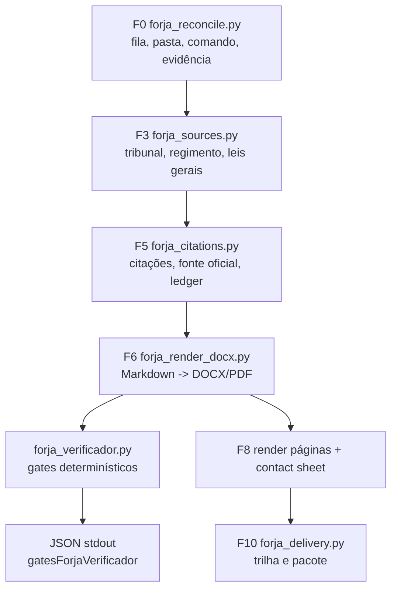

# Relatório Efesto + Helena — Auditoria do Sistema FORJA para Elaboração de Petições

**Data:** 2026-07-09  
**Modo:** auditoria técnica e estratégica, sem alteração funcional do FORJA nesta rodada  
**Lentes:** Efesto Tekhton — arquitetura, automação, runbook e execução verificável; Helena — decisão estratégica, cenários, sinais fracos e red team.  
**Escopo auditado:** `_FORJA_HARNESS`, planejamentos N2, manifesto, scripts, estados, verificador, render, entrega F10 e produtos Markdown atuais em `state/*/producao`.

---

## 1. Status executivo

O FORJA deixou de ser apenas planejamento e já tem uma esteira local parcialmente funcional para elaboração de petições: reconciliação de demandas, gate de fontes/regimento, ledger de citações, render DOCX/PDF em template, QA visual, entrega com evidência e verificador determinístico baseado nas retrospectivas reais.

O núcleo arquitetural está correto: **painel organiza, comando orienta, anexo/fonte prova, estado bloqueia, entrega exige evidência**. A evolução recente mais importante foi transformar as lições de falhas reais em código (`forja_verificador.py`) e acoplar esse verificador ao render (`forja_render_docx.py`).

O risco principal agora não é falta de ambição nem falta de documentação. O risco é **o sistema detectar erro crítico e mesmo assim permitir fechamento se o operador ou o F10 não consumir esse resultado como gate bloqueante**.

Recomendação combinada: operar o FORJA, neste momento, como **esteira assistida com bloqueio técnico obrigatório**, não como produção automática plena. O sistema já pode acelerar diagnóstico, montagem de pacote e auditoria; ainda não deve declarar peça protocolável sem o circuito `verificador -> F7 persistido -> F10 bloqueante -> evidência de entrega`.

**Confiança desta leitura:** 0,86. Base: scripts compilam, regressão do verificador passa, manifesto está válido e os achados foram reproduzidos em produtos reais; a confiança não é maior porque a entrega F10 ainda não consome o resultado do verificador como gate canônico.

---

## 1-A. Leitura Helena — decisão estratégica

### Recomendação

Priorizar uma correção pequena e decisiva: fechar o circuito entre o verificador e a entrega. Essa medida vale mais do que criar novas fases, novos documentos ou nova classificação de risco, porque reduz diretamente o erro que pode chegar ao cliente ou ao protocolo.

O FORJA deve continuar com autonomia operacional, mas com uma trava simples:

> peça protocolável só fecha F10 se `F7_VERIFICADOR_FORJA.json` existir, tiver `p0 == 0` e estiver citado na trilha de evidência.

### Achado diferencial

O FORJA já tem um bom desenho de responsabilidade: o painel não é prova, o estado não substitui fonte, e a entrega não deveria existir sem evidência. O ponto frágil não é conceitual; é de acoplamento entre uma verificação que já existe e a etapa que declara conclusão.

Em termos práticos: o sistema já enxerga parte dos erros. Falta obrigar a etapa final a obedecer esse sinal.

### Mecanismo causal

Quando o verificador fica apenas como saída de render ou informação no console, ele depende de atenção humana no pior momento: fechamento, pressa e pressão de entrega. Ao persistir o resultado em arquivo canônico e exigir esse arquivo no F10, o erro deixa de ser "observação" e vira "estado bloqueante".

### Cenários

| Cenário | Probabilidade | Sinal operacional | Decisão |
|---|---:|---|---|
| Base | 60% | F7 persistido e F10 bloqueante entram sem reescrever a esteira | FORJA vira esteira assistida confiável para novos casos |
| Otimista | 25% | Além do F7, os dois P0 estruturais são resolvidos por fonte/regimento e Libra é validado no DOCX/PDF real | FORJA pode operar piloto de produção com revisão humana final |
| Pessimista | 15% | F10 segue aceitando entrega por checklist de existência e P0 fica só no relatório | Sistema continua útil para auditoria, mas não para fechamento confiável |

### Red team

1. **Contra-hipótese:** talvez o F10 não precise consumir o verificador, porque o operador já lê o JSON do render.  
   **Teste de reversão:** localizar pacotes F10 recentes e confirmar se todos registram leitura explícita do verificador. Se não registram, a hipótese cai.

2. **Contra-hipótese:** o verificador pode bloquear demais e atrapalhar peça boa.  
   **Teste de reversão:** rodar o verificador em um conjunto de peças já aceitas pelo escritório. Se falsos P0 forem frequentes, ajustar regra; se forem raros, manter bloqueio.

3. **Contra-hipótese:** o P0 de Libra Sul pode estar restrito ao Markdown intermediário.  
   **Teste de reversão:** abrir o DOCX/PDF efetivamente entregue. Se o rótulo não aparece, registrar o P0 como artefato intermediário; se aparece, corrigir a peça final.

### Próximo movimento em 48 horas

| Prazo | Movimento | Critério de pronto |
|---|---|---|
| 2026-07-09 | Persistir `F7_VERIFICADOR_FORJA.json` no render | arquivo gerado com `p0`, `p1`, violações e timestamp |
| 2026-07-09 | Fazer F10 consumir o F7 persistido | entrega bloqueia peça protocolável com `p0 > 0` |
| 2026-07-10 | Auditar DOCX/PDF real de Libra Sul | decidir se o P0 é final ou intermediário |
| 2026-07-10 | Resolver P0 estruturais por fonte, não por inferência | Natura com tribunal/produto consultivo definido; Patrícia/Fábio com regimento oficial ou bloqueio mantido |

---

## 2. Evidência de validação executada

### 2.1 Scripts presentes

Foram encontrados os seguintes scripts no harness:

| Script | Função observada | Estado |
|---|---|---|
| `forja_reconcile.py` | F0, reconciliação da fila, estado, evidência e integrações | presente |
| `forja_sources.py` | F3, fontes, regimento e leis gerais | presente |
| `forja_citations.py` | F5, extração e ledger de citações | presente |
| `forja_pilot_m4.py` | M4, piloto template/DOCX/PDF/render | presente |
| `forja_render_docx.py` | F6/F8, render de Markdown para DOCX/PDF + QA | presente |
| `forja_delivery.py` | F10, pacote de revisão e trilha de evidência | presente |
| `forja_headless.py` | adaptador Claude headless OAuth | presente |
| `forja_verificador.py` | gates determinísticos das retrospectivas | presente |
| `test_forja_verificador.py` | regressão do verificador | presente |

### 2.2 Validações rodadas nesta auditoria

- `python -m py_compile` em todos os scripts Python do FORJA: **OK**.
- `python _FORJA_HARNESS\test_forja_verificador.py`: **OK**.
  - Resultado: `10 detecções + 8 não-travas confirmadas`.
- `python -m json.tool _FORJA_HARNESS\FORJA_SPEC_MANIFEST.json`: **OK**.
- Auditoria dos produtos Markdown atuais com `forja_verificador.py`: concluída.
- Auditoria de estados `FORJA_STATE.json`: concluída.

---

## 3. Arquitetura atual do FORJA

### 3.1 Fonte normativa

O manifesto atual é `_FORJA_HARNESS\FORJA_SPEC_MANIFEST.json`. Ele declara:

- especificação vigente: `FORJA_N2`;
- fases F0-F10;
- regras normativas de evidência, fonte oficial, regimento, template, QA visual e destinatários aprovados;
- catálogo de gates de qualidade;
- componentes implementados;
- verificador de qualidade como componente ativo.

O manifesto também registra `qualityVerifier` apontando para:

- arquivo: `forja_verificador.py`;
- status: `active`;
- integração: `forja_render_docx.py`, campo `gatesForjaVerificador`;
- origem: `RETROSPECTIVAS.md`, lições dos casos reais.

### 3.2 Fluxo técnico observado

### 3.3 Ponto forte da arquitetura

O sistema separa bem os planos:

- gestão: `gestao_escritorio/data/demandas.json`;
- estado técnico: `_FORJA_HARNESS/state/<caseId>/FORJA_STATE.json`;
- produção: pasta do caso e `state/<caseId>/producao`;
- auditoria: relatórios, checklists e ledger;
- entrega: `F10_TRILHA_EVIDENCIA.md`.

Essa separação é boa porque reduz o risco de o painel virar prova ou de uma peça ser marcada como cumprida só porque um status visual mudou.

---

## 4. Componentes auditados

### 4.1 `forja_reconcile.py`

**Função:** reconciliar demandas, pastas, comandos, anexos e evidência.

**Acertos:**

- Não altera o painel diretamente.
- Classifica integrações como `ok`, `degraded`, `needs_login` ou `offline`.
- Exige evidência para demanda marcada como `cumprida`.
- Gera `FORJA_STATE.json` por caso.

**Risco residual:**

- Estados antigos `fulfilled` em F0 podem representar reconciliações legadas, não conclusão completa F10. Isso não deve ser corrigido automaticamente sem entender o caso.

### 4.2 `forja_sources.py`

**Função:** F3, fontes/regimento/leis gerais.

**Acertos:**

- Cria gate `TRIBUNAL_NAO_IDENTIFICADO`.
- Cria gate `REGIMENTO_AUSENTE`.
- Trata produto consultivo com lógica diferenciada quando regimento não é bloqueador.

**Risco residual:**

- O caso Natura ainda está bloqueado por `TRIBUNAL_NAO_IDENTIFICADO`.
- O caso Patrícia/Fábio ainda está bloqueado por `REGIMENTO_AUSENTE`.

Esses bloqueios parecem corretos. Não devem ser resolvidos por inferência solta.

### 4.3 `forja_citations.py`

**Função:** extrair citações e montar ledger.

**Acertos:**

- Extrai REsp, AREsp, AgInt, EDcl, Tema e Súmulas.
- Usa cache oficial quando disponível.
- Grava `F5_CHECKLIST_CITACOES.md`.
- Atualiza `sourceLedger`.
- Deduplicação por ID já foi incorporada.

**Risco residual:**

- A existência da fonte não resolve atribuição literal de frase entre aspas. A retrospectiva já apontou erro de aspa/paráfrase de súmula. Esse tipo de validação completa ainda depende de auditoria dedicada ou comparação com cache/texto oficial.

### 4.4 `forja_render_docx.py`

**Função:** renderizar Markdown para DOCX/PDF usando template.

**Acertos:**

- Usa template oficial.
- Exporta PDF via Word COM.
- Renderiza páginas para QA.
- Gera contact sheet.
- Lê o Markdown-fonte e roda `forja_verificador.py`.
- Inclui o resultado em `gatesForjaVerificador`.

**Risco principal:**

O verificador roda, mas o script não bloqueia render quando há P0. Isso foi intencional no código: falha do gate é reportada, não derruba o render.

Isso é aceitável para render consultivo. Não é suficiente para peça final.

### 4.5 `forja_delivery.py`

**Função:** F10, pacote de revisão e evidência.

**Acertos:**

- Exige elos da trilha: comando, fontes, checklist de citações, minuta, auditoria, QA visual, entrega arquivada e evidência.
- Endureceu entrega: não aceita string simples como arquivo arquivado.
- Grava `currentPhase = F10_ENTREGA_EVIDENCIA_APRENDIZADO`.
- Gera `F10_TRILHA_EVIDENCIA.md`.

**Risco principal:**

O F10 confere existência de minuta/auditoria/QA, mas não foi encontrado consumo direto do `gatesForjaVerificador`. Portanto, se o render detectar P0 e ainda gerar DOCX/PDF, o F10 pode não saber disso, salvo se algum relatório humano registrar.

### 4.6 `forja_verificador.py`

**Função:** gates determinísticos derivados das retrospectivas.

**Gates atuais:**

- G1 personas internas e jargão;
- G2 placeholders;
- G3 contagens agregadas;
- G4 súmula/tribunal e dispositivos notórios;
- G5 institutos jurídicos em direção errada;
- G6 cara de IA;
- G7 aritmética de datas;
- G8 formato protocolável.

**Acertos:**

- Teste de regressão existe.
- Detecta erros históricos graves.
- Possui lista de não-travas para evitar P0 indevido.
- Diferencia peça, estudo e e-mail em alguns gates.

**Limite técnico:**

Ele codifica a parte determinística das lições. Não substitui:

- conferência oficial completa de dispositivo legal;
- leitura dos autos;
- comparação verbatim de todas as aspas;
- análise de estratégia jurídica;
- validação de fonte externa atualizada.

### 4.7 `test_forja_verificador.py`

**Função:** impedir regressão do verificador.

**Resultado desta auditoria:** passou.

**Cobertura:**

- Detecta execução fiscal invertida;
- Súmula 7/STF;
- prescrição trienal com art. 205 CC;
- MS com CPC;
- personas internas;
- intervalo de datas absurdo;
- emoji;
- penhora de receita pública;
- marcador de bloqueador;
- placeholder `[NOME]` / `[OAB]`.

**Não-travas confirmadas:**

- negação correta de penhora/bloqueio;
- uso legítimo de `[dia]`;
- `P1:` como pergunta;
- Súmulas corretas;
- intervalo aproximado coerente.

---

## 5. Estado operacional atual

### 5.1 Estados com P0

| Caso | Status | Fase | P0 |
|---|---|---|---|
| `case-email-natura-cabreuva-19f3991ebc75fe03` | `blocked` | `F3_FONTES_REGIMENTO_LEIS` | `TRIBUNAL_NAO_IDENTIFICADO` |
| `case-email-patricia-fabio-memoriais-19f3c68ee6d8fef2` | `blocked` | `F3_FONTES_REGIMENTO_LEIS` | `REGIMENTO_AUSENTE` |

### 5.2 Interpretação Efesto

Esses P0 são bloqueios saudáveis. Eles não demonstram falha do sistema; demonstram que o sistema está recusando avançar quando falta uma condição objetiva.

### 5.3 Estados fulfilled em F0

Há vários estados `fulfilled` ainda em `F0_RECONCILIACAO_FILA` por `manual_override`. Isso deve ser tratado com cuidado: pode ser legado de reconciliação e não uma esteira F0-F10 completa. Não recomendo normalização automática desses estados.

---

## 6. Auditoria dos produtos atuais

### 6.1 Produtos sem P0 pelo verificador

| Produto | Tipo | Resultado |
|---|---|---|
| `MEMORIAIS_PATRICIA_FABIO_APELACAO.md` | peça | 0 P0 / 0 P1 |
| `ESTUDO_PRELIMINAR_NATURA_CABREUVA.md` | estudo | 0 P0 / 0 P1 |
| `MEMORIAL_AZIMUT_RESP_2237713.md` | peça | 0 P0 / 1 P1 |

### 6.2 Produto com P0 determinístico

| Produto | Achado |
|---|---|
| `MEMORIAIS_LIBRA_SUL_AGINT_ARESP_2578181.md` | P0 G8: rótulo estrutural `IDENTIFICAÇÃO DO PROCESSO` na peça |

O achado está em `state/case-email-libra-sul-agint-stj-19f3c9350d875062/producao/MEMORIAIS_LIBRA_SUL_AGINT_ARESP_2578181.md`, linha 9.

### 6.3 Produtos com P1

| Produto | Achado |
|---|---|
| `MEMORIAL_AZIMUT_RESP_2237713.md` | `[dia]` deliberado para preencher ao protocolar |
| `DIAGNOSTICO_CORSAN_AGERST.md` | contagem `13 inquéritos` repetida; verificador pede fonte/método mais explícito no entorno |

No caso CORSAN, parte do próprio texto já indica que os inquéritos não foram acessados. Portanto, o P1 deve ser lido como reforço de rastreabilidade, não como erro fatal automático.

---

## 7. Achados principais

### P0-1 — Gate do verificador ainda não fecha o F10

**Evidência:** `forja_render_docx.py` gera `gatesForjaVerificador`, mas `forja_delivery.py` não consome esse campo diretamente.  
**Risco:** um P0 determinístico pode ser detectado no render e ainda assim não bloquear `fulfilled` se o operador ignorar o JSON.  
**Impacto:** alto para peça protocolável.  
**Correção recomendada:** persistir o resultado do verificador em arquivo canônico e exigir `p0 == 0` no F10.

### P0-2 — Produto Libra Sul possui rótulo estrutural de produção

**Evidência:** `## IDENTIFICAÇÃO DO PROCESSO` na linha 9 da peça Markdown.  
**Risco:** aparência de artefato de produção, não peça real.  
**Impacto:** médio/alto se esse Markdown for usado como fonte final; baixo se já foi substituído por DOCX final limpo.  
**Correção recomendada:** não mexer automaticamente. Validar se o DOCX/PDF entregue contém esse rótulo. Se sim, remover na peça final.

### P1-1 — CORSAN tem contagem sensível sem método suficientemente colado ao número

**Evidência:** `13 inquéritos` aparece em múltiplos trechos do diagnóstico.  
**Risco:** número agregado virar precisão falsa se o leitor não perceber que é dependente de documentos não acessados.  
**Impacto:** médio.  
**Correção recomendada:** manter o número apenas quando estiver sempre acompanhado de origem ou ressalva explícita: "conforme comando/e-mail; íntegra não acessada".

### P1-2 — `[dia]` em Azimut é deliberado, mas exige checklist de protocolo

**Evidência:** `Brasília/DF, [dia] de julho de 2026.`  
**Risco:** virar placeholder esquecido se for protocolar sem preenchimento.  
**Impacto:** baixo enquanto está marcado como P1; alto se virar versão final.  
**Correção recomendada:** F9/F10 deve ter checklist específico: data de protocolo preenchida.

### P1-3 — Estados fulfilled em F0 não provam esteira completa

**Evidência:** múltiplos casos `fulfilled` com `currentPhase = F0_RECONCILIACAO_FILA`.  
**Risco:** leitor futuro interpretar `fulfilled` como peça auditada F10.  
**Impacto:** médio.  
**Correção recomendada:** não alterar estados automaticamente; incluir no relatório de operação a distinção entre `fulfilled por reconciliação/manual_override` e `fulfilled por F10`.

## 7-A. Matriz Efesto + Helena de decisão

| Item | Severidade técnica | Impacto estratégico | Decisão recomendada |
|---|---|---|---|
| F10 não consome `gatesForjaVerificador` | P0 sistêmico | Alto: permite falsa conclusão apesar de erro detectado | Corrigir primeiro; é a menor mudança com maior redução de risco |
| Libra Sul com rótulo estrutural no Markdown | P0 do produto auditado | Médio/alto se chegou ao DOCX/PDF final | Validar entrega real antes de editar; corrigir só se estiver no artefato final |
| Natura bloqueado por tribunal não identificado | P0 estrutural de fonte | Alto para peça; médio se for estudo consultivo | Manter bloqueio até classificar produto/tribunal por evidência |
| Patrícia/Fábio bloqueado por regimento ausente | P0 estrutural normativo | Alto para peça protocolável | Obter regimento oficial integral ou manter bloqueio |
| CORSAN com `13 inquéritos` sem método sempre colado | P1 de rastreabilidade | Médio: risco de precisão aparente | Ajustar texto para origem/método acompanhar o número |
| Azimut com `[dia]` | P1 operacional | Baixo até virar versão final; alto no protocolo | Manter como pendência explícita em F9/F10 |
| Estados `fulfilled` em F0 | P1/P2 de leitura operacional | Médio: confusão futura de status | Documentar distinção; não normalizar em massa sem caso concreto |

Ordem de execução: primeiro fechar o circuito sistêmico; depois verificar Libra no artefato entregue; por fim limpar P1 de rastreabilidade. Essa ordem evita gastar energia corrigindo textos que talvez sejam intermediários enquanto a trava central ainda está aberta.

---

## 8. Recomendação técnica prioritária

### Forjar `F7_VERIFICADOR_FORJA.json`

Criar uma pequena ponte entre render e entrega:

1. `forja_render_docx.py` continua rodando `forja_verificador.py`.
2. Além de imprimir no stdout, grava `F7_VERIFICADOR_FORJA.json` no diretório de produção ou no `state/<caseId>/`.
3. O JSON deve conter:
   - arquivo analisado;
   - tipo (`peca`, `estudo`, `email`);
   - total;
   - `p0`;
   - `p1`;
   - lista de violações;
   - data/hora.
4. `forja_delivery.py` passa a exigir esse arquivo para peça protocolável.
5. F10 bloqueia `fulfilled` se `p0 > 0`.

Essa correção é pequena, objetiva e não reescreve peças.

---

## 9. Runbook recomendado para elaboração de petição FORJA/Efesto

### Entrada

1. Confirmar demanda no painel.
2. Confirmar pasta do caso.
3. Confirmar `COMANDO_DO_EMAIL.md`, `COMANDO_DO_WHATSAPP.md` ou equivalente.
4. Confirmar anexos esperados.

### F3 — Base normativa

1. Identificar tribunal.
2. Confirmar regimento interno integral.
3. Confirmar `_LEIS_GERAIS`.
4. Bloquear se tribunal/regimento for obrigatório e estiver ausente.

### F4/F5 — Estratégia e fontes

1. Blueprint separando fato, declaração, inferência, hipótese e lacuna.
2. Toda citação final precisa de fonte oficial ou arquivo-fonte arquivado.
3. Precedente sem lastro nos autos sai; não vira marcador.
4. Números agregados exigem fonte literal ou método explícito.

### F6 — Redação

1. Usar template ou peça anterior.
2. Não deixar matriz interna, persona, jargão de workflow ou rótulo estrutural na peça.
3. Assinaturas: nomes/OAB somente de fonte do caso.

### F7 — Auditoria

1. Rodar `forja_verificador.py`.
2. Rodar auditoria de fontes.
3. Conferir aspas com fonte primária.
4. Conferir dispositivo legal em fonte oficial quando não houver autos.
5. Registrar pendências deliberadas.

### F8 — QA visual

1. Render PDF via Word COM.
2. Renderizar todas as páginas.
3. Inspecionar contact sheet e páginas individuais.
4. Repetir QA após qualquer alteração que possa mudar paginação.

### F9/F10 — Entrega

1. Pacote de revisão com DOCX, PDF, relatório, fontes, QA e verificador.
2. Não marcar `cumprida` sem evidência real.
3. Não marcar `fulfilled` se `F7_VERIFICADOR_FORJA.json` tiver P0.
4. Se for cumprimento manual, registrar exatamente a evidência.

---

## 10. O que não recomendo fazer agora

1. Não normalizar automaticamente estados antigos `fulfilled` em F0.
2. Não remover P0 Natura ou Patrícia/Fábio por suposição.
3. Não reescrever peças já produzidas sem confirmar se o Markdown é fonte final ou só artefato intermediário.
4. Não transformar todos os P1 em bloqueio P0.
5. Não inserir nova camada de classificação genérica que não melhore entrega.

---

## 11. Próximas ações objetivas

### Ação 1 — Baixo risco, alto ganho

Implementar persistência do resultado do verificador:

- arquivo: `F7_VERIFICADOR_FORJA.json`;
- gate F10: `p0 == 0`;
- relatório F10 deve listar o arquivo e o resumo.

### Ação 2 — Auditoria de entrega real Libra Sul

Verificar se o DOCX/PDF entregue contém `IDENTIFICAÇÃO DO PROCESSO`. Se não contém, registrar que o P0 está restrito ao Markdown intermediário. Se contém, corrigir a peça final.

### Ação 3 — CORSAN

Amarrar todas as ocorrências de `13 inquéritos` a uma origem clara:

- fonte do comando;
- e-mail;
- anexo;
- ou ressalva de não acesso.

### Ação 4 — Azimut

Antes de qualquer protocolo, preencher `[dia]` e registrar no checklist final.

### Ação 5 — P0 estruturais

Manter Natura e Patrícia/Fábio bloqueados até:

- Natura: classificar tribunal/órgão realmente aplicável ou declarar produto consultivo sem regimento obrigatório;
- Patrícia/Fábio: obter `REGIMENTO_INTERNO_TJRJ.md` oficial/integral ou corrigir o estado se o regimento já existir em pasta não localizada.

---

## 12. Veredito Efesto + Helena

O FORJA está em um bom ponto de engenharia: tem estado, manifesto, gates, render, evidência, verificador e testes. O salto de qualidade agora não está em criar mais documentação; está em **fechar os circuitos**.

Circuito ainda aberto:

> `verificador detecta P0` -> `render reporta JSON` -> `F10 precisa bloquear fulfilled`

Enquanto esse circuito não for fechado, o FORJA é uma ótima bancada de auditoria. Depois de fechado, começa a virar esteira confiável de elaboração de petição.

Leitura Efesto: a próxima melhoria deve ser concreta, pequena e verificável. Criar `F7_VERIFICADOR_FORJA.json`, exigir `p0 == 0` no F10 e registrar o resultado na trilha de evidência.

Leitura Helena: o FORJA não precisa de mais promessa de inteligência; precisa de menos ambiguidade na hora de fechar trabalho. O sinal de maturidade será quando uma peça com P0 não depender de interpretação humana para ser bloqueada.

Veredito combinado: **FORJA está apto para operar como harness assistido e auditável; ainda não está apto para fechamento automático pleno de peça protocolável sem a trava F7 -> F10.**
