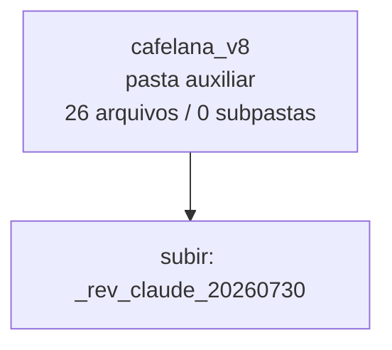

<!-- IA_NAVIGACAO:GERADO_AUTO:v1 -->
# Mapa IA - cafelana_v8

Atualizado automaticamente em: **2026-08-05 13:55:56 -0300**

- Caminho: `C:\Users\IgorPC\.claude\projects\Escritório fabio osório\fabricas de melhoria de petições\_FORJA_HARNESS\reports\_rev_claude_20260730\cafelana_v8`
- Tipo: **pasta auxiliar**
- Função para navegação: conteúdo auxiliar ou residual
- Conteúdo recursivo: **26 arquivos**, **0 subpastas**, **6.2 MB**
- Tipos de arquivo: .png: 26
- Mapa raiz: [MAPA_IA.md](<../../../../MAPA_IA.md>)
- Índice geral: [INDICE_GERAL_IA.md](<../../../../00_IA_NAVIGACAO/INDICE_GERAL_IA.md>)
- Protocolo de navegação: [PROTOCOLO_NAVEGACAO_IA.md](<../../../../00_IA_NAVIGACAO/PROTOCOLO_NAVEGACAO_IA.md>)
- Inventário JSON para agentes: [inventario_ia.json](<../../../../00_IA_NAVIGACAO/dados/inventario_ia.json>)
- Mapa superior: [_rev_claude_20260730](<../MAPA_IA.md>)

## GPS Mermaid

## Ordem de leitura recomendada

1. Ler este `MAPA_IA.md` antes de abrir arquivos pesados.
2. Subir para a raiz se precisar das regras globais `AGENTS.md`, `CLAUDE.md` e `_LEIS_GERAIS`.

## Subpastas diretas

_Sem subpastas diretas._

## Arquivos diretos

| Arquivo | Papel | Tamanho | Modificado | Observação |
|---|---:|---:|---:|---|
| [p01.png](<p01.png>) | imagem/visual | 75.4 KB | 2026-07-30 16:26 | imagem ou elemento visual |
| [p02.png](<p02.png>) | imagem/visual | 264.4 KB | 2026-07-30 16:26 | imagem ou elemento visual |
| [p03.png](<p03.png>) | imagem/visual | 281.3 KB | 2026-07-30 16:26 | imagem ou elemento visual |
| [p04.png](<p04.png>) | imagem/visual | 282.3 KB | 2026-07-30 16:26 | imagem ou elemento visual |
| [p05.png](<p05.png>) | imagem/visual | 219.1 KB | 2026-07-30 16:26 | imagem ou elemento visual |
| [p06.png](<p06.png>) | imagem/visual | 272.4 KB | 2026-07-30 16:26 | imagem ou elemento visual |
| [p07.png](<p07.png>) | imagem/visual | 268.8 KB | 2026-07-30 16:26 | imagem ou elemento visual |
| [p08.png](<p08.png>) | imagem/visual | 203.6 KB | 2026-07-30 16:26 | imagem ou elemento visual |
| [p09.png](<p09.png>) | imagem/visual | 244.9 KB | 2026-07-30 16:26 | imagem ou elemento visual |
| [p10.png](<p10.png>) | imagem/visual | 270.3 KB | 2026-07-30 16:26 | imagem ou elemento visual |
| [p11.png](<p11.png>) | imagem/visual | 277.9 KB | 2026-07-30 16:26 | imagem ou elemento visual |
| [p12.png](<p12.png>) | imagem/visual | 291.9 KB | 2026-07-30 16:26 | imagem ou elemento visual |
| [p13.png](<p13.png>) | imagem/visual | 217.6 KB | 2026-07-30 16:26 | imagem ou elemento visual |
| [p14.png](<p14.png>) | imagem/visual | 240.9 KB | 2026-07-30 16:26 | imagem ou elemento visual |
| [p15.png](<p15.png>) | imagem/visual | 277.2 KB | 2026-07-30 16:26 | imagem ou elemento visual |
| [p16.png](<p16.png>) | imagem/visual | 257.3 KB | 2026-07-30 16:26 | imagem ou elemento visual |
| [p17.png](<p17.png>) | imagem/visual | 280.9 KB | 2026-07-30 16:26 | imagem ou elemento visual |
| [p18.png](<p18.png>) | imagem/visual | 260.7 KB | 2026-07-30 16:26 | imagem ou elemento visual |
| [p19.png](<p19.png>) | imagem/visual | 289.3 KB | 2026-07-30 16:26 | imagem ou elemento visual |
| [p20.png](<p20.png>) | imagem/visual | 256.6 KB | 2026-07-30 16:26 | imagem ou elemento visual |
| [p21.png](<p21.png>) | imagem/visual | 205.8 KB | 2026-07-30 16:26 | imagem ou elemento visual |
| [p22.png](<p22.png>) | imagem/visual | 257.4 KB | 2026-07-30 16:26 | imagem ou elemento visual |
| [p23.png](<p23.png>) | imagem/visual | 253.8 KB | 2026-07-30 16:26 | imagem ou elemento visual |
| [p24.png](<p24.png>) | imagem/visual | 285.9 KB | 2026-07-30 16:26 | imagem ou elemento visual |
| [p25.png](<p25.png>) | imagem/visual | 201.0 KB | 2026-07-30 16:26 | imagem ou elemento visual |
| [p26.png](<p26.png>) | imagem/visual | 155.7 KB | 2026-07-30 16:26 | imagem ou elemento visual |

## Leitura por papel

- **imagem/visual**: [p01.png](<p01.png>), [p02.png](<p02.png>), [p03.png](<p03.png>), [p04.png](<p04.png>), [p05.png](<p05.png>), [p06.png](<p06.png>), [p07.png](<p07.png>), [p08.png](<p08.png>), [p09.png](<p09.png>), [p10.png](<p10.png>), [p11.png](<p11.png>), [p12.png](<p12.png>), [p13.png](<p13.png>), [p14.png](<p14.png>), [p15.png](<p15.png>), [p16.png](<p16.png>), [p17.png](<p17.png>), [p18.png](<p18.png>), [p19.png](<p19.png>), [p20.png](<p20.png>), [p21.png](<p21.png>), [p22.png](<p22.png>), [p23.png](<p23.png>), [p24.png](<p24.png>), [p25.png](<p25.png>), [p26.png](<p26.png>)

## Observações anti-alucinação

- Este mapa classifica por nomes, extensões e posição na árvore; não substitui leitura de fonte primária.
- Fato, citação, ID processual, prazo e jurisprudência só entram em peça depois de conferência no arquivo-fonte ou fonte oficial.
- Se a pasta tiver regimento, a peça deve refletir o regimento vigente na data do protocolo.
