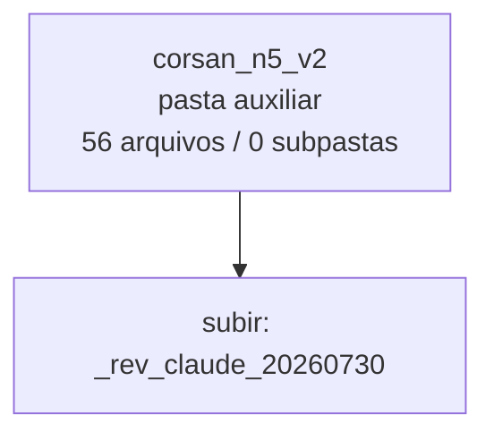

<!-- IA_NAVIGACAO:GERADO_AUTO:v1 -->
# Mapa IA - corsan_n5_v2

Atualizado automaticamente em: **2026-08-05 13:33:35 -0300**

- Caminho: `C:\Users\IgorPC\.claude\projects\Escritório fabio osório\fabricas de melhoria de petições\_FORJA_HARNESS\reports\_rev_claude_20260730\corsan_n5_v2`
- Tipo: **pasta auxiliar**
- Função para navegação: conteúdo auxiliar ou residual
- Conteúdo recursivo: **56 arquivos**, **0 subpastas**, **12.3 MB**
- Tipos de arquivo: .png: 56
- Mapa raiz: [MAPA_IA.md](<../../../../MAPA_IA.md>)
- Índice geral: [INDICE_GERAL_IA.md](<../../../../00_IA_NAVIGACAO/INDICE_GERAL_IA.md>)
- Protocolo de navegação: [PROTOCOLO_NAVEGACAO_IA.md](<../../../../00_IA_NAVIGACAO/PROTOCOLO_NAVEGACAO_IA.md>)
- Inventário JSON para agentes: [inventario_ia.json](<../../../../00_IA_NAVIGACAO/dados/inventario_ia.json>)
- Mapa superior: [_rev_claude_20260730](<../MAPA_IA.md>)

## GPS Mermaid

## Ordem de leitura recomendada

1. Ler este `MAPA_IA.md` antes de abrir arquivos pesados.
2. Subir para a raiz se precisar das regras globais `AGENTS.md`, `CLAUDE.md` e `_LEIS_GERAIS`.

## Subpastas diretas

_Sem subpastas diretas._

## Arquivos diretos

| Arquivo | Papel | Tamanho | Modificado | Observação |
|---|---:|---:|---:|---|
| [p01.png](<p01.png>) | imagem/visual | 217.4 KB | 2026-07-30 16:26 | imagem ou elemento visual |
| [p02.png](<p02.png>) | imagem/visual | 285.2 KB | 2026-07-30 16:26 | imagem ou elemento visual |
| [p03.png](<p03.png>) | imagem/visual | 318.2 KB | 2026-07-30 16:26 | imagem ou elemento visual |
| [p04.png](<p04.png>) | imagem/visual | 201.3 KB | 2026-07-30 16:26 | imagem ou elemento visual |
| [p05.png](<p05.png>) | imagem/visual | 181.5 KB | 2026-07-30 16:26 | imagem ou elemento visual |
| [p06.png](<p06.png>) | imagem/visual | 287.8 KB | 2026-07-30 16:26 | imagem ou elemento visual |
| [p07.png](<p07.png>) | imagem/visual | 180.3 KB | 2026-07-30 16:26 | imagem ou elemento visual |
| [p08.png](<p08.png>) | imagem/visual | 188.7 KB | 2026-07-30 16:26 | imagem ou elemento visual |
| [p09.png](<p09.png>) | imagem/visual | 175.0 KB | 2026-07-30 16:26 | imagem ou elemento visual |
| [p10.png](<p10.png>) | imagem/visual | 179.4 KB | 2026-07-30 16:26 | imagem ou elemento visual |
| [p11.png](<p11.png>) | imagem/visual | 189.4 KB | 2026-07-30 16:26 | imagem ou elemento visual |
| [p12.png](<p12.png>) | imagem/visual | 196.1 KB | 2026-07-30 16:26 | imagem ou elemento visual |
| [p13.png](<p13.png>) | imagem/visual | 163.6 KB | 2026-07-30 16:26 | imagem ou elemento visual |
| [p14.png](<p14.png>) | imagem/visual | 157.1 KB | 2026-07-30 16:26 | imagem ou elemento visual |
| [p15.png](<p15.png>) | imagem/visual | 180.5 KB | 2026-07-30 16:26 | imagem ou elemento visual |
| [p16.png](<p16.png>) | imagem/visual | 161.4 KB | 2026-07-30 16:26 | imagem ou elemento visual |
| [p17.png](<p17.png>) | imagem/visual | 169.0 KB | 2026-07-30 16:26 | imagem ou elemento visual |
| [p18.png](<p18.png>) | imagem/visual | 146.3 KB | 2026-07-30 16:26 | imagem ou elemento visual |
| [p19.png](<p19.png>) | imagem/visual | 184.8 KB | 2026-07-30 16:26 | imagem ou elemento visual |
| [p20.png](<p20.png>) | imagem/visual | 291.4 KB | 2026-07-30 16:26 | imagem ou elemento visual |
| [p21.png](<p21.png>) | imagem/visual | 308.6 KB | 2026-07-30 16:26 | imagem ou elemento visual |
| [p22.png](<p22.png>) | imagem/visual | 291.3 KB | 2026-07-30 16:26 | imagem ou elemento visual |
| [p23.png](<p23.png>) | imagem/visual | 211.6 KB | 2026-07-30 16:26 | imagem ou elemento visual |
| [p24.png](<p24.png>) | imagem/visual | 299.9 KB | 2026-07-30 16:26 | imagem ou elemento visual |
| [p25.png](<p25.png>) | imagem/visual | 280.0 KB | 2026-07-30 16:26 | imagem ou elemento visual |
| [p26.png](<p26.png>) | imagem/visual | 285.5 KB | 2026-07-30 16:26 | imagem ou elemento visual |
| [p27.png](<p27.png>) | imagem/visual | 304.6 KB | 2026-07-30 16:26 | imagem ou elemento visual |
| [p28.png](<p28.png>) | imagem/visual | 285.0 KB | 2026-07-30 16:26 | imagem ou elemento visual |
| [p29.png](<p29.png>) | imagem/visual | 305.2 KB | 2026-07-30 16:26 | imagem ou elemento visual |
| [p30.png](<p30.png>) | imagem/visual | 304.9 KB | 2026-07-30 16:26 | imagem ou elemento visual |
| [p31.png](<p31.png>) | imagem/visual | 306.4 KB | 2026-07-30 16:26 | imagem ou elemento visual |
| [p32.png](<p32.png>) | imagem/visual | 292.0 KB | 2026-07-30 16:26 | imagem ou elemento visual |
| [p33.png](<p33.png>) | imagem/visual | 294.9 KB | 2026-07-30 16:26 | imagem ou elemento visual |
| [p34.png](<p34.png>) | imagem/visual | 291.3 KB | 2026-07-30 16:26 | imagem ou elemento visual |
| [p35.png](<p35.png>) | imagem/visual | 165.1 KB | 2026-07-30 16:26 | imagem ou elemento visual |
| [p36.png](<p36.png>) | imagem/visual | 166.2 KB | 2026-07-30 16:26 | imagem ou elemento visual |
| [p37.png](<p37.png>) | imagem/visual | 183.1 KB | 2026-07-30 16:26 | imagem ou elemento visual |
| [p38.png](<p38.png>) | imagem/visual | 169.6 KB | 2026-07-30 16:26 | imagem ou elemento visual |
| [p39.png](<p39.png>) | imagem/visual | 166.4 KB | 2026-07-30 16:26 | imagem ou elemento visual |
| [p40.png](<p40.png>) | imagem/visual | 165.1 KB | 2026-07-30 16:26 | imagem ou elemento visual |
| [p41.png](<p41.png>) | imagem/visual | 206.6 KB | 2026-07-30 16:26 | imagem ou elemento visual |
| [p42.png](<p42.png>) | imagem/visual | 239.3 KB | 2026-07-30 16:26 | imagem ou elemento visual |
| [p43.png](<p43.png>) | imagem/visual | 157.8 KB | 2026-07-30 16:26 | imagem ou elemento visual |
| [p44.png](<p44.png>) | imagem/visual | 165.4 KB | 2026-07-30 16:26 | imagem ou elemento visual |
| [p45.png](<p45.png>) | imagem/visual | 202.5 KB | 2026-07-30 16:26 | imagem ou elemento visual |
| [p46.png](<p46.png>) | imagem/visual | 180.8 KB | 2026-07-30 16:26 | imagem ou elemento visual |
| [p47.png](<p47.png>) | imagem/visual | 215.3 KB | 2026-07-30 16:26 | imagem ou elemento visual |
| [p48.png](<p48.png>) | imagem/visual | 257.4 KB | 2026-07-30 16:26 | imagem ou elemento visual |
| [p49.png](<p49.png>) | imagem/visual | 239.2 KB | 2026-07-30 16:26 | imagem ou elemento visual |
| [p50.png](<p50.png>) | imagem/visual | 260.1 KB | 2026-07-30 16:26 | imagem ou elemento visual |
| [p51.png](<p51.png>) | imagem/visual | 204.0 KB | 2026-07-30 16:26 | imagem ou elemento visual |
| [p52.png](<p52.png>) | imagem/visual | 242.1 KB | 2026-07-30 16:26 | imagem ou elemento visual |
| [p53.png](<p53.png>) | imagem/visual | 256.6 KB | 2026-07-30 16:26 | imagem ou elemento visual |
| [p54.png](<p54.png>) | imagem/visual | 243.0 KB | 2026-07-30 16:26 | imagem ou elemento visual |
| [p55.png](<p55.png>) | imagem/visual | 291.5 KB | 2026-07-30 16:26 | imagem ou elemento visual |
| [p56.png](<p56.png>) | imagem/visual | 119.9 KB | 2026-07-30 16:26 | imagem ou elemento visual |

## Leitura por papel

- **imagem/visual**: [p01.png](<p01.png>), [p02.png](<p02.png>), [p03.png](<p03.png>), [p04.png](<p04.png>), [p05.png](<p05.png>), [p06.png](<p06.png>), [p07.png](<p07.png>), [p08.png](<p08.png>), [p09.png](<p09.png>), [p10.png](<p10.png>), [p11.png](<p11.png>), [p12.png](<p12.png>), [p13.png](<p13.png>), [p14.png](<p14.png>), [p15.png](<p15.png>), [p16.png](<p16.png>), [p17.png](<p17.png>), [p18.png](<p18.png>), [p19.png](<p19.png>), [p20.png](<p20.png>), [p21.png](<p21.png>), [p22.png](<p22.png>), [p23.png](<p23.png>), [p24.png](<p24.png>), [p25.png](<p25.png>), [p26.png](<p26.png>), [p27.png](<p27.png>), [p28.png](<p28.png>), [p29.png](<p29.png>), [p30.png](<p30.png>), [p31.png](<p31.png>), [p32.png](<p32.png>), [p33.png](<p33.png>), [p34.png](<p34.png>), [p35.png](<p35.png>), [p36.png](<p36.png>), [p37.png](<p37.png>), [p38.png](<p38.png>), [p39.png](<p39.png>), [p40.png](<p40.png>), [p41.png](<p41.png>), [p42.png](<p42.png>), [p43.png](<p43.png>), [p44.png](<p44.png>), [p45.png](<p45.png>), [p46.png](<p46.png>), [p47.png](<p47.png>), [p48.png](<p48.png>), [p49.png](<p49.png>), [p50.png](<p50.png>), [p51.png](<p51.png>), [p52.png](<p52.png>), [p53.png](<p53.png>), [p54.png](<p54.png>), [p55.png](<p55.png>), [p56.png](<p56.png>)

## Observações anti-alucinação

- Este mapa classifica por nomes, extensões e posição na árvore; não substitui leitura de fonte primária.
- Fato, citação, ID processual, prazo e jurisprudência só entram em peça depois de conferência no arquivo-fonte ou fonte oficial.
- Se a pasta tiver regimento, a peça deve refletir o regimento vigente na data do protocolo.
