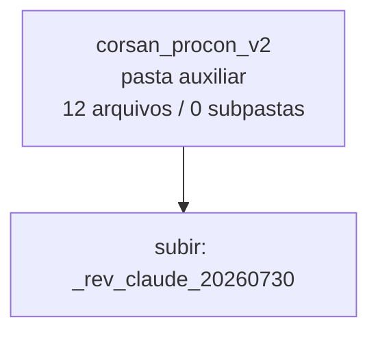

<!-- IA_NAVIGACAO:GERADO_AUTO:v1 -->
# Mapa IA - corsan_procon_v2

Atualizado automaticamente em: **2026-08-05 13:33:35 -0300**

- Caminho: `C:\Users\IgorPC\.claude\projects\Escritório fabio osório\fabricas de melhoria de petições\_FORJA_HARNESS\reports\_rev_claude_20260730\corsan_procon_v2`
- Tipo: **pasta auxiliar**
- Função para navegação: conteúdo auxiliar ou residual
- Conteúdo recursivo: **12 arquivos**, **0 subpastas**, **2.1 MB**
- Tipos de arquivo: .png: 12
- Mapa raiz: [MAPA_IA.md](<../../../../MAPA_IA.md>)
- Índice geral: [INDICE_GERAL_IA.md](<../../../../00_IA_NAVIGACAO/INDICE_GERAL_IA.md>)
- Protocolo de navegação: [PROTOCOLO_NAVEGACAO_IA.md](<../../../../00_IA_NAVIGACAO/PROTOCOLO_NAVEGACAO_IA.md>)
- Inventário JSON para agentes: [inventario_ia.json](<../../../../00_IA_NAVIGACAO/dados/inventario_ia.json>)
- Mapa superior: [_rev_claude_20260730](<../MAPA_IA.md>)

## GPS Mermaid

## Ordem de leitura recomendada

1. Ler este `MAPA_IA.md` antes de abrir arquivos pesados.
2. Subir para a raiz se precisar das regras globais `AGENTS.md`, `CLAUDE.md` e `_LEIS_GERAIS`.

## Subpastas diretas

_Sem subpastas diretas._

## Arquivos diretos

| Arquivo | Papel | Tamanho | Modificado | Observação |
|---|---:|---:|---:|---|
| [p01.png](<p01.png>) | imagem/visual | 69.8 KB | 2026-07-30 16:26 | imagem ou elemento visual |
| [p02.png](<p02.png>) | imagem/visual | 196.6 KB | 2026-07-30 16:26 | imagem ou elemento visual |
| [p03.png](<p03.png>) | imagem/visual | 252.1 KB | 2026-07-30 16:26 | imagem ou elemento visual |
| [p04.png](<p04.png>) | imagem/visual | 202.3 KB | 2026-07-30 16:26 | imagem ou elemento visual |
| [p05.png](<p05.png>) | imagem/visual | 163.5 KB | 2026-07-30 16:26 | imagem ou elemento visual |
| [p06.png](<p06.png>) | imagem/visual | 168.7 KB | 2026-07-30 16:26 | imagem ou elemento visual |
| [p07.png](<p07.png>) | imagem/visual | 164.8 KB | 2026-07-30 16:26 | imagem ou elemento visual |
| [p08.png](<p08.png>) | imagem/visual | 174.1 KB | 2026-07-30 16:26 | imagem ou elemento visual |
| [p09.png](<p09.png>) | imagem/visual | 216.7 KB | 2026-07-30 16:26 | imagem ou elemento visual |
| [p10.png](<p10.png>) | imagem/visual | 174.6 KB | 2026-07-30 16:26 | imagem ou elemento visual |
| [p11.png](<p11.png>) | imagem/visual | 164.9 KB | 2026-07-30 16:26 | imagem ou elemento visual |
| [p12.png](<p12.png>) | imagem/visual | 204.8 KB | 2026-07-30 16:26 | imagem ou elemento visual |

## Leitura por papel

- **imagem/visual**: [p01.png](<p01.png>), [p02.png](<p02.png>), [p03.png](<p03.png>), [p04.png](<p04.png>), [p05.png](<p05.png>), [p06.png](<p06.png>), [p07.png](<p07.png>), [p08.png](<p08.png>), [p09.png](<p09.png>), [p10.png](<p10.png>), [p11.png](<p11.png>), [p12.png](<p12.png>)

## Observações anti-alucinação

- Este mapa classifica por nomes, extensões e posição na árvore; não substitui leitura de fonte primária.
- Fato, citação, ID processual, prazo e jurisprudência só entram em peça depois de conferência no arquivo-fonte ou fonte oficial.
- Se a pasta tiver regimento, a peça deve refletir o regimento vigente na data do protocolo.
