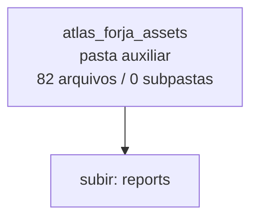

<!-- IA_NAVIGACAO:GERADO_AUTO:v1 -->
# Mapa IA - atlas_forja_assets

Atualizado automaticamente em: **2026-08-05 13:33:43 -0300**

- Caminho: `C:\Users\IgorPC\.claude\projects\Escritório fabio osório\fabricas de melhoria de petições\_FORJA_HARNESS\reports\atlas_forja_assets`
- Tipo: **pasta auxiliar**
- Função para navegação: conteúdo auxiliar ou residual
- Conteúdo recursivo: **82 arquivos**, **0 subpastas**, **1.3 MB**
- Tipos de arquivo: .svg: 41, .mmd: 41
- Mapa raiz: [MAPA_IA.md](<../../../MAPA_IA.md>)
- Índice geral: [INDICE_GERAL_IA.md](<../../../00_IA_NAVIGACAO/INDICE_GERAL_IA.md>)
- Protocolo de navegação: [PROTOCOLO_NAVEGACAO_IA.md](<../../../00_IA_NAVIGACAO/PROTOCOLO_NAVEGACAO_IA.md>)
- Inventário JSON para agentes: [inventario_ia.json](<../../../00_IA_NAVIGACAO/dados/inventario_ia.json>)
- Mapa superior: [reports](<../MAPA_IA.md>)

## GPS Mermaid

## Ordem de leitura recomendada

1. Ler este `MAPA_IA.md` antes de abrir arquivos pesados.
2. Subir para a raiz se precisar das regras globais `AGENTS.md`, `CLAUDE.md` e `_LEIS_GERAIS`.

## Subpastas diretas

_Sem subpastas diretas._

## Arquivos diretos

| Arquivo | Papel | Tamanho | Modificado | Observação |
|---|---:|---:|---:|---|
| [diagrama-01.svg](<diagrama-01.svg>) | imagem/visual | 30.4 KB | 2026-07-12 10:23 | imagem ou elemento visual |
| [diagrama-02.svg](<diagrama-02.svg>) | imagem/visual | 31.5 KB | 2026-07-12 10:23 | imagem ou elemento visual |
| [diagrama-03.svg](<diagrama-03.svg>) | imagem/visual | 31.0 KB | 2026-07-12 10:23 | imagem ou elemento visual |
| [diagrama-04.svg](<diagrama-04.svg>) | imagem/visual | 51.9 KB | 2026-07-12 10:23 | imagem ou elemento visual |
| [diagrama-05.svg](<diagrama-05.svg>) | imagem/visual | 31.5 KB | 2026-07-12 10:23 | imagem ou elemento visual |
| [diagrama-06.svg](<diagrama-06.svg>) | imagem/visual | 30.7 KB | 2026-07-12 10:23 | imagem ou elemento visual |
| [diagrama-07.svg](<diagrama-07.svg>) | imagem/visual | 19.9 KB | 2026-07-12 10:23 | imagem ou elemento visual |
| [diagrama-08.svg](<diagrama-08.svg>) | imagem/visual | 21.0 KB | 2026-07-12 10:23 | imagem ou elemento visual |
| [diagrama-09.svg](<diagrama-09.svg>) | imagem/visual | 32.3 KB | 2026-07-12 10:23 | imagem ou elemento visual |
| [diagrama-10.svg](<diagrama-10.svg>) | imagem/visual | 32.3 KB | 2026-07-12 10:23 | imagem ou elemento visual |
| [diagrama-11.svg](<diagrama-11.svg>) | imagem/visual | 38.7 KB | 2026-07-12 10:23 | imagem ou elemento visual |
| [diagrama-12.svg](<diagrama-12.svg>) | imagem/visual | 34.9 KB | 2026-07-12 10:23 | imagem ou elemento visual |
| [diagrama-13.svg](<diagrama-13.svg>) | imagem/visual | 26.9 KB | 2026-07-12 10:23 | imagem ou elemento visual |
| [diagrama-14.svg](<diagrama-14.svg>) | imagem/visual | 18.7 KB | 2026-07-12 10:23 | imagem ou elemento visual |
| [diagrama-15.svg](<diagrama-15.svg>) | imagem/visual | 32.2 KB | 2026-07-12 10:23 | imagem ou elemento visual |
| [diagrama-16.svg](<diagrama-16.svg>) | imagem/visual | 26.7 KB | 2026-07-12 10:23 | imagem ou elemento visual |
| [diagrama-17.svg](<diagrama-17.svg>) | imagem/visual | 30.9 KB | 2026-07-12 10:23 | imagem ou elemento visual |
| [diagrama-18.svg](<diagrama-18.svg>) | imagem/visual | 31.3 KB | 2026-07-12 10:23 | imagem ou elemento visual |
| [diagrama-19.svg](<diagrama-19.svg>) | imagem/visual | 32.3 KB | 2026-07-12 10:23 | imagem ou elemento visual |
| [diagrama-20.svg](<diagrama-20.svg>) | imagem/visual | 30.0 KB | 2026-07-12 10:23 | imagem ou elemento visual |
| [diagrama-21.svg](<diagrama-21.svg>) | imagem/visual | 35.7 KB | 2026-07-12 10:23 | imagem ou elemento visual |
| [diagrama-22.svg](<diagrama-22.svg>) | imagem/visual | 7.5 KB | 2026-07-12 10:23 | imagem ou elemento visual |
| [diagrama-23.svg](<diagrama-23.svg>) | imagem/visual | 30.4 KB | 2026-07-12 10:23 | imagem ou elemento visual |
| [diagrama-24.svg](<diagrama-24.svg>) | imagem/visual | 31.4 KB | 2026-07-12 10:24 | imagem ou elemento visual |
| [diagrama-25.svg](<diagrama-25.svg>) | imagem/visual | 26.7 KB | 2026-07-12 10:24 | imagem ou elemento visual |
| [diagrama-26.svg](<diagrama-26.svg>) | imagem/visual | 41.9 KB | 2026-07-12 10:24 | imagem ou elemento visual |
| [diagrama-27.svg](<diagrama-27.svg>) | imagem/visual | 31.0 KB | 2026-07-12 10:24 | imagem ou elemento visual |
| [diagrama-28.svg](<diagrama-28.svg>) | imagem/visual | 28.4 KB | 2026-07-12 10:24 | imagem ou elemento visual |
| [diagrama-29.svg](<diagrama-29.svg>) | imagem/visual | 30.2 KB | 2026-07-12 10:24 | imagem ou elemento visual |
| [diagrama-30.svg](<diagrama-30.svg>) | imagem/visual | 29.6 KB | 2026-07-12 10:24 | imagem ou elemento visual |
| [diagrama-31.svg](<diagrama-31.svg>) | imagem/visual | 27.5 KB | 2026-07-12 10:24 | imagem ou elemento visual |
| [diagrama-32.svg](<diagrama-32.svg>) | imagem/visual | 29.2 KB | 2026-07-12 10:24 | imagem ou elemento visual |
| [diagrama-33.svg](<diagrama-33.svg>) | imagem/visual | 42.8 KB | 2026-07-12 10:24 | imagem ou elemento visual |
| [diagrama-34.svg](<diagrama-34.svg>) | imagem/visual | 33.1 KB | 2026-07-12 10:24 | imagem ou elemento visual |
| [diagrama-35.svg](<diagrama-35.svg>) | imagem/visual | 34.6 KB | 2026-07-12 10:24 | imagem ou elemento visual |
| [diagrama-36.svg](<diagrama-36.svg>) | imagem/visual | 54.1 KB | 2026-07-12 10:24 | imagem ou elemento visual |
| [diagrama-37.svg](<diagrama-37.svg>) | imagem/visual | 33.3 KB | 2026-07-12 10:24 | imagem ou elemento visual |
| [diagrama-38.svg](<diagrama-38.svg>) | imagem/visual | 34.6 KB | 2026-07-12 10:24 | imagem ou elemento visual |
| [diagrama-39.svg](<diagrama-39.svg>) | imagem/visual | 30.6 KB | 2026-07-12 10:24 | imagem ou elemento visual |
| [diagrama-40.svg](<diagrama-40.svg>) | imagem/visual | 36.3 KB | 2026-07-12 10:24 | imagem ou elemento visual |
| [diagrama-41.svg](<diagrama-41.svg>) | imagem/visual | 29.5 KB | 2026-07-12 10:24 | imagem ou elemento visual |
| [diagrama-01.mmd](<diagrama-01.mmd>) | outro | 1.4 KB | 2026-07-12 10:23 | arquivo não classificado automaticamente |
| [diagrama-02.mmd](<diagrama-02.mmd>) | outro | 1.7 KB | 2026-07-12 10:23 | arquivo não classificado automaticamente |
| [diagrama-03.mmd](<diagrama-03.mmd>) | outro | 1.7 KB | 2026-07-12 10:23 | arquivo não classificado automaticamente |
| [diagrama-04.mmd](<diagrama-04.mmd>) | outro | 1.7 KB | 2026-07-12 10:23 | arquivo não classificado automaticamente |
| [diagrama-05.mmd](<diagrama-05.mmd>) | outro | 976 B | 2026-07-12 10:23 | arquivo não classificado automaticamente |
| [diagrama-06.mmd](<diagrama-06.mmd>) | outro | 1.3 KB | 2026-07-12 10:23 | arquivo não classificado automaticamente |
| [diagrama-07.mmd](<diagrama-07.mmd>) | outro | 944 B | 2026-07-12 10:23 | arquivo não classificado automaticamente |
| [diagrama-08.mmd](<diagrama-08.mmd>) | outro | 1.1 KB | 2026-07-12 10:23 | arquivo não classificado automaticamente |
| [diagrama-09.mmd](<diagrama-09.mmd>) | outro | 1.2 KB | 2026-07-12 10:23 | arquivo não classificado automaticamente |
| [diagrama-10.mmd](<diagrama-10.mmd>) | outro | 1.0 KB | 2026-07-12 10:23 | arquivo não classificado automaticamente |
| [diagrama-11.mmd](<diagrama-11.mmd>) | outro | 1.2 KB | 2026-07-12 10:23 | arquivo não classificado automaticamente |
| [diagrama-12.mmd](<diagrama-12.mmd>) | outro | 1.4 KB | 2026-07-12 10:23 | arquivo não classificado automaticamente |
| [diagrama-13.mmd](<diagrama-13.mmd>) | outro | 1.3 KB | 2026-07-12 10:23 | arquivo não classificado automaticamente |
| [diagrama-14.mmd](<diagrama-14.mmd>) | outro | 921 B | 2026-07-12 10:23 | arquivo não classificado automaticamente |
| [diagrama-15.mmd](<diagrama-15.mmd>) | outro | 1.4 KB | 2026-07-12 10:23 | arquivo não classificado automaticamente |
| [diagrama-16.mmd](<diagrama-16.mmd>) | outro | 1.0 KB | 2026-07-12 10:23 | arquivo não classificado automaticamente |
| [diagrama-17.mmd](<diagrama-17.mmd>) | outro | 1.6 KB | 2026-07-12 10:23 | arquivo não classificado automaticamente |
| [diagrama-18.mmd](<diagrama-18.mmd>) | outro | 1.5 KB | 2026-07-12 10:23 | arquivo não classificado automaticamente |
| [diagrama-19.mmd](<diagrama-19.mmd>) | outro | 1.4 KB | 2026-07-12 10:23 | arquivo não classificado automaticamente |
| [diagrama-20.mmd](<diagrama-20.mmd>) | outro | 1.5 KB | 2026-07-12 10:23 | arquivo não classificado automaticamente |
| [diagrama-21.mmd](<diagrama-21.mmd>) | outro | 1.6 KB | 2026-07-12 10:23 | arquivo não classificado automaticamente |
| [diagrama-22.mmd](<diagrama-22.mmd>) | outro | 257 B | 2026-07-12 10:23 | arquivo não classificado automaticamente |
| [diagrama-23.mmd](<diagrama-23.mmd>) | outro | 953 B | 2026-07-12 10:23 | arquivo não classificado automaticamente |
| [diagrama-24.mmd](<diagrama-24.mmd>) | outro | 1.7 KB | 2026-07-12 10:23 | arquivo não classificado automaticamente |
| [diagrama-25.mmd](<diagrama-25.mmd>) | outro | 1.1 KB | 2026-07-12 10:24 | arquivo não classificado automaticamente |
| [diagrama-26.mmd](<diagrama-26.mmd>) | outro | 2.0 KB | 2026-07-12 10:24 | arquivo não classificado automaticamente |
| [diagrama-27.mmd](<diagrama-27.mmd>) | outro | 1.0 KB | 2026-07-12 10:24 | arquivo não classificado automaticamente |
| [diagrama-28.mmd](<diagrama-28.mmd>) | outro | 1.2 KB | 2026-07-12 10:24 | arquivo não classificado automaticamente |
| [diagrama-29.mmd](<diagrama-29.mmd>) | outro | 938 B | 2026-07-12 10:24 | arquivo não classificado automaticamente |
| [diagrama-30.mmd](<diagrama-30.mmd>) | outro | 1.1 KB | 2026-07-12 10:24 | arquivo não classificado automaticamente |
| [diagrama-31.mmd](<diagrama-31.mmd>) | outro | 1.1 KB | 2026-07-12 10:24 | arquivo não classificado automaticamente |
| [diagrama-32.mmd](<diagrama-32.mmd>) | outro | 902 B | 2026-07-12 10:24 | arquivo não classificado automaticamente |
| [diagrama-33.mmd](<diagrama-33.mmd>) | outro | 1.5 KB | 2026-07-12 10:24 | arquivo não classificado automaticamente |
| [diagrama-34.mmd](<diagrama-34.mmd>) | outro | 1.5 KB | 2026-07-12 10:24 | arquivo não classificado automaticamente |
| [diagrama-35.mmd](<diagrama-35.mmd>) | outro | 1.4 KB | 2026-07-12 10:24 | arquivo não classificado automaticamente |
| [diagrama-36.mmd](<diagrama-36.mmd>) | outro | 2.0 KB | 2026-07-12 10:24 | arquivo não classificado automaticamente |
| [diagrama-37.mmd](<diagrama-37.mmd>) | outro | 1.4 KB | 2026-07-12 10:24 | arquivo não classificado automaticamente |
| [diagrama-38.mmd](<diagrama-38.mmd>) | outro | 1.0 KB | 2026-07-12 10:24 | arquivo não classificado automaticamente |
| [diagrama-39.mmd](<diagrama-39.mmd>) | outro | 1.3 KB | 2026-07-12 10:24 | arquivo não classificado automaticamente |
| [diagrama-40.mmd](<diagrama-40.mmd>) | outro | 1.5 KB | 2026-07-12 10:24 | arquivo não classificado automaticamente |
| [diagrama-41.mmd](<diagrama-41.mmd>) | outro | 1.1 KB | 2026-07-12 10:24 | arquivo não classificado automaticamente |

## Leitura por papel

- **imagem/visual**: [diagrama-01.svg](<diagrama-01.svg>), [diagrama-02.svg](<diagrama-02.svg>), [diagrama-03.svg](<diagrama-03.svg>), [diagrama-04.svg](<diagrama-04.svg>), [diagrama-05.svg](<diagrama-05.svg>), [diagrama-06.svg](<diagrama-06.svg>), [diagrama-07.svg](<diagrama-07.svg>), [diagrama-08.svg](<diagrama-08.svg>), [diagrama-09.svg](<diagrama-09.svg>), [diagrama-10.svg](<diagrama-10.svg>), [diagrama-11.svg](<diagrama-11.svg>), [diagrama-12.svg](<diagrama-12.svg>), [diagrama-13.svg](<diagrama-13.svg>), [diagrama-14.svg](<diagrama-14.svg>), [diagrama-15.svg](<diagrama-15.svg>), [diagrama-16.svg](<diagrama-16.svg>), [diagrama-17.svg](<diagrama-17.svg>), [diagrama-18.svg](<diagrama-18.svg>), [diagrama-19.svg](<diagrama-19.svg>), [diagrama-20.svg](<diagrama-20.svg>), [diagrama-21.svg](<diagrama-21.svg>), [diagrama-22.svg](<diagrama-22.svg>), [diagrama-23.svg](<diagrama-23.svg>), [diagrama-24.svg](<diagrama-24.svg>), [diagrama-25.svg](<diagrama-25.svg>), [diagrama-26.svg](<diagrama-26.svg>), [diagrama-27.svg](<diagrama-27.svg>), [diagrama-28.svg](<diagrama-28.svg>), [diagrama-29.svg](<diagrama-29.svg>), [diagrama-30.svg](<diagrama-30.svg>), [diagrama-31.svg](<diagrama-31.svg>), [diagrama-32.svg](<diagrama-32.svg>), [diagrama-33.svg](<diagrama-33.svg>), [diagrama-34.svg](<diagrama-34.svg>), [diagrama-35.svg](<diagrama-35.svg>), [diagrama-36.svg](<diagrama-36.svg>), [diagrama-37.svg](<diagrama-37.svg>), [diagrama-38.svg](<diagrama-38.svg>), [diagrama-39.svg](<diagrama-39.svg>), [diagrama-40.svg](<diagrama-40.svg>), [diagrama-41.svg](<diagrama-41.svg>)
- **outro**: [diagrama-01.mmd](<diagrama-01.mmd>), [diagrama-02.mmd](<diagrama-02.mmd>), [diagrama-03.mmd](<diagrama-03.mmd>), [diagrama-04.mmd](<diagrama-04.mmd>), [diagrama-05.mmd](<diagrama-05.mmd>), [diagrama-06.mmd](<diagrama-06.mmd>), [diagrama-07.mmd](<diagrama-07.mmd>), [diagrama-08.mmd](<diagrama-08.mmd>), [diagrama-09.mmd](<diagrama-09.mmd>), [diagrama-10.mmd](<diagrama-10.mmd>), [diagrama-11.mmd](<diagrama-11.mmd>), [diagrama-12.mmd](<diagrama-12.mmd>), [diagrama-13.mmd](<diagrama-13.mmd>), [diagrama-14.mmd](<diagrama-14.mmd>), [diagrama-15.mmd](<diagrama-15.mmd>), [diagrama-16.mmd](<diagrama-16.mmd>), [diagrama-17.mmd](<diagrama-17.mmd>), [diagrama-18.mmd](<diagrama-18.mmd>), [diagrama-19.mmd](<diagrama-19.mmd>), [diagrama-20.mmd](<diagrama-20.mmd>), [diagrama-21.mmd](<diagrama-21.mmd>), [diagrama-22.mmd](<diagrama-22.mmd>), [diagrama-23.mmd](<diagrama-23.mmd>), [diagrama-24.mmd](<diagrama-24.mmd>), [diagrama-25.mmd](<diagrama-25.mmd>), [diagrama-26.mmd](<diagrama-26.mmd>), [diagrama-27.mmd](<diagrama-27.mmd>), [diagrama-28.mmd](<diagrama-28.mmd>), [diagrama-29.mmd](<diagrama-29.mmd>), [diagrama-30.mmd](<diagrama-30.mmd>), [diagrama-31.mmd](<diagrama-31.mmd>), [diagrama-32.mmd](<diagrama-32.mmd>), [diagrama-33.mmd](<diagrama-33.mmd>), [diagrama-34.mmd](<diagrama-34.mmd>), [diagrama-35.mmd](<diagrama-35.mmd>), [diagrama-36.mmd](<diagrama-36.mmd>), [diagrama-37.mmd](<diagrama-37.mmd>), [diagrama-38.mmd](<diagrama-38.mmd>), [diagrama-39.mmd](<diagrama-39.mmd>), [diagrama-40.mmd](<diagrama-40.mmd>), [diagrama-41.mmd](<diagrama-41.mmd>)

## Observações anti-alucinação

- Este mapa classifica por nomes, extensões e posição na árvore; não substitui leitura de fonte primária.
- Fato, citação, ID processual, prazo e jurisprudência só entram em peça depois de conferência no arquivo-fonte ou fonte oficial.
- Se a pasta tiver regimento, a peça deve refletir o regimento vigente na data do protocolo.
