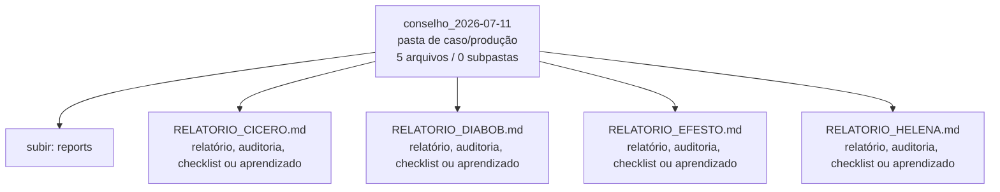

<!-- IA_NAVIGACAO:GERADO_AUTO:v1 -->
# Mapa IA - conselho_2026-07-11

Atualizado automaticamente em: **2026-08-05 13:56:04 -0300**

- Caminho: `C:\Users\IgorPC\.claude\projects\Escritório fabio osório\fabricas de melhoria de petições\_FORJA_HARNESS\reports\conselho_2026-07-11`
- Tipo: **pasta de caso/produção**
- Função para navegação: contém peça, parecer, memorial, relatório ou plano
- Conteúdo recursivo: **5 arquivos**, **0 subpastas**, **61.3 KB**
- Tipos de arquivo: .md: 5
- Mapa raiz: [MAPA_IA.md](<../../../MAPA_IA.md>)
- Índice geral: [INDICE_GERAL_IA.md](<../../../00_IA_NAVIGACAO/INDICE_GERAL_IA.md>)
- Protocolo de navegação: [PROTOCOLO_NAVEGACAO_IA.md](<../../../00_IA_NAVIGACAO/PROTOCOLO_NAVEGACAO_IA.md>)
- Inventário JSON para agentes: [inventario_ia.json](<../../../00_IA_NAVIGACAO/dados/inventario_ia.json>)
- Mapa superior: [reports](<../MAPA_IA.md>)

## GPS Mermaid

## Ordem de leitura recomendada

1. Ler este `MAPA_IA.md` antes de abrir arquivos pesados.
2. Subir para a raiz se precisar das regras globais `AGENTS.md`, `CLAUDE.md` e `_LEIS_GERAIS`.

## Subpastas diretas

_Sem subpastas diretas._

## Arquivos diretos

| Arquivo | Papel | Tamanho | Modificado | Observação |
|---|---:|---:|---:|---|
| [RELATORIO_CICERO.md](<RELATORIO_CICERO.md>) | relatório/auditoria | 7.6 KB | 2026-07-11 01:29 | relatório, auditoria, checklist ou aprendizado \| tópicos: AUDITORIA JURÍDICA DO SISTEMA FORJA; Relatório Cícero — Ciclo 11/07/2026; SUMÁRIO EXECUTIVO |
| [RELATORIO_DIABOB.md](<RELATORIO_DIABOB.md>) | relatório/auditoria | 3.5 KB | 2026-07-11 01:34 | relatório, auditoria, checklist ou aprendizado \| tópicos: Veredicto brutal em 3 frases; Ilusões detectadas com evidência empírica; D1: Gate obrigatório Helena+Cícero existe em spec (09/07) mas nunca foi integrado ao fluxo real |
| [RELATORIO_EFESTO.md](<RELATORIO_EFESTO.md>) | relatório/auditoria | 18.0 KB | 2026-07-11 01:31 | relatório, auditoria, checklist ou aprendizado \| tópicos: Auditoria Técnica FORJA — Relatório EFESTO; Sumário Executivo; 1. Achados Técnicos |
| [RELATORIO_HELENA.md](<RELATORIO_HELENA.md>) | relatório/auditoria | 27.5 KB | 2026-07-11 01:29 | relatório, auditoria, checklist ou aprendizado \| tópicos: AUDITORIA ESTRATÉGICA DA FORJA — PARECER HELENA; Cientista-Chefe de Inteligência, INTEIA; 1. VEREDITO EXECUTIVO |
| [DECISOES_CONSELHO.md](<DECISOES_CONSELHO.md>) | outro | 4.7 KB | 2026-07-11 01:44 | arquivo não classificado automaticamente \| tópicos: Decisões sobre o conselho de auditoria — 11/07/2026; Achados de auditor DERRUBADOS na verificação; ACATADO e implementado (11/07/2026) |

## Leitura por papel

- **relatório/auditoria**: [RELATORIO_CICERO.md](<RELATORIO_CICERO.md>), [RELATORIO_DIABOB.md](<RELATORIO_DIABOB.md>), [RELATORIO_EFESTO.md](<RELATORIO_EFESTO.md>), [RELATORIO_HELENA.md](<RELATORIO_HELENA.md>)
- **outro**: [DECISOES_CONSELHO.md](<DECISOES_CONSELHO.md>)

## Observações anti-alucinação

- Este mapa classifica por nomes, extensões e posição na árvore; não substitui leitura de fonte primária.
- Fato, citação, ID processual, prazo e jurisprudência só entram em peça depois de conferência no arquivo-fonte ou fonte oficial.
- Se a pasta tiver regimento, a peça deve refletir o regimento vigente na data do protocolo.
