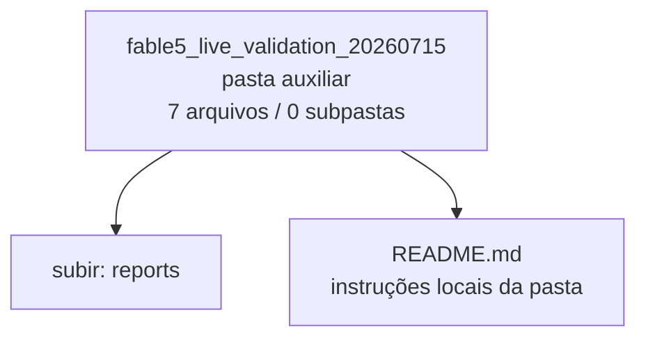

<!-- IA_NAVIGACAO:GERADO_AUTO:v1 -->
# Mapa IA - fable5_live_validation_20260715

Atualizado automaticamente em: **2026-08-05 13:56:04 -0300**

- Caminho: `C:\Users\IgorPC\.claude\projects\Escritório fabio osório\fabricas de melhoria de petições\_FORJA_HARNESS\reports\fable5_live_validation_20260715`
- Tipo: **pasta auxiliar**
- Função para navegação: conteúdo auxiliar ou residual
- Conteúdo recursivo: **7 arquivos**, **0 subpastas**, **48.2 KB**
- Tipos de arquivo: .json: 4, .md: 2, .patch: 1
- Mapa raiz: [MAPA_IA.md](<../../../MAPA_IA.md>)
- Índice geral: [INDICE_GERAL_IA.md](<../../../00_IA_NAVIGACAO/INDICE_GERAL_IA.md>)
- Protocolo de navegação: [PROTOCOLO_NAVEGACAO_IA.md](<../../../00_IA_NAVIGACAO/PROTOCOLO_NAVEGACAO_IA.md>)
- Inventário JSON para agentes: [inventario_ia.json](<../../../00_IA_NAVIGACAO/dados/inventario_ia.json>)
- Mapa superior: [reports](<../MAPA_IA.md>)

## GPS Mermaid

## Ordem de leitura recomendada

1. Ler este `MAPA_IA.md` antes de abrir arquivos pesados.
2. Subir para a raiz se precisar das regras globais `AGENTS.md`, `CLAUDE.md` e `_LEIS_GERAIS`.

## Subpastas diretas

_Sem subpastas diretas._

## Arquivos diretos

| Arquivo | Papel | Tamanho | Modificado | Observação |
|---|---:|---:|---:|---|
| [README.md](<README.md>) | regras | 3.7 KB | 2026-07-16 19:39 | instruções locais da pasta \| tópicos: Evidência de validação ao vivo — Claude Fable 5; Escopo; Resultado registrado |
| [editorial_fidelity.json](<editorial_fidelity.json>) | dados/script | 533 B | 2026-07-15 20:40 | dado estruturado ou rotina técnica |
| [editorial_report.json](<editorial_report.json>) | dados/script | 2.4 KB | 2026-07-15 20:40 | dado estruturado ou rotina técnica |
| [FABLE5_RESULT.json](<FABLE5_RESULT.json>) | dados/script | 914 B | 2026-07-15 20:40 | dado estruturado ou rotina técnica |
| [fable5_usage.json](<fable5_usage.json>) | dados/script | 723 B | 2026-07-15 20:40 | dado estruturado ou rotina técnica |
| [editorial_diff.patch](<editorial_diff.patch>) | outro | 4.8 KB | 2026-07-15 20:40 | arquivo não classificado automaticamente |
| [final_markdown.md](<final_markdown.md>) | outro | 35.2 KB | 2026-07-15 20:40 | arquivo não classificado automaticamente |

## Leitura por papel

- **regras**: [README.md](<README.md>)
- **dados/script**: [editorial_fidelity.json](<editorial_fidelity.json>), [editorial_report.json](<editorial_report.json>), [FABLE5_RESULT.json](<FABLE5_RESULT.json>), [fable5_usage.json](<fable5_usage.json>)
- **outro**: [editorial_diff.patch](<editorial_diff.patch>), [final_markdown.md](<final_markdown.md>)

## Observações anti-alucinação

- Este mapa classifica por nomes, extensões e posição na árvore; não substitui leitura de fonte primária.
- Fato, citação, ID processual, prazo e jurisprudência só entram em peça depois de conferência no arquivo-fonte ou fonte oficial.
- Se a pasta tiver regimento, a peça deve refletir o regimento vigente na data do protocolo.
