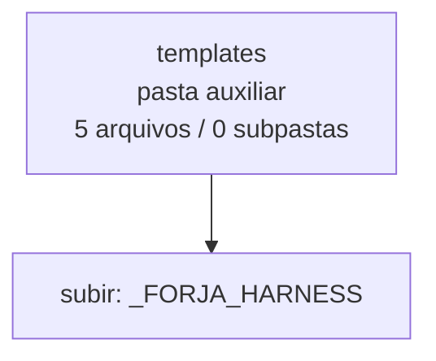

<!-- IA_NAVIGACAO:GERADO_AUTO:v1 -->
# Mapa IA - templates

Atualizado automaticamente em: **2026-08-05 13:32:37 -0300**

- Caminho: `C:\Users\IgorPC\.claude\projects\Escritório fabio osório\fabricas de melhoria de petições\_FORJA_HARNESS\templates`
- Tipo: **pasta auxiliar**
- Função para navegação: conteúdo auxiliar ou residual
- Conteúdo recursivo: **5 arquivos**, **0 subpastas**, **14.9 KB**
- Tipos de arquivo: .md: 5
- Mapa raiz: [MAPA_IA.md](<../../MAPA_IA.md>)
- Índice geral: [INDICE_GERAL_IA.md](<../../00_IA_NAVIGACAO/INDICE_GERAL_IA.md>)
- Protocolo de navegação: [PROTOCOLO_NAVEGACAO_IA.md](<../../00_IA_NAVIGACAO/PROTOCOLO_NAVEGACAO_IA.md>)
- Inventário JSON para agentes: [inventario_ia.json](<../../00_IA_NAVIGACAO/dados/inventario_ia.json>)
- Mapa superior: [_FORJA_HARNESS](<../MAPA_IA.md>)

## GPS Mermaid

## Ordem de leitura recomendada

1. Ler este `MAPA_IA.md` antes de abrir arquivos pesados.
2. Subir para a raiz se precisar das regras globais `AGENTS.md`, `CLAUDE.md` e `_LEIS_GERAIS`.

## Subpastas diretas

_Sem subpastas diretas._

## Arquivos diretos

| Arquivo | Papel | Tamanho | Modificado | Observação |
|---|---:|---:|---:|---|
| [AR_JUIZ_PROTOCOLO.md](<AR_JUIZ_PROTOCOLO.md>) | outro | 2.4 KB | 2026-07-23 23:11 | arquivo não classificado automaticamente \| tópicos: Protocolo canônico do juiz cego — ciclo AR (v2, consolidado dos rounds anulados dos ciclos 1 e 2); Estrutura da sessão; Texto obrigatório no prompt |
| [F2_CONSULTA_ADVOGADO.md](<F2_CONSULTA_ADVOGADO.md>) | outro | 430 B | 2026-07-25 21:09 | arquivo não classificado automaticamente \| tópicos: Consulta ao advogado responsável — {caseId}; O que acontece sem resposta; Perguntas que não estão aqui |
| [F2A_EXPLORACAO_100_PERGUNTAS.md](<F2A_EXPLORACAO_100_PERGUNTAS.md>) | outro | 3.7 KB | 2026-08-05 03:09 | arquivo não classificado automaticamente \| tópicos: F2-A — Exploração problematizadora em 100 perguntas; Resultado obrigatório; Dez óticas canônicas |
| [F4_METODO_SOLUCAO_PROBLEMA_PETICAO.md](<F4_METODO_SOLUCAO_PROBLEMA_PETICAO.md>) | outro | 4.2 KB | 2026-07-11 18:23 | arquivo não classificado automaticamente \| tópicos: Roteiro interno — método de solução do problema da petição; 1. Comando e situação real; 2. Emaranhado do caso |
| [F7_5_BRIEF_VISUAL.md](<F7_5_BRIEF_VISUAL.md>) | outro | 4.1 KB | 2026-08-03 12:52 | arquivo não classificado automaticamente \| tópicos: F7.5 — Brief visual (contrato); Por que este arquivo existe; Onde fica |

## Leitura por papel

- **outro**: [AR_JUIZ_PROTOCOLO.md](<AR_JUIZ_PROTOCOLO.md>), [F2_CONSULTA_ADVOGADO.md](<F2_CONSULTA_ADVOGADO.md>), [F2A_EXPLORACAO_100_PERGUNTAS.md](<F2A_EXPLORACAO_100_PERGUNTAS.md>), [F4_METODO_SOLUCAO_PROBLEMA_PETICAO.md](<F4_METODO_SOLUCAO_PROBLEMA_PETICAO.md>), [F7_5_BRIEF_VISUAL.md](<F7_5_BRIEF_VISUAL.md>)

## Observações anti-alucinação

- Este mapa classifica por nomes, extensões e posição na árvore; não substitui leitura de fonte primária.
- Fato, citação, ID processual, prazo e jurisprudência só entram em peça depois de conferência no arquivo-fonte ou fonte oficial.
- Se a pasta tiver regimento, a peça deve refletir o regimento vigente na data do protocolo.
