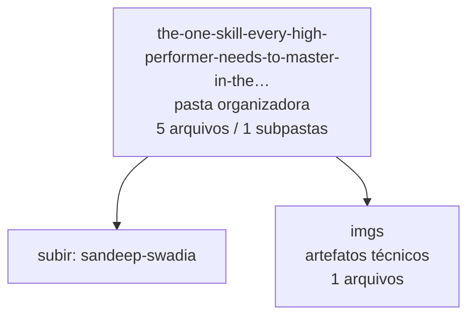

<!-- IA_NAVIGACAO:GERADO_AUTO:v1 -->
# Mapa IA - the-one-skill-every-high-performer-needs-to-master-in-the-age-of-ai

Atualizado automaticamente em: **2026-08-05 13:33:32 -0300**

- Caminho: `C:\Users\IgorPC\.claude\projects\Escritório fabio osório\fabricas de melhoria de petições\_FORJA_HARNESS\youtube-transcript\sandeep-swadia\the-one-skill-every-high-performer-needs-to-master-in-the-age-of-ai`
- Tipo: **pasta organizadora**
- Função para navegação: agrega subpastas; abrir mapa filho conforme objetivo
- Conteúdo recursivo: **5 arquivos**, **1 subpastas**, **324.8 KB**
- Tipos de arquivo: .json: 3, .md: 1, .jpg: 1
- Mapa raiz: [MAPA_IA.md](<../../../../MAPA_IA.md>)
- Índice geral: [INDICE_GERAL_IA.md](<../../../../00_IA_NAVIGACAO/INDICE_GERAL_IA.md>)
- Protocolo de navegação: [PROTOCOLO_NAVEGACAO_IA.md](<../../../../00_IA_NAVIGACAO/PROTOCOLO_NAVEGACAO_IA.md>)
- Inventário JSON para agentes: [inventario_ia.json](<../../../../00_IA_NAVIGACAO/dados/inventario_ia.json>)
- Mapa superior: [sandeep-swadia](<../MAPA_IA.md>)

## GPS Mermaid

## Ordem de leitura recomendada

1. Ler este `MAPA_IA.md` antes de abrir arquivos pesados.
2. Subir para a raiz se precisar das regras globais `AGENTS.md`, `CLAUDE.md` e `_LEIS_GERAIS`.
3. Usar builds, renders e QA apenas para validar entrega ou rastrear geração; não começar por eles.

## Subpastas diretas

| Subpasta | Tipo | Conteúdo | Atualização | Próximo passo |
|---|---|---:|---:|---|
| [imgs](<imgs/MAPA_IA.md>) | artefatos técnicos | 1 arquivos / 0 subpastas | 2026-07-24 18:23 | build, extração ou QA; ler só quando precisar validar entrega |

## Arquivos diretos

| Arquivo | Papel | Tamanho | Modificado | Observação |
|---|---:|---:|---:|---|
| [meta.json](<meta.json>) | dados/script | 2.2 KB | 2026-07-24 18:23 | dado estruturado ou rotina técnica |
| [transcript-raw.json](<transcript-raw.json>) | dados/script | 42.3 KB | 2026-07-24 18:23 | dado estruturado ou rotina técnica |
| [transcript-sentences.json](<transcript-sentences.json>) | dados/script | 33.0 KB | 2026-07-24 18:23 | dado estruturado ou rotina técnica |
| [transcript.md](<transcript.md>) | outro | 31.6 KB | 2026-07-24 18:23 | arquivo não classificado automaticamente \| tópicos: The ONE Skill Every High Performer Needs To Master (in the age of AI); Description; Transcript |

## Leitura por papel

- **dados/script**: [meta.json](<meta.json>), [transcript-raw.json](<transcript-raw.json>), [transcript-sentences.json](<transcript-sentences.json>)
- **outro**: [transcript.md](<transcript.md>)

## Observações anti-alucinação

- Este mapa classifica por nomes, extensões e posição na árvore; não substitui leitura de fonte primária.
- Fato, citação, ID processual, prazo e jurisprudência só entram em peça depois de conferência no arquivo-fonte ou fonte oficial.
- Se a pasta tiver regimento, a peça deve refletir o regimento vigente na data do protocolo.
