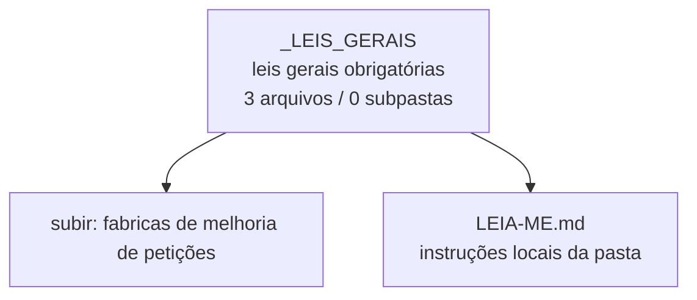

<!-- IA_NAVIGACAO:GERADO_AUTO:v1 -->
# Mapa IA - _LEIS_GERAIS

Atualizado automaticamente em: **2026-08-05 13:56:10 -0300**

- Caminho: `C:\Users\IgorPC\.claude\projects\Escritório fabio osório\fabricas de melhoria de petições\_LEIS_GERAIS`
- Tipo: **leis gerais obrigatórias**
- Função para navegação: Estatuto da OAB e LOMAN; considerar em toda peça
- Conteúdo recursivo: **3 arquivos**, **0 subpastas**, **189.4 KB**
- Tipos de arquivo: .md: 3
- Mapa raiz: [MAPA_IA.md](<../MAPA_IA.md>)
- Índice geral: [INDICE_GERAL_IA.md](<../00_IA_NAVIGACAO/INDICE_GERAL_IA.md>)
- Protocolo de navegação: [PROTOCOLO_NAVEGACAO_IA.md](<../00_IA_NAVIGACAO/PROTOCOLO_NAVEGACAO_IA.md>)
- Inventário JSON para agentes: [inventario_ia.json](<../00_IA_NAVIGACAO/dados/inventario_ia.json>)
- Mapa superior: [fabricas de melhoria de petições](<../MAPA_IA.md>)

## GPS Mermaid

## Ordem de leitura recomendada

1. Ler este `MAPA_IA.md` antes de abrir arquivos pesados.
2. Subir para a raiz se precisar das regras globais `AGENTS.md`, `CLAUDE.md` e `_LEIS_GERAIS`.

## Subpastas diretas

_Sem subpastas diretas._

## Arquivos diretos

| Arquivo | Papel | Tamanho | Modificado | Observação |
|---|---:|---:|---:|---|
| [LEIA-ME.md](<LEIA-ME.md>) | regras | 1.5 KB | 2026-07-06 19:37 | instruções locais da pasta \| tópicos: _LEIS_GERAIS — Pasta mãe de legislação transversal; Conteúdo; Regra de uso (obrigatória) |
| [ESTATUTO_OAB_Lei_8906-1994.md](<ESTATUTO_OAB_Lei_8906-1994.md>) | outro | 101.1 KB | 2026-07-06 19:30 | arquivo não classificado automaticamente \| tópicos: Estatuto da Advocacia e da OAB — Lei nº 8.906, de 4 de julho de 1994; Informações do Documento; Texto Integral |
| [LOMAN_LC_35-1979.md](<LOMAN_LC_35-1979.md>) | outro | 86.9 KB | 2026-07-06 19:32 | arquivo não classificado automaticamente \| tópicos: LEI COMPLEMENTAR Nº 35, DE 14 DE MARÇO DE 1979; Metadados; Ementa |

## Leitura por papel

- **regras**: [LEIA-ME.md](<LEIA-ME.md>)
- **outro**: [ESTATUTO_OAB_Lei_8906-1994.md](<ESTATUTO_OAB_Lei_8906-1994.md>), [LOMAN_LC_35-1979.md](<LOMAN_LC_35-1979.md>)

## Observações anti-alucinação

- Este mapa classifica por nomes, extensões e posição na árvore; não substitui leitura de fonte primária.
- Fato, citação, ID processual, prazo e jurisprudência só entram em peça depois de conferência no arquivo-fonte ou fonte oficial.
- Se a pasta tiver regimento, a peça deve refletir o regimento vigente na data do protocolo.
