<!-- IA_NAVIGACAO:GERADO_AUTO:v1 -->
# Mapa IA - gestao_escritorio

Atualizado automaticamente em: **2026-08-05 13:32:39 -0300**

- Caminho: `C:\Users\IgorPC\.claude\projects\Escritório fabio osório\fabricas de melhoria de petições\gestao_escritorio`
- Tipo: **gestão de demandas**
- Função para navegação: painel, dados e rotinas de acompanhamento do escritório
- Conteúdo recursivo: **326 arquivos**, **159 subpastas**, **66.8 MB**
- Tipos de arquivo: .pdf: 105, .docx: 98, .py: 36, .json: 30, .pyc: 15, .md: 10, .log: 10, .ps1: 6, .txt: 4, .html: 3, +5 tipos
- Mapa raiz: [MAPA_IA.md](<../MAPA_IA.md>)
- Índice geral: [INDICE_GERAL_IA.md](<../00_IA_NAVIGACAO/INDICE_GERAL_IA.md>)
- Protocolo de navegação: [PROTOCOLO_NAVEGACAO_IA.md](<../00_IA_NAVIGACAO/PROTOCOLO_NAVEGACAO_IA.md>)
- Inventário JSON para agentes: [inventario_ia.json](<../00_IA_NAVIGACAO/dados/inventario_ia.json>)
- Mapa superior: [fabricas de melhoria de petições](<../MAPA_IA.md>)

## GPS Mermaid

```mermaid
flowchart TD
  N4b6cd995cc["gestao_escritorio<br/>gestão de demandas<br/>326 arquivos / 159 subpastas"]
  N9ae8663c8a["subir: fabricas de melhoria de petições"]
  N4b6cd995cc --> N9ae8663c8a
  click N9ae8663c8a "../MAPA_IA.md" "Abrir mapa superior"
  N6ad9e210d6[".pytest_cache<br/>gestão de demandas<br/>4 arquivos"]
  N4b6cd995cc --> N6ad9e210d6
  click N6ad9e210d6 ".pytest_cache/MAPA_IA.md" "Abrir mapa da pasta"
  N169f985769["assets<br/>gestão de demandas<br/>3 arquivos"]
  N4b6cd995cc --> N169f985769
  click N169f985769 "assets/MAPA_IA.md" "Abrir mapa da pasta"
  Ne895f68b9a["data<br/>gestão de demandas<br/>33 arquivos"]
  N4b6cd995cc --> Ne895f68b9a
  click Ne895f68b9a "data/MAPA_IA.md" "Abrir mapa da pasta"
  N8d90bb376f["entregas_fabio_osorio<br/>gestão de demandas<br/>205 arquivos"]
  N4b6cd995cc --> N8d90bb376f
  click N8d90bb376f "entregas_fabio_osorio/MAPA_IA.md" "Abrir mapa da pasta"
  Nc0f37da670["hermes_prompts<br/>gestão de demandas<br/>8 arquivos"]
  N4b6cd995cc --> Nc0f37da670
  click Nc0f37da670 "hermes_prompts/MAPA_IA.md" "Abrir mapa da pasta"
  N3693961e90["logs<br/>gestão de demandas<br/>7 arquivos"]
  N4b6cd995cc --> N3693961e90
  click N3693961e90 "logs/MAPA_IA.md" "Abrir mapa da pasta"
  N7004db95a2["scripts<br/>gestão de demandas<br/>52 arquivos"]
  N4b6cd995cc --> N7004db95a2
  click N7004db95a2 "scripts/MAPA_IA.md" "Abrir mapa da pasta"
  Na4e4de3930["templates<br/>gestão de demandas<br/>1 arquivos"]
  N4b6cd995cc --> Na4e4de3930
  click Na4e4de3930 "templates/MAPA_IA.md" "Abrir mapa da pasta"
  Nf29ffe4ecc["tests<br/>gestão de demandas<br/>2 arquivos"]
  N4b6cd995cc --> Nf29ffe4ecc
  click Nf29ffe4ecc "tests/MAPA_IA.md" "Abrir mapa da pasta"
  N05684fe5ce["README.md<br/>instruções locais da pasta"]
  N4b6cd995cc --> N05684fe5ce
  click N05684fe5ce "README.md" "Abrir arquivo"
```

## Ordem de leitura recomendada

1. Ler este `MAPA_IA.md` antes de abrir arquivos pesados.
2. Subir para a raiz se precisar das regras globais `AGENTS.md`, `CLAUDE.md` e `_LEIS_GERAIS`.
3. Para fatos, datas, citações e IDs: verificar nos anexos/fontes antes de afirmar.
4. Usar builds, renders e QA apenas para validar entrega ou rastrear geração; não começar por eles.
5. Tratar dados de WhatsApp/Gmail como triagem sanitizada; não expor conversa bruta.

## Subpastas diretas

| Subpasta | Tipo | Conteúdo | Atualização | Próximo passo |
|---|---|---:|---:|---|
| [.pytest_cache](<.pytest_cache/MAPA_IA.md>) | gestão de demandas | 4 arquivos / 2 subpastas | 2026-07-21 01:37 | painel, dados e rotinas de acompanhamento do escritório |
| [assets](<assets/MAPA_IA.md>) | gestão de demandas | 3 arquivos / 0 subpastas | 2026-07-08 05:41 | painel, dados e rotinas de acompanhamento do escritório |
| [data](<data/MAPA_IA.md>) | gestão de demandas | 33 arquivos / 5 subpastas | 2026-08-05 13:23 | painel, dados e rotinas de acompanhamento do escritório |
| [entregas_fabio_osorio](<entregas_fabio_osorio/MAPA_IA.md>) | gestão de demandas | 205 arquivos / 141 subpastas | 2026-08-04 13:43 | painel, dados e rotinas de acompanhamento do escritório |
| [hermes_prompts](<hermes_prompts/MAPA_IA.md>) | gestão de demandas | 8 arquivos / 0 subpastas | 2026-07-20 19:41 | painel, dados e rotinas de acompanhamento do escritório |
| [logs](<logs/MAPA_IA.md>) | gestão de demandas | 7 arquivos / 0 subpastas | 2026-07-31 11:14 | painel, dados e rotinas de acompanhamento do escritório |
| [scripts](<scripts/MAPA_IA.md>) | gestão de demandas | 52 arquivos / 1 subpastas | 2026-08-05 06:08 | painel, dados e rotinas de acompanhamento do escritório |
| [templates](<templates/MAPA_IA.md>) | gestão de demandas | 1 arquivos / 0 subpastas | 2026-07-22 01:46 | painel, dados e rotinas de acompanhamento do escritório |
| [tests](<tests/MAPA_IA.md>) | gestão de demandas | 2 arquivos / 1 subpastas | 2026-08-05 06:08 | painel, dados e rotinas de acompanhamento do escritório |

## Arquivos diretos

| Arquivo | Papel | Tamanho | Modificado | Observação |
|---|---:|---:|---:|---|
| [README.md](<README.md>) | regras | 5.0 KB | 2026-07-10 12:46 | instruções locais da pasta \| tópicos: Gestão do Escritório Medina Osório; Abrir; Arquitetura |
| [conectar_gmail_local.ps1](<conectar_gmail_local.ps1>) | dados/script | 351 B | 2026-07-07 19:13 | dado estruturado ou rotina técnica |
| [config.json](<config.json>) | dados/script | 1.7 KB | 2026-07-09 21:24 | dado estruturado ou rotina técnica |
| [iniciar_painel_gestao_escritorio.ps1](<iniciar_painel_gestao_escritorio.ps1>) | dados/script | 235 B | 2026-07-09 21:13 | dado estruturado ou rotina técnica |
| [sincronizar_hermes.ps1](<sincronizar_hermes.ps1>) | dados/script | 291 B | 2026-07-08 04:41 | dado estruturado ou rotina técnica |
| [atualizacao_codex_prompt.md](<atualizacao_codex_prompt.md>) | outro | 3.7 KB | 2026-07-22 01:43 | arquivo não classificado automaticamente \| tópicos: Automação diária - Gestão de Demandas do Escritório Medina Osório |
| [HERMES_VPS_OPERADOR.md](<HERMES_VPS_OPERADOR.md>) | outro | 4.0 KB | 2026-07-14 14:56 | arquivo não classificado automaticamente \| tópicos: Operador Hermes VPS - gestão de demandas do escritório; Regra de privacidade; Fonte de verdade e limite da fábrica |
| [NOTA_DECISAO_PENDENCIAS_ENTREGA_2026-07-23.md](<NOTA_DECISAO_PENDENCIAS_ENTREGA_2026-07-23.md>) | outro | 3.5 KB | 2026-07-23 20:45 | arquivo não classificado automaticamente \| tópicos: Decisão operacional sobre pendências e entrega; Resultado; Fórmula recomendada para a resposta ao advogado |
| [PAINEL_ESCRITORIO_MEDINA_OSORIO.html](<PAINEL_ESCRITORIO_MEDINA_OSORIO.html>) | outro | 1.1 MB | 2026-08-05 13:15 | arquivo não classificado automaticamente |
| [painel_gestao_escritorio.html](<painel_gestao_escritorio.html>) | outro | 1.1 MB | 2026-08-05 13:15 | arquivo não classificado automaticamente |
| [TRIAGEM_AUDIOS_FABIO_2026-07-10.md](<TRIAGEM_AUDIOS_FABIO_2026-07-10.md>) | outro | 2.8 KB | 2026-07-10 06:29 | arquivo não classificado automaticamente \| tópicos: TRIAGEM OPERACIONAL SANITIZADA — ÁUDIOS DO FÁBIO; Demandas jurídicas identificadas; 1. Plano de saúde / SulAmérica |

## Leitura por papel

- **regras**: [README.md](<README.md>)
- **dados/script**: [conectar_gmail_local.ps1](<conectar_gmail_local.ps1>), [config.json](<config.json>), [iniciar_painel_gestao_escritorio.ps1](<iniciar_painel_gestao_escritorio.ps1>), [sincronizar_hermes.ps1](<sincronizar_hermes.ps1>)
- **outro**: [atualizacao_codex_prompt.md](<atualizacao_codex_prompt.md>), [HERMES_VPS_OPERADOR.md](<HERMES_VPS_OPERADOR.md>), [NOTA_DECISAO_PENDENCIAS_ENTREGA_2026-07-23.md](<NOTA_DECISAO_PENDENCIAS_ENTREGA_2026-07-23.md>), [PAINEL_ESCRITORIO_MEDINA_OSORIO.html](<PAINEL_ESCRITORIO_MEDINA_OSORIO.html>), [painel_gestao_escritorio.html](<painel_gestao_escritorio.html>), [TRIAGEM_AUDIOS_FABIO_2026-07-10.md](<TRIAGEM_AUDIOS_FABIO_2026-07-10.md>)

## Observações anti-alucinação

- Este mapa classifica por nomes, extensões e posição na árvore; não substitui leitura de fonte primária.
- Fato, citação, ID processual, prazo e jurisprudência só entram em peça depois de conferência no arquivo-fonte ou fonte oficial.
- Se a pasta tiver regimento, a peça deve refletir o regimento vigente na data do protocolo.
