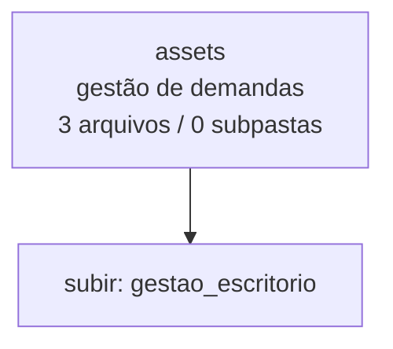

<!-- IA_NAVIGACAO:GERADO_AUTO:v1 -->
# Mapa IA - assets

Atualizado automaticamente em: **2026-08-05 13:33:46 -0300**

- Caminho: `C:\Users\IgorPC\.claude\projects\Escritório fabio osório\fabricas de melhoria de petições\gestao_escritorio\assets`
- Tipo: **gestão de demandas**
- Função para navegação: painel, dados e rotinas de acompanhamento do escritório
- Conteúdo recursivo: **3 arquivos**, **0 subpastas**, **64.0 KB**
- Tipos de arquivo: .png: 3
- Mapa raiz: [MAPA_IA.md](<../../MAPA_IA.md>)
- Índice geral: [INDICE_GERAL_IA.md](<../../00_IA_NAVIGACAO/INDICE_GERAL_IA.md>)
- Protocolo de navegação: [PROTOCOLO_NAVEGACAO_IA.md](<../../00_IA_NAVIGACAO/PROTOCOLO_NAVEGACAO_IA.md>)
- Inventário JSON para agentes: [inventario_ia.json](<../../00_IA_NAVIGACAO/dados/inventario_ia.json>)
- Mapa superior: [gestao_escritorio](<../MAPA_IA.md>)

## GPS Mermaid

## Ordem de leitura recomendada

1. Ler este `MAPA_IA.md` antes de abrir arquivos pesados.
2. Subir para a raiz se precisar das regras globais `AGENTS.md`, `CLAUDE.md` e `_LEIS_GERAIS`.
3. Tratar dados de WhatsApp/Gmail como triagem sanitizada; não expor conversa bruta.

## Subpastas diretas

_Sem subpastas diretas._

## Arquivos diretos

| Arquivo | Papel | Tamanho | Modificado | Observação |
|---|---:|---:|---:|---|
| [logo_coluna_160.png](<logo_coluna_160.png>) | imagem/visual | 9.2 KB | 2026-07-08 05:41 | imagem ou elemento visual |
| [logo_coluna_64.png](<logo_coluna_64.png>) | imagem/visual | 3.5 KB | 2026-07-08 05:41 | imagem ou elemento visual |
| [logo_medina_transp.png](<logo_medina_transp.png>) | imagem/visual | 51.4 KB | 2026-07-08 05:41 | imagem ou elemento visual |

## Leitura por papel

- **imagem/visual**: [logo_coluna_160.png](<logo_coluna_160.png>), [logo_coluna_64.png](<logo_coluna_64.png>), [logo_medina_transp.png](<logo_medina_transp.png>)

## Observações anti-alucinação

- Este mapa classifica por nomes, extensões e posição na árvore; não substitui leitura de fonte primária.
- Fato, citação, ID processual, prazo e jurisprudência só entram em peça depois de conferência no arquivo-fonte ou fonte oficial.
- Se a pasta tiver regimento, a peça deve refletir o regimento vigente na data do protocolo.
