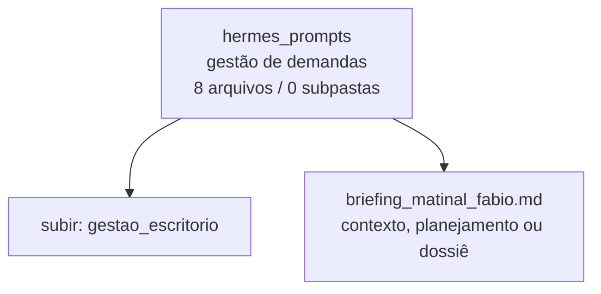

<!-- IA_NAVIGACAO:GERADO_AUTO:v1 -->
# Mapa IA - hermes_prompts

Atualizado automaticamente em: **2026-08-05 13:33:46 -0300**

- Caminho: `C:\Users\IgorPC\.claude\projects\Escritório fabio osório\fabricas de melhoria de petições\gestao_escritorio\hermes_prompts`
- Tipo: **gestão de demandas**
- Função para navegação: painel, dados e rotinas de acompanhamento do escritório
- Conteúdo recursivo: **8 arquivos**, **0 subpastas**, **10.1 KB**
- Tipos de arquivo: .md: 4, .txt: 4
- Mapa raiz: [MAPA_IA.md](<../../MAPA_IA.md>)
- Índice geral: [INDICE_GERAL_IA.md](<../../00_IA_NAVIGACAO/INDICE_GERAL_IA.md>)
- Protocolo de navegação: [PROTOCOLO_NAVEGACAO_IA.md](<../../00_IA_NAVIGACAO/PROTOCOLO_NAVEGACAO_IA.md>)
- Inventário JSON para agentes: [inventario_ia.json](<../../00_IA_NAVIGACAO/dados/inventario_ia.json>)
- Mapa superior: [gestao_escritorio](<../MAPA_IA.md>)

## GPS Mermaid

## Ordem de leitura recomendada

1. Ler este `MAPA_IA.md` antes de abrir arquivos pesados.
2. Subir para a raiz se precisar das regras globais `AGENTS.md`, `CLAUDE.md` e `_LEIS_GERAIS`.
3. Tratar dados de WhatsApp/Gmail como triagem sanitizada; não expor conversa bruta.

## Subpastas diretas

_Sem subpastas diretas._

## Arquivos diretos

| Arquivo | Papel | Tamanho | Modificado | Observação |
|---|---:|---:|---:|---|
| [briefing_matinal_fabio.md](<briefing_matinal_fabio.md>) | plano/contexto | 1.9 KB | 2026-07-14 14:40 | contexto, planejamento ou dossiê |
| [email_natura_cabreuva_resposta_20260720.txt](<email_natura_cabreuva_resposta_20260720.txt>) | outro | 1.1 KB | 2026-07-20 18:42 | arquivo não classificado automaticamente |
| [fechamento_diario_fabio.md](<fechamento_diario_fabio.md>) | outro | 1.6 KB | 2026-07-14 14:40 | arquivo não classificado automaticamente |
| [indexador_workspace_fabio.md](<indexador_workspace_fabio.md>) | outro | 1.1 KB | 2026-07-14 14:43 | arquivo não classificado automaticamente |
| [monitor_fabio_whatsapp.md](<monitor_fabio_whatsapp.md>) | outro | 2.3 KB | 2026-07-14 14:40 | arquivo não classificado automaticamente |
| [whatsapp_fabio_entrega_herman_link_20260720.txt](<whatsapp_fabio_entrega_herman_link_20260720.txt>) | outro | 370 B | 2026-07-20 19:41 | arquivo não classificado automaticamente |
| [whatsapp_fabio_nylton_bloqueio_20260720.txt](<whatsapp_fabio_nylton_bloqueio_20260720.txt>) | outro | 616 B | 2026-07-20 19:32 | arquivo não classificado automaticamente |
| [whatsapp_fabio_pendencias_20260720.txt](<whatsapp_fabio_pendencias_20260720.txt>) | outro | 1.1 KB | 2026-07-20 18:38 | arquivo não classificado automaticamente |

## Leitura por papel

- **plano/contexto**: [briefing_matinal_fabio.md](<briefing_matinal_fabio.md>)
- **outro**: [email_natura_cabreuva_resposta_20260720.txt](<email_natura_cabreuva_resposta_20260720.txt>), [fechamento_diario_fabio.md](<fechamento_diario_fabio.md>), [indexador_workspace_fabio.md](<indexador_workspace_fabio.md>), [monitor_fabio_whatsapp.md](<monitor_fabio_whatsapp.md>), [whatsapp_fabio_entrega_herman_link_20260720.txt](<whatsapp_fabio_entrega_herman_link_20260720.txt>), [whatsapp_fabio_nylton_bloqueio_20260720.txt](<whatsapp_fabio_nylton_bloqueio_20260720.txt>), [whatsapp_fabio_pendencias_20260720.txt](<whatsapp_fabio_pendencias_20260720.txt>)

## Observações anti-alucinação

- Este mapa classifica por nomes, extensões e posição na árvore; não substitui leitura de fonte primária.
- Fato, citação, ID processual, prazo e jurisprudência só entram em peça depois de conferência no arquivo-fonte ou fonte oficial.
- Se a pasta tiver regimento, a peça deve refletir o regimento vigente na data do protocolo.
