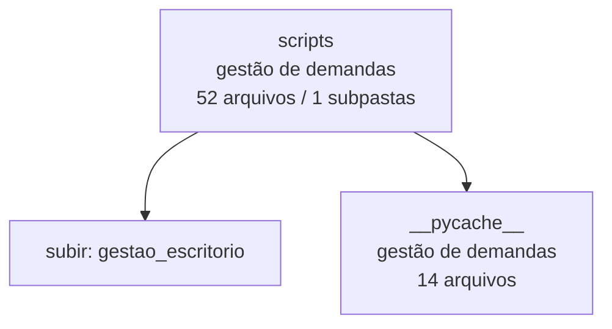

<!-- IA_NAVIGACAO:GERADO_AUTO:v1 -->
# Mapa IA - scripts

Atualizado automaticamente em: **2026-08-05 13:33:45 -0300**

- Caminho: `C:\Users\IgorPC\.claude\projects\Escritório fabio osório\fabricas de melhoria de petições\gestao_escritorio\scripts`
- Tipo: **gestão de demandas**
- Função para navegação: painel, dados e rotinas de acompanhamento do escritório
- Conteúdo recursivo: **52 arquivos**, **1 subpastas**, **716.3 KB**
- Tipos de arquivo: .py: 35, .pyc: 14, .ps1: 3
- Mapa raiz: [MAPA_IA.md](<../../MAPA_IA.md>)
- Índice geral: [INDICE_GERAL_IA.md](<../../00_IA_NAVIGACAO/INDICE_GERAL_IA.md>)
- Protocolo de navegação: [PROTOCOLO_NAVEGACAO_IA.md](<../../00_IA_NAVIGACAO/PROTOCOLO_NAVEGACAO_IA.md>)
- Inventário JSON para agentes: [inventario_ia.json](<../../00_IA_NAVIGACAO/dados/inventario_ia.json>)
- Mapa superior: [gestao_escritorio](<../MAPA_IA.md>)

## GPS Mermaid

## Ordem de leitura recomendada

1. Ler este `MAPA_IA.md` antes de abrir arquivos pesados.
2. Subir para a raiz se precisar das regras globais `AGENTS.md`, `CLAUDE.md` e `_LEIS_GERAIS`.
3. Usar builds, renders e QA apenas para validar entrega ou rastrear geração; não começar por eles.
4. Tratar dados de WhatsApp/Gmail como triagem sanitizada; não expor conversa bruta.

## Subpastas diretas

| Subpasta | Tipo | Conteúdo | Atualização | Próximo passo |
|---|---|---:|---:|---|
| [__pycache__](<__pycache__/MAPA_IA.md>) | gestão de demandas | 14 arquivos / 0 subpastas | 2026-08-05 06:08 | painel, dados e rotinas de acompanhamento do escritório |

## Arquivos diretos

| Arquivo | Papel | Tamanho | Modificado | Observação |
|---|---:|---:|---:|---|
| [apply_forja_n3_next_cases_20260710.py](<apply_forja_n3_next_cases_20260710.py>) | dados/script | 30.0 KB | 2026-07-10 12:48 | dado estruturado ou rotina técnica |
| [apply_forja_n3_reconstruction_20260710.py](<apply_forja_n3_reconstruction_20260710.py>) | dados/script | 9.9 KB | 2026-07-10 03:59 | dado estruturado ou rotina técnica |
| [apply_manual_updates.py](<apply_manual_updates.py>) | dados/script | 2.6 KB | 2026-07-29 16:57 | dado estruturado ou rotina técnica |
| [audit_delivered_docs.py](<audit_delivered_docs.py>) | dados/script | 14.0 KB | 2026-07-29 00:13 | dado estruturado ou rotina técnica |
| [dashboard_enrichment.py](<dashboard_enrichment.py>) | dados/script | 11.5 KB | 2026-07-14 14:39 | dado estruturado ou rotina técnica |
| [ensure_server.ps1](<ensure_server.ps1>) | dados/script | 3.5 KB | 2026-07-10 02:37 | dado estruturado ou rotina técnica |
| [gmail_gws_update.py](<gmail_gws_update.py>) | dados/script | 21.7 KB | 2026-07-29 00:13 | dado estruturado ou rotina técnica |
| [hermes_bridge.py](<hermes_bridge.py>) | dados/script | 15.8 KB | 2026-07-14 14:43 | dado estruturado ou rotina técnica |
| [hermes_office_panel_remote.py](<hermes_office_panel_remote.py>) | dados/script | 8.9 KB | 2026-07-14 14:37 | dado estruturado ou rotina técnica |
| [hermes_reconcile_workspace_sources.py](<hermes_reconcile_workspace_sources.py>) | dados/script | 3.1 KB | 2026-07-14 14:46 | dado estruturado ou rotina técnica |
| [indexar_corsan_agerst.py](<indexar_corsan_agerst.py>) | dados/script | 8.6 KB | 2026-07-29 19:27 | dado estruturado ou rotina técnica |
| [install_sync_schedule.ps1](<install_sync_schedule.ps1>) | dados/script | 1.6 KB | 2026-07-14 14:38 | dado estruturado ou rotina técnica |
| [ocr_lote_visual_legal.py](<ocr_lote_visual_legal.py>) | dados/script | 7.2 KB | 2026-07-29 18:49 | dado estruturado ou rotina técnica |
| [office_application.py](<office_application.py>) | dados/script | 966 B | 2026-07-22 02:17 | dado estruturado ou rotina técnica |
| [office_io.py](<office_io.py>) | dados/script | 3.7 KB | 2026-07-09 23:56 | dado estruturado ou rotina técnica |
| [preencher_f2a_estre_erm.py](<preencher_f2a_estre_erm.py>) | dados/script | 23.9 KB | 2026-07-29 19:25 | dado estruturado ou rotina técnica |
| [registrar_atualizacao_deltan_n4_20260721.py](<registrar_atualizacao_deltan_n4_20260721.py>) | dados/script | 7.4 KB | 2026-07-21 21:08 | dado estruturado ou rotina técnica |
| [registrar_demanda_cafelana_re1395147_20260721.py](<registrar_demanda_cafelana_re1395147_20260721.py>) | dados/script | 5.7 KB | 2026-07-21 01:45 | dado estruturado ou rotina técnica |
| [registrar_entrega_cafelana_v4_20260715.py](<registrar_entrega_cafelana_v4_20260715.py>) | dados/script | 3.1 KB | 2026-07-15 14:18 | dado estruturado ou rotina técnica |
| [registrar_entrega_natura_v1_20260715.py](<registrar_entrega_natura_v1_20260715.py>) | dados/script | 3.6 KB | 2026-07-15 15:30 | dado estruturado ou rotina técnica |
| [registrar_entrega_nylton_20260721.py](<registrar_entrega_nylton_20260721.py>) | dados/script | 4.0 KB | 2026-07-21 00:09 | dado estruturado ou rotina técnica |
| [registrar_entrega_nylton_20260729.py](<registrar_entrega_nylton_20260729.py>) | dados/script | 2.7 KB | 2026-07-29 00:09 | dado estruturado ou rotina técnica |
| [registrar_entrega_v8_sulamerica_20260715.py](<registrar_entrega_v8_sulamerica_20260715.py>) | dados/script | 3.5 KB | 2026-07-15 13:43 | dado estruturado ou rotina técnica |
| [registrar_entregas_20260729_tarde.py](<registrar_entregas_20260729_tarde.py>) | dados/script | 8.1 KB | 2026-07-29 16:57 | dado estruturado ou rotina técnica |
| [registrar_entregas_revisao_humana_20260712.py](<registrar_entregas_revisao_humana_20260712.py>) | dados/script | 6.1 KB | 2026-07-12 10:31 | dado estruturado ou rotina técnica |
| [registrar_fechamento_fila_20260724.py](<registrar_fechamento_fila_20260724.py>) | dados/script | 8.0 KB | 2026-07-24 13:21 | dado estruturado ou rotina técnica |
| [registrar_fechamento_libra_sul_20260729.py](<registrar_fechamento_libra_sul_20260729.py>) | dados/script | 5.5 KB | 2026-07-29 00:31 | dado estruturado ou rotina técnica |
| [registrar_feedback_fabio_20260715.py](<registrar_feedback_fabio_20260715.py>) | dados/script | 5.3 KB | 2026-07-15 00:23 | dado estruturado ou rotina técnica |
| [registrar_material_deltan_whatsapp_20260721.py](<registrar_material_deltan_whatsapp_20260721.py>) | dados/script | 5.1 KB | 2026-07-21 22:53 | dado estruturado ou rotina técnica |
| [registrar_pesquisa_oficial_deltan_n5_20260722.py](<registrar_pesquisa_oficial_deltan_n5_20260722.py>) | dados/script | 5.5 KB | 2026-07-22 02:01 | dado estruturado ou rotina técnica |
| [registrar_reabertura_fila_email_20260728.py](<registrar_reabertura_fila_email_20260728.py>) | dados/script | 8.2 KB | 2026-07-28 23:48 | dado estruturado ou rotina técnica |
| [remote_audio_inventory.py](<remote_audio_inventory.py>) | dados/script | 2.8 KB | 2026-07-10 05:19 | dado estruturado ou rotina técnica |
| [remote_audio_transcribe.py](<remote_audio_transcribe.py>) | dados/script | 4.7 KB | 2026-07-10 05:20 | dado estruturado ou rotina técnica |
| [render_dashboard.py](<render_dashboard.py>) | dados/script | 2.3 KB | 2026-07-12 10:28 | dado estruturado ou rotina técnica |
| [seed_fabio_audio_updates_20260708.py](<seed_fabio_audio_updates_20260708.py>) | dados/script | 11.0 KB | 2026-07-08 04:12 | dado estruturado ou rotina técnica |
| [server.py](<server.py>) | dados/script | 34.6 KB | 2026-07-22 02:17 | dado estruturado ou rotina técnica |
| [sync_forja_gestao.py](<sync_forja_gestao.py>) | dados/script | 32.5 KB | 2026-07-29 00:14 | dado estruturado ou rotina técnica |
| [update_dashboard_local.ps1](<update_dashboard_local.ps1>) | dados/script | 26.9 KB | 2026-07-22 01:45 | dado estruturado ou rotina técnica |

## Leitura por papel

- **dados/script**: [apply_forja_n3_next_cases_20260710.py](<apply_forja_n3_next_cases_20260710.py>), [apply_forja_n3_reconstruction_20260710.py](<apply_forja_n3_reconstruction_20260710.py>), [apply_manual_updates.py](<apply_manual_updates.py>), [audit_delivered_docs.py](<audit_delivered_docs.py>), [dashboard_enrichment.py](<dashboard_enrichment.py>), [ensure_server.ps1](<ensure_server.ps1>), [gmail_gws_update.py](<gmail_gws_update.py>), [hermes_bridge.py](<hermes_bridge.py>), [hermes_office_panel_remote.py](<hermes_office_panel_remote.py>), [hermes_reconcile_workspace_sources.py](<hermes_reconcile_workspace_sources.py>), [indexar_corsan_agerst.py](<indexar_corsan_agerst.py>), [install_sync_schedule.ps1](<install_sync_schedule.ps1>), [ocr_lote_visual_legal.py](<ocr_lote_visual_legal.py>), [office_application.py](<office_application.py>), [office_io.py](<office_io.py>), [preencher_f2a_estre_erm.py](<preencher_f2a_estre_erm.py>), [registrar_atualizacao_deltan_n4_20260721.py](<registrar_atualizacao_deltan_n4_20260721.py>), [registrar_demanda_cafelana_re1395147_20260721.py](<registrar_demanda_cafelana_re1395147_20260721.py>), [registrar_entrega_cafelana_v4_20260715.py](<registrar_entrega_cafelana_v4_20260715.py>), [registrar_entrega_natura_v1_20260715.py](<registrar_entrega_natura_v1_20260715.py>), [registrar_entrega_nylton_20260721.py](<registrar_entrega_nylton_20260721.py>), [registrar_entrega_nylton_20260729.py](<registrar_entrega_nylton_20260729.py>), [registrar_entrega_v8_sulamerica_20260715.py](<registrar_entrega_v8_sulamerica_20260715.py>), [registrar_entregas_20260729_tarde.py](<registrar_entregas_20260729_tarde.py>), [registrar_entregas_revisao_humana_20260712.py](<registrar_entregas_revisao_humana_20260712.py>), [registrar_fechamento_fila_20260724.py](<registrar_fechamento_fila_20260724.py>), [registrar_fechamento_libra_sul_20260729.py](<registrar_fechamento_libra_sul_20260729.py>), [registrar_feedback_fabio_20260715.py](<registrar_feedback_fabio_20260715.py>), [registrar_material_deltan_whatsapp_20260721.py](<registrar_material_deltan_whatsapp_20260721.py>), [registrar_pesquisa_oficial_deltan_n5_20260722.py](<registrar_pesquisa_oficial_deltan_n5_20260722.py>), [registrar_reabertura_fila_email_20260728.py](<registrar_reabertura_fila_email_20260728.py>), [remote_audio_inventory.py](<remote_audio_inventory.py>), [remote_audio_transcribe.py](<remote_audio_transcribe.py>), [render_dashboard.py](<render_dashboard.py>), [seed_fabio_audio_updates_20260708.py](<seed_fabio_audio_updates_20260708.py>), [server.py](<server.py>), [sync_forja_gestao.py](<sync_forja_gestao.py>), [update_dashboard_local.ps1](<update_dashboard_local.ps1>)

## Observações anti-alucinação

- Este mapa classifica por nomes, extensões e posição na árvore; não substitui leitura de fonte primária.
- Fato, citação, ID processual, prazo e jurisprudência só entram em peça depois de conferência no arquivo-fonte ou fonte oficial.
- Se a pasta tiver regimento, a peça deve refletir o regimento vigente na data do protocolo.
