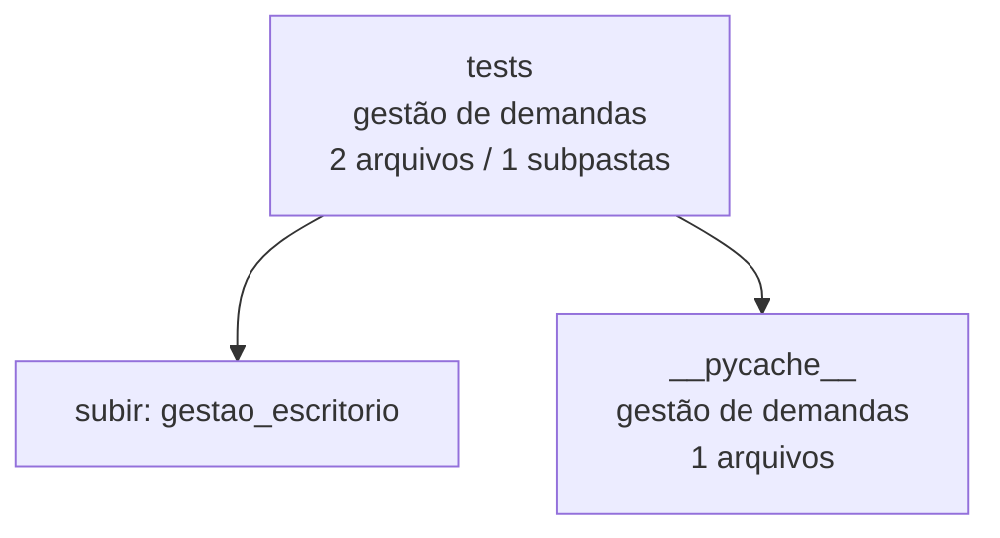

<!-- IA_NAVIGACAO:GERADO_AUTO:v1 -->
# Mapa IA - tests

Atualizado automaticamente em: **2026-08-05 13:56:06 -0300**

- Caminho: `C:\Users\IgorPC\.claude\projects\Escritório fabio osório\fabricas de melhoria de petições\gestao_escritorio\tests`
- Tipo: **gestão de demandas**
- Função para navegação: painel, dados e rotinas de acompanhamento do escritório
- Conteúdo recursivo: **2 arquivos**, **1 subpastas**, **22.0 KB**
- Tipos de arquivo: .py: 1, .pyc: 1
- Mapa raiz: [MAPA_IA.md](<../../MAPA_IA.md>)
- Índice geral: [INDICE_GERAL_IA.md](<../../00_IA_NAVIGACAO/INDICE_GERAL_IA.md>)
- Protocolo de navegação: [PROTOCOLO_NAVEGACAO_IA.md](<../../00_IA_NAVIGACAO/PROTOCOLO_NAVEGACAO_IA.md>)
- Inventário JSON para agentes: [inventario_ia.json](<../../00_IA_NAVIGACAO/dados/inventario_ia.json>)
- Mapa superior: [gestao_escritorio](<../MAPA_IA.md>)

## GPS Mermaid

## Ordem de leitura recomendada

1. Ler este `MAPA_IA.md` antes de abrir arquivos pesados.
2. Subir para a raiz se precisar das regras globais `AGENTS.md`, `CLAUDE.md` e `_LEIS_GERAIS`.
3. Usar builds, renders e QA apenas para validar entrega ou rastrear geração; não começar por eles.
4. Tratar dados de WhatsApp/Gmail como triagem sanitizada; não expor conversa bruta.

## Subpastas diretas

| Subpasta | Tipo | Conteúdo | Atualização | Próximo passo |
|---|---|---:|---:|---|
| [__pycache__](<__pycache__/MAPA_IA.md>) | gestão de demandas | 1 arquivos / 0 subpastas | 2026-08-05 06:08 | painel, dados e rotinas de acompanhamento do escritório |

## Arquivos diretos

| Arquivo | Papel | Tamanho | Modificado | Observação |
|---|---:|---:|---:|---|
| [test_system.py](<test_system.py>) | dados/script | 7.4 KB | 2026-07-22 02:17 | dado estruturado ou rotina técnica |

## Leitura por papel

- **dados/script**: [test_system.py](<test_system.py>)

## Observações anti-alucinação

- Este mapa classifica por nomes, extensões e posição na árvore; não substitui leitura de fonte primária.
- Fato, citação, ID processual, prazo e jurisprudência só entram em peça depois de conferência no arquivo-fonte ou fonte oficial.
- Se a pasta tiver regimento, a peça deve refletir o regimento vigente na data do protocolo.
