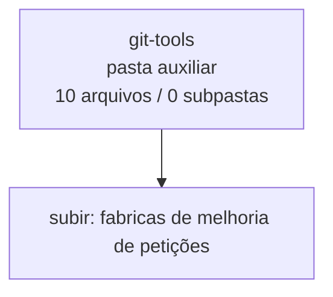

<!-- IA_NAVIGACAO:GERADO_AUTO:v1 -->
# Mapa IA - git-tools

Atualizado automaticamente em: **2026-08-05 13:32:39 -0300**

- Caminho: `C:\Users\IgorPC\.claude\projects\Escritório fabio osório\fabricas de melhoria de petições\git-tools`
- Tipo: **pasta auxiliar**
- Função para navegação: conteúdo auxiliar ou residual
- Conteúdo recursivo: **10 arquivos**, **0 subpastas**, **39.5 KB**
- Tipos de arquivo: .ps1: 7, .json: 1, .py: 1, .md: 1
- Mapa raiz: [MAPA_IA.md](<../MAPA_IA.md>)
- Índice geral: [INDICE_GERAL_IA.md](<../00_IA_NAVIGACAO/INDICE_GERAL_IA.md>)
- Protocolo de navegação: [PROTOCOLO_NAVEGACAO_IA.md](<../00_IA_NAVIGACAO/PROTOCOLO_NAVEGACAO_IA.md>)
- Inventário JSON para agentes: [inventario_ia.json](<../00_IA_NAVIGACAO/dados/inventario_ia.json>)
- Mapa superior: [fabricas de melhoria de petições](<../MAPA_IA.md>)

## GPS Mermaid

## Ordem de leitura recomendada

1. Ler este `MAPA_IA.md` antes de abrir arquivos pesados.
2. Subir para a raiz se precisar das regras globais `AGENTS.md`, `CLAUDE.md` e `_LEIS_GERAIS`.

## Subpastas diretas

_Sem subpastas diretas._

## Arquivos diretos

| Arquivo | Papel | Tamanho | Modificado | Observação |
|---|---:|---:|---:|---|
| [large-assets-manifest.json](<large-assets-manifest.json>) | dados/script | 3.2 KB | 2026-07-11 13:07 | dado estruturado ou rotina técnica |
| [publish_large_assets.ps1](<publish_large_assets.ps1>) | dados/script | 2.6 KB | 2026-07-11 13:13 | dado estruturado ou rotina técnica |
| [refresh_large_assets_manifest.ps1](<refresh_large_assets_manifest.ps1>) | dados/script | 4.0 KB | 2026-07-11 13:07 | dado estruturado ou rotina técnica |
| [restore_github_release_assets.ps1](<restore_github_release_assets.ps1>) | dados/script | 2.5 KB | 2026-07-11 13:07 | dado estruturado ou rotina técnica |
| [restore_oversized_file.ps1](<restore_oversized_file.ps1>) | dados/script | 2.0 KB | 2026-07-11 13:07 | dado estruturado ou rotina técnica |
| [split_oversized_file.ps1](<split_oversized_file.ps1>) | dados/script | 3.3 KB | 2026-07-11 13:07 | dado estruturado ou rotina técnica |
| [sync_forja_repos.py](<sync_forja_repos.py>) | dados/script | 8.5 KB | 2026-08-05 13:20 | dado estruturado ou rotina técnica |
| [sync_github.ps1](<sync_github.ps1>) | dados/script | 8.9 KB | 2026-08-05 13:23 | dado estruturado ou rotina técnica |
| [test_sync_github.ps1](<test_sync_github.ps1>) | dados/script | 4.2 KB | 2026-08-05 07:02 | dado estruturado ou rotina técnica |
| [STATUS_SYNC.md](<STATUS_SYNC.md>) | outro | 200 B | 2026-08-05 07:03 | arquivo não classificado automaticamente \| tópicos: Última sincronização com o GitHub |

## Leitura por papel

- **dados/script**: [large-assets-manifest.json](<large-assets-manifest.json>), [publish_large_assets.ps1](<publish_large_assets.ps1>), [refresh_large_assets_manifest.ps1](<refresh_large_assets_manifest.ps1>), [restore_github_release_assets.ps1](<restore_github_release_assets.ps1>), [restore_oversized_file.ps1](<restore_oversized_file.ps1>), [split_oversized_file.ps1](<split_oversized_file.ps1>), [sync_forja_repos.py](<sync_forja_repos.py>), [sync_github.ps1](<sync_github.ps1>), [test_sync_github.ps1](<test_sync_github.ps1>)
- **outro**: [STATUS_SYNC.md](<STATUS_SYNC.md>)

## Observações anti-alucinação

- Este mapa classifica por nomes, extensões e posição na árvore; não substitui leitura de fonte primária.
- Fato, citação, ID processual, prazo e jurisprudência só entram em peça depois de conferência no arquivo-fonte ou fonte oficial.
- Se a pasta tiver regimento, a peça deve refletir o regimento vigente na data do protocolo.
